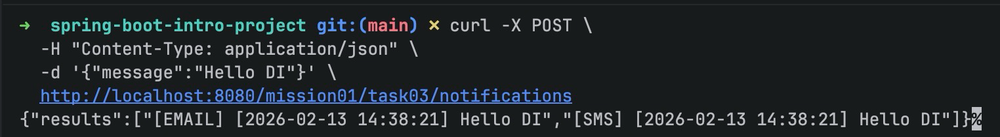

# Spring DI 실습: @Autowired와 @Component 사용하기

이 문서는 Spring 입문 미션(`mission-01-spring-intro`)의 세 번째 테스크(`task-03-di`)에서 스프링의 의존성 주입(DI)을 실습한 과정을 정리합니다. `@Component`, `@Service`, `@Repository`, `@Autowired`를 사용해 빈을 등록하고, 생성자 주입으로 여러 의존성을 연결합니다.

## 1. 구성 개요

- **패키지 구조**: `com.goorm.springmissionsplayground.mission01_spring_intro.task03_di` 아래에 `controller`, `service`, `sender`, `dto`로 구성
- **시나리오**: 알림 메시지를 이메일/SMS 두 채널로 전달하는 예제. 메시지 포맷터와 두 개의 전송기(Email, SMS)를 서비스에 주입하여 동작을 조합합니다.
- **DI 포인트**: `NotificationService`는 `List<NotificationSender>`와 `MessageFormatter`를 생성자에서 주입받습니다(`@Autowired`). 각 전송기는 `@Component`로 등록되어 자동으로 컬렉션 주입됩니다.

## 2. 주요 구현

### Sender 인터페이스와 구현체

**파일: `src/main/java/com/goorm/springmissionsplayground/mission01_spring_intro/task03_di/sender/NotificationSender.java`**

```java
public interface NotificationSender {
    String channel();
    String send(String message);
}
```

**파일: `EmailNotificationSender.java`, `SmsNotificationSender.java`**

```java
@Component
public class EmailNotificationSender implements NotificationSender {
    @Override
    public String channel() { return "email"; }
    @Override
    public String send(String message) { return "[EMAIL] " + message; }
}
```

```java
@Component
public class SmsNotificationSender implements NotificationSender {
    @Override
    public String channel() { return "sms"; }
    @Override
    public String send(String message) { return "[SMS] " + message; }
}
```

### 서비스

**파일: `src/main/java/com/goorm/springmissionsplayground/mission01_spring_intro/task03_di/service/NotificationService.java`**

```java
@Service
public class NotificationService {

    private final List<NotificationSender> senders;
    private final MessageFormatter formatter;

    @Autowired
    public NotificationService(List<NotificationSender> senders, MessageFormatter formatter) {
        this.senders = senders;
        this.formatter = formatter;
    }

    public List<String> notifyAllChannels(String message) {
        String formatted = formatter.format(message);
        return senders.stream()
                .map(sender -> sender.send(formatted))
                .collect(Collectors.toList());
    }
}
```

### 컨트롤러

**파일: `src/main/java/com/goorm/springmissionsplayground/mission01_spring_intro/task03_di/controller/NotificationController.java`**

```java
@RestController
@RequestMapping("/mission01/task03/notifications")
public class NotificationController {

    private final NotificationService notificationService;

    public NotificationController(NotificationService notificationService) {
        this.notificationService = notificationService;
    }

    @PostMapping
    @ResponseStatus(HttpStatus.CREATED)
    public NotificationResponse notifyAll(@RequestBody NotificationRequest request) {
        List<String> results = notificationService.notifyAllChannels(request.getMessage());
        return new NotificationResponse(results);
    }
}
```

### DTO

**파일: `NotificationRequest`, `NotificationResponse`**

```java
public class NotificationRequest {
    private String message;
    // 기본 생성자 + getter
}
```

```java
public class NotificationResponse {
    private final List<String> results;
    // 생성자 + getter
}
```

## 3. 실행

### 애플리케이션 실행

```bash
./gradlew bootRun
```

실행 중인 상태에서 `http://localhost:8080` 기준으로 아래 엔드포인트를 호출합니다.

### API 호출 예시

1. 알림 발송 (POST)
```bash
curl -X POST \
  -H "Content-Type: application/json" \
  -d '{"message":"Hello DI"}' \
  http://localhost:8080/mission01/task03/notifications
```

**예상 응답 예시**
```json
{"results":["[EMAIL] [2026-02-10 21:41:49] Hello DI","[SMS] [2026-02-10 21:41:49] Hello DI"]}
```



## 학습 내용

- **@Component 스캔**: `@Component`, `@Service`, `@Repository`를 사용하면 스프링이 빈으로 등록합니다. 패키지 하위에 있으면 `@SpringBootApplication`의 컴포넌트 스캔 대상이 됩니다.
- **생성자 주입 + @Autowired**: `NotificationService`는 생성자에 `@Autowired`를 붙여 의존성을 주입받습니다. 파라미터가 하나뿐이어도 기본으로 동작하지만, 명시하면 의도가 분명해집니다.
- **컬렉션 주입**: 인터페이스 타입(`List<NotificationSender>`)으로 받으면 구현체 여러 개가 자동으로 주입됩니다. 새 채널을 추가해도 서비스 코드를 건드리지 않고 확장 가능합니다.
- **단일 책임 분리**: 메시지 포맷팅(`MessageFormatter`)과 전송(`NotificationSender` 구현들)을 분리하여 테스트와 변경이 쉬워집니다.
