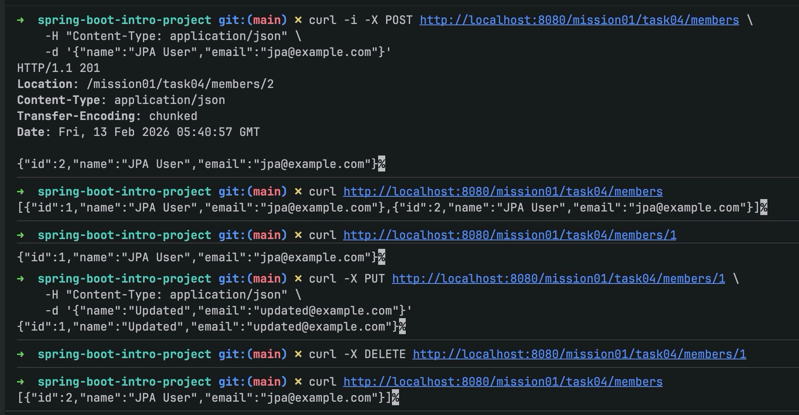

# JPA와 스프링 데이터 JPA로 CRUD 구현하기

이 문서는 `mission-01-spring-intro`의 `task-04-jpa` 구현을 코드 중심으로 정리한 보고서입니다.  
문서만 읽어도 구조와 동작을 이해할 수 있도록, 파일 인덱스/흐름 설명/개념 링크/전체 코드(토글)를 함께 제공합니다.

## 1. 작업 개요

- 미션/태스크: `mission-01-spring-intro` / `task-04-jpa`
- 목표: 회원(Member) CRUD API를 Spring Data JPA로 구현
- 베이스 경로: `/mission01/task04/members`
- 핵심 포인트:
  - JPA 엔티티 매핑
  - `JpaRepository` 기반 CRUD
  - 서비스 계층 트랜잭션 처리
  - REST API 응답 코드/Location 헤더 처리

## 2. 코드 파일 인덱스

| 구분 | 파일 경로 | 역할 |
|---|---|---|
| Domain | `src/main/java/com/goorm/springmissionsplayground/mission01_spring_intro/task04_jpa/domain/Member.java` | JPA 엔티티 (`members` 테이블 매핑) |
| Repository | `src/main/java/com/goorm/springmissionsplayground/mission01_spring_intro/task04_jpa/repository/MemberJpaRepository.java` | `JpaRepository<Member, Long>` 기반 DB 접근 |
| Service | `src/main/java/com/goorm/springmissionsplayground/mission01_spring_intro/task04_jpa/service/MemberJpaService.java` | 비즈니스 로직 + 트랜잭션 경계 |
| Controller | `src/main/java/com/goorm/springmissionsplayground/mission01_spring_intro/task04_jpa/controller/MemberJpaController.java` | HTTP 요청/응답 처리 |
| DTO(Request) | `src/main/java/com/goorm/springmissionsplayground/mission01_spring_intro/task04_jpa/dto/MemberRequest.java` | 생성/수정 요청 본문 |
| DTO(Response) | `src/main/java/com/goorm/springmissionsplayground/mission01_spring_intro/task04_jpa/dto/MemberResponse.java` | API 응답 객체 |
| Config | `src/main/resources/application.properties` | H2/JPA 실행 설정 |

## 3. 요청 처리 흐름 상세

`POST /mission01/task04/members` 기준:

1. `MemberJpaController#create()`가 `MemberRequest`를 받습니다.
2. `MemberJpaService#create(name, email)`를 호출합니다.
3. 서비스에서 `new Member(name, email)` 생성 후 `memberRepository.save(member)`를 호출합니다.
4. JPA가 INSERT를 수행하고 생성된 ID가 엔티티에 반영됩니다.
5. 컨트롤러는 `201 Created`와 `Location: /mission01/task04/members/{id}`를 응답합니다.

`PUT /mission01/task04/members/{id}` 기준:

1. 서비스 `findById(id)`로 엔티티를 조회합니다.
2. 조회한 엔티티에 `member.update(name, email)`을 적용합니다.
3. `@Transactional` 범위 내 변경 감지(Dirty Checking)로 커밋 시 UPDATE가 반영됩니다.

## 4. 파일별 상세 설명 + 전체 코드

### 4.1 Entity: Member

- 엔티티 선언: `@Entity`, `@Table(name = "members")`
- PK 전략: `@GeneratedValue(strategy = GenerationType.IDENTITY)`
- 핵심 메서드: `update(name, email)`로 상태 변경
- 이유:
  - 엔티티 내부에 상태 변경 로직을 두면 변경 지점을 명확히 관리할 수 있습니다.
  - 기본 생성자(`protected Member()`)는 JPA 프록시/리플렉션 생성에 필요합니다.

<details>
<summary><code>Member.java</code> 전체 코드</summary>

```java
package com.goorm.springmissionsplayground.mission01_spring_intro.task04_jpa.domain;

import jakarta.persistence.Entity;
import jakarta.persistence.GeneratedValue;
import jakarta.persistence.GenerationType;
import jakarta.persistence.Id;
import jakarta.persistence.Table;

@Entity
@Table(name = "members")
public class Member {

    @Id
    @GeneratedValue(strategy = GenerationType.IDENTITY)
    private Long id;

    private String name;
    private String email;

    protected Member() {
        // JPA 기본 생성자
    }

    public Member(String name, String email) {
        this.name = name;
        this.email = email;
    }

    public Long getId() {
        return id;
    }

    public String getName() {
        return name;
    }

    public String getEmail() {
        return email;
    }

    public void update(String name, String email) {
        this.name = name;
        this.email = email;
    }
}
```

</details>

### 4.2 Repository: MemberJpaRepository

- `JpaRepository<Member, Long>` 상속으로 기본 CRUD 자동 제공
- 별도 구현 클래스 없이 인터페이스만 선언해도 스프링 데이터 JPA가 런타임 프록시를 생성합니다.

<details>
<summary><code>MemberJpaRepository.java</code> 전체 코드</summary>

```java
package com.goorm.springmissionsplayground.mission01_spring_intro.task04_jpa.repository;

import com.goorm.springmissionsplayground.mission01_spring_intro.task04_jpa.domain.Member;
import org.springframework.data.jpa.repository.JpaRepository;
import org.springframework.stereotype.Repository;

@Repository
public interface MemberJpaRepository extends JpaRepository<Member, Long> {
}
```

</details>

### 4.3 Service: MemberJpaService

- 클래스 레벨 `@Transactional`: 쓰기 작업 기본 트랜잭션
- 조회 메서드 `findAll`, `findById`는 `@Transactional(readOnly = true)` 적용
- `findById` 실패 시 `ResponseStatusException(HttpStatus.NOT_FOUND, "Member not found")`으로 404 처리
- `update`는 조회 후 엔티티 변경만 수행하고, 커밋 시점에 UPDATE SQL 반영

<details>
<summary><code>MemberJpaService.java</code> 전체 코드</summary>

```java
package com.goorm.springmissionsplayground.mission01_spring_intro.task04_jpa.service;

import com.goorm.springmissionsplayground.mission01_spring_intro.task04_jpa.domain.Member;
import com.goorm.springmissionsplayground.mission01_spring_intro.task04_jpa.repository.MemberJpaRepository;
import java.util.List;
import org.springframework.http.HttpStatus;
import org.springframework.stereotype.Service;
import org.springframework.transaction.annotation.Transactional;
import org.springframework.web.server.ResponseStatusException;

@Service("memberJpaService")
@Transactional
public class MemberJpaService {

    private final MemberJpaRepository memberRepository;

    public MemberJpaService(MemberJpaRepository memberRepository) {
        this.memberRepository = memberRepository;
    }

    public Member create(String name, String email) {
        Member member = new Member(name, email);
        return memberRepository.save(member);
    }

    @Transactional(readOnly = true)
    public List<Member> findAll() {
        return memberRepository.findAll();
    }

    @Transactional(readOnly = true)
    public Member findById(Long id) {
        return memberRepository.findById(id)
                .orElseThrow(() -> new ResponseStatusException(HttpStatus.NOT_FOUND, "Member not found"));
    }

    public Member update(Long id, String name, String email) {
        Member member = findById(id);
        member.update(name, email);
        return member;
    }

    public void delete(Long id) {
        if (!memberRepository.existsById(id)) {
            throw new ResponseStatusException(HttpStatus.NOT_FOUND, "Member not found");
        }
        memberRepository.deleteById(id);
    }
}
```

</details>

### 4.4 Controller: MemberJpaController

- 경로: `@RequestMapping("/mission01/task04/members")`
- 메서드별 역할:
  - `create`: 생성 후 `201 Created` + `Location` 헤더 반환
  - `list`: 전체 조회
  - `findOne`: 단건 조회
  - `update`: 수정
  - `delete`: 삭제 후 `204 No Content`
- 엔티티를 바로 노출하지 않고 `MemberResponse`로 변환해 응답 스펙을 안정적으로 유지합니다.

<details>
<summary><code>MemberJpaController.java</code> 전체 코드</summary>

```java
package com.goorm.springmissionsplayground.mission01_spring_intro.task04_jpa.controller;

import com.goorm.springmissionsplayground.mission01_spring_intro.task04_jpa.domain.Member;
import com.goorm.springmissionsplayground.mission01_spring_intro.task04_jpa.dto.MemberRequest;
import com.goorm.springmissionsplayground.mission01_spring_intro.task04_jpa.dto.MemberResponse;
import com.goorm.springmissionsplayground.mission01_spring_intro.task04_jpa.service.MemberJpaService;
import java.net.URI;
import java.util.List;
import java.util.stream.Collectors;
import org.springframework.http.HttpStatus;
import org.springframework.http.ResponseEntity;
import org.springframework.web.bind.annotation.DeleteMapping;
import org.springframework.web.bind.annotation.GetMapping;
import org.springframework.web.bind.annotation.PathVariable;
import org.springframework.web.bind.annotation.PostMapping;
import org.springframework.web.bind.annotation.PutMapping;
import org.springframework.web.bind.annotation.RequestBody;
import org.springframework.web.bind.annotation.RequestMapping;
import org.springframework.web.bind.annotation.ResponseStatus;
import org.springframework.web.bind.annotation.RestController;

@RestController("memberJpaController")
@RequestMapping("/mission01/task04/members")
public class MemberJpaController {

    private final MemberJpaService memberService;

    public MemberJpaController(MemberJpaService memberService) {
        this.memberService = memberService;
    }

    @PostMapping
    public ResponseEntity<MemberResponse> create(@RequestBody MemberRequest request) {
        Member created = memberService.create(request.getName(), request.getEmail());
        return ResponseEntity
                .created(URI.create("/mission01/task04/members/" + created.getId()))
                .body(MemberResponse.from(created));
    }

    @GetMapping
    public List<MemberResponse> list() {
        return memberService.findAll().stream()
                .map(MemberResponse::from)
                .collect(Collectors.toList());
    }

    @GetMapping("/{id}")
    public MemberResponse findOne(@PathVariable Long id) {
        return MemberResponse.from(memberService.findById(id));
    }

    @PutMapping("/{id}")
    public MemberResponse update(@PathVariable Long id, @RequestBody MemberRequest request) {
        Member updated = memberService.update(id, request.getName(), request.getEmail());
        return MemberResponse.from(updated);
    }

    @DeleteMapping("/{id}")
    @ResponseStatus(HttpStatus.NO_CONTENT)
    public void delete(@PathVariable Long id) {
        memberService.delete(id);
    }
}
```

</details>

### 4.5 DTO: MemberRequest

- 요청 본문 바인딩용 객체
- 기본 생성자가 있어야 JSON 역직렬화(Jackson) 시 생성 가능합니다.

<details>
<summary><code>MemberRequest.java</code> 전체 코드</summary>

```java
package com.goorm.springmissionsplayground.mission01_spring_intro.task04_jpa.dto;

public class MemberRequest {
    private String name;
    private String email;

    public MemberRequest() {
    }

    public MemberRequest(String name, String email) {
        this.name = name;
        this.email = email;
    }

    public String getName() {
        return name;
    }

    public String getEmail() {
        return email;
    }
}
```

</details>

### 4.6 DTO: MemberResponse

- 응답 전용 객체
- `from(Member member)` 정적 팩토리 메서드로 변환 로직을 한 곳에 모았습니다.

<details>
<summary><code>MemberResponse.java</code> 전체 코드</summary>

```java
package com.goorm.springmissionsplayground.mission01_spring_intro.task04_jpa.dto;

import com.goorm.springmissionsplayground.mission01_spring_intro.task04_jpa.domain.Member;

public class MemberResponse {
    private final Long id;
    private final String name;
    private final String email;

    public MemberResponse(Long id, String name, String email) {
        this.id = id;
        this.name = name;
        this.email = email;
    }

    public static MemberResponse from(Member member) {
        return new MemberResponse(member.getId(), member.getName(), member.getEmail());
    }

    public Long getId() {
        return id;
    }

    public String getName() {
        return name;
    }

    public String getEmail() {
        return email;
    }
}
```

</details>

### 4.7 환경 설정: application.properties

- H2 인메모리 DB 사용
- `ddl-auto=create-drop`으로 실행 시 스키마 생성/종료 시 제거
- SQL 로그 출력 활성화
- H2 콘솔 경로 `/h2-console` 활성화

<details>
<summary><code>application.properties</code> 코드</summary>

```properties
spring.application.name=core

# H2 in-memory DB 설정 (테스트/학습용)
spring.datasource.url=jdbc:h2:mem:mission01;DB_CLOSE_DELAY=-1;DB_CLOSE_ON_EXIT=FALSE
spring.datasource.driverClassName=org.h2.Driver
spring.datasource.username=sa
spring.datasource.password=

# JPA 설정
spring.jpa.hibernate.ddl-auto=create-drop
spring.jpa.show-sql=true
spring.jpa.properties.hibernate.format_sql=true

# H2 콘솔 (개발 편의를 위해 활성화)
spring.h2.console.enabled=true
spring.h2.console.path=/h2-console
```

</details>

## 5. 새로 나온 개념 정리 + 공식 문서 링크

### 5.1 Spring Data JPA (`JpaRepository`)

- 핵심: 인터페이스 상속만으로 CRUD 구현체를 자동 생성합니다.
- 왜 쓰는가: 반복적인 DAO/SQL 코드를 줄이고, 비즈니스 로직에 집중할 수 있습니다.
- 참고:
  - Spring Data JPA Reference: https://docs.spring.io/spring-data/jpa/reference/

### 5.2 JPA Entity 매핑 (`@Entity`, `@Id`, `@GeneratedValue`)

- 핵심: 자바 객체와 DB 테이블을 매핑합니다.
- 왜 쓰는가: 객체 중심 개발과 DB 영속화를 연결할 수 있습니다.
- 참고:
  - Jakarta Persistence Specification: https://jakarta.ee/specifications/persistence/
  - Hibernate ORM User Guide: https://docs.jboss.org/hibernate/orm/current/userguide/html_single/Hibernate_User_Guide.html

### 5.3 트랜잭션 (`@Transactional`, Dirty Checking)

- 핵심: 서비스 로직을 하나의 원자적 작업 단위로 묶고, 엔티티 변경을 커밋 시 반영합니다.
- 왜 쓰는가: 데이터 정합성과 예외 시 롤백을 보장하기 위함입니다.
- 참고:
  - Spring Framework Transaction Docs: https://docs.spring.io/spring-framework/reference/data-access/transaction.html

### 5.4 H2 인메모리 DB

- 핵심: 실행 중 메모리 기반 DB를 사용해 실습/테스트를 빠르게 반복할 수 있습니다.
- 왜 쓰는가: 별도 DB 설치 없이 개발 초기 검증이 가능합니다.
- 참고:
  - H2 Database 공식 문서: https://h2database.com/html/main.html

## 6. 실행·검증 방법

### 6.1 실행

```bash
./gradlew bootRun
```

### 6.2 API 호출 예시

회원 생성:

```bash
curl -i -X POST http://localhost:8080/mission01/task04/members \
  -H "Content-Type: application/json" \
  -d '{"name":"JPA User","email":"jpa@example.com"}'
```

전체 조회:

```bash
curl http://localhost:8080/mission01/task04/members
```

단건 조회:

```bash
curl http://localhost:8080/mission01/task04/members/1
```

수정:

```bash
curl -X PUT http://localhost:8080/mission01/task04/members/1 \
  -H "Content-Type: application/json" \
  -d '{"name":"Updated","email":"updated@example.com"}'
```

삭제:

```bash
curl -X DELETE http://localhost:8080/mission01/task04/members/1
```

### 6.3 예상 결과

- 생성: `201 Created` + `Location` 헤더 포함
- 삭제: `204 No Content`
- 존재하지 않는 ID 조회/수정/삭제: `404 Not Found`

## 7. 결과 확인(스크린샷)

- 예시 이미지: `img.png`


