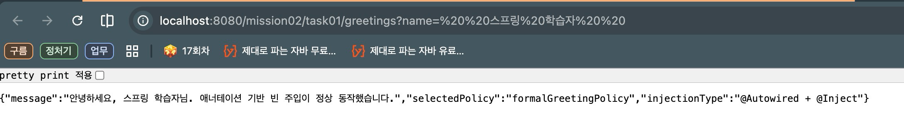

# 스프링 핵심 원리 - 기본: 애너테이션을 사용하여 빈 주입하기

이 문서는 `mission-02-spring-core-basic`의 `task-01-annotation-injection`를 수작업 기준으로 다시 정리한 보고서입니다.
태스크별 의도와 코드 흐름을 중심으로 설명하고, 모든 관련 파일은 토글 코드 블록으로 확인할 수 있습니다.

## 1. 작업 개요

- 미션/태스크: `mission-02-spring-core-basic` / `task-01-annotation-injection`
- 목표:
  - 애너테이션 기반 빈 등록과 생성자 주입을 사용해 인사 메시지 서비스를 구성한다.
  - `@Qualifier`로 다중 정책 빈 중 특정 구현(`formalGreetingPolicy`)을 명시적으로 선택한다.
  - 입력 이름 정제(`NameSanitizer`/`NameNormalizer`)와 정책 메시지 생성을 분리한다.
- 엔드포인트: `GET /mission02/task01/greetings?name=...`

## 2. 코드 파일 경로 인덱스

| 구분 | 파일 경로 | 역할 |
|---|---|---|
| Controller | `src/main/java/com/goorm/springmissionsplayground/mission02_spring_core_basic/task01_annotation_injection/controller/GreetingController.java` | 요청 진입점(HTTP 매핑/응답 구성) |
| DTO | `src/main/java/com/goorm/springmissionsplayground/mission02_spring_core_basic/task01_annotation_injection/dto/GreetingResponse.java` | 요청/응답 데이터 구조 |
| Policy | `src/main/java/com/goorm/springmissionsplayground/mission02_spring_core_basic/task01_annotation_injection/policy/FormalGreetingPolicy.java` | 전략 인터페이스/구현체 |
| Policy | `src/main/java/com/goorm/springmissionsplayground/mission02_spring_core_basic/task01_annotation_injection/policy/FriendlyGreetingPolicy.java` | 전략 인터페이스/구현체 |
| Policy | `src/main/java/com/goorm/springmissionsplayground/mission02_spring_core_basic/task01_annotation_injection/policy/GreetingPolicy.java` | 전략 인터페이스/구현체 |
| Service | `src/main/java/com/goorm/springmissionsplayground/mission02_spring_core_basic/task01_annotation_injection/service/AnnotationGreetingService.java` | 비즈니스 로직과 흐름 제어 |
| Service | `src/main/java/com/goorm/springmissionsplayground/mission02_spring_core_basic/task01_annotation_injection/service/NameNormalizer.java` | 비즈니스 로직과 흐름 제어 |
| Service | `src/main/java/com/goorm/springmissionsplayground/mission02_spring_core_basic/task01_annotation_injection/service/NameSanitizer.java` | 비즈니스 로직과 흐름 제어 |
| Test | `src/test/java/com/goorm/springmissionsplayground/mission02_spring_core_basic/task01_annotation_injection/AnnotationGreetingServiceTest.java` | 요구사항 검증 테스트 |

## 3. 구현 단계와 주요 코드 해설

1. `GreetingPolicy` 인터페이스와 두 구현체(Formal/Friendly)를 분리해 전략 교체 가능한 구조를 만듭니다.
2. `AnnotationGreetingService`는 `@Qualifier("formalGreetingPolicy")`로 사용할 정책을 명시적으로 고정합니다.
3. `NameSanitizer`/`NameNormalizer`를 통해 입력값 정제와 기본값 처리를 분리합니다.
4. `GreetingController`는 서비스 결과를 `GreetingResponse`로 반환해 주입 방식과 선택 정책을 함께 노출합니다.

## 4. 파일별 상세 설명 + 전체 코드

### 4.1 `GreetingController.java`

- 파일 경로: `src/main/java/com/goorm/springmissionsplayground/mission02_spring_core_basic/task01_annotation_injection/controller/GreetingController.java`
- 역할: 요청 진입점(HTTP 매핑/응답 구성)
- 상세 설명:
- 기본 경로: `/mission02/task01/greetings`
- 매핑 메서드: Get;
- 컨트롤러는 입력을 바인딩하고 서비스 결과를 HTTP 응답 규약에 맞춰 반환합니다.

<details>
<summary><code>GreetingController.java</code> 전체 코드</summary>

```java
package com.goorm.springmissionsplayground.mission02_spring_core_basic.task01_annotation_injection.controller;

import com.goorm.springmissionsplayground.mission02_spring_core_basic.task01_annotation_injection.dto.GreetingResponse;
import com.goorm.springmissionsplayground.mission02_spring_core_basic.task01_annotation_injection.service.AnnotationGreetingService;
import org.springframework.web.bind.annotation.GetMapping;
import org.springframework.web.bind.annotation.RequestMapping;
import org.springframework.web.bind.annotation.RequestParam;
import org.springframework.web.bind.annotation.RestController;

@RestController
@RequestMapping("/mission02/task01/greetings")
public class GreetingController {

    private final AnnotationGreetingService greetingService;

    public GreetingController(AnnotationGreetingService greetingService) {
        this.greetingService = greetingService;
    }

    @GetMapping
    public GreetingResponse greet(@RequestParam(required = false) String name) {
        return greetingService.greet(name);
    }
}
```

</details>

### 4.2 `GreetingResponse.java`

- 파일 경로: `src/main/java/com/goorm/springmissionsplayground/mission02_spring_core_basic/task01_annotation_injection/dto/GreetingResponse.java`
- 역할: 요청/응답 데이터 구조
- 상세 설명:
- 요청/응답 전용 타입을 분리해 API 계약을 안정적으로 유지합니다.
- 도메인 객체 직접 노출을 피해서 내부 구조 변경 전파를 줄입니다.
- 컨트롤러와 서비스 사이의 데이터 경계를 명확히 만듭니다.

<details>
<summary><code>GreetingResponse.java</code> 전체 코드</summary>

```java
package com.goorm.springmissionsplayground.mission02_spring_core_basic.task01_annotation_injection.dto;

public class GreetingResponse {

    private final String message;
    private final String selectedPolicy;
    private final String injectionType;

    public GreetingResponse(String message, String selectedPolicy, String injectionType) {
        this.message = message;
        this.selectedPolicy = selectedPolicy;
        this.injectionType = injectionType;
    }

    public String getMessage() {
        return message;
    }

    public String getSelectedPolicy() {
        return selectedPolicy;
    }

    public String getInjectionType() {
        return injectionType;
    }
}
```

</details>

### 4.3 `FormalGreetingPolicy.java`

- 파일 경로: `src/main/java/com/goorm/springmissionsplayground/mission02_spring_core_basic/task01_annotation_injection/policy/FormalGreetingPolicy.java`
- 역할: 전략 인터페이스/구현체
- 상세 설명:
- 공통 인터페이스 아래 구현체를 분리해 전략 교체가 가능한 구조를 만듭니다.
- 클라이언트는 구체 구현이 아닌 추상 타입에 의존합니다.
- 요구사항 추가 시 새 정책 클래스를 추가하는 방식으로 확장합니다.

<details>
<summary><code>FormalGreetingPolicy.java</code> 전체 코드</summary>

```java
package com.goorm.springmissionsplayground.mission02_spring_core_basic.task01_annotation_injection.policy;

import org.springframework.stereotype.Component;

@Component("formalGreetingPolicy")
public class FormalGreetingPolicy implements GreetingPolicy {

    @Override
    public String createMessage(String name) {
        return "안녕하세요, " + name + "님. 애너테이션 기반 빈 주입이 정상 동작했습니다.";
    }
}
```

</details>

### 4.4 `FriendlyGreetingPolicy.java`

- 파일 경로: `src/main/java/com/goorm/springmissionsplayground/mission02_spring_core_basic/task01_annotation_injection/policy/FriendlyGreetingPolicy.java`
- 역할: 전략 인터페이스/구현체
- 상세 설명:
- 공통 인터페이스 아래 구현체를 분리해 전략 교체가 가능한 구조를 만듭니다.
- 클라이언트는 구체 구현이 아닌 추상 타입에 의존합니다.
- 요구사항 추가 시 새 정책 클래스를 추가하는 방식으로 확장합니다.

<details>
<summary><code>FriendlyGreetingPolicy.java</code> 전체 코드</summary>

```java
package com.goorm.springmissionsplayground.mission02_spring_core_basic.task01_annotation_injection.policy;

import org.springframework.stereotype.Component;

@Component("friendlyGreetingPolicy")
public class FriendlyGreetingPolicy implements GreetingPolicy {

    @Override
    public String createMessage(String name) {
        return "반가워요, " + name + "님! 오늘도 즐겁게 스프링을 학습해봐요.";
    }
}
```

</details>

### 4.5 `GreetingPolicy.java`

- 파일 경로: `src/main/java/com/goorm/springmissionsplayground/mission02_spring_core_basic/task01_annotation_injection/policy/GreetingPolicy.java`
- 역할: 전략 인터페이스/구현체
- 상세 설명:
- 공통 인터페이스 아래 구현체를 분리해 전략 교체가 가능한 구조를 만듭니다.
- 클라이언트는 구체 구현이 아닌 추상 타입에 의존합니다.
- 요구사항 추가 시 새 정책 클래스를 추가하는 방식으로 확장합니다.

<details>
<summary><code>GreetingPolicy.java</code> 전체 코드</summary>

```java
package com.goorm.springmissionsplayground.mission02_spring_core_basic.task01_annotation_injection.policy;

public interface GreetingPolicy {

    String createMessage(String name);
}
```

</details>

### 4.6 `AnnotationGreetingService.java`

- 파일 경로: `src/main/java/com/goorm/springmissionsplayground/mission02_spring_core_basic/task01_annotation_injection/service/AnnotationGreetingService.java`
- 역할: 비즈니스 로직과 흐름 제어
- 상세 설명:
- 핵심 공개 메서드: `public class AnnotationGreetingService {,    public AnnotationGreetingService(,    public GreetingResponse greet(String rawName) {,`
- 서비스 계층에서 검증, 계산, 상태 변경, 예외 처리를 집중 관리합니다.
- 컨트롤러/저장소 사이의 결합을 줄여 테스트 가능성을 높입니다.

<details>
<summary><code>AnnotationGreetingService.java</code> 전체 코드</summary>

```java
package com.goorm.springmissionsplayground.mission02_spring_core_basic.task01_annotation_injection.service;

import com.goorm.springmissionsplayground.mission02_spring_core_basic.task01_annotation_injection.dto.GreetingResponse;
import com.goorm.springmissionsplayground.mission02_spring_core_basic.task01_annotation_injection.policy.GreetingPolicy;
import org.springframework.beans.factory.annotation.Autowired;
import org.springframework.beans.factory.annotation.Qualifier;
import org.springframework.stereotype.Service;

@Service
public class AnnotationGreetingService {

    private final GreetingPolicy greetingPolicy;
    private final NameNormalizer nameNormalizer;

    @Autowired
    public AnnotationGreetingService(
            @Qualifier("formalGreetingPolicy") GreetingPolicy greetingPolicy,
            NameNormalizer nameNormalizer
    ) {
        this.greetingPolicy = greetingPolicy;
        this.nameNormalizer = nameNormalizer;
    }

    public GreetingResponse greet(String rawName) {
        String normalizedName = nameNormalizer.normalize(rawName);
        String message = greetingPolicy.createMessage(normalizedName);
        return new GreetingResponse(message, "formalGreetingPolicy", "@Autowired + @Inject");
    }
}
```

</details>

### 4.7 `NameNormalizer.java`

- 파일 경로: `src/main/java/com/goorm/springmissionsplayground/mission02_spring_core_basic/task01_annotation_injection/service/NameNormalizer.java`
- 역할: 비즈니스 로직과 흐름 제어
- 상세 설명:
- 핵심 공개 메서드: `public class NameNormalizer {,    public NameNormalizer(NameSanitizer nameSanitizer) {,    public String normalize(String rawName) {,`
- 서비스 계층에서 검증, 계산, 상태 변경, 예외 처리를 집중 관리합니다.
- 컨트롤러/저장소 사이의 결합을 줄여 테스트 가능성을 높입니다.

<details>
<summary><code>NameNormalizer.java</code> 전체 코드</summary>

```java
package com.goorm.springmissionsplayground.mission02_spring_core_basic.task01_annotation_injection.service;

import jakarta.inject.Inject;
import org.springframework.stereotype.Component;

@Component
public class NameNormalizer {

    private final NameSanitizer nameSanitizer;

    @Inject
    public NameNormalizer(NameSanitizer nameSanitizer) {
        this.nameSanitizer = nameSanitizer;
    }

    public String normalize(String rawName) {
        return nameSanitizer.sanitize(rawName);
    }
}
```

</details>

### 4.8 `NameSanitizer.java`

- 파일 경로: `src/main/java/com/goorm/springmissionsplayground/mission02_spring_core_basic/task01_annotation_injection/service/NameSanitizer.java`
- 역할: 비즈니스 로직과 흐름 제어
- 상세 설명:
- 핵심 공개 메서드: `public class NameSanitizer {,    public String sanitize(String rawName) {,`
- 서비스 계층에서 검증, 계산, 상태 변경, 예외 처리를 집중 관리합니다.
- 컨트롤러/저장소 사이의 결합을 줄여 테스트 가능성을 높입니다.

<details>
<summary><code>NameSanitizer.java</code> 전체 코드</summary>

```java
package com.goorm.springmissionsplayground.mission02_spring_core_basic.task01_annotation_injection.service;

import org.springframework.stereotype.Component;

@Component
public class NameSanitizer {

    public String sanitize(String rawName) {
        if (rawName == null) {
            return "손님";
        }

        String normalized = rawName.trim().replaceAll("\\s+", " ");
        return normalized.isBlank() ? "손님" : normalized;
    }
}
```

</details>

### 4.9 `AnnotationGreetingServiceTest.java`

- 파일 경로: `src/test/java/com/goorm/springmissionsplayground/mission02_spring_core_basic/task01_annotation_injection/AnnotationGreetingServiceTest.java`
- 역할: 요구사항 검증 테스트
- 상세 설명:
- 검증 시나리오: `greet_usesAutowiredAndInjectInjectedBeans,greet_usesFallbackNameWhenInputIsBlank,`
- 정상/예외 흐름을 코드 수준에서 고정해 회귀를 빠르게 감지합니다.
- 요구사항이 바뀌면 테스트부터 수정해 변경 범위를 명확히 확인합니다.

<details>
<summary><code>AnnotationGreetingServiceTest.java</code> 전체 코드</summary>

```java
package com.goorm.springmissionsplayground.mission02_spring_core_basic.task01_annotation_injection;

import com.goorm.springmissionsplayground.mission02_spring_core_basic.task01_annotation_injection.dto.GreetingResponse;
import com.goorm.springmissionsplayground.mission02_spring_core_basic.task01_annotation_injection.service.AnnotationGreetingService;
import org.junit.jupiter.api.Test;
import org.springframework.beans.factory.annotation.Autowired;
import org.springframework.boot.test.context.SpringBootTest;

import static org.assertj.core.api.Assertions.assertThat;

@SpringBootTest
class AnnotationGreetingServiceTest {

    @Autowired
    private AnnotationGreetingService greetingService;

    @Test
    void greet_usesAutowiredAndInjectInjectedBeans() {
        GreetingResponse response = greetingService.greet("  스프링   학습자  ");

        assertThat(response.getMessage()).isEqualTo("안녕하세요, 스프링 학습자님. 애너테이션 기반 빈 주입이 정상 동작했습니다.");
        assertThat(response.getSelectedPolicy()).isEqualTo("formalGreetingPolicy");
        assertThat(response.getInjectionType()).isEqualTo("@Autowired + @Inject");
    }

    @Test
    void greet_usesFallbackNameWhenInputIsBlank() {
        GreetingResponse response = greetingService.greet("   ");

        assertThat(response.getMessage()).contains("손님");
    }
}
```

</details>

## 5. 새로 나온 개념 정리 + 참고 링크

- **애너테이션 기반 빈 주입**
  - 핵심: `@Component`, `@Service`, 생성자 주입으로 빈 그래프를 구성합니다.
  - 참고: https://docs.spring.io/spring-framework/reference/core/beans/annotation-config.html
- **`@Qualifier`**
  - 핵심: 동일 타입 다중 빈 환경에서 원하는 구현체를 지정합니다.
  - 참고: https://docs.spring.io/spring-framework/reference/core/beans/annotation-config/autowired-qualifiers.html

## 6. 실행·검증 방법

### 6.1 실행

```bash
./gradlew bootRun
```

### 6.2 API 호출 예시

```bash
curl "http://localhost:8080/mission02/task01/greetings?name=%20%20스프링%20학습자%20%20"
```

확인 포인트:
- 이름 정규화 결과가 메시지에 반영되는지
- `selectedPolicy` 값이 `formalGreetingPolicy`인지

### 6.3 테스트

```bash
./gradlew test --tests "*task01_annotation_injection*"
```

## 7. 결과 확인

- 문서의 호출 예시를 그대로 실행해 상태 코드/응답 본문을 확인합니다.


## 8. 학습 내용

- 동일 인터페이스 구현체가 여러 개일 때는 `@Qualifier`로 의도를 명확히 표현하는 것이 안전합니다.
- 입력 정제 로직과 정책 로직을 분리하면 변경 시 영향 범위를 줄일 수 있습니다.
