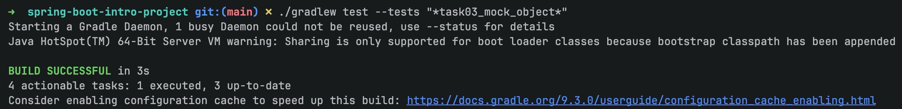

# 스프링 핵심 원리 - 기본: 의존성 주입과 테스트를 위한 Mock 객체 사용

이 문서는 `mission-02-spring-core-basic`의 `task-03-mock-object`를 수작업 기준으로 다시 정리한 보고서입니다.
태스크별 의도와 코드 흐름을 중심으로 설명하고, 모든 관련 파일은 토글 코드 블록으로 확인할 수 있습니다.

## 1. 작업 개요

- 미션/태스크: `mission-02-spring-core-basic` / `task-03-mock-object`
- 목표:
  - 저장소 인터페이스를 기준으로 서비스 테스트를 격리한다.
  - Mockito 기반 Mock 저장소로 상호작용과 반환값을 정밀 검증한다.
  - 비즈니스 규칙(중복/조회 실패/정상 등록)이 테스트에서 명확히 드러나도록 구성한다.
- 테스트 중심 태스크: API 엔드포인트 없이 서비스 동작을 단위 테스트로 검증

## 2. 코드 파일 경로 인덱스

| 구분 | 파일 경로 | 역할 |
|---|---|---|
| Domain | `src/main/java/com/goorm/springmissionsplayground/mission02_spring_core_basic/task03_mock_object/domain/MockMember.java` | 도메인 상태/행위 모델 |
| Repository | `src/main/java/com/goorm/springmissionsplayground/mission02_spring_core_basic/task03_mock_object/repository/InMemoryMockMemberRepository.java` | 데이터 접근 추상화 |
| Repository | `src/main/java/com/goorm/springmissionsplayground/mission02_spring_core_basic/task03_mock_object/repository/MockMemberRepository.java` | 데이터 접근 추상화 |
| Service | `src/main/java/com/goorm/springmissionsplayground/mission02_spring_core_basic/task03_mock_object/service/MockMemberService.java` | 비즈니스 로직과 흐름 제어 |
| Test | `src/test/java/com/goorm/springmissionsplayground/mission02_spring_core_basic/task03_mock_object/MockMemberServiceTest.java` | 요구사항 검증 테스트 |

## 3. 구현 단계와 주요 코드 해설

1. `MockMemberRepository` 인터페이스를 기준으로 서비스 의존을 추상화합니다.
2. 서비스 테스트에서는 Mockito mock을 주입해 저장소 반환값/호출 횟수를 세밀하게 검증합니다.
3. 중복 회원, 조회 실패, 정상 등록 등 핵심 규칙을 테스트 메서드 단위로 분리합니다.
4. 인메모리 구현체(`InMemoryMockMemberRepository`)는 통합 시나리오 확장 시 사용할 수 있도록 유지합니다.

## 4. 파일별 상세 설명 + 전체 코드

### 4.1 `MockMember.java`

- 파일 경로: `src/main/java/com/goorm/springmissionsplayground/mission02_spring_core_basic/task03_mock_object/domain/MockMember.java`
- 역할: 도메인 상태/행위 모델
- 상세 설명:
- 도메인의 핵심 상태를 필드로 보관하고, 필요한 변경 메서드로 상태 전이를 관리합니다.
- 애플리케이션 계층은 도메인 API를 통해서만 상태를 변경하도록 제한합니다.
- JPA 엔티티인 경우 매핑 애너테이션과 생성자 규칙을 함께 고려합니다.

<details>
<summary><code>MockMember.java</code> 전체 코드</summary>

```java
package com.goorm.springmissionsplayground.mission02_spring_core_basic.task03_mock_object.domain;

public class MockMember {

    private Long id;
    private String name;
    private String email;

    public MockMember(Long id, String name, String email) {
        this.id = id;
        this.name = name;
        this.email = email;
    }

    public Long getId() {
        return id;
    }

    public void setId(Long id) {
        this.id = id;
    }

    public String getName() {
        return name;
    }

    public String getEmail() {
        return email;
    }

    public void update(String name, String email) {
        this.name = name;
        this.email = email;
    }
}
```

</details>

### 4.2 `InMemoryMockMemberRepository.java`

- 파일 경로: `src/main/java/com/goorm/springmissionsplayground/mission02_spring_core_basic/task03_mock_object/repository/InMemoryMockMemberRepository.java`
- 역할: 데이터 접근 추상화
- 상세 설명:
- 저장/조회 책임을 분리해 서비스가 영속화 기술 세부사항에 덜 의존하도록 구성합니다.
- 인터페이스 기반 구조로 구현 교체(메모리/DB) 가능성을 열어둡니다.
- 테스트에서 가짜 저장소를 주입해 비즈니스 로직만 검증하기 쉬워집니다.

<details>
<summary><code>InMemoryMockMemberRepository.java</code> 전체 코드</summary>

```java
package com.goorm.springmissionsplayground.mission02_spring_core_basic.task03_mock_object.repository;

import com.goorm.springmissionsplayground.mission02_spring_core_basic.task03_mock_object.domain.MockMember;
import java.util.ArrayList;
import java.util.List;
import java.util.Optional;
import java.util.concurrent.ConcurrentHashMap;
import java.util.concurrent.ConcurrentMap;
import java.util.concurrent.atomic.AtomicLong;
import org.springframework.stereotype.Repository;

@Repository
public class InMemoryMockMemberRepository implements MockMemberRepository {

    private final ConcurrentMap<Long, MockMember> store = new ConcurrentHashMap<>();
    private final AtomicLong sequence = new AtomicLong(0);

    @Override
    public MockMember save(MockMember member) {
        Long id = member.getId();
        if (id == null) {
            id = sequence.incrementAndGet();
            member.setId(id);
        }
        store.put(id, member);
        return member;
    }

    @Override
    public Optional<MockMember> findById(Long id) {
        return Optional.ofNullable(store.get(id));
    }

    @Override
    public List<MockMember> findAll() {
        return new ArrayList<>(store.values());
    }

    @Override
    public boolean existsById(Long id) {
        return store.containsKey(id);
    }

    @Override
    public void deleteById(Long id) {
        store.remove(id);
    }
}
```

</details>

### 4.3 `MockMemberRepository.java`

- 파일 경로: `src/main/java/com/goorm/springmissionsplayground/mission02_spring_core_basic/task03_mock_object/repository/MockMemberRepository.java`
- 역할: 데이터 접근 추상화
- 상세 설명:
- 저장/조회 책임을 분리해 서비스가 영속화 기술 세부사항에 덜 의존하도록 구성합니다.
- 인터페이스 기반 구조로 구현 교체(메모리/DB) 가능성을 열어둡니다.
- 테스트에서 가짜 저장소를 주입해 비즈니스 로직만 검증하기 쉬워집니다.

<details>
<summary><code>MockMemberRepository.java</code> 전체 코드</summary>

```java
package com.goorm.springmissionsplayground.mission02_spring_core_basic.task03_mock_object.repository;

import com.goorm.springmissionsplayground.mission02_spring_core_basic.task03_mock_object.domain.MockMember;
import java.util.List;
import java.util.Optional;

public interface MockMemberRepository {
    MockMember save(MockMember member);

    Optional<MockMember> findById(Long id);

    List<MockMember> findAll();

    boolean existsById(Long id);

    void deleteById(Long id);
}
```

</details>

### 4.4 `MockMemberService.java`

- 파일 경로: `src/main/java/com/goorm/springmissionsplayground/mission02_spring_core_basic/task03_mock_object/service/MockMemberService.java`
- 역할: 비즈니스 로직과 흐름 제어
- 상세 설명:
- 핵심 공개 메서드: `public class MockMemberService {,    public MockMemberService(MockMemberRepository mockMemberRepository) {,    public MockMember createMember(String name, String email) {,    public MockMember findMember(Long id) {,    public List<MockMember> listMembers() {,    public MockMember updateMember(Long id, String name, String email) {,    public void deleteMember(Long id) {,`
- 서비스 계층에서 검증, 계산, 상태 변경, 예외 처리를 집중 관리합니다.
- 컨트롤러/저장소 사이의 결합을 줄여 테스트 가능성을 높입니다.

<details>
<summary><code>MockMemberService.java</code> 전체 코드</summary>

```java
package com.goorm.springmissionsplayground.mission02_spring_core_basic.task03_mock_object.service;

import com.goorm.springmissionsplayground.mission02_spring_core_basic.task03_mock_object.domain.MockMember;
import com.goorm.springmissionsplayground.mission02_spring_core_basic.task03_mock_object.repository.MockMemberRepository;
import java.util.List;
import org.springframework.stereotype.Service;

@Service
public class MockMemberService {

    private final MockMemberRepository mockMemberRepository;

    public MockMemberService(MockMemberRepository mockMemberRepository) {
        this.mockMemberRepository = mockMemberRepository;
    }

    public MockMember createMember(String name, String email) {
        MockMember newMember = new MockMember(null, name, email);
        return mockMemberRepository.save(newMember);
    }

    public MockMember findMember(Long id) {
        return mockMemberRepository.findById(id)
                .orElseThrow(() -> new IllegalArgumentException("회원을 찾을 수 없습니다. id=" + id));
    }

    public List<MockMember> listMembers() {
        return mockMemberRepository.findAll();
    }

    public MockMember updateMember(Long id, String name, String email) {
        MockMember member = findMember(id);
        member.update(name, email);
        return mockMemberRepository.save(member);
    }

    public void deleteMember(Long id) {
        if (!mockMemberRepository.existsById(id)) {
            throw new IllegalArgumentException("회원을 찾을 수 없습니다. id=" + id);
        }
        mockMemberRepository.deleteById(id);
    }
}
```

</details>

### 4.5 `MockMemberServiceTest.java`

- 파일 경로: `src/test/java/com/goorm/springmissionsplayground/mission02_spring_core_basic/task03_mock_object/MockMemberServiceTest.java`
- 역할: 요구사항 검증 테스트
- 상세 설명:
- 검증 시나리오: `createMember_usesMockRepositorySave,findMember_returnsMockedData,listMembers_returnsMockedList,updateMember_usesMockedFindAndSave,deleteMember_callsMockDeleteWhenExists,deleteMember_throwsExceptionWhenMissing,`
- 정상/예외 흐름을 코드 수준에서 고정해 회귀를 빠르게 감지합니다.
- 요구사항이 바뀌면 테스트부터 수정해 변경 범위를 명확히 확인합니다.

<details>
<summary><code>MockMemberServiceTest.java</code> 전체 코드</summary>

```java
package com.goorm.springmissionsplayground.mission02_spring_core_basic.task03_mock_object;

import com.goorm.springmissionsplayground.mission02_spring_core_basic.task03_mock_object.domain.MockMember;
import com.goorm.springmissionsplayground.mission02_spring_core_basic.task03_mock_object.repository.MockMemberRepository;
import com.goorm.springmissionsplayground.mission02_spring_core_basic.task03_mock_object.service.MockMemberService;
import java.util.List;
import java.util.Optional;
import org.junit.jupiter.api.Test;
import org.junit.jupiter.api.extension.ExtendWith;
import org.mockito.InjectMocks;
import org.mockito.Mock;
import org.mockito.junit.jupiter.MockitoExtension;

import static org.assertj.core.api.Assertions.assertThat;
import static org.assertj.core.api.Assertions.assertThatThrownBy;
import static org.mockito.ArgumentMatchers.any;
import static org.mockito.Mockito.verify;
import static org.mockito.Mockito.when;

@ExtendWith(MockitoExtension.class)
class MockMemberServiceTest {

    @Mock
    private MockMemberRepository mockMemberRepository;

    @InjectMocks
    private MockMemberService mockMemberService;

    @Test
    void createMember_usesMockRepositorySave() {
        when(mockMemberRepository.save(any(MockMember.class)))
                .thenAnswer(invocation -> {
                    MockMember member = invocation.getArgument(0);
                    member.setId(1L);
                    return member;
                });

        MockMember created = mockMemberService.createMember("Alice", "alice@example.com");

        assertThat(created.getId()).isEqualTo(1L);
        assertThat(created.getName()).isEqualTo("Alice");
        assertThat(created.getEmail()).isEqualTo("alice@example.com");
        verify(mockMemberRepository).save(any(MockMember.class));
    }

    @Test
    void findMember_returnsMockedData() {
        when(mockMemberRepository.findById(1L))
                .thenReturn(Optional.of(new MockMember(1L, "Bob", "bob@example.com")));

        MockMember found = mockMemberService.findMember(1L);

        assertThat(found.getName()).isEqualTo("Bob");
        assertThat(found.getEmail()).isEqualTo("bob@example.com");
    }

    @Test
    void listMembers_returnsMockedList() {
        when(mockMemberRepository.findAll()).thenReturn(List.of(
                new MockMember(1L, "Carol", "carol@example.com"),
                new MockMember(2L, "Dave", "dave@example.com")
        ));

        List<MockMember> members = mockMemberService.listMembers();

        assertThat(members).hasSize(2);
        assertThat(members.get(0).getName()).isEqualTo("Carol");
        assertThat(members.get(1).getName()).isEqualTo("Dave");
    }

    @Test
    void updateMember_usesMockedFindAndSave() {
        MockMember existing = new MockMember(1L, "Old Name", "old@example.com");
        when(mockMemberRepository.findById(1L)).thenReturn(Optional.of(existing));
        when(mockMemberRepository.save(any(MockMember.class)))
                .thenAnswer(invocation -> invocation.getArgument(0));

        MockMember updated = mockMemberService.updateMember(1L, "New Name", "new@example.com");

        assertThat(updated.getName()).isEqualTo("New Name");
        assertThat(updated.getEmail()).isEqualTo("new@example.com");
        verify(mockMemberRepository).findById(1L);
        verify(mockMemberRepository).save(existing);
    }

    @Test
    void deleteMember_callsMockDeleteWhenExists() {
        when(mockMemberRepository.existsById(1L)).thenReturn(true);

        mockMemberService.deleteMember(1L);

        verify(mockMemberRepository).deleteById(1L);
    }

    @Test
    void deleteMember_throwsExceptionWhenMissing() {
        when(mockMemberRepository.existsById(9L)).thenReturn(false);

        assertThatThrownBy(() -> mockMemberService.deleteMember(9L))
                .isInstanceOf(IllegalArgumentException.class)
                .hasMessageContaining("id=9");
    }
}
```

</details>

## 5. 새로 나온 개념 정리 + 참고 링크

- **Mock 객체 기반 단위 테스트**
  - 핵심: 외부 의존성을 대체해 서비스 로직만 고립 검증합니다.
  - 참고: https://site.mockito.org/
- **테스트 대역 개념(Fake/Mock/Stub)**
  - 핵심: 검증 목적에 맞는 대역을 선택해 테스트 신뢰성을 높입니다.
  - 참고: https://martinfowler.com/articles/mocksArentStubs.html

## 6. 실행·검증 방법

### 6.1 테스트 실행 (핵심)

```bash
./gradlew test --tests "*task03_mock_object*"
```

### 6.2 확인 포인트

- 저장소 mock 호출 횟수/인자 검증
- 중복 회원/조회 실패 예외 검증
- 정상 등록/조회 흐름 검증

## 7. 결과 확인

- 문서의 호출 예시를 그대로 실행해 상태 코드/응답 본문을 확인합니다.
- 테스트 명령으로 자동 검증 통과 여부를 함께 확인합니다.


## 8. 학습 내용

- Mock 객체를 사용하면 서비스 로직을 외부 상태와 분리해 빠르고 안정적으로 검증할 수 있습니다.
- 테스트 메서드 이름을 요구사항 문장처럼 작성하면 회귀 시 원인 파악이 쉬워집니다.
