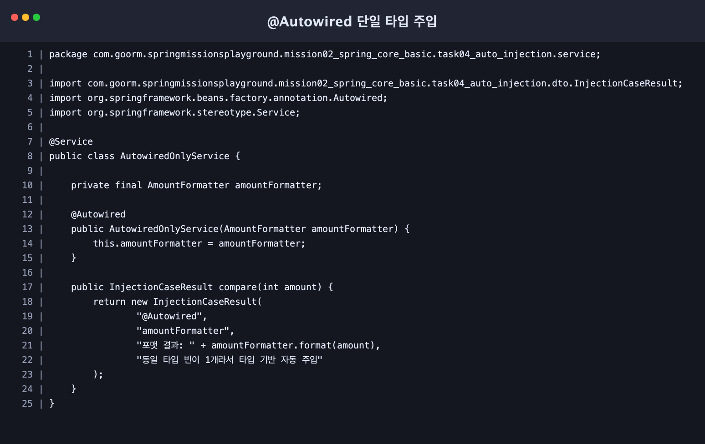
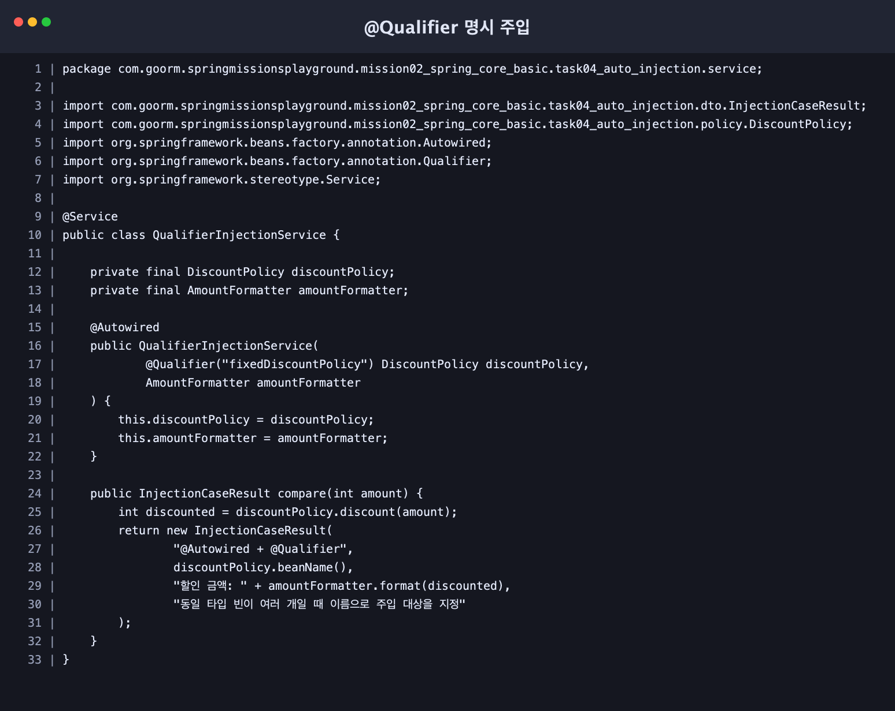
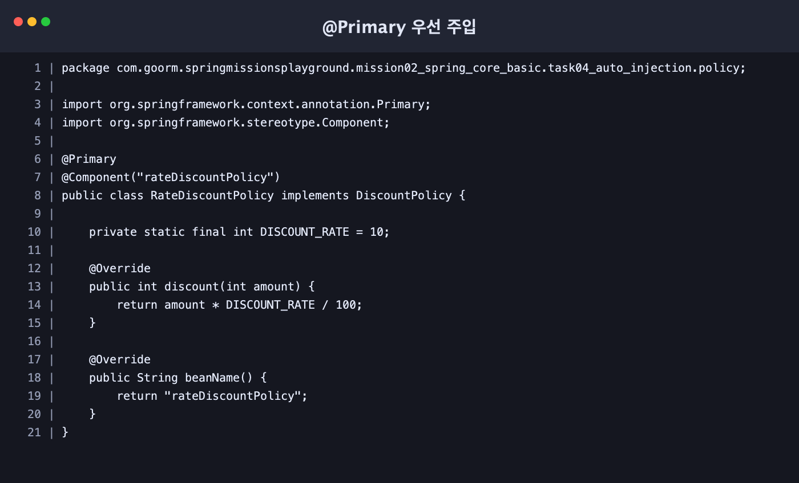
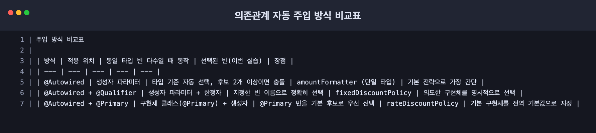

# 스프링 핵심 원리 - 기본: 의존관계 자동 주입 방식 실습

이 문서는 `mission-02-spring-core-basic`의 `task-04-auto-injection` 작업 내용을 정리한 보고서입니다.  
`@Autowired`, `@Qualifier`, `@Primary`를 각각 적용해 자동 주입 동작 차이를 확인하고, 코드 스크린샷과 비교표를 PDF로 정리했습니다.

## 1. 작업 개요

- 패키지: `com.goorm.springmissionsplayground.mission02_spring_core_basic.task04_auto_injection`
- 목표:
  - `@Autowired` 단독 주입(단일 타입 빈) 동작 확인
  - `@Autowired + @Qualifier`로 특정 구현체 명시 선택
  - `@Primary`가 지정된 구현체의 우선 선택 확인
- 시나리오:
  - 금액 포맷터(`AmountFormatter`)는 단일 빈으로 `@Autowired`만 사용
  - 할인 정책(`DiscountPolicy`)은 2개 구현체를 등록하고, `@Qualifier` 또는 `@Primary`로 선택 방식 비교

## 2. 구현 단계와 주요 코드

### 2.1 할인 정책 인터페이스와 구현체 구성

- `src/main/java/com/goorm/springmissionsplayground/mission02_spring_core_basic/task04_auto_injection/policy/DiscountPolicy.java`
- `src/main/java/com/goorm/springmissionsplayground/mission02_spring_core_basic/task04_auto_injection/policy/FixedDiscountPolicy.java`
- `src/main/java/com/goorm/springmissionsplayground/mission02_spring_core_basic/task04_auto_injection/policy/RateDiscountPolicy.java`

`DiscountPolicy` 인터페이스를 만들고 구현체 2개를 등록했습니다.
- `FixedDiscountPolicy`: `@Component("fixedDiscountPolicy")`
- `RateDiscountPolicy`: `@Component("rateDiscountPolicy") + @Primary`

### 2.2 `@Autowired` 단독 주입

- `src/main/java/com/goorm/springmissionsplayground/mission02_spring_core_basic/task04_auto_injection/service/AutowiredOnlyService.java`
- `src/main/java/com/goorm/springmissionsplayground/mission02_spring_core_basic/task04_auto_injection/service/AmountFormatter.java`

`AutowiredOnlyService` 생성자에 `@Autowired`를 적용하고, 단일 타입 빈인 `AmountFormatter`를 주입받아 금액 포맷 결과를 반환하도록 구성했습니다.



### 2.3 `@Qualifier` 명시 주입

- `src/main/java/com/goorm/springmissionsplayground/mission02_spring_core_basic/task04_auto_injection/service/QualifierInjectionService.java`

`QualifierInjectionService` 생성자 파라미터에 `@Qualifier("fixedDiscountPolicy")`를 지정해,  
동일 타입 빈이 여러 개일 때도 `fixedDiscountPolicy`를 정확히 주입받도록 구성했습니다.



### 2.4 `@Primary` 우선 주입

- `src/main/java/com/goorm/springmissionsplayground/mission02_spring_core_basic/task04_auto_injection/policy/RateDiscountPolicy.java`
- `src/main/java/com/goorm/springmissionsplayground/mission02_spring_core_basic/task04_auto_injection/service/PrimaryInjectionService.java`

`RateDiscountPolicy`에 `@Primary`를 지정하고, `PrimaryInjectionService`에서는 `DiscountPolicy`를 타입만으로 주입받았습니다.  
결과적으로 `rateDiscountPolicy`가 기본 후보로 선택됩니다.



### 2.5 비교 응답 API 및 테스트 추가

- `src/main/java/com/goorm/springmissionsplayground/mission02_spring_core_basic/task04_auto_injection/controller/AutoInjectionController.java`
- `src/main/java/com/goorm/springmissionsplayground/mission02_spring_core_basic/task04_auto_injection/service/AutoInjectionComparisonService.java`
- `src/test/java/com/goorm/springmissionsplayground/mission02_spring_core_basic/task04_auto_injection/AutoInjectionComparisonServiceTest.java`

`GET /mission02/task04/auto-injection?amount=...` 요청에서 3가지 주입 방식 결과를 한 번에 비교할 수 있도록 구성했습니다.

## 3. 실행·빌드·테스트 방법과 예상 결과

### 3.1 애플리케이션 실행

```bash
./gradlew bootRun
```

### 3.2 API 호출 예시

```bash
curl "http://localhost:8080/mission02/task04/auto-injection?amount=20000"
```

예상 응답:

```json
{
  "amount": 20000,
  "comparisons": [
    {
      "injectionType": "@Autowired",
      "injectedBean": "amountFormatter",
      "result": "포맷 결과: 20,000원",
      "reason": "동일 타입 빈이 1개라서 타입 기반 자동 주입"
    },
    {
      "injectionType": "@Autowired + @Qualifier",
      "injectedBean": "fixedDiscountPolicy",
      "result": "할인 금액: 1,000원",
      "reason": "동일 타입 빈이 여러 개일 때 이름으로 주입 대상을 지정"
    },
    {
      "injectionType": "@Autowired + @Primary",
      "injectedBean": "rateDiscountPolicy",
      "result": "할인 금액: 2,000원",
      "reason": "@Primary가 지정된 빈을 기본 후보로 우선 선택"
    }
  ]
}
```

### 3.3 테스트 실행

```bash
./gradlew test --tests "*AutoInjectionComparisonServiceTest"
```

예상 결과:
- 테스트 1건 성공
- 3가지 주입 전략이 각각 의도한 빈을 선택하는지 검증 완료

## 4. 결과 확인 방법

- API 응답에서 `comparisons[1].injectedBean`이 `fixedDiscountPolicy`인지 확인 (`@Qualifier`)
- API 응답에서 `comparisons[2].injectedBean`이 `rateDiscountPolicy`인지 확인 (`@Primary`)
- 테스트 리포트에서 `AutoInjectionComparisonServiceTest` 성공 여부 확인
- 제출용 PDF 확인: [mission02-task04-auto-injection-report.pdf](mission02-task04-auto-injection-report.pdf)

## 5. 주입 방식 비교표



| 주입 방식 | 선택 기준 | 빈 충돌 상황 처리 | 이번 실습에서 선택된 빈 | 적합한 사용 상황 |
| --- | --- | --- | --- | --- |
| `@Autowired` | 타입 | 같은 타입이 2개 이상이면 충돌 | `amountFormatter`(단일 타입) | 후보가 하나로 명확한 기본 주입 |
| `@Autowired + @Qualifier` | 타입 + 이름 한정 | 지정한 이름으로 정확히 선택 | `fixedDiscountPolicy` | 특정 구현체를 의도적으로 고정해야 할 때 |
| `@Autowired + @Primary` | 타입 + 기본 우선순위 | `@Primary` 빈을 기본으로 선택 | `rateDiscountPolicy` | 기본 구현체를 정하고, 필요한 곳만 `@Qualifier`로 예외 처리할 때 |

## 학습 내용

- `@Autowired`는 타입 기반 자동 주입이 기본이며, 단일 후보일 때 가장 간단하고 직관적입니다.
- 동일 타입 구현체가 여러 개면 스프링은 어떤 빈을 넣어야 할지 결정할 수 없어 충돌합니다. 이때 `@Qualifier`로 이름을 지정하면 의도한 구현체를 정확히 고를 수 있습니다.
- `@Primary`는 “기본값” 역할을 하는 구현체를 지정하는 방식입니다. 여러 곳에서 공통 기본 구현체를 쓰고, 일부만 `@Qualifier`로 바꿔야 할 때 유지보수성이 좋아집니다.
- 실무에서는 `@Primary`로 전역 기본 전략을 두고, 예외 케이스만 `@Qualifier`로 명시하는 조합이 자주 사용됩니다.
