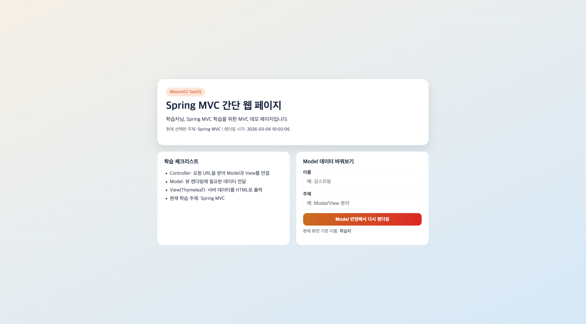
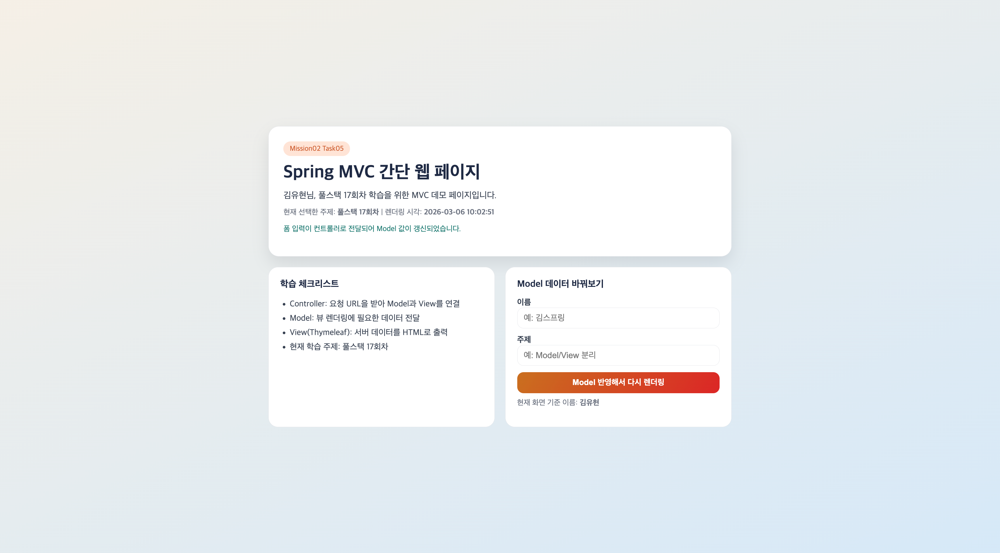

# 스프링 핵심 원리 - 기본: 스프링 MVC를 이용하여 간단한 웹 페이지 구현하기

이 문서는 `mission-02-spring-core-basic`의 `task-05-spring-mvc-web-page`를 수작업 기준으로 다시 정리한 보고서입니다.
태스크별 의도와 코드 흐름을 중심으로 설명하고, 모든 관련 파일은 토글 코드 블록으로 확인할 수 있습니다.

## 1. 작업 개요

- 미션/태스크: `mission-02-spring-core-basic` / `task-05-spring-mvc-web-page`
- 목표:
  - `@Controller + Thymeleaf` 기반 서버 렌더링 페이지를 구현한다.
  - 폼 입력을 `@ModelAttribute`로 바인딩해 동일 뷰를 재렌더링한다.
  - 모델 데이터(체크리스트/환영 메시지/서버 시각)가 화면에 반영되는 흐름을 확인한다.
- 엔드포인트: `GET /mission02/task05/mvc`, `POST /mission02/task05/mvc/preview`

## 2. 코드 파일 경로 인덱스

| 구분 | 파일 경로 | 역할 |
|---|---|---|
| Controller | `src/main/java/com/goorm/springmissionsplayground/mission02_spring_core_basic/task05_spring_mvc_web_page/controller/SimpleMvcPageController.java` | 요청 진입점(HTTP 매핑/응답 구성) |
| DTO | `src/main/java/com/goorm/springmissionsplayground/mission02_spring_core_basic/task05_spring_mvc_web_page/dto/LearningRequest.java` | 요청/응답 데이터 구조 |
| Service | `src/main/java/com/goorm/springmissionsplayground/mission02_spring_core_basic/task05_spring_mvc_web_page/service/MvcPageContentService.java` | 비즈니스 로직과 흐름 제어 |
| Template | `src/main/resources/templates/mission02/task05/home.html` | MVC 화면 렌더링 템플릿 |
| Test | `src/test/java/com/goorm/springmissionsplayground/mission02_spring_core_basic/task05_spring_mvc_web_page/SimpleMvcPageControllerTest.java` | 요구사항 검증 테스트 |

## 3. 구현 단계와 주요 코드 해설

1. `SimpleMvcPageController`에서 GET/POST 흐름을 분리해 초기 화면 렌더링과 폼 제출 재렌더링을 처리합니다.
2. `MvcPageContentService`는 환영 메시지/체크리스트 생성 로직을 뷰 로직과 분리합니다.
3. `LearningRequest`는 폼 입력 바인딩 전용 DTO로 사용합니다.
4. `home.html`은 모델 값(`welcomeMessage`, `learningChecklist`, `submitted`)을 표현하고 반응형 스타일을 제공합니다.

## 4. 파일별 상세 설명 + 전체 코드

### 4.1 `SimpleMvcPageController.java`

- 파일 경로: `src/main/java/com/goorm/springmissionsplayground/mission02_spring_core_basic/task05_spring_mvc_web_page/controller/SimpleMvcPageController.java`
- 역할: 요청 진입점(HTTP 매핑/응답 구성)
- 상세 설명:
- 기본 경로: `/mission02/task05/mvc`
- 매핑 메서드: Get;Post /preview;
- 컨트롤러는 입력을 바인딩하고 서비스 결과를 HTTP 응답 규약에 맞춰 반환합니다.

<details>
<summary><code>SimpleMvcPageController.java</code> 전체 코드</summary>

```java
package com.goorm.springmissionsplayground.mission02_spring_core_basic.task05_spring_mvc_web_page.controller;

import com.goorm.springmissionsplayground.mission02_spring_core_basic.task05_spring_mvc_web_page.dto.LearningRequest;
import com.goorm.springmissionsplayground.mission02_spring_core_basic.task05_spring_mvc_web_page.service.MvcPageContentService;
import java.time.LocalDateTime;
import java.time.format.DateTimeFormatter;
import org.springframework.stereotype.Controller;
import org.springframework.ui.Model;
import org.springframework.util.StringUtils;
import org.springframework.web.bind.annotation.GetMapping;
import org.springframework.web.bind.annotation.ModelAttribute;
import org.springframework.web.bind.annotation.PostMapping;
import org.springframework.web.bind.annotation.RequestMapping;
import org.springframework.web.bind.annotation.RequestParam;

@Controller
@RequestMapping("/mission02/task05/mvc")
public class SimpleMvcPageController {

    private static final String DEFAULT_NAME = "학습자";
    private static final String DEFAULT_TOPIC = "Spring MVC";
    private static final DateTimeFormatter TIME_FORMATTER = DateTimeFormatter.ofPattern("yyyy-MM-dd HH:mm:ss");

    private final MvcPageContentService mvcPageContentService;

    public SimpleMvcPageController(MvcPageContentService mvcPageContentService) {
        this.mvcPageContentService = mvcPageContentService;
    }

    @GetMapping
    public String showPage(@RequestParam(required = false) String name, Model model) {
        String displayName = normalizeOrDefault(name, DEFAULT_NAME);
        renderModel(model, displayName, DEFAULT_TOPIC, false);
        return "mission02/task05/home";
    }

    @PostMapping("/preview")
    public String previewPage(@ModelAttribute LearningRequest learningRequest, Model model) {
        String displayName = normalizeOrDefault(learningRequest.getName(), DEFAULT_NAME);
        String topic = normalizeOrDefault(learningRequest.getTopic(), DEFAULT_TOPIC);
        renderModel(model, displayName, topic, true);
        return "mission02/task05/home";
    }

    private void renderModel(Model model, String displayName, String topic, boolean submitted) {
        model.addAttribute("displayName", displayName);
        model.addAttribute("topic", topic);
        model.addAttribute("submitted", submitted);
        model.addAttribute("serverTime", LocalDateTime.now().format(TIME_FORMATTER));
        model.addAttribute("welcomeMessage", mvcPageContentService.welcomeMessage(displayName, topic));
        model.addAttribute("learningChecklist", mvcPageContentService.learningChecklist(topic));
        model.addAttribute("learningRequest", new LearningRequest());
    }

    private String normalizeOrDefault(String value, String defaultValue) {
        if (!StringUtils.hasText(value)) {
            return defaultValue;
        }
        return value.trim().replaceAll("\\s{2,}", " ");
    }
}
```

</details>

### 4.2 `LearningRequest.java`

- 파일 경로: `src/main/java/com/goorm/springmissionsplayground/mission02_spring_core_basic/task05_spring_mvc_web_page/dto/LearningRequest.java`
- 역할: 요청/응답 데이터 구조
- 상세 설명:
- 요청/응답 전용 타입을 분리해 API 계약을 안정적으로 유지합니다.
- 도메인 객체 직접 노출을 피해서 내부 구조 변경 전파를 줄입니다.
- 컨트롤러와 서비스 사이의 데이터 경계를 명확히 만듭니다.

<details>
<summary><code>LearningRequest.java</code> 전체 코드</summary>

```java
package com.goorm.springmissionsplayground.mission02_spring_core_basic.task05_spring_mvc_web_page.dto;

public class LearningRequest {

    private String name;
    private String topic;

    public String getName() {
        return name;
    }

    public void setName(String name) {
        this.name = name;
    }

    public String getTopic() {
        return topic;
    }

    public void setTopic(String topic) {
        this.topic = topic;
    }
}
```

</details>

### 4.3 `MvcPageContentService.java`

- 파일 경로: `src/main/java/com/goorm/springmissionsplayground/mission02_spring_core_basic/task05_spring_mvc_web_page/service/MvcPageContentService.java`
- 역할: 비즈니스 로직과 흐름 제어
- 상세 설명:
- 핵심 공개 메서드: `public class MvcPageContentService {,    public String welcomeMessage(String name, String topic) {,    public List<String> learningChecklist(String topic) {,`
- 서비스 계층에서 검증, 계산, 상태 변경, 예외 처리를 집중 관리합니다.
- 컨트롤러/저장소 사이의 결합을 줄여 테스트 가능성을 높입니다.

<details>
<summary><code>MvcPageContentService.java</code> 전체 코드</summary>

```java
package com.goorm.springmissionsplayground.mission02_spring_core_basic.task05_spring_mvc_web_page.service;

import java.util.List;
import org.springframework.stereotype.Service;

@Service
public class MvcPageContentService {

    public String welcomeMessage(String name, String topic) {
        return name + "님, " + topic + " 학습을 위한 MVC 데모 페이지입니다.";
    }

    public List<String> learningChecklist(String topic) {
        return List.of(
                "Controller: 요청 URL을 받아 Model과 View를 연결",
                "Model: 뷰 렌더링에 필요한 데이터 전달",
                "View(Thymeleaf): 서버 데이터를 HTML로 출력",
                "현재 학습 주제: " + topic
        );
    }
}
```

</details>

### 4.4 `home.html`

- 파일 경로: `src/main/resources/templates/mission02/task05/home.html`
- 역할: MVC 화면 렌더링 템플릿
- 상세 설명:
- 서버가 내려준 모델 값을 뷰 템플릿에서 시각적으로 렌더링합니다.
- 사용자 입력 폼과 결과 표시 영역을 분리해 실습 흐름을 명확히 보여줍니다.
- 반응형 스타일과 시맨틱 마크업으로 기본 사용성을 확보합니다.

<details>
<summary><code>home.html</code> 전체 코드</summary>

```html
<!DOCTYPE html>
<html lang="ko" xmlns:th="http://www.thymeleaf.org">
<head>
    <meta charset="UTF-8">
    <meta name="viewport" content="width=device-width, initial-scale=1.0">
    <title>Mission02 Task05 - Spring MVC Page</title>
    <style>
        :root {
            --bg-top: #f5efe6;
            --bg-bottom: #d6e9f8;
            --card: #ffffff;
            --title: #1f2a44;
            --body: #374151;
            --accent: #cc5a2b;
            --accent-soft: #ffe4d6;
            --border: #e5e7eb;
        }

        * {
            box-sizing: border-box;
        }

        body {
            margin: 0;
            min-height: 100vh;
            font-family: "Gowun Dodum", "Noto Sans KR", sans-serif;
            color: var(--body);
            background: linear-gradient(155deg, var(--bg-top), var(--bg-bottom));
            display: grid;
            place-items: center;
            padding: 24px;
        }

        .layout {
            width: min(880px, 100%);
            display: grid;
            gap: 20px;
            animation: float-in 0.5s ease-out;
        }

        .hero {
            background: var(--card);
            border-radius: 20px;
            padding: 28px;
            border: 1px solid var(--border);
            box-shadow: 0 14px 30px rgba(17, 24, 39, 0.1);
        }

        h1 {
            margin: 0 0 10px;
            color: var(--title);
            font-size: clamp(1.5rem, 2.8vw, 2.1rem);
        }

        .badge {
            display: inline-block;
            font-size: 0.85rem;
            background: var(--accent-soft);
            color: var(--accent);
            padding: 6px 12px;
            border-radius: 999px;
            margin-bottom: 12px;
        }

        .welcome {
            margin: 8px 0 0;
            font-size: 1.05rem;
            line-height: 1.6;
        }

        .grid {
            display: grid;
            grid-template-columns: 1fr 1fr;
            gap: 20px;
        }

        .panel {
            background: var(--card);
            border-radius: 18px;
            border: 1px solid var(--border);
            padding: 22px;
        }

        .panel h2 {
            margin: 0 0 14px;
            color: var(--title);
            font-size: 1.1rem;
        }

        ul {
            margin: 0;
            padding-left: 18px;
            line-height: 1.7;
        }

        form {
            display: grid;
            gap: 12px;
        }

        label {
            font-weight: 700;
            font-size: 0.95rem;
        }

        input {
            width: 100%;
            border: 1px solid var(--border);
            border-radius: 12px;
            padding: 10px 12px;
            font-size: 1rem;
        }

        button {
            border: 0;
            border-radius: 12px;
            padding: 11px 14px;
            font-size: 0.95rem;
            font-weight: 700;
            color: #fff;
            background: linear-gradient(120deg, #ca6f1f, #dc2626);
            cursor: pointer;
        }

        .meta {
            margin-top: 10px;
            font-size: 0.9rem;
            color: #6b7280;
        }

        .notice {
            margin-top: 8px;
            font-size: 0.9rem;
            color: #0f766e;
        }

        @media (max-width: 760px) {
            .grid {
                grid-template-columns: 1fr;
            }
            .hero,
            .panel {
                padding: 18px;
            }
        }

        @keyframes float-in {
            from {
                opacity: 0;
                transform: translateY(10px);
            }
            to {
                opacity: 1;
                transform: translateY(0);
            }
        }
    </style>
</head>
<body>
<main class="layout">
    <section class="hero">
        <span class="badge">Mission02 Task05</span>
        <h1>Spring MVC 간단 웹 페이지</h1>
        <p class="welcome" th:text="${welcomeMessage}">
            학습자님, Spring MVC 학습을 위한 MVC 데모 페이지입니다.
        </p>
        <p class="meta">
            현재 선택한 주제: <strong th:text="${topic}">Spring MVC</strong> |
            렌더링 시각: <strong th:text="${serverTime}">2026-02-26 20:10:00</strong>
        </p>
        <p class="notice" th:if="${submitted}">
            폼 입력이 컨트롤러로 전달되어 Model 값이 갱신되었습니다.
        </p>
    </section>

    <section class="grid">
        <article class="panel">
            <h2>학습 체크리스트</h2>
            <ul>
                <li th:each="item : ${learningChecklist}" th:text="${item}">Controller와 View 연결 확인</li>
            </ul>
        </article>

        <article class="panel">
            <h2>Model 데이터 바꿔보기</h2>
            <form th:action="@{/mission02/task05/mvc/preview}" method="post" th:object="${learningRequest}">
                <div>
                    <label for="name">이름</label>
                    <input id="name" type="text" th:field="*{name}" placeholder="예: 김스프링">
                </div>
                <div>
                    <label for="topic">주제</label>
                    <input id="topic" type="text" th:field="*{topic}" placeholder="예: Model/View 분리">
                </div>
                <button type="submit">Model 반영해서 다시 렌더링</button>
            </form>
            <p class="meta">현재 화면 기준 이름: <strong th:text="${displayName}">학습자</strong></p>
        </article>
    </section>
</main>
</body>
</html>
```

</details>

### 4.5 `SimpleMvcPageControllerTest.java`

- 파일 경로: `src/test/java/com/goorm/springmissionsplayground/mission02_spring_core_basic/task05_spring_mvc_web_page/SimpleMvcPageControllerTest.java`
- 역할: 요구사항 검증 테스트
- 상세 설명:
- 검증 시나리오: `showPage_rendersViewAndModel,previewPage_bindsFormValuesAndRendersView,`
- 정상/예외 흐름을 코드 수준에서 고정해 회귀를 빠르게 감지합니다.
- 요구사항이 바뀌면 테스트부터 수정해 변경 범위를 명확히 확인합니다.

<details>
<summary><code>SimpleMvcPageControllerTest.java</code> 전체 코드</summary>

```java
package com.goorm.springmissionsplayground.mission02_spring_core_basic.task05_spring_mvc_web_page;

import com.goorm.springmissionsplayground.mission02_spring_core_basic.task05_spring_mvc_web_page.controller.SimpleMvcPageController;
import com.goorm.springmissionsplayground.mission02_spring_core_basic.task05_spring_mvc_web_page.service.MvcPageContentService;
import org.junit.jupiter.api.BeforeEach;
import org.junit.jupiter.api.Test;
import org.springframework.test.web.servlet.MockMvc;
import org.springframework.test.web.servlet.setup.MockMvcBuilders;

import static org.hamcrest.Matchers.hasSize;
import static org.springframework.test.web.servlet.request.MockMvcRequestBuilders.get;
import static org.springframework.test.web.servlet.request.MockMvcRequestBuilders.post;
import static org.springframework.test.web.servlet.result.MockMvcResultMatchers.model;
import static org.springframework.test.web.servlet.result.MockMvcResultMatchers.status;
import static org.springframework.test.web.servlet.result.MockMvcResultMatchers.view;

class SimpleMvcPageControllerTest {

    private MockMvc mockMvc;

    @BeforeEach
    void setUp() {
        SimpleMvcPageController controller = new SimpleMvcPageController(new MvcPageContentService());
        mockMvc = MockMvcBuilders.standaloneSetup(controller).build();
    }

    @Test
    void showPage_rendersViewAndModel() throws Exception {
        mockMvc.perform(get("/mission02/task05/mvc").param("name", "  김스프링  "))
                .andExpect(status().isOk())
                .andExpect(view().name("mission02/task05/home"))
                .andExpect(model().attribute("displayName", "김스프링"))
                .andExpect(model().attribute("topic", "Spring MVC"))
                .andExpect(model().attribute("submitted", false))
                .andExpect(model().attributeExists("welcomeMessage", "serverTime", "learningRequest"))
                .andExpect(model().attribute("learningChecklist", hasSize(4)));
    }

    @Test
    void previewPage_bindsFormValuesAndRendersView() throws Exception {
        mockMvc.perform(post("/mission02/task05/mvc/preview")
                        .param("name", "   ")
                        .param("topic", "Model 과 View 분리"))
                .andExpect(status().isOk())
                .andExpect(view().name("mission02/task05/home"))
                .andExpect(model().attribute("displayName", "학습자"))
                .andExpect(model().attribute("topic", "Model 과 View 분리"))
                .andExpect(model().attribute("submitted", true))
                .andExpect(model().attributeExists("welcomeMessage", "serverTime", "learningChecklist"));
    }
}
```

</details>

## 5. 새로 나온 개념 정리 + 참고 링크

- **Spring MVC + Thymeleaf 서버 렌더링**
  - 핵심: 컨트롤러 모델 데이터를 템플릿 엔진으로 HTML에 반영합니다.
  - 참고: https://docs.spring.io/spring-boot/reference/web/servlet.html
- **`@ModelAttribute` 바인딩**
  - 핵심: 폼 데이터를 DTO로 바인딩해 컨트롤러 메서드에서 사용합니다.
  - 참고: https://docs.spring.io/spring-framework/reference/web/webmvc/mvc-controller/ann-methods/modelattrib-method-args.html

## 6. 실행·검증 방법

### 6.1 실행

```bash
./gradlew bootRun
```

### 6.2 화면 확인

```text
http://localhost:8080/mission02/task05/mvc
```

폼 제출 후 `submitted` 안내 문구/모델 값 갱신 여부 확인

### 6.3 테스트

```bash
./gradlew test --tests "*task05_spring_mvc_web_page*"
```

## 7. 결과 확인

- 문서의 호출 예시를 그대로 실행해 상태 코드/응답 본문을 확인합니다.
- 테스트 명령으로 자동 검증 통과 여부를 함께 확인합니다.



## 8. 학습 내용

- 서버 렌더링 MVC는 요청 처리와 화면 표현을 명확히 연결해 학습용으로 이해가 빠릅니다.
- 폼 바인딩/모델 렌더링 흐름을 직접 구현하면 REST API와 다른 웹 페이지 생명주기를 체감할 수 있습니다.
