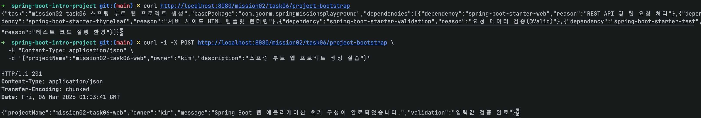

# 스프링 핵심 원리 - 기본: 스프링 부트를 사용하여 웹 애플리케이션 프로젝트 생성하기

이 문서는 `mission-02-spring-core-basic`의 `task-06-spring-boot-web-project`를 수작업 기준으로 다시 정리한 보고서입니다.
태스크별 의도와 코드 흐름을 중심으로 설명하고, 모든 관련 파일은 토글 코드 블록으로 확인할 수 있습니다.

## 1. 작업 개요

- 미션/태스크: `mission-02-spring-core-basic` / `task-06-spring-boot-web-project`
- 목표:
  - 스프링 부트 웹 프로젝트 생성 정보를 DTO로 구성해 API로 제공한다.
  - POST 요청에서 입력 검증을 적용해 잘못된 요청을 사전에 차단한다.
  - 서비스 레이어에서 생성 요약 결과를 조합해 재사용 가능한 응답 구조를 만든다.
- 엔드포인트: `GET /mission02/task06/project-bootstrap`, `POST /mission02/task06/project-bootstrap`

## 2. 코드 파일 경로 인덱스

| 구분 | 파일 경로 | 역할 |
|---|---|---|
| Controller | `src/main/java/com/goorm/springmissionsplayground/mission02_spring_core_basic/task06_spring_boot_web_project/controller/ProjectBootstrapController.java` | 요청 진입점(HTTP 매핑/응답 구성) |
| DTO | `src/main/java/com/goorm/springmissionsplayground/mission02_spring_core_basic/task06_spring_boot_web_project/dto/DependencyItem.java` | 요청/응답 데이터 구조 |
| DTO | `src/main/java/com/goorm/springmissionsplayground/mission02_spring_core_basic/task06_spring_boot_web_project/dto/ProjectBootstrapResponse.java` | 요청/응답 데이터 구조 |
| DTO | `src/main/java/com/goorm/springmissionsplayground/mission02_spring_core_basic/task06_spring_boot_web_project/dto/ProjectCreateRequest.java` | 요청/응답 데이터 구조 |
| DTO | `src/main/java/com/goorm/springmissionsplayground/mission02_spring_core_basic/task06_spring_boot_web_project/dto/ProjectCreateResponse.java` | 요청/응답 데이터 구조 |
| Service | `src/main/java/com/goorm/springmissionsplayground/mission02_spring_core_basic/task06_spring_boot_web_project/service/ProjectBootstrapService.java` | 비즈니스 로직과 흐름 제어 |
| Test | `src/test/java/com/goorm/springmissionsplayground/mission02_spring_core_basic/task06_spring_boot_web_project/ProjectBootstrapServiceTest.java` | 요구사항 검증 테스트 |

## 3. 구현 단계와 주요 코드 해설

1. `ProjectBootstrapService`가 프로젝트 메타정보와 의존성 목록을 조합해 응답 DTO를 생성합니다.
2. POST 요청용 `ProjectCreateRequest`에 검증 규칙을 적용해 입력 품질을 보장합니다.
3. `ProjectBootstrapController`는 GET(기본 정보) / POST(생성 요청) API를 분리해 학습 흐름을 명확히 합니다.
4. 테스트에서 정상 요청, 검증 실패, 응답 데이터 구성 로직을 각각 검증합니다.

## 4. 파일별 상세 설명 + 전체 코드

### 4.1 `ProjectBootstrapController.java`

- 파일 경로: `src/main/java/com/goorm/springmissionsplayground/mission02_spring_core_basic/task06_spring_boot_web_project/controller/ProjectBootstrapController.java`
- 역할: 요청 진입점(HTTP 매핑/응답 구성)
- 상세 설명:
- 기본 경로: `/mission02/task06/project-bootstrap`
- 매핑 메서드: Get;Post;
- 컨트롤러는 입력을 바인딩하고 서비스 결과를 HTTP 응답 규약에 맞춰 반환합니다.

<details>
<summary><code>ProjectBootstrapController.java</code> 전체 코드</summary>

```java
package com.goorm.springmissionsplayground.mission02_spring_core_basic.task06_spring_boot_web_project.controller;

import com.goorm.springmissionsplayground.mission02_spring_core_basic.task06_spring_boot_web_project.dto.ProjectBootstrapResponse;
import com.goorm.springmissionsplayground.mission02_spring_core_basic.task06_spring_boot_web_project.dto.ProjectCreateRequest;
import com.goorm.springmissionsplayground.mission02_spring_core_basic.task06_spring_boot_web_project.dto.ProjectCreateResponse;
import com.goorm.springmissionsplayground.mission02_spring_core_basic.task06_spring_boot_web_project.service.ProjectBootstrapService;
import jakarta.validation.Valid;
import org.springframework.http.HttpStatus;
import org.springframework.web.bind.annotation.GetMapping;
import org.springframework.web.bind.annotation.PostMapping;
import org.springframework.web.bind.annotation.RequestBody;
import org.springframework.web.bind.annotation.RequestMapping;
import org.springframework.web.bind.annotation.ResponseStatus;
import org.springframework.web.bind.annotation.RestController;

@RestController
@RequestMapping("/mission02/task06/project-bootstrap")
public class ProjectBootstrapController {

    private final ProjectBootstrapService projectBootstrapService;

    public ProjectBootstrapController(ProjectBootstrapService projectBootstrapService) {
        this.projectBootstrapService = projectBootstrapService;
    }

    @GetMapping
    public ProjectBootstrapResponse summary() {
        return projectBootstrapService.projectSummary();
    }

    @PostMapping
    @ResponseStatus(HttpStatus.CREATED)
    public ProjectCreateResponse create(@Valid @RequestBody ProjectCreateRequest request) {
        return projectBootstrapService.create(request);
    }
}
```

</details>

### 4.2 `DependencyItem.java`

- 파일 경로: `src/main/java/com/goorm/springmissionsplayground/mission02_spring_core_basic/task06_spring_boot_web_project/dto/DependencyItem.java`
- 역할: 요청/응답 데이터 구조
- 상세 설명:
- 요청/응답 전용 타입을 분리해 API 계약을 안정적으로 유지합니다.
- 도메인 객체 직접 노출을 피해서 내부 구조 변경 전파를 줄입니다.
- 컨트롤러와 서비스 사이의 데이터 경계를 명확히 만듭니다.

<details>
<summary><code>DependencyItem.java</code> 전체 코드</summary>

```java
package com.goorm.springmissionsplayground.mission02_spring_core_basic.task06_spring_boot_web_project.dto;

public class DependencyItem {

    private final String dependency;
    private final String reason;

    public DependencyItem(String dependency, String reason) {
        this.dependency = dependency;
        this.reason = reason;
    }

    public String getDependency() {
        return dependency;
    }

    public String getReason() {
        return reason;
    }
}
```

</details>

### 4.3 `ProjectBootstrapResponse.java`

- 파일 경로: `src/main/java/com/goorm/springmissionsplayground/mission02_spring_core_basic/task06_spring_boot_web_project/dto/ProjectBootstrapResponse.java`
- 역할: 요청/응답 데이터 구조
- 상세 설명:
- 요청/응답 전용 타입을 분리해 API 계약을 안정적으로 유지합니다.
- 도메인 객체 직접 노출을 피해서 내부 구조 변경 전파를 줄입니다.
- 컨트롤러와 서비스 사이의 데이터 경계를 명확히 만듭니다.

<details>
<summary><code>ProjectBootstrapResponse.java</code> 전체 코드</summary>

```java
package com.goorm.springmissionsplayground.mission02_spring_core_basic.task06_spring_boot_web_project.dto;

import java.util.List;

public class ProjectBootstrapResponse {

    private final String task;
    private final String basePackage;
    private final List<DependencyItem> dependencies;

    public ProjectBootstrapResponse(
            String task,
            String basePackage,
            List<DependencyItem> dependencies
    ) {
        this.task = task;
        this.basePackage = basePackage;
        this.dependencies = dependencies;
    }

    public String getTask() {
        return task;
    }

    public String getBasePackage() {
        return basePackage;
    }

    public List<DependencyItem> getDependencies() {
        return dependencies;
    }
}
```

</details>

### 4.4 `ProjectCreateRequest.java`

- 파일 경로: `src/main/java/com/goorm/springmissionsplayground/mission02_spring_core_basic/task06_spring_boot_web_project/dto/ProjectCreateRequest.java`
- 역할: 요청/응답 데이터 구조
- 상세 설명:
- 요청/응답 전용 타입을 분리해 API 계약을 안정적으로 유지합니다.
- 도메인 객체 직접 노출을 피해서 내부 구조 변경 전파를 줄입니다.
- 컨트롤러와 서비스 사이의 데이터 경계를 명확히 만듭니다.

<details>
<summary><code>ProjectCreateRequest.java</code> 전체 코드</summary>

```java
package com.goorm.springmissionsplayground.mission02_spring_core_basic.task06_spring_boot_web_project.dto;

import jakarta.validation.constraints.NotBlank;
import jakarta.validation.constraints.Size;

public class ProjectCreateRequest {

    @NotBlank(message = "projectName은 필수입니다.")
    @Size(max = 40, message = "projectName은 40자 이하여야 합니다.")
    private String projectName;

    @NotBlank(message = "owner는 필수입니다.")
    @Size(max = 30, message = "owner는 30자 이하여야 합니다.")
    private String owner;

    @NotBlank(message = "description은 필수입니다.")
    @Size(max = 200, message = "description은 200자 이하여야 합니다.")
    private String description;

    public String getProjectName() {
        return projectName;
    }

    public void setProjectName(String projectName) {
        this.projectName = projectName;
    }

    public String getOwner() {
        return owner;
    }

    public void setOwner(String owner) {
        this.owner = owner;
    }

    public String getDescription() {
        return description;
    }

    public void setDescription(String description) {
        this.description = description;
    }
}
```

</details>

### 4.5 `ProjectCreateResponse.java`

- 파일 경로: `src/main/java/com/goorm/springmissionsplayground/mission02_spring_core_basic/task06_spring_boot_web_project/dto/ProjectCreateResponse.java`
- 역할: 요청/응답 데이터 구조
- 상세 설명:
- 요청/응답 전용 타입을 분리해 API 계약을 안정적으로 유지합니다.
- 도메인 객체 직접 노출을 피해서 내부 구조 변경 전파를 줄입니다.
- 컨트롤러와 서비스 사이의 데이터 경계를 명확히 만듭니다.

<details>
<summary><code>ProjectCreateResponse.java</code> 전체 코드</summary>

```java
package com.goorm.springmissionsplayground.mission02_spring_core_basic.task06_spring_boot_web_project.dto;

public class ProjectCreateResponse {

    private final String projectName;
    private final String owner;
    private final String message;
    private final String validation;

    public ProjectCreateResponse(String projectName, String owner, String message, String validation) {
        this.projectName = projectName;
        this.owner = owner;
        this.message = message;
        this.validation = validation;
    }

    public String getProjectName() {
        return projectName;
    }

    public String getOwner() {
        return owner;
    }

    public String getMessage() {
        return message;
    }

    public String getValidation() {
        return validation;
    }
}
```

</details>

### 4.6 `ProjectBootstrapService.java`

- 파일 경로: `src/main/java/com/goorm/springmissionsplayground/mission02_spring_core_basic/task06_spring_boot_web_project/service/ProjectBootstrapService.java`
- 역할: 비즈니스 로직과 흐름 제어
- 상세 설명:
- 핵심 공개 메서드: `public class ProjectBootstrapService {,    public ProjectBootstrapResponse projectSummary() {,    public ProjectCreateResponse create(ProjectCreateRequest request) {,`
- 서비스 계층에서 검증, 계산, 상태 변경, 예외 처리를 집중 관리합니다.
- 컨트롤러/저장소 사이의 결합을 줄여 테스트 가능성을 높입니다.

<details>
<summary><code>ProjectBootstrapService.java</code> 전체 코드</summary>

```java
package com.goorm.springmissionsplayground.mission02_spring_core_basic.task06_spring_boot_web_project.service;

import com.goorm.springmissionsplayground.mission02_spring_core_basic.task06_spring_boot_web_project.dto.DependencyItem;
import com.goorm.springmissionsplayground.mission02_spring_core_basic.task06_spring_boot_web_project.dto.ProjectBootstrapResponse;
import com.goorm.springmissionsplayground.mission02_spring_core_basic.task06_spring_boot_web_project.dto.ProjectCreateRequest;
import com.goorm.springmissionsplayground.mission02_spring_core_basic.task06_spring_boot_web_project.dto.ProjectCreateResponse;
import java.util.List;
import org.springframework.stereotype.Service;

@Service
public class ProjectBootstrapService {

    public ProjectBootstrapResponse projectSummary() {
        return new ProjectBootstrapResponse(
                "mission02 task06 스프링 부트 웹 프로젝트 생성",
                "com.goorm.springmissionsplayground",
                List.of(
                        new DependencyItem("spring-boot-starter-web", "REST API 및 웹 요청 처리"),
                        new DependencyItem("spring-boot-starter-thymeleaf", "서버 사이드 HTML 템플릿 렌더링"),
                        new DependencyItem("spring-boot-starter-validation", "요청 데이터 검증(@Valid)"),
                        new DependencyItem("spring-boot-starter-test", "테스트 코드 실행 환경")
                )
        );
    }

    public ProjectCreateResponse create(ProjectCreateRequest request) {
        return new ProjectCreateResponse(
                request.getProjectName().trim(),
                request.getOwner().trim(),
                "Spring Boot 웹 애플리케이션 초기 구성이 완료되었습니다.",
                "입력값 검증 완료"
        );
    }
}
```

</details>

### 4.7 `ProjectBootstrapServiceTest.java`

- 파일 경로: `src/test/java/com/goorm/springmissionsplayground/mission02_spring_core_basic/task06_spring_boot_web_project/ProjectBootstrapServiceTest.java`
- 역할: 요구사항 검증 테스트
- 상세 설명:
- 검증 시나리오: `projectSummary_containsRequiredDependencies,create_trimsInputValues,createRequestValidation_rejectsBlankProjectName,`
- 정상/예외 흐름을 코드 수준에서 고정해 회귀를 빠르게 감지합니다.
- 요구사항이 바뀌면 테스트부터 수정해 변경 범위를 명확히 확인합니다.

<details>
<summary><code>ProjectBootstrapServiceTest.java</code> 전체 코드</summary>

```java
package com.goorm.springmissionsplayground.mission02_spring_core_basic.task06_spring_boot_web_project;

import com.goorm.springmissionsplayground.mission02_spring_core_basic.task06_spring_boot_web_project.dto.ProjectBootstrapResponse;
import com.goorm.springmissionsplayground.mission02_spring_core_basic.task06_spring_boot_web_project.dto.ProjectCreateRequest;
import com.goorm.springmissionsplayground.mission02_spring_core_basic.task06_spring_boot_web_project.dto.ProjectCreateResponse;
import com.goorm.springmissionsplayground.mission02_spring_core_basic.task06_spring_boot_web_project.service.ProjectBootstrapService;
import jakarta.validation.Validation;
import jakarta.validation.Validator;
import org.junit.jupiter.api.Test;

import static org.assertj.core.api.Assertions.assertThat;

class ProjectBootstrapServiceTest {

    private final ProjectBootstrapService projectBootstrapService = new ProjectBootstrapService();
    private final Validator validator = Validation.buildDefaultValidatorFactory().getValidator();

    @Test
    void projectSummary_containsRequiredDependencies() {
        ProjectBootstrapResponse response = projectBootstrapService.projectSummary();

        assertThat(response.getTask()).isEqualTo("mission02 task06 스프링 부트 웹 프로젝트 생성");
        assertThat(response.getBasePackage()).isEqualTo("com.goorm.springmissionsplayground");
        assertThat(response.getDependencies()).hasSize(4);
        assertThat(response.getDependencies())
                .extracting("dependency")
                .contains("spring-boot-starter-web", "spring-boot-starter-validation");
    }

    @Test
    void create_trimsInputValues() {
        ProjectCreateRequest request = new ProjectCreateRequest();
        request.setProjectName("  mission02-task06-web  ");
        request.setOwner("  kim  ");
        request.setDescription("스프링 부트 웹 프로젝트 생성 실습");

        ProjectCreateResponse response = projectBootstrapService.create(request);

        assertThat(response.getProjectName()).isEqualTo("mission02-task06-web");
        assertThat(response.getOwner()).isEqualTo("kim");
        assertThat(response.getValidation()).isEqualTo("입력값 검증 완료");
    }

    @Test
    void createRequestValidation_rejectsBlankProjectName() {
        ProjectCreateRequest request = new ProjectCreateRequest();
        request.setProjectName("   ");
        request.setOwner("kim");
        request.setDescription("desc");

        assertThat(validator.validate(request))
                .extracting("message")
                .contains("projectName은 필수입니다.");
    }
}
```

</details>

## 5. 새로 나온 개념 정리 + 참고 링크

- **Spring Boot 웹 프로젝트 구성**
  - 핵심: 스타터 의존성으로 웹 실행 환경을 빠르게 구성합니다.
  - 참고: https://docs.spring.io/spring-boot/reference/using/index.html
- **Bean Validation**
  - 핵심: 입력 제약을 DTO에 선언해 컨트롤러 진입 시 검증합니다.
  - 참고: https://jakarta.ee/specifications/bean-validation/

## 6. 실행·검증 방법

### 6.1 실행

```bash
./gradlew bootRun
```

### 6.2 API 호출 예시

```bash
curl http://localhost:8080/mission02/task06/project-bootstrap

curl -i -X POST http://localhost:8080/mission02/task06/project-bootstrap \
  -H "Content-Type: application/json" \
  -d '{"projectName":"mission02-task06-web","owner":"kim","description":"스프링 부트 웹 프로젝트 생성 실습"}'
```

### 6.3 테스트

```bash
./gradlew test --tests "*task06_spring_boot_web_project*"
```

## 7. 결과 확인

- 문서의 호출 예시를 그대로 실행해 상태 코드/응답 본문을 확인합니다.
- 테스트 명령으로 자동 검증 통과 여부를 함께 확인합니다.


## 8. 학습 내용

- DTO 설계와 검증 규칙을 먼저 정의하면 컨트롤러 코드가 단순해지고 안정성이 높아집니다.
- 서비스 계층에서 응답 조합 책임을 모으면 컨트롤러 재사용성이 좋아집니다.
