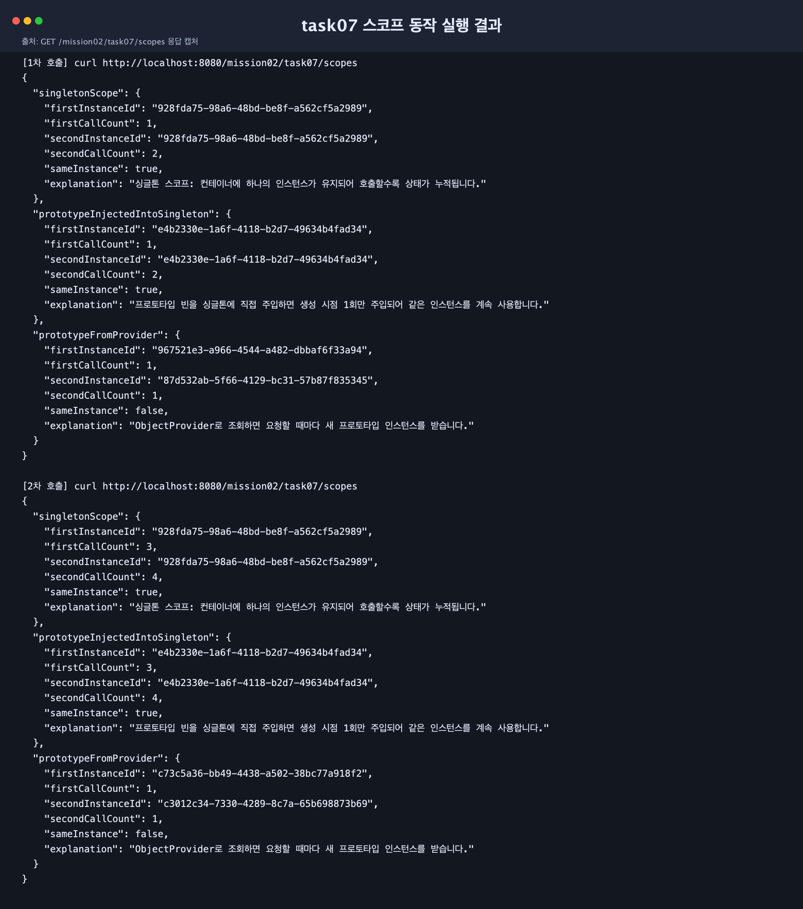

# 스프링 핵심 원리 - 기본: 싱글톤 빈 스코프와 프로토타입 빈 스코프 구현하기

이 문서는 `mission-02-spring-core-basic`의 `task-07-singleton-prototype-scope` 작업 내용을 정리한 보고서입니다.  
싱글톤/프로토타입 스코프를 각각 구현하고, 실행 결과로 두 스코프의 동작 차이를 확인했습니다.

## 1. 작업 개요

- 패키지: `com.goorm.springmissionsplayground.mission02_spring_core_basic.task07_singleton_prototype_scope`
- 목표:
  - 싱글톤 스코프와 프로토타입 스코프 빈을 각각 구현한다.
  - 동일 요청 흐름에서 스코프별 인스턴스 재사용 여부를 비교한다.
  - 실행 결과를 스크린샷으로 남기고 제출 가능 형태로 정리한다.
- 시나리오:
  - `SingletonScopeBean`: 컨테이너 전역 단일 인스턴스
  - `PrototypeScopeBean`: 요청할 때마다 새 인스턴스 생성
  - `ObjectProvider` 사용 여부에 따른 프로토타입 동작 차이 비교

## 2. 구현 단계와 주요 코드

### 2.1 스코프 빈 구현

- `src/main/java/com/goorm/springmissionsplayground/mission02_spring_core_basic/task07_singleton_prototype_scope/scope/SingletonScopeBean.java`
- `src/main/java/com/goorm/springmissionsplayground/mission02_spring_core_basic/task07_singleton_prototype_scope/scope/PrototypeScopeBean.java`

구현 내용:
- 두 빈 모두 `instanceId(UUID)`와 `callCount` 상태를 보유
- `touch()` 호출 시 카운트를 증가시키고 현재 상태를 반환
- 스코프 설정:
  - 싱글톤: `@Scope("singleton")`
  - 프로토타입: `@Scope(ConfigurableBeanFactory.SCOPE_PROTOTYPE)`

### 2.2 비교 서비스/응답 DTO 구성

- `src/main/java/com/goorm/springmissionsplayground/mission02_spring_core_basic/task07_singleton_prototype_scope/service/ScopeComparisonService.java`
- `src/main/java/com/goorm/springmissionsplayground/mission02_spring_core_basic/task07_singleton_prototype_scope/dto/ScopeComparisonResponse.java`
- `src/main/java/com/goorm/springmissionsplayground/mission02_spring_core_basic/task07_singleton_prototype_scope/dto/ScopePairResult.java`

비교 항목:
- `singletonScope`: 동일 인스턴스 재사용 여부
- `prototypeInjectedIntoSingleton`: 프로토타입을 싱글톤에 직접 주입했을 때의 동작
- `prototypeFromProvider`: `ObjectProvider`로 조회했을 때의 동작

핵심 포인트:
- 프로토타입 빈을 싱글톤에 직접 주입하면 생성 시점 1회 주입이라 결과적으로 같은 인스턴스를 계속 사용합니다.
- `ObjectProvider#getObject()`로 조회하면 호출마다 새로운 프로토타입 인스턴스를 받습니다.

### 2.3 확인용 API 추가

- `src/main/java/com/goorm/springmissionsplayground/mission02_spring_core_basic/task07_singleton_prototype_scope/controller/ScopeComparisonController.java`

엔드포인트:
- `GET /mission02/task07/scopes`

### 2.4 테스트 작성

- `src/test/java/com/goorm/springmissionsplayground/mission02_spring_core_basic/task07_singleton_prototype_scope/ScopeComparisonServiceTest.java`

검증 내용:
- 싱글톤: 같은 `instanceId`, 호출 카운트 증가
- 직접 주입 프로토타입: 같은 `instanceId`, 호출 카운트 증가
- Provider 조회 프로토타입: 다른 `instanceId`, 각 카운트 1

## 3. 실행·빌드·테스트 방법과 예상 결과

### 3.1 애플리케이션 실행

```bash
./gradlew bootRun
```

### 3.2 API 호출 예시

```bash
curl http://localhost:8080/mission02/task07/scopes
curl http://localhost:8080/mission02/task07/scopes
```

예상 결과 요약:
- `singletonScope.sameInstance = true`
- `prototypeInjectedIntoSingleton.sameInstance = true`
- `prototypeFromProvider.sameInstance = false`

### 3.3 테스트 실행

```bash
./gradlew test --tests "*ScopeComparisonServiceTest"
```

예상 결과:
- 테스트 1건 성공
- 스코프별 인스턴스 동작 차이 검증 완료

## 4. 결과 확인 및 스크린샷

### 4.1 실행 결과 스크린샷(제출용 예시)

아래 이미지는 `GET /mission02/task07/scopes`를 2회 호출한 결과를 캡처한 파일입니다.



### 4.2 스크린샷 촬영 방법 (macOS 기준)

1. 터미널 1에서 서버 실행:

```bash
./gradlew bootRun
```

2. 터미널 2에서 API 2회 호출:

```bash
curl http://localhost:8080/mission02/task07/scopes
curl http://localhost:8080/mission02/task07/scopes
```

3. 캡처 방법:
- 영역 캡처: `Shift + Command + 4`
- 창 단위 캡처: `Shift + Command + 4` 후 `Space`

4. 캡처 파일 저장 위치:
- 기본값: 바탕화면(Desktop)
- 파일명을 `task07-scope-result.png`로 정리해 제출

## 학습 내용

- 싱글톤 스코프는 컨테이너에서 하나의 객체를 공유하므로 상태가 누적됩니다.
- 프로토타입 스코프는 조회 시점마다 새로운 객체를 생성하지만, 싱글톤에 직접 주입하면 새로 생성되지 않습니다.
- 프로토타입의 “매 요청 새 인스턴스” 성질이 필요하면 `ObjectProvider`, `Provider` 같은 조회 전략을 사용해야 합니다.
- 스코프는 성능·상태 관리·동시성에 직접 영향을 주므로, 빈 책임과 생명주기에 맞춰 선택해야 합니다.
