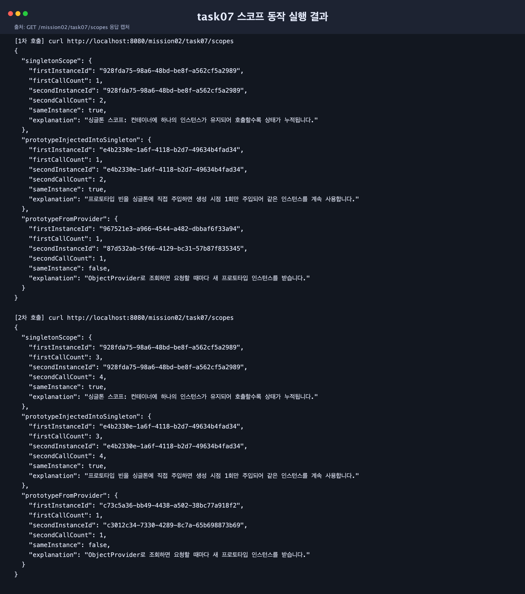

# 스프링 핵심 원리 - 기본: 싱글톤 빈 스코프와 프로토타입 빈 스코프 구현하기

이 문서는 `mission-02-spring-core-basic`의 `task-07-singleton-prototype-scope`를 수작업 기준으로 다시 정리한 보고서입니다.
태스크별 의도와 코드 흐름을 중심으로 설명하고, 모든 관련 파일은 토글 코드 블록으로 확인할 수 있습니다.

## 1. 작업 개요

- 미션/태스크: `mission-02-spring-core-basic` / `task-07-singleton-prototype-scope`
- 목표:
  - 싱글톤/프로토타입 빈의 인스턴스 재사용 차이를 실측한다.
  - 직접 주입 vs `ObjectProvider` 조회 방식에서 프로토타입 동작 차이를 비교한다.
  - 응답 DTO에 인스턴스 ID/카운트를 담아 재현 가능한 결과를 제공한다.
- 엔드포인트: `GET /mission02/task07/scopes`

## 2. 코드 파일 경로 인덱스

| 구분 | 파일 경로 | 역할 |
|---|---|---|
| Controller | `src/main/java/com/goorm/springmissionsplayground/mission02_spring_core_basic/task07_singleton_prototype_scope/controller/ScopeComparisonController.java` | 요청 진입점(HTTP 매핑/응답 구성) |
| DTO | `src/main/java/com/goorm/springmissionsplayground/mission02_spring_core_basic/task07_singleton_prototype_scope/dto/BeanTouchSnapshot.java` | 요청/응답 데이터 구조 |
| DTO | `src/main/java/com/goorm/springmissionsplayground/mission02_spring_core_basic/task07_singleton_prototype_scope/dto/ScopeComparisonResponse.java` | 요청/응답 데이터 구조 |
| DTO | `src/main/java/com/goorm/springmissionsplayground/mission02_spring_core_basic/task07_singleton_prototype_scope/dto/ScopePairResult.java` | 요청/응답 데이터 구조 |
| Scope | `src/main/java/com/goorm/springmissionsplayground/mission02_spring_core_basic/task07_singleton_prototype_scope/scope/PrototypeScopeBean.java` | 빈 스코프 실습 컴포넌트 |
| Scope | `src/main/java/com/goorm/springmissionsplayground/mission02_spring_core_basic/task07_singleton_prototype_scope/scope/SingletonScopeBean.java` | 빈 스코프 실습 컴포넌트 |
| Service | `src/main/java/com/goorm/springmissionsplayground/mission02_spring_core_basic/task07_singleton_prototype_scope/service/ScopeComparisonService.java` | 비즈니스 로직과 흐름 제어 |
| Test | `src/test/java/com/goorm/springmissionsplayground/mission02_spring_core_basic/task07_singleton_prototype_scope/ScopeComparisonServiceTest.java` | 요구사항 검증 테스트 |

## 3. 구현 단계와 주요 코드 해설

1. `SingletonScopeBean`과 `PrototypeScopeBean`에 식별자/카운터 상태를 두어 인스턴스 재사용 여부를 추적합니다.
2. `ScopeComparisonService`가 세 가지 비교 케이스(싱글톤, 직접 주입 프로토타입, Provider 조회 프로토타입)를 계산합니다.
3. `ScopeComparisonController`는 비교 결과를 JSON으로 제공해 반복 호출 시 차이를 바로 확인할 수 있습니다.
4. 테스트는 인스턴스 ID 동일/상이 조건을 명시적으로 검증합니다.

## 4. 파일별 상세 설명 + 전체 코드

### 4.1 `ScopeComparisonController.java`

- 파일 경로: `src/main/java/com/goorm/springmissionsplayground/mission02_spring_core_basic/task07_singleton_prototype_scope/controller/ScopeComparisonController.java`
- 역할: 요청 진입점(HTTP 매핑/응답 구성)
- 상세 설명:
- 기본 경로: `/mission02/task07/scopes`
- 매핑 메서드: Get;
- 컨트롤러는 입력을 바인딩하고 서비스 결과를 HTTP 응답 규약에 맞춰 반환합니다.

<details>
<summary><code>ScopeComparisonController.java</code> 전체 코드</summary>

```java
package com.goorm.springmissionsplayground.mission02_spring_core_basic.task07_singleton_prototype_scope.controller;

import com.goorm.springmissionsplayground.mission02_spring_core_basic.task07_singleton_prototype_scope.dto.ScopeComparisonResponse;
import com.goorm.springmissionsplayground.mission02_spring_core_basic.task07_singleton_prototype_scope.service.ScopeComparisonService;
import org.springframework.web.bind.annotation.GetMapping;
import org.springframework.web.bind.annotation.RequestMapping;
import org.springframework.web.bind.annotation.RestController;

@RestController
@RequestMapping("/mission02/task07/scopes")
public class ScopeComparisonController {

    private final ScopeComparisonService scopeComparisonService;

    public ScopeComparisonController(ScopeComparisonService scopeComparisonService) {
        this.scopeComparisonService = scopeComparisonService;
    }

    @GetMapping
    public ScopeComparisonResponse compare() {
        return scopeComparisonService.compare();
    }
}
```

</details>

### 4.2 `BeanTouchSnapshot.java`

- 파일 경로: `src/main/java/com/goorm/springmissionsplayground/mission02_spring_core_basic/task07_singleton_prototype_scope/dto/BeanTouchSnapshot.java`
- 역할: 요청/응답 데이터 구조
- 상세 설명:
- 요청/응답 전용 타입을 분리해 API 계약을 안정적으로 유지합니다.
- 도메인 객체 직접 노출을 피해서 내부 구조 변경 전파를 줄입니다.
- 컨트롤러와 서비스 사이의 데이터 경계를 명확히 만듭니다.

<details>
<summary><code>BeanTouchSnapshot.java</code> 전체 코드</summary>

```java
package com.goorm.springmissionsplayground.mission02_spring_core_basic.task07_singleton_prototype_scope.dto;

public class BeanTouchSnapshot {

    private final String instanceId;
    private final int callCount;

    public BeanTouchSnapshot(String instanceId, int callCount) {
        this.instanceId = instanceId;
        this.callCount = callCount;
    }

    public String getInstanceId() {
        return instanceId;
    }

    public int getCallCount() {
        return callCount;
    }
}
```

</details>

### 4.3 `ScopeComparisonResponse.java`

- 파일 경로: `src/main/java/com/goorm/springmissionsplayground/mission02_spring_core_basic/task07_singleton_prototype_scope/dto/ScopeComparisonResponse.java`
- 역할: 요청/응답 데이터 구조
- 상세 설명:
- 요청/응답 전용 타입을 분리해 API 계약을 안정적으로 유지합니다.
- 도메인 객체 직접 노출을 피해서 내부 구조 변경 전파를 줄입니다.
- 컨트롤러와 서비스 사이의 데이터 경계를 명확히 만듭니다.

<details>
<summary><code>ScopeComparisonResponse.java</code> 전체 코드</summary>

```java
package com.goorm.springmissionsplayground.mission02_spring_core_basic.task07_singleton_prototype_scope.dto;

public class ScopeComparisonResponse {

    private final ScopePairResult singletonScope;
    private final ScopePairResult prototypeInjectedIntoSingleton;
    private final ScopePairResult prototypeFromProvider;

    public ScopeComparisonResponse(
            ScopePairResult singletonScope,
            ScopePairResult prototypeInjectedIntoSingleton,
            ScopePairResult prototypeFromProvider
    ) {
        this.singletonScope = singletonScope;
        this.prototypeInjectedIntoSingleton = prototypeInjectedIntoSingleton;
        this.prototypeFromProvider = prototypeFromProvider;
    }

    public ScopePairResult getSingletonScope() {
        return singletonScope;
    }

    public ScopePairResult getPrototypeInjectedIntoSingleton() {
        return prototypeInjectedIntoSingleton;
    }

    public ScopePairResult getPrototypeFromProvider() {
        return prototypeFromProvider;
    }
}
```

</details>

### 4.4 `ScopePairResult.java`

- 파일 경로: `src/main/java/com/goorm/springmissionsplayground/mission02_spring_core_basic/task07_singleton_prototype_scope/dto/ScopePairResult.java`
- 역할: 요청/응답 데이터 구조
- 상세 설명:
- 요청/응답 전용 타입을 분리해 API 계약을 안정적으로 유지합니다.
- 도메인 객체 직접 노출을 피해서 내부 구조 변경 전파를 줄입니다.
- 컨트롤러와 서비스 사이의 데이터 경계를 명확히 만듭니다.

<details>
<summary><code>ScopePairResult.java</code> 전체 코드</summary>

```java
package com.goorm.springmissionsplayground.mission02_spring_core_basic.task07_singleton_prototype_scope.dto;

public class ScopePairResult {

    private final String firstInstanceId;
    private final int firstCallCount;
    private final String secondInstanceId;
    private final int secondCallCount;
    private final boolean sameInstance;
    private final String explanation;

    public ScopePairResult(
            String firstInstanceId,
            int firstCallCount,
            String secondInstanceId,
            int secondCallCount,
            boolean sameInstance,
            String explanation
    ) {
        this.firstInstanceId = firstInstanceId;
        this.firstCallCount = firstCallCount;
        this.secondInstanceId = secondInstanceId;
        this.secondCallCount = secondCallCount;
        this.sameInstance = sameInstance;
        this.explanation = explanation;
    }

    public String getFirstInstanceId() {
        return firstInstanceId;
    }

    public int getFirstCallCount() {
        return firstCallCount;
    }

    public String getSecondInstanceId() {
        return secondInstanceId;
    }

    public int getSecondCallCount() {
        return secondCallCount;
    }

    public boolean isSameInstance() {
        return sameInstance;
    }

    public String getExplanation() {
        return explanation;
    }
}
```

</details>

### 4.5 `PrototypeScopeBean.java`

- 파일 경로: `src/main/java/com/goorm/springmissionsplayground/mission02_spring_core_basic/task07_singleton_prototype_scope/scope/PrototypeScopeBean.java`
- 역할: 빈 스코프 실습 컴포넌트
- 상세 설명:
- 태스크 동작에 필요한 구성요소로, 상위 계층과의 연결 지점을 담당합니다.
- 단일 책임 원칙을 유지해 변경 시 영향 범위를 줄입니다.
- 테스트 코드와 함께 읽으면 설계 의도를 더 명확히 파악할 수 있습니다.

<details>
<summary><code>PrototypeScopeBean.java</code> 전체 코드</summary>

```java
package com.goorm.springmissionsplayground.mission02_spring_core_basic.task07_singleton_prototype_scope.scope;

import com.goorm.springmissionsplayground.mission02_spring_core_basic.task07_singleton_prototype_scope.dto.BeanTouchSnapshot;
import java.util.UUID;
import org.springframework.beans.factory.config.ConfigurableBeanFactory;
import org.springframework.context.annotation.Scope;
import org.springframework.stereotype.Component;

@Component
@Scope(ConfigurableBeanFactory.SCOPE_PROTOTYPE)
public class PrototypeScopeBean {

    private final String instanceId = UUID.randomUUID().toString();
    private int callCount;

    public BeanTouchSnapshot touch() {
        callCount += 1;
        return new BeanTouchSnapshot(instanceId, callCount);
    }
}
```

</details>

### 4.6 `SingletonScopeBean.java`

- 파일 경로: `src/main/java/com/goorm/springmissionsplayground/mission02_spring_core_basic/task07_singleton_prototype_scope/scope/SingletonScopeBean.java`
- 역할: 빈 스코프 실습 컴포넌트
- 상세 설명:
- 태스크 동작에 필요한 구성요소로, 상위 계층과의 연결 지점을 담당합니다.
- 단일 책임 원칙을 유지해 변경 시 영향 범위를 줄입니다.
- 테스트 코드와 함께 읽으면 설계 의도를 더 명확히 파악할 수 있습니다.

<details>
<summary><code>SingletonScopeBean.java</code> 전체 코드</summary>

```java
package com.goorm.springmissionsplayground.mission02_spring_core_basic.task07_singleton_prototype_scope.scope;

import com.goorm.springmissionsplayground.mission02_spring_core_basic.task07_singleton_prototype_scope.dto.BeanTouchSnapshot;
import java.util.UUID;
import org.springframework.context.annotation.Scope;
import org.springframework.stereotype.Component;

@Component
@Scope("singleton")
public class SingletonScopeBean {

    private final String instanceId = UUID.randomUUID().toString();
    private int callCount;

    public BeanTouchSnapshot touch() {
        callCount += 1;
        return new BeanTouchSnapshot(instanceId, callCount);
    }
}
```

</details>

### 4.7 `ScopeComparisonService.java`

- 파일 경로: `src/main/java/com/goorm/springmissionsplayground/mission02_spring_core_basic/task07_singleton_prototype_scope/service/ScopeComparisonService.java`
- 역할: 비즈니스 로직과 흐름 제어
- 상세 설명:
- 핵심 공개 메서드: `public class ScopeComparisonService {,    public ScopeComparisonService(,    public ScopeComparisonResponse compare() {,`
- 서비스 계층에서 검증, 계산, 상태 변경, 예외 처리를 집중 관리합니다.
- 컨트롤러/저장소 사이의 결합을 줄여 테스트 가능성을 높입니다.

<details>
<summary><code>ScopeComparisonService.java</code> 전체 코드</summary>

```java
package com.goorm.springmissionsplayground.mission02_spring_core_basic.task07_singleton_prototype_scope.service;

import com.goorm.springmissionsplayground.mission02_spring_core_basic.task07_singleton_prototype_scope.dto.BeanTouchSnapshot;
import com.goorm.springmissionsplayground.mission02_spring_core_basic.task07_singleton_prototype_scope.dto.ScopeComparisonResponse;
import com.goorm.springmissionsplayground.mission02_spring_core_basic.task07_singleton_prototype_scope.dto.ScopePairResult;
import com.goorm.springmissionsplayground.mission02_spring_core_basic.task07_singleton_prototype_scope.scope.PrototypeScopeBean;
import com.goorm.springmissionsplayground.mission02_spring_core_basic.task07_singleton_prototype_scope.scope.SingletonScopeBean;
import org.springframework.beans.factory.ObjectProvider;
import org.springframework.stereotype.Service;

@Service
public class ScopeComparisonService {

    private final SingletonScopeBean singletonScopeBean;
    private final PrototypeScopeBean injectedPrototypeScopeBean;
    private final ObjectProvider<PrototypeScopeBean> prototypeScopeBeanProvider;

    public ScopeComparisonService(
            SingletonScopeBean singletonScopeBean,
            PrototypeScopeBean injectedPrototypeScopeBean,
            ObjectProvider<PrototypeScopeBean> prototypeScopeBeanProvider
    ) {
        this.singletonScopeBean = singletonScopeBean;
        this.injectedPrototypeScopeBean = injectedPrototypeScopeBean;
        this.prototypeScopeBeanProvider = prototypeScopeBeanProvider;
    }

    public ScopeComparisonResponse compare() {
        ScopePairResult singletonResult = toPairResult(
                singletonScopeBean.touch(),
                singletonScopeBean.touch(),
                "싱글톤 스코프: 컨테이너에 하나의 인스턴스가 유지되어 호출할수록 상태가 누적됩니다."
        );

        ScopePairResult injectedPrototypeResult = toPairResult(
                injectedPrototypeScopeBean.touch(),
                injectedPrototypeScopeBean.touch(),
                "프로토타입 빈을 싱글톤에 직접 주입하면 생성 시점 1회만 주입되어 같은 인스턴스를 계속 사용합니다."
        );

        ScopePairResult providerPrototypeResult = toPairResult(
                prototypeScopeBeanProvider.getObject().touch(),
                prototypeScopeBeanProvider.getObject().touch(),
                "ObjectProvider로 조회하면 요청할 때마다 새 프로토타입 인스턴스를 받습니다."
        );

        return new ScopeComparisonResponse(
                singletonResult,
                injectedPrototypeResult,
                providerPrototypeResult
        );
    }

    private ScopePairResult toPairResult(
            BeanTouchSnapshot first,
            BeanTouchSnapshot second,
            String explanation
    ) {
        return new ScopePairResult(
                first.getInstanceId(),
                first.getCallCount(),
                second.getInstanceId(),
                second.getCallCount(),
                first.getInstanceId().equals(second.getInstanceId()),
                explanation
        );
    }
}
```

</details>

### 4.8 `ScopeComparisonServiceTest.java`

- 파일 경로: `src/test/java/com/goorm/springmissionsplayground/mission02_spring_core_basic/task07_singleton_prototype_scope/ScopeComparisonServiceTest.java`
- 역할: 요구사항 검증 테스트
- 상세 설명:
- 검증 시나리오: `compare_verifiesSingletonAndPrototypeBehavior,`
- 정상/예외 흐름을 코드 수준에서 고정해 회귀를 빠르게 감지합니다.
- 요구사항이 바뀌면 테스트부터 수정해 변경 범위를 명확히 확인합니다.

<details>
<summary><code>ScopeComparisonServiceTest.java</code> 전체 코드</summary>

```java
package com.goorm.springmissionsplayground.mission02_spring_core_basic.task07_singleton_prototype_scope;

import com.goorm.springmissionsplayground.mission02_spring_core_basic.task07_singleton_prototype_scope.dto.ScopeComparisonResponse;
import com.goorm.springmissionsplayground.mission02_spring_core_basic.task07_singleton_prototype_scope.dto.ScopePairResult;
import com.goorm.springmissionsplayground.mission02_spring_core_basic.task07_singleton_prototype_scope.service.ScopeComparisonService;
import org.junit.jupiter.api.Test;
import org.springframework.beans.factory.annotation.Autowired;
import org.springframework.boot.test.context.SpringBootTest;

import static org.assertj.core.api.Assertions.assertThat;

@SpringBootTest
class ScopeComparisonServiceTest {

    @Autowired
    private ScopeComparisonService scopeComparisonService;

    @Test
    void compare_verifiesSingletonAndPrototypeBehavior() {
        ScopeComparisonResponse response = scopeComparisonService.compare();

        ScopePairResult singleton = response.getSingletonScope();
        ScopePairResult injectedPrototype = response.getPrototypeInjectedIntoSingleton();
        ScopePairResult providerPrototype = response.getPrototypeFromProvider();

        assertThat(singleton.isSameInstance()).isTrue();
        assertThat(singleton.getSecondCallCount()).isEqualTo(singleton.getFirstCallCount() + 1);

        assertThat(injectedPrototype.isSameInstance()).isTrue();
        assertThat(injectedPrototype.getSecondCallCount()).isEqualTo(injectedPrototype.getFirstCallCount() + 1);

        assertThat(providerPrototype.isSameInstance()).isFalse();
        assertThat(providerPrototype.getFirstCallCount()).isEqualTo(1);
        assertThat(providerPrototype.getSecondCallCount()).isEqualTo(1);
    }
}
```

</details>

## 5. 새로 나온 개념 정리 + 참고 링크

- **빈 스코프(Singleton/Prototype)**
  - 핵심: 생성/재사용 시점이 스코프에 따라 달라집니다.
  - 참고: https://docs.spring.io/spring-framework/reference/core/beans/factory-scopes.html
- **`ObjectProvider` 지연 조회**
  - 핵심: 필요한 순간마다 새 프로토타입 빈을 조회할 수 있습니다.
  - 참고: https://docs.spring.io/spring-framework/reference/core/beans/dependencies/factory-method-injection.html

## 6. 실행·검증 방법

### 6.1 실행

```bash
./gradlew bootRun
```

### 6.2 API 호출 예시

```bash
curl http://localhost:8080/mission02/task07/scopes
curl http://localhost:8080/mission02/task07/scopes
```

확인 포인트:
- `singletonScope.sameInstance = true`
- `prototypeInjectedIntoSingleton.sameInstance = true`
- `prototypeFromProvider.sameInstance = false`

### 6.3 테스트

```bash
./gradlew test --tests "*task07_singleton_prototype_scope*"
```

## 7. 결과 확인

- `/mission02/task07/scopes`를 2회 호출해 스코프별 인스턴스 재사용 차이를 비교합니다.
- 현재 문서 디렉토리의 스크린샷(`scope-run-result.png`)과 응답 값을 대조해 확인합니다.


## 8. 학습 내용

- 스코프 차이는 개념 설명보다 인스턴스 ID/카운터를 직접 비교할 때 가장 명확하게 이해됩니다.
- 프로토타입을 싱글톤에 직접 주입하면 기대와 달리 재사용될 수 있으므로 조회 전략을 함께 고려해야 합니다.
