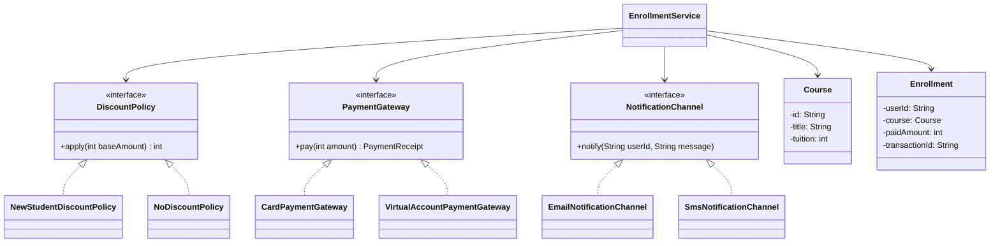

# 스프링 핵심 원리 - 기본: 객체 지향 설계 원칙 이해하기

이 문서는 `mission-02-spring-core-basic`의 `task-11-object-oriented-design-principles`를 수행하며 정리한 보고서입니다. SOLID 다섯 가지 원칙을 온라인 강의 수강 신청 시나리오에 적용하고, 설계 결과를 클래스 다이어그램과 코드로 제시합니다.

## 1. 작업 개요
- 미션/태스크: `mission-02-spring-core-basic` / `task-11-object-oriented-design-principles`
- 목표: 온라인 강의 수강 신청 흐름을 설계하고 SOLID 원칙별 적용 지점을 코드로 구현·검증한다.
- 산출물: 설계된 클래스 다이어그램(Mermaid), 핵심 코드 및 단위 테스트, 적용 설명 문서.

## 2. 코드 파일 경로 인덱스
| 구분 | 파일 경로 | 역할 |
|---|---|---|
| Domain | `src/main/java/com/goorm/springmissionsplayground/mission02_spring_core_basic/task11_object_oriented_design_principles/domain/Course.java` | 강의 기본 정보(식별자, 제목, 수강료) 보관 |
| Domain | `src/main/java/com/goorm/springmissionsplayground/mission02_spring_core_basic/task11_object_oriented_design_principles/domain/Enrollment.java` | 결제 완료된 수강 신청 결과 값 객체 |
| Policy | `src/main/java/com/goorm/springmissionsplayground/mission02_spring_core_basic/task11_object_oriented_design_principles/policy/DiscountPolicy.java` | 할인 계산을 위한 추상 인터페이스 |
| Policy | `src/main/java/com/goorm/springmissionsplayground/mission02_spring_core_basic/task11_object_oriented_design_principles/policy/NewStudentDiscountPolicy.java` | 신규 수강생 20% 할인 정책 구현 |
| Policy | `src/main/java/com/goorm/springmissionsplayground/mission02_spring_core_basic/task11_object_oriented_design_principles/policy/NoDiscountPolicy.java` | 할인 미적용 기본 정책 구현 |
| Payment | `src/main/java/com/goorm/springmissionsplayground/mission02_spring_core_basic/task11_object_oriented_design_principles/payment/PaymentGateway.java` | 결제 수단 공통 계약(결제 실행) |
| Payment | `src/main/java/com/goorm/springmissionsplayground/mission02_spring_core_basic/task11_object_oriented_design_principles/payment/PaymentReceipt.java` | 결제 결과(거래 ID, 금액) 값 객체 |
| Payment | `src/main/java/com/goorm/springmissionsplayground/mission02_spring_core_basic/task11_object_oriented_design_principles/payment/CardPaymentGateway.java` | 카드 결제 구현체 |
| Payment | `src/main/java/com/goorm/springmissionsplayground/mission02_spring_core_basic/task11_object_oriented_design_principles/payment/VirtualAccountPaymentGateway.java` | 가상계좌 결제 구현체 |
| Notification | `src/main/java/com/goorm/springmissionsplayground/mission02_spring_core_basic/task11_object_oriented_design_principles/notification/NotificationChannel.java` | 알림 전송용 최소 인터페이스 |
| Notification | `src/main/java/com/goorm/springmissionsplayground/mission02_spring_core_basic/task11_object_oriented_design_principles/notification/EmailNotificationChannel.java` | 이메일 알림 구현체(메시지 기록) |
| Notification | `src/main/java/com/goorm/springmissionsplayground/mission02_spring_core_basic/task11_object_oriented_design_principles/notification/SmsNotificationChannel.java` | SMS 알림 구현체(메시지 기록) |
| Service | `src/main/java/com/goorm/springmissionsplayground/mission02_spring_core_basic/task11_object_oriented_design_principles/service/EnrollmentService.java` | 수강 신청 프로세스 오케스트레이션 |
| Test | `src/test/java/com/goorm/springmissionsplayground/mission02_spring_core_basic/task11_object_oriented_design_principles/EnrollmentServiceTest.java` | SOLID 적용 시나리오 단위 테스트 |
| Docs | `docs/mission-02-spring-core-basic/task-11-object-oriented-design-principles/solid-class-diagram.mmd` | Mermaid 클래스 다이어그램 원본 |

## 3. 구현 단계와 주요 코드 해설
1) **설계 대상 정의**: 온라인 강의 수강 신청을 예로 들고, 할인 정책 적용 → 결제 → 알림 전송 → 수강 등록 순서를 모델링했습니다.
2) **SOLID 적용 포인트 설계**:
   - SRP: 할인 계산, 결제 실행, 알림 전송, 수강 등록을 각각 별도 클래스로 분리.
   - OCP: `DiscountPolicy`, `PaymentGateway`, `NotificationChannel` 인터페이스 뒤에 구현을 교체·확장할 수 있게 구성.
   - LSP: 두 결제 구현체(`CardPaymentGateway`, `VirtualAccountPaymentGateway`)가 동일 계약을 지켜 서비스 코드 수정 없이 대체 가능하도록 테스트로 검증.
   - ISP: 알림 채널을 전송 기능만 가진 슬림한 인터페이스로 정의해 불필요한 기능 구현을 강제하지 않음.
   - DIP: 상위 수준 모듈인 `EnrollmentService`가 추상화(인터페이스)에만 의존하도록 생성자 주입 기반으로 설계.
3) **다이어그램 작성 및 테스트 검증**: 아래 Mermaid 다이어그램과 JUnit 테스트로 설계 적합성을 확인했습니다.



## 4. 파일별 상세 설명 + 전체 코드
각 파일은 실제 동작 중심으로 2~4줄 설명 후 전체 코드를 제공합니다.

### 4.1 `Course.java`
- 파일 경로: `src/main/java/com/goorm/springmissionsplayground/mission02_spring_core_basic/task11_object_oriented_design_principles/domain/Course.java`
- 역할: 강의 식별자·제목·수강료를 보관하는 불변 값 객체.
- 상세: 생성 시 필수 값 검증을 통해 도메인 일관성을 보장한다.

<details>
<summary><code>Course.java</code> 전체 코드</summary>

```java
package com.goorm.springmissionsplayground.mission02_spring_core_basic.task11_object_oriented_design_principles.domain;

public class Course {

    private final String id;
    private final String title;
    private final int tuition;

    public Course(String id, String title, int tuition) {
        if (id == null || id.isBlank()) {
            throw new IllegalArgumentException("과정 ID는 필수입니다.");
        }
        if (title == null || title.isBlank()) {
            throw new IllegalArgumentException("과정명은 필수입니다.");
        }
        if (tuition <= 0) {
            throw new IllegalArgumentException("수강료는 0보다 커야 합니다.");
        }
        this.id = id;
        this.title = title;
        this.tuition = tuition;
    }

    public String getId() {
        return id;
    }

    public String getTitle() {
        return title;
    }

    public int getTuition() {
        return tuition;
    }
}
```

</details>

### 4.2 `Enrollment.java`
- 파일 경로: `src/main/java/com/goorm/springmissionsplayground/mission02_spring_core_basic/task11_object_oriented_design_principles/domain/Enrollment.java`
- 역할: 결제 완료 후 생성되는 수강 신청 결과 값 객체.
- 상세: 사용자 ID, 과정, 결제 금액, 거래 ID를 불변 상태로 묶어 잘못된 상태 생성 방지.

<details>
<summary><code>Enrollment.java</code> 전체 코드</summary>

```java
package com.goorm.springmissionsplayground.mission02_spring_core_basic.task11_object_oriented_design_principles.domain;

public class Enrollment {

    private final String userId;
    private final Course course;
    private final int paidAmount;
    private final String transactionId;

    public Enrollment(String userId, Course course, int paidAmount, String transactionId) {
        if (userId == null || userId.isBlank()) {
            throw new IllegalArgumentException("사용자 ID는 필수입니다.");
        }
        if (course == null) {
            throw new IllegalArgumentException("과정 정보가 필요합니다.");
        }
        if (paidAmount <= 0) {
            throw new IllegalArgumentException("결제 금액은 0보다 커야 합니다.");
        }
        if (transactionId == null || transactionId.isBlank()) {
            throw new IllegalArgumentException("거래 ID는 필수입니다.");
        }
        this.userId = userId;
        this.course = course;
        this.paidAmount = paidAmount;
        this.transactionId = transactionId;
    }

    public String getUserId() {
        return userId;
    }

    public Course getCourse() {
        return course;
    }

    public int getPaidAmount() {
        return paidAmount;
    }

    public String getTransactionId() {
        return transactionId;
    }
}
```

</details>

### 4.3 `DiscountPolicy.java`
- 파일 경로: `src/main/java/com/goorm/springmissionsplayground/mission02_spring_core_basic/task11_object_oriented_design_principles/policy/DiscountPolicy.java`
- 역할: 할인 계산 전략을 캡슐화하는 추상 인터페이스.
- 상세: 금액을 받아 적용 금액을 반환하는 단일 책임으로 정의해 OCP 확장을 열어 둠.

<details>
<summary><code>DiscountPolicy.java</code> 전체 코드</summary>

```java
package com.goorm.springmissionsplayground.mission02_spring_core_basic.task11_object_oriented_design_principles.policy;

public interface DiscountPolicy {

    int apply(int baseAmount);
}
```

</details>

### 4.4 `NewStudentDiscountPolicy.java`
- 파일 경로: `src/main/java/com/goorm/springmissionsplayground/mission02_spring_core_basic/task11_object_oriented_design_principles/policy/NewStudentDiscountPolicy.java`
- 역할: 신규 수강생에 대한 비율 할인 구현.
- 상세: 생성자에서 할인율을 받아 검증하고, 금액 대비 할인액을 계산 후 적용 금액을 반환.

<details>
<summary><code>NewStudentDiscountPolicy.java</code> 전체 코드</summary>

```java
package com.goorm.springmissionsplayground.mission02_spring_core_basic.task11_object_oriented_design_principles.policy;

public class NewStudentDiscountPolicy implements DiscountPolicy {

    private final int discountRate;

    public NewStudentDiscountPolicy() {
        this(20);
    }

    public NewStudentDiscountPolicy(int discountRate) {
        if (discountRate < 0 || discountRate >= 100) {
            throw new IllegalArgumentException("할인율은 0 이상 100 미만이어야 합니다.");
        }
        this.discountRate = discountRate;
    }

    @Override
    public int apply(int baseAmount) {
        if (baseAmount <= 0) {
            throw new IllegalArgumentException("기준 금액은 0보다 커야 합니다.");
        }
        int discount = (baseAmount * discountRate) / 100;
        return baseAmount - discount;
    }

    public int getDiscountRate() {
        return discountRate;
    }
}
```

</details>

### 4.5 `NoDiscountPolicy.java`
- 파일 경로: `src/main/java/com/goorm/springmissionsplayground/mission02_spring_core_basic/task11_object_oriented_design_principles/policy/NoDiscountPolicy.java`
- 역할: 할인 없이 원금 그대로 반환하는 기본 정책.
- 상세: 금액 검증만 수행하며 추가 책임을 갖지 않아 SRP를 만족.

<details>
<summary><code>NoDiscountPolicy.java</code> 전체 코드</summary>

```java
package com.goorm.springmissionsplayground.mission02_spring_core_basic.task11_object_oriented_design_principles.policy;

public class NoDiscountPolicy implements DiscountPolicy {

    @Override
    public int apply(int baseAmount) {
        if (baseAmount <= 0) {
            throw new IllegalArgumentException("기준 금액은 0보다 커야 합니다.");
        }
        return baseAmount;
    }
}
```

</details>

### 4.6 `PaymentGateway.java`
- 파일 경로: `src/main/java/com/goorm/springmissionsplayground/mission02_spring_core_basic/task11_object_oriented_design_principles/payment/PaymentGateway.java`
- 역할: 결제 수단을 위한 공통 계약 정의.
- 상세: 금액을 받아 `PaymentReceipt`를 반환하는 단일 메서드로 인터페이스를 최소화(ISP 반영).

<details>
<summary><code>PaymentGateway.java</code> 전체 코드</summary>

```java
package com.goorm.springmissionsplayground.mission02_spring_core_basic.task11_object_oriented_design_principles.payment;

public interface PaymentGateway {

    PaymentReceipt pay(int amount);
}
```

</details>

### 4.7 `PaymentReceipt.java`
- 파일 경로: `src/main/java/com/goorm/springmissionsplayground/mission02_spring_core_basic/task11_object_oriented_design_principles/payment/PaymentReceipt.java`
- 역할: 결제 결과를 담는 값 객체(record).
- 상세: 거래 ID와 금액을 검증하며, 결제 구현체 간 공통 반환 타입으로 사용.

<details>
<summary><code>PaymentReceipt.java</code> 전체 코드</summary>

```java
package com.goorm.springmissionsplayground.mission02_spring_core_basic.task11_object_oriented_design_principles.payment;

public record PaymentReceipt(String transactionId, int paidAmount) {

    public PaymentReceipt {
        if (transactionId == null || transactionId.isBlank()) {
            throw new IllegalArgumentException("거래 ID는 필수입니다.");
        }
        if (paidAmount <= 0) {
            throw new IllegalArgumentException("결제 금액은 0보다 커야 합니다.");
        }
    }
}
```

</details>

### 4.8 `CardPaymentGateway.java`
- 파일 경로: `src/main/java/com/goorm/springmissionsplayground/mission02_spring_core_basic/task11_object_oriented_design_principles/payment/CardPaymentGateway.java`
- 역할: 카드 결제를 수행하는 구현체.
- 상세: 금액 검증 후 UUID 기반 거래 ID를 만들어 영수증을 반환하며, `PaymentGateway` 계약을 준수해 대체 가능성을 보장.

<details>
<summary><code>CardPaymentGateway.java</code> 전체 코드</summary>

```java
package com.goorm.springmissionsplayground.mission02_spring_core_basic.task11_object_oriented_design_principles.payment;

import java.util.UUID;

public class CardPaymentGateway implements PaymentGateway {

    @Override
    public PaymentReceipt pay(int amount) {
        if (amount <= 0) {
            throw new IllegalArgumentException("결제 금액은 0보다 커야 합니다.");
        }
        String transactionId = "CARD-" + UUID.randomUUID();
        return new PaymentReceipt(transactionId, amount);
    }
}
```

</details>

### 4.9 `VirtualAccountPaymentGateway.java`
- 파일 경로: `src/main/java/com/goorm/springmissionsplayground/mission02_spring_core_basic/task11_object_oriented_design_principles/payment/VirtualAccountPaymentGateway.java`
- 역할: 가상계좌 결제를 수행하는 구현체.
- 상세: 카드 결제와 동일한 계약을 따르며 접두사만 달리해 LSP 준수 여부를 테스트로 검증 가능.

<details>
<summary><code>VirtualAccountPaymentGateway.java</code> 전체 코드</summary>

```java
package com.goorm.springmissionsplayground.mission02_spring_core_basic.task11_object_oriented_design_principles.payment;

import java.util.UUID;

public class VirtualAccountPaymentGateway implements PaymentGateway {

    @Override
    public PaymentReceipt pay(int amount) {
        if (amount <= 0) {
            throw new IllegalArgumentException("결제 금액은 0보다 커야 합니다.");
        }
        String transactionId = "VA-" + UUID.randomUUID();
        return new PaymentReceipt(transactionId, amount);
    }
}
```

</details>

### 4.10 `NotificationChannel.java`
- 파일 경로: `src/main/java/com/goorm/springmissionsplayground/mission02_spring_core_basic/task11_object_oriented_design_principles/notification/NotificationChannel.java`
- 역할: 알림 전송 기능만을 가진 최소 인터페이스.
- 상세: 클라이언트가 필요로 하는 행위만 노출해 ISP를 만족하도록 설계.

<details>
<summary><code>NotificationChannel.java</code> 전체 코드</summary>

```java
package com.goorm.springmissionsplayground.mission02_spring_core_basic.task11_object_oriented_design_principles.notification;

public interface NotificationChannel {

    void notify(String userId, String message);
}
```

</details>

### 4.11 `EmailNotificationChannel.java`
- 파일 경로: `src/main/java/com/goorm/springmissionsplayground/mission02_spring_core_basic/task11_object_oriented_design_principles/notification/EmailNotificationChannel.java`
- 역할: 이메일 채널 구현체로, 전달한 메시지를 메모리에 기록해 테스트 검증을 돕는다.
- 상세: 메시지를 리스트에 보관하고 불변 뷰를 반환해 외부 수정으로부터 보호.

<details>
<summary><code>EmailNotificationChannel.java</code> 전체 코드</summary>

```java
package com.goorm.springmissionsplayground.mission02_spring_core_basic.task11_object_oriented_design_principles.notification;

import java.util.ArrayList;
import java.util.Collections;
import java.util.List;

public class EmailNotificationChannel implements NotificationChannel {

    private final List<String> deliveredMessages = new ArrayList<>();

    @Override
    public void notify(String userId, String message) {
        deliveredMessages.add("EMAIL|" + userId + "|" + message);
    }

    public List<String> deliveredMessages() {
        return Collections.unmodifiableList(deliveredMessages);
    }
}
```

</details>

### 4.12 `SmsNotificationChannel.java`
- 파일 경로: `src/main/java/com/goorm/springmissionsplayground/mission02_spring_core_basic/task11_object_oriented_design_principles/notification/SmsNotificationChannel.java`
- 역할: SMS 채널 구현체로, 메시지 기록을 통해 채널 교체 가능성을 확인한다.
- 상세: 단순 기록 역할만 수행하여 SRP와 ISP를 모두 충족.

<details>
<summary><code>SmsNotificationChannel.java</code> 전체 코드</summary>

```java
package com.goorm.springmissionsplayground.mission02_spring_core_basic.task11_object_oriented_design_principles.notification;

import java.util.ArrayList;
import java.util.Collections;
import java.util.List;

public class SmsNotificationChannel implements NotificationChannel {

    private final List<String> deliveredMessages = new ArrayList<>();

    @Override
    public void notify(String userId, String message) {
        deliveredMessages.add("SMS|" + userId + "|" + message);
    }

    public List<String> deliveredMessages() {
        return Collections.unmodifiableList(deliveredMessages);
    }
}
```

</details>

### 4.13 `EnrollmentService.java`
- 파일 경로: `src/main/java/com/goorm/springmissionsplayground/mission02_spring_core_basic/task11_object_oriented_design_principles/service/EnrollmentService.java`
- 역할: 할인 적용 → 결제 수행 → 알림 전송 → 수강 등록 생성까지의 흐름을 조합하는 상위 수준 서비스.
- 상세: 생성자 주입으로 세 가지 추상화에만 의존(DIP), 입력 검증 후 책임 있는 구성 요소에 작업을 위임한다.

<details>
<summary><code>EnrollmentService.java</code> 전체 코드</summary>

```java
package com.goorm.springmissionsplayground.mission02_spring_core_basic.task11_object_oriented_design_principles.service;

import com.goorm.springmissionsplayground.mission02_spring_core_basic.task11_object_oriented_design_principles.domain.Course;
import com.goorm.springmissionsplayground.mission02_spring_core_basic.task11_object_oriented_design_principles.domain.Enrollment;
import com.goorm.springmissionsplayground.mission02_spring_core_basic.task11_object_oriented_design_principles.notification.NotificationChannel;
import com.goorm.springmissionsplayground.mission02_spring_core_basic.task11_object_oriented_design_principles.payment.PaymentGateway;
import com.goorm.springmissionsplayground.mission02_spring_core_basic.task11_object_oriented_design_principles.payment.PaymentReceipt;
import com.goorm.springmissionsplayground.mission02_spring_core_basic.task11_object_oriented_design_principles.policy.DiscountPolicy;

public class EnrollmentService {

    private final DiscountPolicy discountPolicy;
    private final PaymentGateway paymentGateway;
    private final NotificationChannel notificationChannel;

    public EnrollmentService(
        DiscountPolicy discountPolicy,
        PaymentGateway paymentGateway,
        NotificationChannel notificationChannel
    ) {
        this.discountPolicy = discountPolicy;
        this.paymentGateway = paymentGateway;
        this.notificationChannel = notificationChannel;
    }

    public Enrollment enroll(String userId, Course course) {
        if (userId == null || userId.isBlank()) {
            throw new IllegalArgumentException("사용자 ID는 필수입니다.");
        }
        if (course == null) {
            throw new IllegalArgumentException("수강할 과정을 선택하세요.");
        }

        int payableAmount = discountPolicy.apply(course.getTuition());
        PaymentReceipt receipt = paymentGateway.pay(payableAmount);
        notificationChannel.notify(userId, buildMessage(course, receipt));

        return new Enrollment(userId, course, receipt.paidAmount(), receipt.transactionId());
    }

    private String buildMessage(Course course, PaymentReceipt receipt) {
        return "%s 과정 결제가 완료되었습니다. 금액: %d원, 거래 ID: %s"
            .formatted(course.getTitle(), receipt.paidAmount(), receipt.transactionId());
    }
}
```

</details>

### 4.14 `EnrollmentServiceTest.java`
- 파일 경로: `src/test/java/com/goorm/springmissionsplayground/mission02_spring_core_basic/task11_object_oriented_design_principles/EnrollmentServiceTest.java`
- 역할: SOLID 원칙 적용이 실제로 대체 가능·확장 가능·분리 가능한지 검증하는 단위 테스트.
- 상세: 할인/결제/알림 구현체를 조합해 SRP, OCP, LSP, ISP, DIP가 유지되는지 확인한다.

<details>
<summary><code>EnrollmentServiceTest.java</code> 전체 코드</summary>

```java
package com.goorm.springmissionsplayground.mission02_spring_core_basic.task11_object_oriented_design_principles;

import com.goorm.springmissionsplayground.mission02_spring_core_basic.task11_object_oriented_design_principles.domain.Course;
import com.goorm.springmissionsplayground.mission02_spring_core_basic.task11_object_oriented_design_principles.domain.Enrollment;
import com.goorm.springmissionsplayground.mission02_spring_core_basic.task11_object_oriented_design_principles.notification.EmailNotificationChannel;
import com.goorm.springmissionsplayground.mission02_spring_core_basic.task11_object_oriented_design_principles.notification.NotificationChannel;
import com.goorm.springmissionsplayground.mission02_spring_core_basic.task11_object_oriented_design_principles.notification.SmsNotificationChannel;
import com.goorm.springmissionsplayground.mission02_spring_core_basic.task11_object_oriented_design_principles.payment.CardPaymentGateway;
import com.goorm.springmissionsplayground.mission02_spring_core_basic.task11_object_oriented_design_principles.payment.VirtualAccountPaymentGateway;
import com.goorm.springmissionsplayground.mission02_spring_core_basic.task11_object_oriented_design_principles.policy.NewStudentDiscountPolicy;
import com.goorm.springmissionsplayground.mission02_spring_core_basic.task11_object_oriented_design_principles.policy.NoDiscountPolicy;
import com.goorm.springmissionsplayground.mission02_spring_core_basic.task11_object_oriented_design_principles.service.EnrollmentService;
import org.junit.jupiter.api.Test;

import static org.assertj.core.api.Assertions.assertThat;

class EnrollmentServiceTest {

    @Test
    void enroll_appliesDiscount_thenPaysAndNotifies_viaCard() {
        Course course = new Course("C-101", "스프링 입문", 10000);
        NewStudentDiscountPolicy discountPolicy = new NewStudentDiscountPolicy(20);
        EmailNotificationChannel emailChannel = new EmailNotificationChannel();
        EnrollmentService enrollmentService = new EnrollmentService(
            discountPolicy,
            new CardPaymentGateway(),
            emailChannel
        );

        Enrollment enrollment = enrollmentService.enroll("user-1", course);

        assertThat(enrollment.getPaidAmount()).isEqualTo(8000);
        assertThat(enrollment.getTransactionId()).startsWith("CARD-");
        assertThat(emailChannel.deliveredMessages())
            .singleElement()
            .satisfies(msg -> assertThat(msg)
                .contains("스프링 입문")
                .contains("8000"));
    }

    @Test
    void enroll_switchPaymentImplementation_withoutChangingService() {
        Course course = new Course("C-102", "객체 지향 설계", 12000);
        EnrollmentService enrollmentService = new EnrollmentService(
            new NoDiscountPolicy(),
            new VirtualAccountPaymentGateway(),
            new SmsNotificationChannel()
        );

        Enrollment enrollment = enrollmentService.enroll("user-2", course);

        assertThat(enrollment.getPaidAmount()).isEqualTo(12000);
        assertThat(enrollment.getTransactionId()).startsWith("VA-");
    }

    @Test
    void enroll_allowsNotificationChannelReplacement_smallInterface() {
        Course course = new Course("C-103", "테스트 주도 개발", 9000);
        RecordingNotificationChannel recordingChannel = new RecordingNotificationChannel();
        EnrollmentService enrollmentService = new EnrollmentService(
            new NoDiscountPolicy(),
            new CardPaymentGateway(),
            recordingChannel
        );

        enrollmentService.enroll("user-3", course);

        assertThat(recordingChannel.lastUserId).isEqualTo("user-3");
        assertThat(recordingChannel.lastMessage).contains("테스트 주도 개발");
    }

    private static class RecordingNotificationChannel implements NotificationChannel {
        private String lastUserId;
        private String lastMessage;

        @Override
        public void notify(String userId, String message) {
            this.lastUserId = userId;
            this.lastMessage = message;
        }
    }
}
```

</details>

## 5. 새로 나온 개념 정리 + 참고 링크
- **SRP (Single Responsibility Principle)**
  - 핵심: 한 클래스는 한 가지 이유로만 변경돼야 한다.
  - 왜 쓰는가: 변경 파급 범위를 최소화하고 테스트를 단순화하기 위해.
  - 참고 링크: https://en.wikipedia.org/wiki/Single-responsibility_principle
- **OCP (Open-Closed Principle)**
  - 핵심: 소프트웨어 요소는 확장에는 열려 있고 수정에는 닫혀 있어야 한다.
  - 왜 쓰는가: 새로운 요구사항을 추가할 때 기존 코드 수정 없이 기능을 늘리기 위해.
  - 참고 링크: https://en.wikipedia.org/wiki/Open%E2%80%93closed_principle
- **LSP (Liskov Substitution Principle)**
  - 핵심: 하위 타입은 상위 타입으로 대체 가능해야 한다.
  - 왜 쓰는가: 다형성 기반 설계에서 예측 가능한 행동 일관성을 확보하기 위해.
  - 참고 링크: https://en.wikipedia.org/wiki/Liskov_substitution_principle
- **ISP (Interface Segregation Principle)**
  - 핵심: 클라이언트는 자신이 사용하지 않는 메서드에 의존하지 않아야 한다.
  - 왜 쓰는가: 불필요한 구현 강제를 줄여 결합도를 낮추고 대체 가능성을 높이기 위해.
  - 참고 링크: https://en.wikipedia.org/wiki/Interface_segregation_principle
- **DIP (Dependency Inversion Principle)**
  - 핵심: 고수준 모듈은 저수준 모듈에 의존하지 말고, 둘 다 추상화에 의존해야 한다.
  - 왜 쓰는가: 구현 세부사항 교체 시 상위 정책 코드의 변경을 막아 유연성을 높이기 위해.
  - 참고 링크: https://martinfowler.com/articles/injection.html

## 6. 실행·검증 방법
- Gradle 테스트(태스크 전용): `./gradlew test --tests "*task11_object_oriented_design_principles*"`
- 다이어그램 확인: README의 Mermaid 블록 또는 `docs/mission-02-spring-core-basic/task-11-object-oriented-design-principles/solid-class-diagram.mmd` 파일을 Mermaid 뷰어에서 열기.

## 7. 결과 확인 방법(스크린샷 포함)
- 성공 기준: 위 테스트 명령이 모두 통과하고, README 내 Mermaid 다이어그램이 관계를 올바르게 표현하는지 확인.
- 다이어그램 파일: `docs/mission-02-spring-core-basic/task-11-object-oriented-design-principles/solid-class-diagram.mmd` (필요 시 Mermaid Live Editor에서 렌더링). 별도 화면 캡처는 요구되지 않는 설계 태스크입니다.

## 8. 학습 내용
- 역할을 좁힌 인터페이스를 먼저 세운 후 구현을 뒤따르게 하면 자연스럽게 DIP와 ISP를 만족한다는 점을 체감했다.
- 값 객체를 통해 도메인 유효성 검증을 생성 시점에 고정하면 이후 흐름에서 방어 코드가 줄어든다.
- 테스트로 구현체 교체 시나리오를 직접 실행해보면 OCP/LSP 충족 여부를 명확히 확인할 수 있다.
