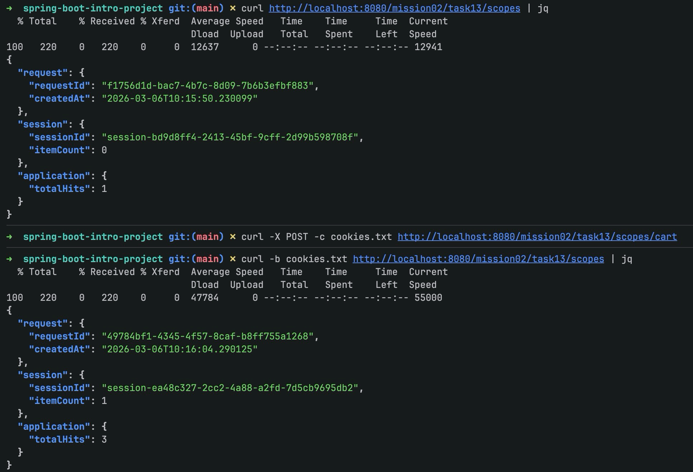

# 스프링 핵심 원리 - 기본: 스프링 웹 스코프를 활용한 빈 생성하기

이 문서는 `mission-02-spring-core-basic`의 `task-13-spring-web-scope` 수행 결과를 정리한 보고서입니다. Spring MVC 환경에서 request / session / application 스코프 빈을 등록하고, HTTP 요청 흐름 속에서 스코프가 어떻게 유지·분리되는지 확인했습니다.

## 1. 작업 개요
- 미션/태스크: `mission-02-spring-core-basic` / `task-13-spring-web-scope`
- 목표: 세 가지 웹 스코프 빈을 정의하고 컨트롤러에서 주입·활용하여 스코프별 수명과 공유 범위를 확인한다.
- 엔드포인트:
  - `GET /mission02/task13/scopes` : 현재 스코프별 상태 조회(+ application hit 증가)
  - `POST /mission02/task13/scopes/cart` : 세션 장바구니 수량 증가(+ application hit 증가)

## 2. 코드 파일 경로 인덱스
| 구분 | 파일 경로 | 역할 |
|---|---|---|
| Controller | `src/main/java/com/goorm/springmissionsplayground/mission02_spring_core_basic/task13_web_scope/controller/WebScopeController.java` | 웹 스코프 상태 조회/변경 API 노출 |
| DTO | `src/main/java/com/goorm/springmissionsplayground/mission02_spring_core_basic/task13_web_scope/dto/ScopeSnapshot.java` | 스코프 상태 응답 DTO |
| Scope | `src/main/java/com/goorm/springmissionsplayground/mission02_spring_core_basic/task13_web_scope/scope/RequestTrace.java` | RequestScope 빈 (요청 식별/생성시각) |
| Scope | `src/main/java/com/goorm/springmissionsplayground/mission02_spring_core_basic/task13_web_scope/scope/SessionCart.java` | SessionScope 빈 (장바구니 수량) |
| Scope | `src/main/java/com/goorm/springmissionsplayground/mission02_spring_core_basic/task13_web_scope/scope/ApplicationStats.java` | ApplicationScope 빈 (전체 호출 수) |
| Test | `src/test/java/com/goorm/springmissionsplayground/mission02_spring_core_basic/task13_web_scope/WebScopeControllerTest.java` | 스코프 수명/누적 여부 검증 |
| Docs | `docs/mission-02-spring-core-basic/task-13-spring-web-scope/README.md` | 태스크 보고서 |
| Screenshots | `docs/mission-02-spring-core-basic/task-13-spring-web-scope/screenshots/curl-output.txt` | 예시 실행 로그(스크린샷 대체용 캡처 가이드) |

## 3. 구현 단계와 주요 코드 해설
1) **스코프 빈 정의**: `@Scope(value="request|session|application", proxyMode=TARGET_CLASS)`로 요청/세션/애플리케이션 스코프 빈을 선언했습니다. 프록시를 사용해 싱글톤 컨트롤러 주입 시 지연 조회가 가능하도록 했습니다.
2) **컨트롤러 구성**: GET 요청에서 모든 스코프 상태를 한 번에 반환하고, POST `/cart`에서 세션 장바구니 수량을 증가시킵니다. 두 엔드포인트 모두 application hit 카운터를 증가시켜 스코프 차이를 관찰할 수 있습니다.
3) **DTO 정리**: 응답 구조를 `ScopeSnapshot`으로 통일해 API 출력이 일정하게 유지되도록 했습니다.
4) **테스트**: MockMvc로 서로 다른 요청/동일 세션/전체 호출 누적을 검증하여 request/session/application 스코프 동작을 확인했습니다.

## 4. 파일별 상세 설명 + 전체 코드

### 4.1 `WebScopeController.java`
- 파일 경로: `src/main/java/com/goorm/springmissionsplayground/mission02_spring_core_basic/task13_web_scope/controller/WebScopeController.java`
- 역할: 스코프 상태 조회/변경 REST 엔드포인트 제공.
- 상세: 기본 경로 `/mission02/task13/scopes`; GET은 snapshot 반환, POST `/cart`는 세션 장바구니 수량 증가 후 204 반환.

<details>
<summary><code>WebScopeController.java</code> 전체 코드</summary>

```java
package com.goorm.springmissionsplayground.mission02_spring_core_basic.task13_web_scope.controller;

import com.goorm.springmissionsplayground.mission02_spring_core_basic.task13_web_scope.dto.ScopeSnapshot;
import com.goorm.springmissionsplayground.mission02_spring_core_basic.task13_web_scope.scope.ApplicationStats;
import com.goorm.springmissionsplayground.mission02_spring_core_basic.task13_web_scope.scope.RequestTrace;
import com.goorm.springmissionsplayground.mission02_spring_core_basic.task13_web_scope.scope.SessionCart;
import org.springframework.http.HttpStatus;
import org.springframework.web.bind.annotation.GetMapping;
import org.springframework.web.bind.annotation.PostMapping;
import org.springframework.web.bind.annotation.RequestMapping;
import org.springframework.web.bind.annotation.ResponseStatus;
import org.springframework.web.bind.annotation.RestController;

@RestController
@RequestMapping("/mission02/task13/scopes")
public class WebScopeController {

    private final RequestTrace requestTrace;
    private final SessionCart sessionCart;
    private final ApplicationStats applicationStats;

    public WebScopeController(RequestTrace requestTrace, SessionCart sessionCart, ApplicationStats applicationStats) {
        this.requestTrace = requestTrace;
        this.sessionCart = sessionCart;
        this.applicationStats = applicationStats;
    }

    @GetMapping
    public ScopeSnapshot snapshot() {
        applicationStats.increase();
        return toSnapshot();
    }

    @PostMapping("/cart")
    @ResponseStatus(HttpStatus.NO_CONTENT)
    public void addCartItem() {
        applicationStats.increase();
        sessionCart.addItem();
    }

    private ScopeSnapshot toSnapshot() {
        return new ScopeSnapshot(
            new ScopeSnapshot.RequestScopeInfo(requestTrace.getRequestId(), requestTrace.getCreatedAt()),
            new ScopeSnapshot.SessionScopeInfo(sessionCart.getSessionId(), sessionCart.getItemCount()),
            new ScopeSnapshot.ApplicationScopeInfo(applicationStats.getTotalHits())
        );
    }
}
```

</details>

### 4.2 `ScopeSnapshot.java`
- 파일 경로: `src/main/java/com/goorm/springmissionsplayground/mission02_spring_core_basic/task13_web_scope/dto/ScopeSnapshot.java`
- 역할: 스코프별 상태를 한 번에 담는 응답 DTO.
- 상세: request/session/application 각각을 record 서브타입으로 구성해 직렬화 시 필드명이 명확하게 노출됩니다.

<details>
<summary><code>ScopeSnapshot.java</code> 전체 코드</summary>

```java
package com.goorm.springmissionsplayground.mission02_spring_core_basic.task13_web_scope.dto;

import java.time.LocalDateTime;

public class ScopeSnapshot {

    private final RequestScopeInfo request;
    private final SessionScopeInfo session;
    private final ApplicationScopeInfo application;

    public ScopeSnapshot(RequestScopeInfo request, SessionScopeInfo session, ApplicationScopeInfo application) {
        this.request = request;
        this.session = session;
        this.application = application;
    }

    public RequestScopeInfo getRequest() {
        return request;
    }

    public SessionScopeInfo getSession() {
        return session;
    }

    public ApplicationScopeInfo getApplication() {
        return application;
    }

    public record RequestScopeInfo(String requestId, LocalDateTime createdAt) { }

    public record SessionScopeInfo(String sessionId, int itemCount) { }

    public record ApplicationScopeInfo(long totalHits) { }
}
```

</details>

### 4.3 `RequestTrace.java`
- 파일 경로: `src/main/java/com/goorm/springmissionsplayground/mission02_spring_core_basic/task13_web_scope/scope/RequestTrace.java`
- 역할: 요청마다 새로운 ID와 생성 시각을 갖는 RequestScope 빈.
- 상세: `ScopedProxyMode.TARGET_CLASS`로 컨트롤러 주입 시 실제 요청 시점에 실제 빈을 조회합니다.

<details>
<summary><code>RequestTrace.java</code> 전체 코드</summary>

```java
package com.goorm.springmissionsplayground.mission02_spring_core_basic.task13_web_scope.scope;

import org.springframework.context.annotation.Scope;
import org.springframework.context.annotation.ScopedProxyMode;
import org.springframework.stereotype.Component;

import java.time.LocalDateTime;
import java.util.UUID;

@Component
@Scope(value = "request", proxyMode = ScopedProxyMode.TARGET_CLASS)
public class RequestTrace {

    private final String requestId = UUID.randomUUID().toString();
    private final LocalDateTime createdAt = LocalDateTime.now();

    public String getRequestId() {
        return requestId;
    }

    public LocalDateTime getCreatedAt() {
        return createdAt;
    }
}
```

</details>

### 4.4 `SessionCart.java`
- 파일 경로: `src/main/java/com/goorm/springmissionsplayground/mission02_spring_core_basic/task13_web_scope/scope/SessionCart.java`
- 역할: 세션마다 유지되는 장바구니 수량을 관리.
- 상세: UUID 기반 세션 ID를 갖고, `addItem()` 호출 시 수량을 누적합니다.

<details>
<summary><code>SessionCart.java</code> 전체 코드</summary>

```java
package com.goorm.springmissionsplayground.mission02_spring_core_basic.task13_web_scope.scope;

import org.springframework.context.annotation.Scope;
import org.springframework.context.annotation.ScopedProxyMode;
import org.springframework.stereotype.Component;

import java.util.UUID;
import java.util.concurrent.atomic.AtomicInteger;

@Component
@Scope(value = "session", proxyMode = ScopedProxyMode.TARGET_CLASS)
public class SessionCart {

    private final String sessionId = "session-" + UUID.randomUUID();
    private final AtomicInteger itemCount = new AtomicInteger(0);

    public int addItem() {
        return itemCount.incrementAndGet();
    }

    public int getItemCount() {
        return itemCount.get();
    }

    public String getSessionId() {
        return sessionId;
    }
}
```

</details>

### 4.5 `ApplicationStats.java`
- 파일 경로: `src/main/java/com/goorm/springmissionsplayground/mission02_spring_core_basic/task13_web_scope/scope/ApplicationStats.java`
- 역할: 애플리케이션 전체 요청 수를 누적하는 ApplicationScope 빈.
- 상세: `increase()`로 증가시키고 `reset()`으로 테스트 초기화가 가능합니다.

<details>
<summary><code>ApplicationStats.java</code> 전체 코드</summary>

```java
package com.goorm.springmissionsplayground.mission02_spring_core_basic.task13_web_scope.scope;

import org.springframework.context.annotation.Scope;
import org.springframework.context.annotation.ScopedProxyMode;
import org.springframework.stereotype.Component;

import java.util.concurrent.atomic.AtomicLong;

@Component
@Scope(value = "application", proxyMode = ScopedProxyMode.TARGET_CLASS)
public class ApplicationStats {

    private final AtomicLong totalHits = new AtomicLong(0);

    public long increase() {
        return totalHits.incrementAndGet();
    }

    public long getTotalHits() {
        return totalHits.get();
    }

    public void reset() {
        totalHits.set(0);
    }
}
```

</details>

### 4.6 `WebScopeControllerTest.java`
- 파일 경로: `src/test/java/com/goorm/springmissionsplayground/mission02_spring_core_basic/task13_web_scope/WebScopeControllerTest.java`
- 역할: request/session/application 스코프 동작을 MockMvc로 검증.
- 상세: 요청마다 다른 requestId, 동일 세션에서 cart 누적, application hit 누적을 각각 확인합니다. 테스트마다 `ApplicationStats.reset()`으로 초기화합니다.

<details>
<summary><code>WebScopeControllerTest.java</code> 전체 코드</summary>

```java
package com.goorm.springmissionsplayground.mission02_spring_core_basic.task13_web_scope;

import com.goorm.springmissionsplayground.mission02_spring_core_basic.task13_web_scope.scope.ApplicationStats;
import org.junit.jupiter.api.BeforeEach;
import org.junit.jupiter.api.DisplayName;
import org.junit.jupiter.api.Test;
import org.springframework.beans.factory.annotation.Autowired;
import org.springframework.boot.test.autoconfigure.web.servlet.AutoConfigureMockMvc;
import org.springframework.boot.test.context.SpringBootTest;
import org.springframework.test.web.servlet.MockMvc;
import org.springframework.test.web.servlet.ResultActions;
import org.springframework.mock.web.MockHttpSession;

import static org.assertj.core.api.Assertions.assertThat;
import static org.springframework.test.web.servlet.request.MockMvcRequestBuilders.get;
import static org.springframework.test.web.servlet.request.MockMvcRequestBuilders.post;
import static org.springframework.test.web.servlet.result.MockMvcResultMatchers.jsonPath;
import static org.springframework.test.web.servlet.result.MockMvcResultMatchers.status;

@SpringBootTest
@AutoConfigureMockMvc
class WebScopeControllerTest {

    @Autowired
    MockMvc mockMvc;

    @Autowired
    ApplicationStats applicationStats;

    @BeforeEach
    void resetApplicationStats() {
        applicationStats.reset();
    }

    @Test
    @DisplayName("RequestScope는 요청마다 requestId가 달라진다")
    void requestScopeChangesPerRequest() throws Exception {
        String id1 = extractRequestId(mockMvc.perform(get("/mission02/task13/scopes")));
        String id2 = extractRequestId(mockMvc.perform(get("/mission02/task13/scopes")));

        assertThat(id1).isNotEqualTo(id2);
    }

    @Test
    @DisplayName("SessionScope는 동일 세션에서 cart count를 유지한다")
    void sessionScopePersistsWithinSession() throws Exception {
        MockHttpSession session = new MockHttpSession();

        mockMvc.perform(post("/mission02/task13/scopes/cart").session(session))
            .andExpect(status().isNoContent());

        mockMvc.perform(post("/mission02/task13/scopes/cart").session(session))
            .andExpect(status().isNoContent());

        mockMvc.perform(get("/mission02/task13/scopes").session(session))
            .andExpect(status().isOk())
            .andExpect(jsonPath("$.session.itemCount").value(2));
    }

    @Test
    @DisplayName("ApplicationScope는 총 호출 수를 누적한다")
    void applicationScopeAccumulates() throws Exception {
        mockMvc.perform(get("/mission02/task13/scopes")).andExpect(status().isOk());
        mockMvc.perform(get("/mission02/task13/scopes")).andExpect(status().isOk());

        mockMvc.perform(get("/mission02/task13/scopes"))
            .andExpect(status().isOk())
            .andExpect(jsonPath("$.application.totalHits").value(3));
    }

    private String extractRequestId(ResultActions action) throws Exception {
        String response = action.andExpect(status().isOk())
            .andExpect(jsonPath("$.request.requestId").exists())
            .andReturn()
            .getResponse()
            .getContentAsString();
        int start = response.indexOf("requestId\":\"") + "requestId\":\"".length();
        int end = response.indexOf("\"", start);
        return response.substring(start, end);
    }
}
```

</details>

## 5. 새로 나온 개념 정리 + 참고 링크
- **웹 스코프 빈(Request/Session/Application)**
  - 핵심: 요청/세션/애플리케이션 범위에 따라 빈 생명주기를 다르게 관리한다.
  - 왜 쓰는가: 상태 보존 범위를 조절해 필요한 곳에만 상태를 유지하고 불필요한 공유를 막기 위해.
  - 참고 링크: https://docs.spring.io/spring-framework/reference/core/beans/factory-scopes.html#beans-factory-scopes-other-web
- **Scoped Proxy**
  - 핵심: 스코프가 짧은 빈을 싱글톤 빈에 주입할 때 프록시를 사용해 실제 조회 시점을 지연한다.
  - 왜 쓰는가: DI 시점에는 프록시를, 실제 요청 시에는 실체를 사용해 라이프사이클 충돌을 방지한다.
  - 참고 링크: https://docs.spring.io/spring-framework/reference/core/beans/definition.html#beans-factory-scoping-proxies
- **MockMvc를 통한 스코프 검증**
  - 핵심: 가짜 HTTP 요청을 만들어 컨트롤러와 웹 스코프 빈 협력을 통합 테스트한다.
  - 왜 쓰는가: 실제 서블릿 컨텍스트 없이도 요청/세션 단위로 동작을 검증할 수 있다.
  - 참고 링크: https://docs.spring.io/spring-framework/reference/testing/spring-mvc-test-framework.html

## 6. 실행·검증 방법
- 애플리케이션 실행: `./gradlew bootRun`
- API 호출 예시:
  - 스코프 조회: `curl http://localhost:8080/mission02/task13/scopes | jq`
  - 세션 장바구니 추가(동일 세션 유지): `curl -X POST -c cookies.txt http://localhost:8080/mission02/task13/scopes/cart` 후 `curl -b cookies.txt http://localhost:8080/mission02/task13/scopes | jq`
- 테스트 실행: `./gradlew test --tests "*task13_web_scope*"`

## 7. 결과 확인 방법(스크린샷 포함)
- 성공 기준: 
  - 요청마다 `request.requestId` 값이 달라지고, 동일 세션에서 `session.itemCount`가 누적되며, `application.totalHits`가 전체 호출 수를 반영하면 성공.
  - `docs/mission-02-spring-core-basic/task-13-spring-web-scope/screenshots/curl-output.txt`에 예시 출력 로그를 제공했습니다. 실제 스크린샷을 촬영할 경우 같은 경로에 `request-session-application.png`로 저장하면 됩니다.


## 8. 학습 내용
- 스코프가 다른 빈을 하나의 컨트롤러에 주입할 때 프록시를 사용하면 라이프사이클 문제를 손쉽게 해결할 수 있다.
- 세션 스코프 빈은 테스트 시 동일 MockHttpSession을 공유해야 동작을 검증할 수 있으며, application 스코프는 테스트 격리를 위해 reset 훅을 준비하는 것이 유용하다.
- 스코프별 상태를 한 번에 반환하는 DTO를 정의하면 API 소비자가 스코프 차이를 직관적으로 비교할 수 있다.
