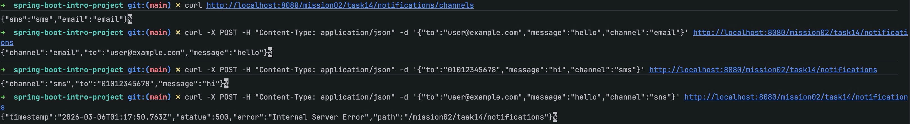

# 스프링 핵심 원리 - 기본: 인터페이스를 사용하여 의존성 주입하기

이 문서는 `mission-02-spring-core-basic`의 `task-14-interface-injection` 수행 결과를 정리한 보고서입니다. 공통 인터페이스 뒤에 여러 구현을 두고, 런타임에 채널 문자열로 구현을 선택하는 DI 예제를 Spring Boot로 구성했습니다.

## 1. 작업 개요
- 미션/태스크: `mission-02-spring-core-basic` / `task-14-interface-injection`
- 목표: 인터페이스(`NotificationSender`) 기반으로 다형적 의존성을 주입하고, 맵/리스트 주입을 통해 구현을 선택하는 방식을 실습한다.
- 엔드포인트: `POST /mission02/task14/notifications` (알림 전송), `GET /mission02/task14/notifications/channels` (지원 채널 조회)

## 2. 코드 파일 경로 인덱스
| 구분 | 파일 경로 | 역할 |
|---|---|---|
| Controller | `src/main/java/com/goorm/springmissionsplayground/mission02_spring_core_basic/task14_interface_injection/controller/NotificationController.java` | API 진입점, 요청 바인딩/상태 코드 반환 |
| Service | `src/main/java/com/goorm/springmissionsplayground/mission02_spring_core_basic/task14_interface_injection/service/NotificationService.java` | 인터페이스 기반 구현 선택 및 비즈니스 처리 |
| Interface | `src/main/java/com/goorm/springmissionsplayground/mission02_spring_core_basic/task14_interface_injection/sender/NotificationSender.java` | 알림 전송 공통 계약 |
| Implementation | `src/main/java/com/goorm/springmissionsplayground/mission02_spring_core_basic/task14_interface_injection/sender/EmailNotificationSender.java` | 이메일 알림 구현체(컴포넌트 이름 `emailSender`) |
| Implementation | `src/main/java/com/goorm/springmissionsplayground/mission02_spring_core_basic/task14_interface_injection/sender/SmsNotificationSender.java` | SMS 알림 구현체(컴포넌트 이름 `smsSender`) |
| DTO | `src/main/java/com/goorm/springmissionsplayground/mission02_spring_core_basic/task14_interface_injection/dto/NotifyRequest.java` | 요청 바인딩/검증 DTO |
| DTO | `src/main/java/com/goorm/springmissionsplayground/mission02_spring_core_basic/task14_interface_injection/dto/NotifyResponse.java` | 응답 DTO |
| Test | `src/test/java/com/goorm/springmissionsplayground/mission02_spring_core_basic/task14_interface_injection/NotificationServiceTest.java` | 채널 선택/예외 흐름 단위 테스트 |

## 3. 구현 단계와 주요 코드 해설
1) **인터페이스 정의**: `NotificationSender`가 `send()`와 `channel()` 계약을 제공하여 구현체가 자신의 채널 키를 노출하도록 함.
2) **구현체 등록**: `@Component("emailSender")`, `@Component("smsSender")`로 명시적 빈 이름을 부여해 다른 태스크와의 빈 이름 충돌을 방지.
3) **주입 방식**: `NotificationService`에서 `Map<String, NotificationSender>`와 `List<NotificationSender>`를 동시 주입받아, 리스트에서 채널 문자열로 구현을 찾고 실패 시 예외를 던진다.
4) **컨트롤러**: POST 요청으로 알림을 전송하고, GET `/channels`로 사용 가능한 채널 키를 노출해 클라이언트가 안전하게 선택하도록 한다.
5) **테스트**: 이메일 채널 성공 시나리오와 미지원 채널 예외 시나리오를 단위 테스트로 검증했다.

## 4. 파일별 상세 설명 + 전체 코드

### 4.1 `NotificationController.java`
- 파일 경로: `src/main/java/com/goorm/springmissionsplayground/mission02_spring_core_basic/task14_interface_injection/controller/NotificationController.java`
- 역할: 알림 전송 API와 채널 조회 API를 제공.
- 상세: 기본 경로 `/mission02/task14/notifications`; POST는 201 Created로 응답, GET `/channels`는 사용 가능 채널 맵을 반환.

<details>
<summary><code>NotificationController.java</code> 전체 코드</summary>

```java
package com.goorm.springmissionsplayground.mission02_spring_core_basic.task14_interface_injection.controller;

import com.goorm.springmissionsplayground.mission02_spring_core_basic.task14_interface_injection.dto.NotifyRequest;
import com.goorm.springmissionsplayground.mission02_spring_core_basic.task14_interface_injection.dto.NotifyResponse;
import com.goorm.springmissionsplayground.mission02_spring_core_basic.task14_interface_injection.service.NotificationService;
import jakarta.validation.Valid;
import org.springframework.http.HttpStatus;
import org.springframework.web.bind.annotation.GetMapping;
import org.springframework.web.bind.annotation.PostMapping;
import org.springframework.web.bind.annotation.RequestBody;
import org.springframework.web.bind.annotation.RequestMapping;
import org.springframework.web.bind.annotation.ResponseStatus;
import org.springframework.web.bind.annotation.RestController;

import java.util.Map;

@RestController("task14NotificationController")
@RequestMapping("/mission02/task14/notifications")
public class NotificationController {

    private final NotificationService notificationService;

    public NotificationController(NotificationService notificationService) {
        this.notificationService = notificationService;
    }

    @PostMapping
    @ResponseStatus(HttpStatus.CREATED)
    public NotifyResponse send(@RequestBody @Valid NotifyRequest request) {
        return notificationService.notify(request);
    }

    @GetMapping("/channels")
    public Map<String, String> channels() {
        return notificationService.availableChannels();
    }
}
```

</details>

### 4.2 `NotificationService.java`
- 파일 경로: `src/main/java/com/goorm/springmissionsplayground/mission02_spring_core_basic/task14_interface_injection/service/NotificationService.java`
- 역할: 채널 문자열로 구현체를 선택해 알림을 보내는 서비스.
- 상세: 스프링이 주입한 `List<NotificationSender>`에서 `channel()`을 비교해 구현체를 선택하고, 예외 메시지에 사용 가능 채널을 함께 노출합니다.

<details>
<summary><code>NotificationService.java</code> 전체 코드</summary>

```java
package com.goorm.springmissionsplayground.mission02_spring_core_basic.task14_interface_injection.service;

import com.goorm.springmissionsplayground.mission02_spring_core_basic.task14_interface_injection.dto.NotifyRequest;
import com.goorm.springmissionsplayground.mission02_spring_core_basic.task14_interface_injection.dto.NotifyResponse;
import com.goorm.springmissionsplayground.mission02_spring_core_basic.task14_interface_injection.sender.NotificationSender;
import org.springframework.stereotype.Service;

import java.util.List;
import java.util.Map;
import java.util.stream.Collectors;

@Service("task14NotificationService")
public class NotificationService {

    private final Map<String, NotificationSender> senderMap;
    private final List<NotificationSender> senderList;

    public NotificationService(Map<String, NotificationSender> senderMap, List<NotificationSender> senderList) {
        this.senderMap = senderMap;
        this.senderList = senderList;
    }

    public NotifyResponse notify(NotifyRequest request) {
        NotificationSender sender = resolveSender(request.getChannel());
        sender.send(request.getTo(), request.getMessage());
        return new NotifyResponse(sender.channel(), request.getTo(), request.getMessage());
    }

    public Map<String, String> availableChannels() {
        return senderList.stream()
            .collect(Collectors.toMap(NotificationSender::channel, NotificationSender::channel));
    }

    private NotificationSender resolveSender(String channel) {
        return senderList.stream()
            .filter(s -> s.channel().equalsIgnoreCase(channel))
            .findFirst()
            .orElseThrow(() -> new IllegalArgumentException("지원하지 않는 채널: " + channel + " / 사용가능: " + senderMap.keySet()));
    }
}
```

</details>

### 4.3 `NotificationSender` 및 구현체
- 파일 경로: `src/main/java/com/goorm/springmissionsplayground/mission02_spring_core_basic/task14_interface_injection/sender/NotificationSender.java`
- 역할: 알림 전송 공통 계약을 정의하며, 구현체가 자신의 채널 키를 제공.
- 구현체:
  - `EmailNotificationSender` (`emailSender`): 이메일 채널 전송
  - `SmsNotificationSender` (`smsSender`): SMS 채널 전송

<details>
<summary><code>NotificationSender.java</code> 전체 코드</summary>

```java
package com.goorm.springmissionsplayground.mission02_spring_core_basic.task14_interface_injection.sender;

public interface NotificationSender {

    void send(String to, String message);

    String channel();
}
```

</details>

### 4.4 `NotifyRequest.java`, `NotifyResponse.java`
- 역할: 요청/응답 DTO. Bean Validation을 적용해 필수 값 누락을 방지합니다.

<details>
<summary><code>NotifyRequest.java</code> 전체 코드</summary>

```java
package com.goorm.springmissionsplayground.mission02_spring_core_basic.task14_interface_injection.dto;

import jakarta.validation.constraints.NotBlank;

public class NotifyRequest {

    @NotBlank(message = "수신자는 필수입니다.")
    private String to;

    @NotBlank(message = "메시지는 필수입니다.")
    private String message;

    @NotBlank(message = "채널은 필수입니다.")
    private String channel;

    public String getTo() {
        return to;
    }

    public void setTo(String to) {
        this.to = to;
    }

    public String getMessage() {
        return message;
    }

    public void setMessage(String message) {
        this.message = message;
    }

    public String getChannel() {
        return channel;
    }

    public void setChannel(String channel) {
        this.channel = channel;
    }
}
```

</details>

<details>
<summary><code>NotifyResponse.java</code> 전체 코드</summary>

```java
package com.goorm.springmissionsplayground.mission02_spring_core_basic.task14_interface_injection.dto;

public class NotifyResponse {

    private final String channel;
    private final String to;
    private final String message;

    public NotifyResponse(String channel, String to, String message) {
        this.channel = channel;
        this.to = to;
        this.message = message;
    }

    public String getChannel() {
        return channel;
    }

    public String getTo() {
        return to;
    }

    public String getMessage() {
        return message;
    }
}
```

</details>

### 4.5 `NotificationServiceTest.java`
- 파일 경로: `src/test/java/com/goorm/springmissionsplayground/mission02_spring_core_basic/task14_interface_injection/NotificationServiceTest.java`
- 역할: 채널 선택 성공/실패 시나리오 검증.

<details>
<summary><code>NotificationServiceTest.java</code> 전체 코드</summary>

```java
package com.goorm.springmissionsplayground.mission02_spring_core_basic.task14_interface_injection;

import com.goorm.springmissionsplayground.mission02_spring_core_basic.task14_interface_injection.dto.NotifyRequest;
import com.goorm.springmissionsplayground.mission02_spring_core_basic.task14_interface_injection.dto.NotifyResponse;
import com.goorm.springmissionsplayground.mission02_spring_core_basic.task14_interface_injection.service.NotificationService;
import org.junit.jupiter.api.DisplayName;
import org.junit.jupiter.api.Test;
import org.springframework.beans.factory.annotation.Autowired;
import org.springframework.boot.test.context.SpringBootTest;

import static org.assertj.core.api.Assertions.assertThat;
import static org.assertj.core.api.Assertions.assertThatThrownBy;

@SpringBootTest
class NotificationServiceTest {

    @Autowired
    NotificationService notificationService;

    @Test
    @DisplayName("채널 문자열로 구현체를 선택해 알림을 보낸다")
    void notifyByChannel() {
        NotifyRequest request = new NotifyRequest();
        request.setTo("user@example.com");
        request.setMessage("환영합니다");
        request.setChannel("email");

        NotifyResponse response = notificationService.notify(request);

        assertThat(response.getChannel()).isEqualTo("email");
        assertThat(response.getTo()).isEqualTo("user@example.com");
    }

    @Test
    @DisplayName("지원하지 않는 채널이면 예외가 발생한다")
    void unsupportedChannel() {
        NotifyRequest request = new NotifyRequest();
        request.setTo("user");
        request.setMessage("hello");
        request.setChannel("slack");

        assertThatThrownBy(() -> notificationService.notify(request))
            .isInstanceOf(IllegalArgumentException.class)
            .hasMessageContaining("지원하지 않는 채널");
    }
}
```

</details>

## 5. 새로 나온 개념 정리 + 참고 링크
- **인터페이스 기반 DI와 다형성 선택**
  - 핵심: 공통 인터페이스 뒤에 여러 구현을 두고, 클라이언트에서 조건에 따라 구현을 선택한다.
  - 왜 쓰는가: 기능 확장 시 기존 코드를 수정하지 않고 구현만 추가해 OCP를 지키기 위해.
  - 참고 링크: https://docs.spring.io/spring-framework/reference/core/beans/dependencies/factory-collaboration.html#beans-autowired-annotation
- **Map/List 주입을 통한 빈 선택**
  - 핵심: 동일 타입의 빈을 맵/리스트로 주입받아 키 또는 순회로 구현을 선택한다.
  - 왜 쓰는가: 런타임에 구현을 결정하거나 전략을 외부 입력에 매핑할 때 유용하다.
  - 참고 링크: https://docs.spring.io/spring-framework/reference/core/beans/dependencies/factory-collaboration.html#beans-autowired-annotation-collections
- **빈 이름 충돌 방지**
  - 핵심: `@Component("customName")`를 사용해 동일 클래스명이 다른 패키지에 있을 때도 충돌을 피한다.
  - 왜 쓰는가: 대규모 프로젝트나 학습용 멀티 태스크 환경에서 스캔 범위가 넓을 때 빈 이름 중복을 예방한다.

## 6. 실행·검증 방법
- 애플리케이션 실행: `./gradlew bootRun`
- API 호출 예시:
  - 채널 목록: `curl http://localhost:8080/mission02/task14/notifications/channels`
  - 이메일 전송: `curl -X POST -H "Content-Type: application/json" -d '{"to":"user@example.com","message":"hello","channel":"email"}' http://localhost:8080/mission02/task14/notifications`
  - SMS 전송: `curl -X POST -H "Content-Type: application/json" -d '{"to":"01012345678","message":"hi","channel":"sms"}' http://localhost:8080/mission02/task14/notifications`
- 테스트: `./gradlew test --tests "*task14_interface_injection*"`

## 7. 결과 확인 방법(스크린샷 포함)
- 성공 기준: 지정한 채널에 따라 응답 `channel` 값이 일치하고, 미지원 채널 요청 시 400/500 범위 예외 메시지에 "지원하지 않는 채널"이 포함됩니다.
- 스크린샷: 필요 시 curl 결과를 캡처해 `docs/mission-02-spring-core-basic/task-14-interface-injection/` 하위에 저장할 수 있습니다.


## 8. 학습 내용
- 동일 타입의 여러 빈을 Map/List로 주입하면 전략 패턴을 스프링 DI로 자연스럽게 구현할 수 있다.
- 빈 이름을 명시해두면 여러 태스크가 공존하는 프로젝트에서도 충돌을 예방할 수 있다.
- 인터페이스와 DTO를 통해 입력/출력을 분리하면 컨트롤러·서비스 테스트가 단순해진다.
