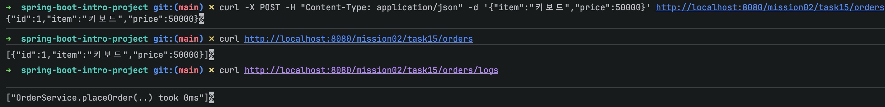

# 스프링 핵심 원리 - 기본: DI/IoC/AOP를 적용한 간단한 예제

이 문서는 `mission-02-spring-core-basic`의 `task-15-core-principles-demo` 수행 결과입니다. 주문 생성 흐름에 DI, IoC, AOP 핵심 원리를 적용해 단일 예제로 묶고, 코드와 테스트로 동작을 확인했습니다.

## 1. 작업 개요
- 미션/태스크: `mission-02-spring-core-basic` / `task-15-core-principles-demo`
- 목표: 인터페이스 기반 DI, 스프링 컨테이너의 IoC, AOP(@Around) 로깅을 한 예제 안에 담아 작동 방식을 보여준다.
- 엔드포인트: `POST /mission02/task15/orders` (주문 생성), `GET /mission02/task15/orders` (목록), `GET /mission02/task15/orders/logs` (AOP 실행 로그)

## 2. 코드 파일 경로 인덱스
| 구분 | 파일 경로 | 역할 |
|---|---|---|
| Controller | `src/main/java/com/goorm/springmissionsplayground/mission02_spring_core_basic/task15_core_principles_demo/controller/OrderDemoController.java` | 주문 생성/조회, 로그 조회 API |
| Service | `src/main/java/com/goorm/springmissionsplayground/mission02_spring_core_basic/task15_core_principles_demo/service/OrderService.java` | 비즈니스 로직, @LogExecution AOP 대상 |
| Repository | `src/main/java/com/goorm/springmissionsplayground/mission02_spring_core_basic/task15_core_principles_demo/repository/OrderRepository.java` | 저장소 추상화 인터페이스 |
| Repository | `src/main/java/com/goorm/springmissionsplayground/mission02_spring_core_basic/task15_core_principles_demo/repository/InMemoryOrderRepository.java` | 인메모리 구현체 |
| Domain | `src/main/java/com/goorm/springmissionsplayground/mission02_spring_core_basic/task15_core_principles_demo/domain/Order.java` | 주문 값 객체 |
| AOP Annotation | `src/main/java/com/goorm/springmissionsplayground/mission02_spring_core_basic/task15_core_principles_demo/aop/LogExecution.java` | 로깅 대상 표시용 커스텀 애너테이션 |
| AOP Aspect | `src/main/java/com/goorm/springmissionsplayground/mission02_spring_core_basic/task15_core_principles_demo/aop/ExecutionLoggingAspect.java` | @Around 로깅 구현 |
| AOP Store | `src/main/java/com/goorm/springmissionsplayground/mission02_spring_core_basic/task15_core_principles_demo/aop/ExecutionLogStore.java` | 실행 로그 저장소(테스트/조회용) |
| Test | `src/test/java/com/goorm/springmissionsplayground/mission02_spring_core_basic/task15_core_principles_demo/OrderServiceTest.java` | DI·IoC·AOP 동작 검증 |

## 3. 구현 단계와 주요 코드 해설
1) **IoC/DI**: `OrderService`는 `OrderRepository` 인터페이스로 의존성을 선언하고, 스프링 컨테이너가 `InMemoryOrderRepository`를 주입한다. 서비스는 구현을 모른 채 주문을 저장한다.
2) **AOP**: `@LogExecution` 애너테이션을 서비스 메서드에 붙이고, `ExecutionLoggingAspect`가 실행 시간을 기록해 `ExecutionLogStore`에 저장한다. 핵심 로직을 건드리지 않고 부가 기능을 주입.
3) **REST 엔드포인트**: 컨트롤러가 서비스와 로그 스토어를 주입 받아 주문 생성/조회, 로그 조회를 제공해 AOP 결과를 바로 확인할 수 있다.
4) **테스트**: 주문 저장이 인터페이스 기반으로 수행되는지, AOP 로그가 남는지 검증하여 세 원리가 작동함을 확인했다.

## 4. 파일별 상세 설명 + 전체 코드

### 4.1 `OrderDemoController.java`
- 파일 경로: `src/main/java/com/goorm/springmissionsplayground/mission02_spring_core_basic/task15_core_principles_demo/controller/OrderDemoController.java`
- 역할: 주문 생성/조회, 로그 조회 API 제공.
- 상세: `/mission02/task15/orders`에 POST(201), GET(200), `/logs`(200)를 매핑해 AOP 결과를 확인 가능.

<details>
<summary><code>OrderDemoController.java</code> 전체 코드</summary>

```java
package com.goorm.springmissionsplayground.mission02_spring_core_basic.task15_core_principles_demo.controller;

import com.goorm.springmissionsplayground.mission02_spring_core_basic.task15_core_principles_demo.aop.ExecutionLogStore;
import com.goorm.springmissionsplayground.mission02_spring_core_basic.task15_core_principles_demo.domain.Order;
import com.goorm.springmissionsplayground.mission02_spring_core_basic.task15_core_principles_demo.service.OrderService;
import org.springframework.http.HttpStatus;
import org.springframework.web.bind.annotation.GetMapping;
import org.springframework.web.bind.annotation.PostMapping;
import org.springframework.web.bind.annotation.RequestBody;
import org.springframework.web.bind.annotation.RequestMapping;
import org.springframework.web.bind.annotation.ResponseStatus;
import org.springframework.web.bind.annotation.RestController;

import java.util.List;
import java.util.Map;

@RestController("task15OrderDemoController")
@RequestMapping("/mission02/task15/orders")
public class OrderDemoController {

    private final OrderService orderService;
    private final ExecutionLogStore logStore;

    public OrderDemoController(OrderService orderService, ExecutionLogStore logStore) {
        this.orderService = orderService;
        this.logStore = logStore;
    }

    @PostMapping
    @ResponseStatus(HttpStatus.CREATED)
    public Order place(@RequestBody Map<String, Object> body) {
        String item = (String) body.getOrDefault("item", "");
        int price = ((Number) body.getOrDefault("price", 0)).intValue();
        return orderService.placeOrder(item, price);
    }

    @GetMapping
    public List<Order> list() {
        return orderService.list();
    }

    @GetMapping("/logs")
    public List<String> logs() {
        return logStore.getLogs();
    }
}
```

</details>

### 4.2 `OrderService.java`
- 파일 경로: `src/main/java/com/goorm/springmissionsplayground/mission02_spring_core_basic/task15_core_principles_demo/service/OrderService.java`
- 역할: 주문 생성/조회 비즈니스 로직, AOP 대상 메서드 보유.
- 상세: 인터페이스 타입으로 저장소를 주입받고, `@LogExecution`이 부착된 `placeOrder()`를 @Transactional로 감싼다.

<details>
<summary><code>OrderService.java</code> 전체 코드</summary>

```java
package com.goorm.springmissionsplayground.mission02_spring_core_basic.task15_core_principles_demo.service;

import com.goorm.springmissionsplayground.mission02_spring_core_basic.task15_core_principles_demo.aop.LogExecution;
import com.goorm.springmissionsplayground.mission02_spring_core_basic.task15_core_principles_demo.domain.Order;
import com.goorm.springmissionsplayground.mission02_spring_core_basic.task15_core_principles_demo.repository.OrderRepository;
import org.springframework.stereotype.Service;
import org.springframework.transaction.annotation.Transactional;

import java.util.List;

@Service("task15OrderService")
@Transactional(readOnly = true)
public class OrderService {

    private final OrderRepository orderRepository;

    public OrderService(OrderRepository orderRepository) {
        this.orderRepository = orderRepository;
    }

    @LogExecution
    @Transactional
    public Order placeOrder(String item, int price) {
        Order order = new Order(null, item, price);
        return orderRepository.save(order);
    }

    public List<Order> list() {
        return orderRepository.findAll();
    }
}
```

</details>

### 4.3 `OrderRepository` & `InMemoryOrderRepository`
- 역할: 저장소 추상화와 인메모리 구현체. IoC 컨테이너가 인터페이스 타입 의존성을 구현체로 연결한다.

<details>
<summary><code>OrderRepository.java</code> 전체 코드</summary>

```java
package com.goorm.springmissionsplayground.mission02_spring_core_basic.task15_core_principles_demo.repository;

import com.goorm.springmissionsplayground.mission02_spring_core_basic.task15_core_principles_demo.domain.Order;

import java.util.List;
import java.util.Optional;

public interface OrderRepository {

    Order save(Order order);

    Optional<Order> findById(Long id);

    List<Order> findAll();

    void clear();
}
```

</details>

<details>
<summary><code>InMemoryOrderRepository.java</code> 전체 코드</summary>

```java
package com.goorm.springmissionsplayground.mission02_spring_core_basic.task15_core_principles_demo.repository;

import com.goorm.springmissionsplayground.mission02_spring_core_basic.task15_core_principles_demo.domain.Order;
import org.springframework.stereotype.Repository;

import java.util.ArrayList;
import java.util.List;
import java.util.Optional;
import java.util.concurrent.ConcurrentHashMap;
import java.util.concurrent.atomic.AtomicLong;

@Repository("task15OrderRepository")
public class InMemoryOrderRepository implements OrderRepository {

    private final ConcurrentHashMap<Long, Order> store = new ConcurrentHashMap<>();
    private final AtomicLong sequence = new AtomicLong(0L);

    @Override
    public Order save(Order order) {
        Long id = sequence.incrementAndGet();
        Order saved = new Order(id, order.getItem(), order.getPrice());
        store.put(id, saved);
        return saved;
    }

    @Override
    public Optional<Order> findById(Long id) {
        return Optional.ofNullable(store.get(id));
    }

    @Override
    public List<Order> findAll() {
        return new ArrayList<>(store.values());
    }

    @Override
    public void clear() {
        store.clear();
        sequence.set(0L);
    }
}
```

</details>

### 4.4 AOP 구성 (`LogExecution`, `ExecutionLoggingAspect`, `ExecutionLogStore`)
- 역할: @LogExecution 애너테이션이 붙은 메서드 실행 시간을 기록하고 저장.

<details>
<summary><code>ExecutionLoggingAspect.java</code> 전체 코드</summary>

```java
package com.goorm.springmissionsplayground.mission02_spring_core_basic.task15_core_principles_demo.aop;

import org.aspectj.lang.ProceedingJoinPoint;
import org.aspectj.lang.annotation.Around;
import org.aspectj.lang.annotation.Aspect;
import org.springframework.stereotype.Component;

@Aspect
@Component("task15ExecutionLoggingAspect")
public class ExecutionLoggingAspect {

    private final ExecutionLogStore logStore;

    public ExecutionLoggingAspect(ExecutionLogStore logStore) {
        this.logStore = logStore;
    }

    @Around("@annotation(com.goorm.springmissionsplayground.mission02_spring_core_basic.task15_core_principles_demo.aop.LogExecution)")
    public Object logExecution(ProceedingJoinPoint pjp) throws Throwable {
        long start = System.currentTimeMillis();
        try {
            return pjp.proceed();
        } finally {
            long took = System.currentTimeMillis() - start;
            logStore.add(pjp.getSignature().toShortString() + " took " + took + "ms");
        }
    }
}
```

</details>

### 4.5 테스트 `OrderServiceTest.java`
- 파일 경로: `src/test/java/com/goorm/springmissionsplayground/mission02_spring_core_basic/task15_core_principles_demo/OrderServiceTest.java`
- 역할: DI/IoC로 저장소가 주입되어 저장되는지, AOP 로그가 남는지 검증.

<details>
<summary><code>OrderServiceTest.java</code> 전체 코드</summary>

```java
package com.goorm.springmissionsplayground.mission02_spring_core_basic.task15_core_principles_demo;

import com.goorm.springmissionsplayground.mission02_spring_core_basic.task15_core_principles_demo.aop.ExecutionLogStore;
import com.goorm.springmissionsplayground.mission02_spring_core_basic.task15_core_principles_demo.domain.Order;
import com.goorm.springmissionsplayground.mission02_spring_core_basic.task15_core_principles_demo.repository.OrderRepository;
import com.goorm.springmissionsplayground.mission02_spring_core_basic.task15_core_principles_demo.service.OrderService;
import org.junit.jupiter.api.BeforeEach;
import org.junit.jupiter.api.DisplayName;
import org.junit.jupiter.api.Test;
import org.springframework.beans.factory.annotation.Autowired;
import org.springframework.boot.test.context.SpringBootTest;

import static org.assertj.core.api.Assertions.assertThat;

@SpringBootTest
class OrderServiceTest {

    @Autowired
    OrderService orderService;

    @Autowired
    OrderRepository orderRepository;

    @Autowired
    ExecutionLogStore logStore;

    @BeforeEach
    void setUp() {
        orderRepository.clear();
        logStore.clear();
    }

    @Test
    @DisplayName("DI/IoC: 서비스는 인터페이스 타입으로 저장소를 주입받아 주문을 저장한다")
    void placeOrder_savesThroughInjectedRepository() {
        Order saved = orderService.placeOrder("키보드", 50000);

        assertThat(saved.getId()).isNotNull();
        assertThat(orderRepository.findById(saved.getId())).isPresent();
    }

    @Test
    @DisplayName("AOP: @LogExecution 메서드 호출 시 실행 로그가 기록된다")
    void aspectLogsExecution() {
        orderService.placeOrder("마우스", 30000);

        assertThat(logStore.getLogs())
            .isNotEmpty()
            .first()
            .satisfies(log -> assertThat(log).contains("placeOrder"));
    }
}
```

</details>

## 5. 새로 나온 개념 정리 + 참고 링크
- **DI & IoC**
  - 핵심: 의존성을 코드가 직접 생성하지 않고 컨테이너가 주입한다.
  - 사용 이유: 구현 교체·테스트 용이성 확보, 느슨한 결합 유지.
  - 참고: https://docs.spring.io/spring-framework/reference/core/beans/dependencies/factory-collaboration.html
- **AOP (@Around, 커스텀 애너테이션)**
  - 핵심: 핵심 로직과 부가 관심사를 분리하여 재사용 가능하게 만든다.
  - 사용 이유: 로깅/측정/트랜잭션 등 반복 부가 기능을 공통화하여 코드 중복 제거.
  - 참고: https://docs.spring.io/spring-framework/reference/core/aop.html
- **커스텀 애너테이션으로 포인트컷 표현**
  - 핵심: 도메인 의미에 맞는 애너테이션을 붙여 AOP 적용 대상을 명확히 표시한다.
  - 참고: https://docs.spring.io/spring-framework/reference/core/aop/ataspectj/ataspectj-advice.html

## 6. 실행·검증 방법
- 앱 실행: `./gradlew bootRun`
- API 호출 예시:
  - 주문 생성: `curl -X POST -H "Content-Type: application/json" -d '{"item":"키보드","price":50000}' http://localhost:8080/mission02/task15/orders`
  - 주문 목록: `curl http://localhost:8080/mission02/task15/orders`
  - 실행 로그 조회: `curl http://localhost:8080/mission02/task15/orders/logs`
- 테스트: `./gradlew test --tests "*task15_core_principles_demo*"`

## 7. 결과 확인 방법(스크린샷 포함)
- 성공 기준: 주문 생성 시 ID가 발급되고, `/logs` 또는 `ExecutionLogStore`에 `placeOrder took ...ms` 형태 로그가 쌓인다.
- 필요 시 curl 결과를 캡처해 `docs/mission-02-spring-core-basic/task-15-core-principles-demo/`에 저장하면 됩니다.

## 8. 학습 내용
- 인터페이스와 구현을 분리하면 컨테이너가 주입을 책임져 IoC/DI를 자연스럽게 달성할 수 있다.
- AOP로 부가 기능을 외부화하면 핵심 로직을 더 간결하게 유지하면서도 실행 정보를 쉽게 수집할 수 있다.
- 커스텀 애너테이션을 사용하면 포인트컷 의도가 명시적으로 드러나 가독성이 향상된다.
