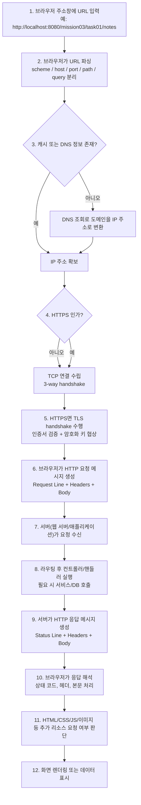

# HTTP 요청과 응답 흐름 이해하기

`mission-03-http-web-basic`의 `task-02-http-request-response-flow` 보고서입니다. 브라우저 주소창에 URL을 입력했을 때 브라우저, 네트워크, 서버가 어떤 순서로 동작하는지 단계별로 정리했습니다.

## 1. 작업 개요

- 미션/태스크: `mission-03-http-web-basic` / `task-02-http-request-response-flow`
- 목표:
  - URL 입력부터 응답 렌더링까지의 흐름을 브라우저 관점에서 순서대로 이해한다.
  - DNS 조회, 연결 수립, HTTP 메시지 전송, 서버 처리, 브라우저 렌더링의 역할을 구분해 설명한다.
  - 개발자도구와 `curl`로 요청/응답 흐름을 직접 확인할 수 있는 검증 절차를 정리한다.
- 관찰 예시 URL: `http://localhost:8080/mission03/task01/notes`

## 2. 구현 단계와 주요 코드 해설

### 2.1 전체 흐름 다이어그램



### 2.2 단계별 설명

1. **URL 입력**
   - 사용자가 브라우저 주소창에 `http://localhost:8080/mission03/task01/notes` 같은 URL을 입력합니다.
   - 이 시점에는 아직 서버로 바이트가 전송되지 않았고, 브라우저가 먼저 입력값을 해석할 준비를 합니다.

2. **URL 파싱**
   - 브라우저는 URL을 `scheme(http)`, `host(localhost)`, `port(8080)`, `path(/mission03/task01/notes)`로 나눕니다.
   - `#fragment`가 있다면 이는 브라우저 내부 이동 용도이므로 서버로 전달되지 않습니다.

3. **캐시 확인과 DNS 조회**
   - 브라우저는 먼저 자체 DNS 캐시, 운영체제 캐시, 로컬 hosts 정보를 확인합니다.
   - 도메인 이름의 IP 주소를 모르면 DNS 조회를 수행합니다.
   - `localhost`는 보통 로컬 루프백 주소 `127.0.0.1` 또는 `::1`로 바로 해석됩니다.

4. **TCP 연결 수립**
   - HTTP/1.1, HTTP/2 모두 전송 기반 연결이 먼저 필요합니다.
   - 브라우저는 서버와 TCP 3-way handshake를 수행해 신뢰성 있는 연결을 만듭니다.

5. **TLS handshake(HTTPS일 때)**
   - URL이 `https://`라면 TCP 연결 후 TLS handshake가 이어집니다.
   - 이 과정에서 서버 인증서를 검증하고, 이후 데이터를 암호화할 키를 협상합니다.
   - `http://`라면 이 단계 없이 바로 HTTP 요청으로 넘어갑니다.

6. **HTTP 요청 메시지 생성**
   - 브라우저는 요청 라인, 헤더, 본문을 조합해 HTTP 요청 메시지를 만듭니다.
   - 단순 조회라면 보통 `GET` 메서드와 헤더 중심 요청이 전송되고, `POST`나 `PUT`은 본문이 함께 전달됩니다.
   - 예: `GET /mission03/task01/notes HTTP/1.1`, `Host: localhost:8080`, `Accept: application/json`

7. **서버 수신과 라우팅**
   - 웹 서버 또는 애플리케이션 서버가 요청을 수신합니다.
   - 스프링 애플리케이션이라면 `DispatcherServlet`이 요청을 받고, 어떤 컨트롤러 메서드가 처리할지 매핑합니다.

8. **비즈니스 로직 실행**
   - 컨트롤러는 요청값을 읽고 서비스 계층을 호출합니다.
   - 필요하면 저장소나 DB와 통신한 뒤, 응답에 필요한 데이터를 준비합니다.

9. **HTTP 응답 메시지 생성**
   - 서버는 처리 결과를 상태 코드, 헤더, 본문으로 구성합니다.
   - 예를 들어 정상 조회라면 `200 OK`, `Content-Type: application/json`, 응답 본문 `[]` 같은 형태가 됩니다.

10. **브라우저의 응답 해석**
   - 브라우저는 응답 상태 코드가 성공인지, 리다이렉트인지, 오류인지 먼저 확인합니다.
   - 이어서 헤더를 보고 본문 타입(JSON, HTML, 이미지 등), 캐시 가능 여부, 압축 여부를 판단합니다.

11. **추가 리소스 요청**
   - 응답이 HTML 문서라면 브라우저는 내부의 CSS, JS, 이미지 링크를 다시 읽고 추가 HTTP 요청을 만듭니다.
   - 그래서 사용자가 한 번 URL을 입력해도 실제 네트워크 탭에는 여러 요청이 보일 수 있습니다.

12. **렌더링 또는 데이터 표시**
   - HTML이면 화면을 렌더링하고, JSON이면 브라우저가 원문을 보여주거나 자바스크립트가 데이터를 활용합니다.
   - 사용자가 실제로 보는 최종 화면은 이 마지막 단계의 결과입니다.

### 2.3 예시 요청/응답 메시지

아래 예시는 `GET /mission03/task01/notes` 요청이 오갈 때 메시지가 어떤 모습인지 단순화해 보여줍니다.

```text
GET /mission03/task01/notes HTTP/1.1
Host: localhost:8080
Accept: application/json
User-Agent: Mozilla/5.0

HTTP/1.1 200 OK
Content-Type: application/json
Content-Length: 2

[]
```

## 3. 새로 나온 개념 정리 + 참고 링크

- **URL 구성 요소**
  - 핵심: URL은 `scheme`, `host`, `port`, `path`, `query`, `fragment`로 나뉘며, 서버에는 보통 `fragment`를 제외한 정보가 전달됩니다.
  - 왜 쓰는가: 브라우저가 어디에 어떤 방식으로 연결할지 정확히 판단하려면 URL을 구조적으로 해석해야 합니다.
  - 참고 링크:
    - RFC 3986: https://datatracker.ietf.org/doc/html/rfc3986
    - MDN URL 이해하기: https://developer.mozilla.org/ko/docs/Learn_web_development/Howto/Web_mechanics/What_is_a_URL

- **DNS 조회**
  - 핵심: 사람이 읽는 도메인 이름을 실제 통신 가능한 IP 주소로 변환하는 과정입니다.
  - 왜 쓰는가: 네트워크 연결은 IP 주소를 기준으로 이루어지므로, DNS 없이 대부분의 웹 서버에 도달할 수 없습니다.
  - 참고 링크:
    - MDN DNS 동작 방식: https://developer.mozilla.org/ko/docs/Learn_web_development/Howto/Web_mechanics/How_DNS_works
    - RFC 1034: https://datatracker.ietf.org/doc/html/rfc1034

- **TCP와 TLS handshake**
  - 핵심: TCP는 신뢰성 있는 바이트 전송 채널을 만들고, TLS는 HTTPS 통신을 암호화하고 서버 신원을 검증합니다.
  - 왜 쓰는가: HTTP 메시지가 중간에서 깨지지 않고, 필요할 때는 안전하게 전달되도록 보장해야 하기 때문입니다.
  - 참고 링크:
    - RFC 9293(TCP): https://datatracker.ietf.org/doc/html/rfc9293
    - RFC 8446(TLS 1.3): https://datatracker.ietf.org/doc/html/rfc8446

- **HTTP 메시지 구조**
  - 핵심: 요청은 Request Line/Headers/Body, 응답은 Status Line/Headers/Body로 이루어집니다.
  - 왜 쓰는가: 클라이언트와 서버가 같은 규약으로 메시지를 이해해야 서로 다른 기술 스택끼리도 통신할 수 있습니다.
  - 참고 링크:
    - RFC 9110(HTTP Semantics): https://datatracker.ietf.org/doc/html/rfc9110
    - RFC 9112(HTTP/1.1): https://datatracker.ietf.org/doc/html/rfc9112

- **브라우저 렌더링과 추가 요청**
  - 핵심: 브라우저는 첫 응답을 받은 뒤 끝나는 것이 아니라, HTML 안의 CSS/JS/이미지 링크를 읽고 추가 요청을 발생시킵니다.
  - 왜 쓰는가: 사용자가 보는 최종 화면은 단일 응답이 아니라 여러 리소스가 합쳐져 만들어지기 때문입니다.
  - 참고 링크:
    - MDN 브라우저의 동작 방식: https://developer.mozilla.org/ko/docs/Web/Performance/How_browsers_work
    - web.dev 렌더링 성능 기초: https://web.dev/learn/performance/

## 4. 학습 내용

- 브라우저에 URL을 입력했다고 해서 즉시 애플리케이션 코드가 실행되는 것은 아닙니다. URL 해석, 주소 확인, 연결 수립 같은 네트워크 준비 단계가 먼저 진행됩니다.
- HTTP는 메시지 규약이고, TCP/TLS는 그 메시지를 실제로 전달하는 기반입니다. 둘의 역할을 구분하면 요청 흐름을 더 정확히 이해할 수 있습니다.
- 서버가 응답을 한 번 보냈다고 해서 화면 구성이 끝나는 것은 아닙니다. HTML 안에 포함된 다른 리소스 때문에 브라우저는 추가 요청을 계속 만들 수 있습니다.
- 개발자도구의 Network 탭과 `curl -v`를 함께 보면 추상적인 설명이 실제 요청/응답 메시지와 바로 연결됩니다.
