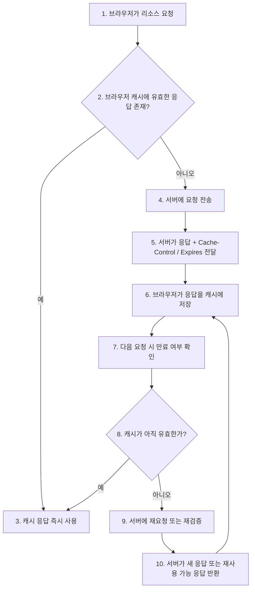

# HTTP 캐시의 동작 원리

`mission-03-http-web-basic`의 `task-09-http-cache-principles` 보고서입니다. HTTP 캐시가 왜 필요한지, `Cache-Control`과 `Expires`가 어떤 역할을 하는지, 그리고 브라우저와 서버 사이에서 캐시가 어떻게 동작하는지 간단한 흐름 중심으로 정리했습니다.

## 1. 작업 개요

- 미션/태스크: `mission-03-http-web-basic` / `task-09-http-cache-principles`
- 목표:
  - HTTP 캐시의 기본 원리를 이해한다.
  - `Cache-Control`, `Expires` 헤더가 캐시 정책에서 어떤 역할을 하는지 구분한다.
  - 브라우저와 서버 사이에서 캐시가 동작하는 흐름을 다이어그램과 함께 설명한다.

## 2. 주요 해설

### 2.1 HTTP 캐시가 필요한 이유

- 같은 리소스를 매번 서버에서 다시 내려받으면 네트워크 비용과 응답 시간이 모두 늘어납니다.
- 이미지, CSS, JS, 자주 바뀌지 않는 API 응답은 캐시에 저장해 두면 더 빠르게 재사용할 수 있습니다.
- HTTP 캐시는 "무조건 저장"이 아니라, 서버가 응답 헤더로 캐시 가능 여부와 만료 조건을 알려 주고 브라우저가 그 정책을 따르는 방식으로 동작합니다.

### 2.2 HTTP 캐시 작동 원리 다이어그램



### 2.3 캐시 관련 주요 헤더 설명표

| 헤더 | 주로 보내는 쪽 | 역할 | 핵심 포인트 |
|---|---|---|---|
| `Cache-Control` | 서버 응답, 필요 시 클라이언트 요청 | 캐시 저장 여부, 재사용 시간, 재검증 정책을 지정합니다. | `max-age`, `no-cache`, `no-store`, `public`, `private` 같은 지시어를 사용합니다. |
| `Expires` | 서버 응답 | 캐시 만료 시각을 절대 시간으로 지정합니다. | 오래된 캐시 제어 방식이며, `Cache-Control`이 함께 있으면 보통 `Cache-Control`이 더 우선합니다. |

### 2.4 브라우저와 서버에서 캐시가 작동하는 방식

#### 브라우저 관점

1. 브라우저는 먼저 자신이 저장한 캐시를 확인합니다.
2. 응답에 `Cache-Control: max-age=60` 같은 값이 있으면, 그 시간 동안은 서버에 다시 묻지 않고 캐시를 사용할 수 있습니다.
3. 만료 시간이 지났거나 `no-cache` 같은 정책이 있으면, 서버에 다시 요청해 최신 여부를 확인합니다.

#### 서버 관점

1. 서버는 응답을 내려줄 때 이 리소스를 얼마나 오래 재사용해도 되는지 헤더로 알려 줍니다.
2. 자주 바뀌지 않는 정적 리소스에는 긴 캐시 시간을 줄 수 있고, 민감하거나 실시간성이 중요한 데이터에는 캐시를 제한할 수 있습니다.
3. 즉, 서버는 "캐시 정책을 결정하는 쪽"이고, 브라우저는 "그 정책을 실제로 적용하는 쪽"이라고 이해하면 쉽습니다.

### 2.5 Cache-Control과 Expires를 함께 볼 때 이해할 점

| 항목 | `Cache-Control` | `Expires` |
|---|---|---|
| 시간 표현 방식 | 현재 시점 기준 상대 시간 | 고정된 절대 시각 |
| 제어 범위 | 저장 여부, 재검증 여부, 공개/비공개 등 더 풍부함 | 만료 시각 지정 중심 |
| 실무 활용도 | 현재 표준적으로 더 많이 사용 | 구형 호환용으로 함께 쓰는 경우가 많음 |
| 예시 | `Cache-Control: max-age=3600` | `Expires: Wed, 21 Oct 2026 07:28:00 GMT` |

### 2.6 예시 응답 읽기

```http
HTTP/1.1 200 OK
Content-Type: text/css
Cache-Control: max-age=3600, public
Expires: Wed, 21 Oct 2026 07:28:00 GMT
```

- 이 응답은 CSS 파일을 1시간 동안 캐시해서 재사용할 수 있다는 의미로 읽을 수 있습니다.
- 브라우저는 만료 전까지는 같은 리소스를 다시 요청하지 않고 로컬 캐시를 사용할 수 있습니다.
- `Expires`도 함께 있지만, 실무적으로는 `Cache-Control`의 정책을 더 중심으로 읽는 경우가 많습니다.

## 3. 새로 나온 개념 정리 + 참고 링크

- **HTTP 캐시**
  - 핵심: 이전에 받은 응답을 저장해 두었다가 같은 요청에 다시 활용하는 메커니즘입니다.
  - 왜 쓰는가: 응답 속도를 높이고, 네트워크 사용량과 서버 부하를 줄일 수 있기 때문입니다.
  - 참고 링크:
    - RFC 9111 HTTP Caching: https://datatracker.ietf.org/doc/html/rfc9111
    - MDN HTTP 캐시: https://developer.mozilla.org/ko/docs/Web/HTTP/Caching

- **Cache-Control**
  - 핵심: 캐시 정책을 가장 중심적으로 제어하는 HTTP 헤더입니다.
  - 왜 쓰는가: 단순 만료 시간뿐 아니라 저장 가능 여부와 재검증 조건까지 세밀하게 지정할 수 있기 때문입니다.
  - 참고 링크:
    - RFC 9111 HTTP Caching: https://datatracker.ietf.org/doc/html/rfc9111
    - MDN Cache-Control: https://developer.mozilla.org/ko/docs/Web/HTTP/Reference/Headers/Cache-Control

- **Expires**
  - 핵심: 응답의 만료 시각을 절대 시간으로 지정하는 캐시 헤더입니다.
  - 왜 쓰는가: 오래된 캐시 시스템과의 호환을 고려할 때 여전히 함께 사용될 수 있기 때문입니다.
  - 참고 링크:
    - RFC 9111 HTTP Caching: https://datatracker.ietf.org/doc/html/rfc9111
    - MDN Expires: https://developer.mozilla.org/en-US/docs/Web/HTTP/Reference/Headers/Expires

- **브라우저 캐시와 서버 정책**
  - 핵심: 브라우저는 캐시를 저장하고 재사용하는 주체이고, 서버는 응답 헤더로 그 기준을 정합니다.
  - 왜 쓰는가: 같은 캐시라도 어디서 저장하고 누가 정책을 정하는지 구분해야 동작 원리를 정확히 이해할 수 있기 때문입니다.
  - 참고 링크:
    - MDN HTTP 캐시: https://developer.mozilla.org/ko/docs/Web/HTTP/Caching

## 4. 학습 내용

- HTTP 캐시는 단순히 "빠르게 다시 보여주는 기능"이 아니라, 서버가 응답 헤더로 정책을 정하고 브라우저가 그 정책을 따르는 협력 구조입니다.
- `Cache-Control`은 현재 실무에서 가장 중요한 캐시 헤더이고, `Expires`는 절대 시각 기반 보조 정보로 이해하면 정리가 쉽습니다.
- 브라우저는 유효한 캐시가 있으면 서버에 가지 않고 바로 응답을 재사용할 수 있기 때문에 체감 성능 향상에 매우 큰 영향을 줍니다.
- 캐시를 잘못 설정하면 오래된 데이터가 계속 보일 수 있으므로, "무조건 길게 캐시"가 아니라 리소스 성격에 맞게 정책을 정하는 것이 중요합니다.
