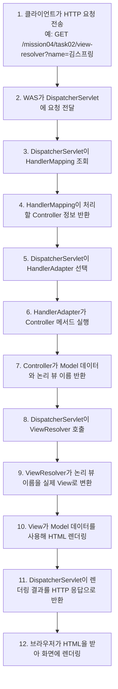
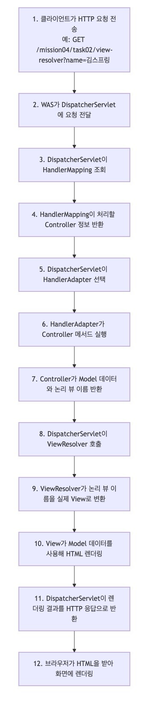

# 스프링 MVC: 요청-응답 흐름 이해

이 문서는 `mission-04-spring-mvc`의 `task-04-request-response-flow` 수행 결과를 정리한 보고서입니다. 스프링 MVC에서 클라이언트 요청이 `DispatcherServlet`을 거쳐 컨트롤러, 모델, 뷰, `ViewResolver`로 이어지는 과정을 다이어그램과 단계 설명으로 정리했습니다.

## 1. 작업 개요

- 미션/태스크: `mission-04-spring-mvc` / `task-04-request-response-flow`
- 목표:
  - 스프링 MVC의 요청-응답 흐름을 단계별로 정리해 프론트 컨트롤러 방식이 어떻게 동작하는지 이해한다.
  - `DispatcherServlet`, `HandlerMapping`, `HandlerAdapter`, `Controller`, `Model`, `ViewResolver`, `View`의 역할을 구분해 설명한다.
  - 기존 `mission04 task02` 화면 예제를 관찰 대상으로 삼아 실제 MVC 화면 렌더링 흐름과 연결해 정리한다.
- 관찰 예시 엔드포인트: `GET /mission04/task02/view-resolver?name=김스프링`

## 2. 코드 파일 경로 인덱스

| 구분 | 파일 경로 | 역할 |
|---|---|---|
| Diagram | `docs/mission-04-spring-mvc/task-04-request-response-flow/spring-mvc-request-response-flow.mmd` | 스프링 MVC 요청-응답 흐름 Mermaid 다이어그램 원본 |
| Doc | `docs/mission-04-spring-mvc/task-04-request-response-flow/spring-mvc-component-summary.md` | 주요 컴포넌트 역할과 단계별 설명 요약 문서 |

## 3. 구현 단계와 주요 코드 해설

### 3.1 전체 흐름 다이어그램



### 3.2 단계별 설명

1. **클라이언트 요청**
   - 브라우저가 `GET /mission04/task02/view-resolver?name=김스프링` 요청을 보냅니다.
   - 이 요청은 먼저 내장 톰캣 같은 WAS에 도착합니다.

2. **DispatcherServlet 진입**
   - WAS는 스프링 MVC의 진입점인 `DispatcherServlet`에 요청을 전달합니다.
   - `DispatcherServlet`은 모든 웹 요청을 한곳에서 조정하는 프론트 컨트롤러입니다.

3. **HandlerMapping 조회**
   - `DispatcherServlet`은 어떤 컨트롤러가 현재 요청을 처리할지 찾기 위해 `HandlerMapping`을 조회합니다.
   - `@GetMapping`, `@RequestMapping` 같은 애노테이션 정보가 여기서 활용됩니다.

4. **HandlerAdapter 선택**
   - 찾은 핸들러를 바로 호출하는 것이 아니라, 스프링은 해당 핸들러 타입을 실행할 수 있는 `HandlerAdapter`를 선택합니다.
   - 이 덕분에 컨트롤러 구현 방식이 달라도 `DispatcherServlet`은 같은 흐름으로 처리할 수 있습니다.

5. **Controller 실행**
   - `HandlerAdapter`가 컨트롤러 메서드를 호출합니다.
   - 컨트롤러는 요청 파라미터를 읽고, 필요한 서비스 호출을 수행하고, 화면에 필요한 데이터를 `Model`에 담습니다.

6. **논리 뷰 이름 반환**
   - 컨트롤러는 보통 실제 파일 경로가 아니라 논리 뷰 이름을 반환합니다.
   - 예를 들어 `task02` 예제에서는 `mission04/task02/view-resolver-demo`가 반환됩니다.

7. **ViewResolver 호출**
   - `DispatcherServlet`은 컨트롤러가 반환한 논리 뷰 이름을 `ViewResolver`에 전달합니다.
   - `ViewResolver`는 설정된 prefix, suffix를 적용해 실제 뷰를 찾습니다.

8. **View 렌더링**
   - 찾은 `View`가 `Model`에 담긴 값을 읽어 최종 HTML을 만듭니다.
   - Thymeleaf를 사용하면 템플릿 안의 `th:text`, `th:each` 등이 이 단계에서 평가됩니다.

9. **HTTP 응답 반환**
   - `DispatcherServlet`은 렌더링된 결과를 HTTP 응답으로 만들고 브라우저에 보냅니다.
   - 브라우저는 받은 HTML을 해석해 화면을 그립니다.

### 3.3 주요 컴포넌트 한눈에 보기

| 컴포넌트 | 핵심 역할 | 이번 흐름에서 보는 포인트 |
|---|---|---|
| DispatcherServlet | 전체 요청 흐름 조정 | 어떤 컴포넌트를 어떤 순서로 호출할지 결정 |
| HandlerMapping | 요청에 맞는 핸들러 검색 | URL과 HTTP 메서드에 맞는 컨트롤러 선택 |
| HandlerAdapter | 핸들러 실행 방식 맞춤 | 컨트롤러 메서드 호출과 인자 준비 담당 |
| Controller | 요청 처리와 모델 구성 | 화면에 필요한 데이터와 논리 뷰 이름 반환 |
| Model | 뷰에 전달할 데이터 묶음 | 렌더링 시 제목, 메시지, 목록 같은 값 전달 |
| ViewResolver | 논리 뷰 이름 해석 | 템플릿 실제 경로 결정 |
| View | 최종 화면 생성 | HTML 렌더링 후 응답 본문 생성 |

## 4. 파일별 상세 설명 + 전체 코드

### 4.1 `spring-mvc-request-response-flow.mmd`

- 파일 경로: `docs/mission-04-spring-mvc/task-04-request-response-flow/spring-mvc-request-response-flow.mmd`
- 역할: 스프링 MVC 요청-응답 흐름 Mermaid 다이어그램 원본
- 상세 설명:
- 클라이언트 요청부터 브라우저 렌더링까지 12단계를 순서대로 표현합니다.
- `DispatcherServlet`, `HandlerMapping`, `HandlerAdapter`, `Controller`, `ViewResolver`, `View`가 어떤 순서로 등장하는지 한눈에 보이도록 구성했습니다.
- 실제 관찰 예시는 `task02`의 View Resolver 화면 요청을 기준으로 잡아 문서 설명과 연결되게 했습니다.

<details>
<summary><code>spring-mvc-request-response-flow.mmd</code> 전체 코드</summary>

```text
flowchart TD
    A["1. 클라이언트가 HTTP 요청 전송<br/>예: GET /mission04/task02/view-resolver?name=김스프링"] --> B["2. WAS가 DispatcherServlet에 요청 전달"]
    B --> C["3. DispatcherServlet이 HandlerMapping 조회"]
    C --> D["4. HandlerMapping이 처리할 Controller 정보 반환"]
    D --> E["5. DispatcherServlet이 HandlerAdapter 선택"]
    E --> F["6. HandlerAdapter가 Controller 메서드 실행"]
    F --> G["7. Controller가 Model 데이터와 논리 뷰 이름 반환"]
    G --> H["8. DispatcherServlet이 ViewResolver 호출"]
    H --> I["9. ViewResolver가 논리 뷰 이름을 실제 View로 변환"]
    I --> J["10. View가 Model 데이터를 사용해 HTML 렌더링"]
    J --> K["11. DispatcherServlet이 렌더링 결과를 HTTP 응답으로 반환"]
    K --> L["12. 브라우저가 HTML을 받아 화면에 렌더링"]
```

</details>

### 4.2 `spring-mvc-component-summary.md`

- 파일 경로: `docs/mission-04-spring-mvc/task-04-request-response-flow/spring-mvc-component-summary.md`
- 역할: 주요 컴포넌트 역할과 단계별 설명 요약 문서
- 상세 설명:
- 다이어그램만으로 놓치기 쉬운 컴포넌트별 책임을 표로 분리해 정리했습니다.
- `DispatcherServlet`이 직접 모든 일을 하는 것이 아니라, 매핑 조회와 핸들러 실행, 뷰 해석을 각각 다른 컴포넌트와 협력해 처리한다는 점을 문서 중심으로 설명합니다.
- `task02`의 View Resolver 예시와 연결해 추상 개념이 실제 템플릿 렌더링과 어떻게 이어지는지 이해할 수 있게 했습니다.

<details>
<summary><code>spring-mvc-component-summary.md</code> 전체 코드</summary>

```markdown
# 스프링 MVC 요청-응답 흐름 컴포넌트 요약

## 관찰 예시

- 예시 요청: `GET /mission04/task02/view-resolver?name=김스프링`
- 의도: View Resolver가 실제로 동작하는 기존 화면을 기준으로 요청부터 HTML 응답까지의 흐름을 설명한다.

## 주요 컴포넌트와 역할

| 컴포넌트 | 언제 등장하는가 | 역할 |
|---|---|---|
| DispatcherServlet | 스프링 MVC 요청이 들어오자마자 | 전체 요청 처리 흐름을 조정하는 프론트 컨트롤러 |
| HandlerMapping | 어떤 컨트롤러가 처리할지 찾을 때 | URL, HTTP 메서드, 애노테이션 조건에 맞는 핸들러를 찾는다 |
| HandlerAdapter | 실제 컨트롤러 메서드를 호출할 때 | 핸들러 종류에 맞는 호출 방식을 맞춰 준다 |
| Controller | 비즈니스 흐름을 시작할 때 | 요청값을 읽고 서비스 호출, Model 구성, 뷰 이름 반환을 담당한다 |
| Model | 컨트롤러 실행 결과를 뷰에 전달할 때 | 화면 렌더링에 필요한 데이터를 담는다 |
| ViewResolver | 논리 뷰 이름을 실제 뷰로 바꿀 때 | 예: `mission04/task02/view-resolver-demo`를 Thymeleaf 템플릿으로 해석한다 |
| View | 응답 직전에 | Model 데이터를 HTML에 반영해 최종 화면을 만든다 |

## 단계별 흐름

1. 클라이언트가 URL을 요청하면 WAS가 이를 받아 스프링 MVC의 시작점인 `DispatcherServlet`에 전달한다.
2. `DispatcherServlet`은 `HandlerMapping`에게 이 요청을 처리할 핸들러가 무엇인지 묻는다.
3. `HandlerMapping`은 `@RequestMapping`, `@GetMapping` 같은 매핑 정보를 보고 적절한 컨트롤러 메서드를 찾는다.
4. `DispatcherServlet`은 해당 핸들러를 실행할 수 있는 `HandlerAdapter`를 선택한다.
5. `HandlerAdapter`는 컨트롤러 메서드를 호출하고, 요청 파라미터 바인딩과 필요한 인자 준비를 돕는다.
6. 컨트롤러는 요청을 처리하고 `Model`에 화면 데이터를 담은 뒤 논리 뷰 이름을 반환한다.
7. `DispatcherServlet`은 반환된 논리 뷰 이름을 `ViewResolver`에 전달해 실제 뷰 객체를 찾는다.
8. `ViewResolver`는 prefix, suffix 같은 설정을 조합해 템플릿 위치를 해석한다.
9. `View`는 `Model` 데이터를 사용해 HTML을 렌더링한다.
10. `DispatcherServlet`은 렌더링된 결과를 HTTP 응답 본문에 담아 브라우저로 반환하고, 브라우저는 이를 화면에 표시한다.

## 예시 연결 포인트

- `task02`의 `ViewResolverController`는 논리 뷰 이름 `mission04/task02/view-resolver-demo`를 반환한다.
- `application.properties`의 Thymeleaf 설정은 이 이름을 `classpath:/templates/mission04/task02/view-resolver-demo.html`로 해석하게 만든다.
- 따라서 사용자는 단순히 URL을 호출하지만, 내부에서는 DispatcherServlet이 컨트롤러 실행과 ViewResolver 호출을 순서대로 조정한다.
```

</details>

## 5. 새로 나온 개념 정리 + 참고 링크

### 5.1 `DispatcherServlet`

- 핵심: 스프링 MVC의 프론트 컨트롤러로서 모든 웹 요청을 먼저 받고, 이후 처리 흐름을 조정합니다.
- 왜 쓰는가: 요청마다 공통 흐름을 중앙에서 통제하면 매핑 조회, 예외 처리, 뷰 해석, 바인딩 같은 기능을 일관되게 적용할 수 있습니다.
- 참고 링크:
  - Spring Framework DispatcherServlet: https://docs.spring.io/spring-framework/reference/web/webmvc/mvc-servlet.html
  - Spring Framework DispatcherServlet Javadoc: https://docs.spring.io/spring-framework/docs/current/javadoc-api/org/springframework/web/servlet/DispatcherServlet.html

### 5.2 `HandlerMapping`과 `HandlerAdapter`

- 핵심: `HandlerMapping`은 어떤 핸들러가 요청을 처리할지 찾고, `HandlerAdapter`는 그 핸들러를 실제로 실행할 수 있게 맞춰 줍니다.
- 왜 쓰는가: 컨트롤러 구현 방식이 달라도 `DispatcherServlet`은 같은 인터페이스로 처리 흐름을 유지할 수 있습니다.
- 참고 링크:
  - Spring Framework Handler Mappings: https://docs.spring.io/spring-framework/reference/web/webmvc/mvc-servlet/handlermapping.html
  - Spring Framework Handler Adapters: https://docs.spring.io/spring-framework/reference/web/webmvc/mvc-servlet/handleradapter.html

### 5.3 `Model`, `ViewResolver`, `View`

- 핵심: `Model`은 뷰에 전달할 데이터 묶음이고, `ViewResolver`는 논리 뷰 이름을 실제 뷰로 바꾸며, `View`는 최종 응답을 렌더링합니다.
- 왜 쓰는가: 컨트롤러가 템플릿 실제 경로와 렌더링 세부 사항에서 분리되므로, 요청 처리와 화면 생성 책임을 나눌 수 있습니다.
- 참고 링크:
  - Spring Framework Model Interface: https://docs.spring.io/spring-framework/docs/current/javadoc-api/org/springframework/ui/Model.html
  - Spring Framework View Resolution: https://docs.spring.io/spring-framework/reference/web/webmvc/mvc-servlet/viewresolver.html
  - Spring Framework Thymeleaf 안내: https://docs.spring.io/spring-framework/reference/web/webmvc-view/mvc-thymeleaf.html

## 6. 실행·검증 방법

### 6.1 애플리케이션 실행

```bash
./gradlew bootRun
```

### 6.2 브라우저로 요청-응답 흐름 관찰

- 브라우저 확인 URL:
  - `http://localhost:8080/mission04/task02/view-resolver`
  - `http://localhost:8080/mission04/task02/view-resolver?name=김스프링`
- 확인 포인트:
  - 주소 입력 후 HTML 화면이 렌더링되는지 확인합니다.
  - 브라우저 개발자도구 Network 탭에서 요청 URL, 상태 코드 `200`, 응답 HTML을 확인합니다.
  - 응답 화면에 논리 뷰 이름과 실제 템플릿 경로가 함께 표시되는지 확인합니다.

### 6.3 curl로 응답 확인

```bash
curl -i http://localhost:8080/mission04/task02/view-resolver
curl -i "http://localhost:8080/mission04/task02/view-resolver?name=%EA%B9%80%EC%8A%A4%ED%94%84%EB%A7%81"
```

- 예상 결과:
  - `HTTP/1.1 200` 응답과 함께 HTML 본문이 반환됩니다.
  - HTML 안에 `mission04/task02/view-resolver-demo`와 `classpath:/templates/mission04/task02/view-resolver-demo.html` 문자열이 포함됩니다.

### 6.4 테스트 실행

```bash
./gradlew test --tests com.goorm.springmissionsplayground.mission04_spring_mvc.task02_view_resolver.ViewResolverControllerTest
```

- 예상 결과:
  - 기존 View Resolver 예제 화면이 정상 동작하는지 검증하는 테스트가 통과합니다.
  - 문서 전용 태스크이므로 별도 Java 테스트 파일은 추가하지 않았습니다.

## 7. 결과 확인 방법

- 성공 기준:
  - 다이어그램에서 요청이 `DispatcherServlet`을 시작점으로 컨트롤러, `ViewResolver`, `View`를 거쳐 응답으로 이어지는 순서가 드러납니다.
  - 설명 문서에서 각 컴포넌트의 역할과 등장 시점을 구분해서 읽을 수 있습니다.
  - 브라우저로 `task02` 예제 화면을 호출했을 때 문서에 적은 흐름과 실제 화면 렌더링 결과가 연결됩니다.
- API/화면 확인 방법:
  - 브라우저와 `curl`로 `GET /mission04/task02/view-resolver` 요청을 호출합니다.
  - 개발자도구 Network 탭에서 요청 1건과 응답 HTML을 확인합니다.
- 스크린샷 :
  - 흐름 다이어그램 캡처 
  - 

## 8. 학습 내용

- 스프링 MVC에서 가장 먼저 이해해야 할 점은 컨트롤러가 직접 요청 전체를 통제하지 않는다는 것입니다. 실제 시작점은 `DispatcherServlet`이며, 컨트롤러는 그 흐름 안에서 요청 처리 책임만 맡습니다.
- `HandlerMapping`과 `HandlerAdapter`가 분리되어 있기 때문에 `DispatcherServlet`은 URL 매핑을 찾는 일과 컨트롤러를 실행하는 일을 각각 다른 컴포넌트에 맡길 수 있습니다. 이 구조 덕분에 스프링 MVC는 확장성과 일관성을 동시에 얻습니다.
- 컨트롤러가 반환하는 값이 실제 템플릿 경로가 아니라 논리 뷰 이름이라는 점도 중요합니다. 이렇게 해야 컨트롤러는 화면 기술에 덜 의존하고, `ViewResolver`가 템플릿 엔진 설정과 연결을 담당할 수 있습니다.
- 이번 문서는 `task02`의 실제 화면 예시와 연결해서 정리했기 때문에, 추상적인 요청-응답 흐름이 실제 스프링 MVC 화면 렌더링과 어떻게 이어지는지 한 번에 이해할 수 있습니다.
