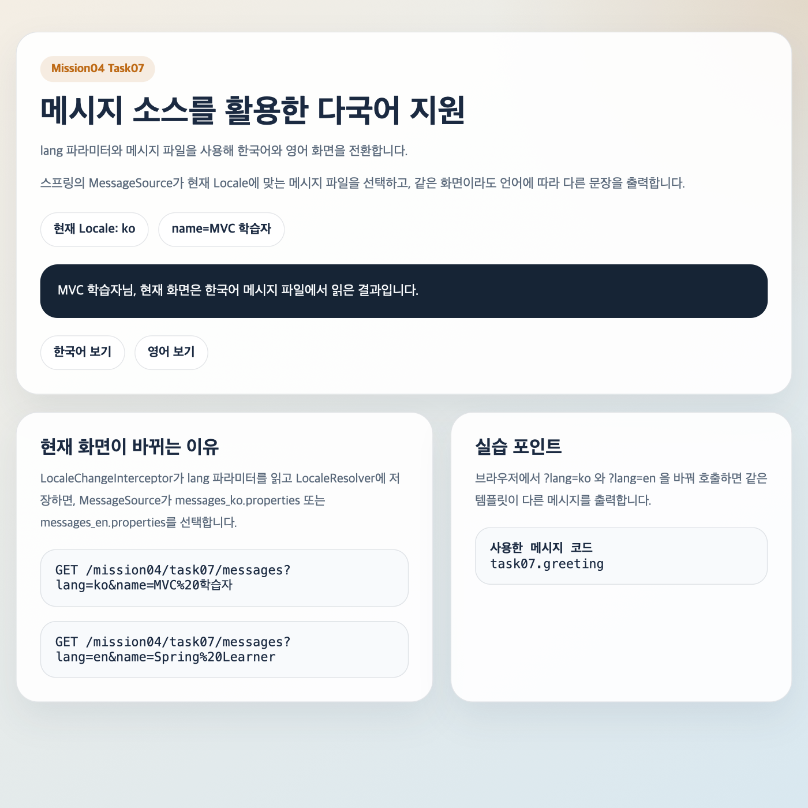
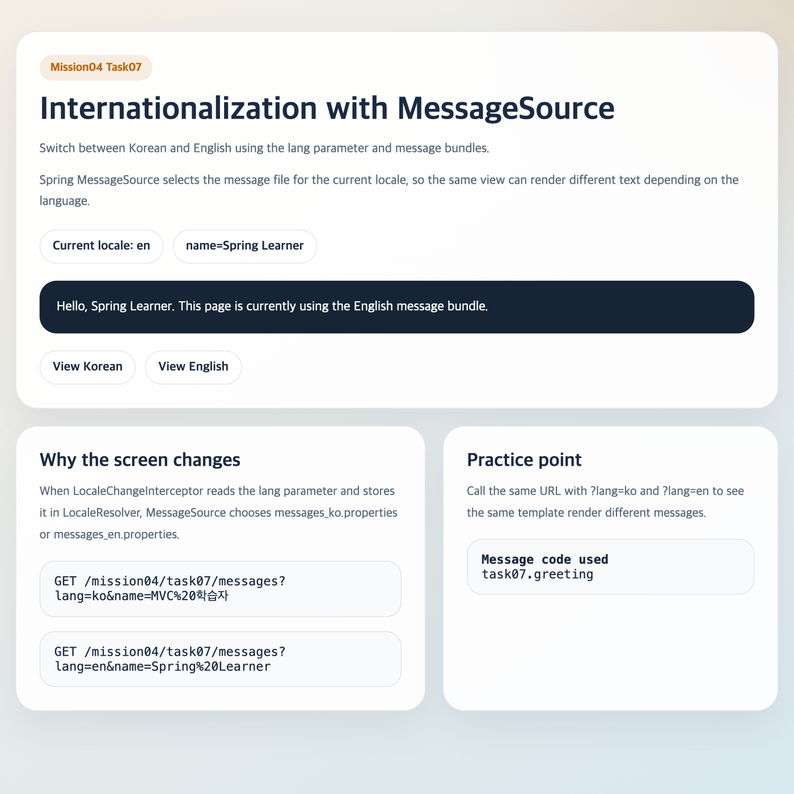

# 스프링 MVC: 메시지 소스를 통한 다국어 지원 설정

이 문서는 `mission-04-spring-mvc`의 `task-07-message-source` 수행 결과를 정리한 보고서입니다. `MessageSource`, `LocaleResolver`, `LocaleChangeInterceptor`를 사용해 한국어와 영어 메시지를 전환하는 예제를 구현했고, 실제 화면 캡처 파일도 함께 남겼습니다.

## 1. 작업 개요

- 미션/태스크: `mission-04-spring-mvc` / `task-07-message-source`
- 목표:
  - 메시지 파일(`messages_ko.properties`, `messages_en.properties`)을 작성해 언어별 문구를 분리한다.
  - 스프링의 `MessageSource`와 `LocaleResolver`를 설정해 현재 언어에 맞는 메시지를 선택하도록 구성한다.
  - `lang` 파라미터를 통해 같은 화면에서 한국어/영어가 바뀌는 예제를 만들고, 실제 결과 화면 캡처를 남긴다.
- 엔드포인트:
  - `GET /mission04/task07/messages`
  - `GET /mission04/task07/messages?lang=ko`
  - `GET /mission04/task07/messages?lang=en`

## 2. 코드 파일 경로 인덱스

| 구분 | 파일 경로 | 역할 |
|---|---|---|
| Config | `src/main/java/com/goorm/springmissionsplayground/mission04_spring_mvc/task07_message_source/config/MessageSourceConfig.java` | MessageSource, LocaleResolver, LocaleChangeInterceptor 설정 |
| Controller | `src/main/java/com/goorm/springmissionsplayground/mission04_spring_mvc/task07_message_source/controller/MessageSourceDemoController.java` | 현재 Locale 기준으로 다국어 메시지를 읽어 화면 모델 구성 |
| Resource | `src/main/resources/messages/mission04/task07/messages_ko.properties` | 한국어 메시지 번들 |
| Resource | `src/main/resources/messages/mission04/task07/messages_en.properties` | 영어 메시지 번들 |
| Template | `src/main/resources/templates/mission04/task07/message-source-demo.html` | 언어 전환 링크와 메시지 출력 화면 |
| Test | `src/test/java/com/goorm/springmissionsplayground/mission04_spring_mvc/task07_message_source/MessageSourceDemoControllerTest.java` | 기본 한국어/영어 전환 렌더링 검증 |

## 3. 구현 단계와 주요 코드 해설

1. `MessageSourceConfig`에서 `ReloadableResourceBundleMessageSource`를 빈으로 등록하고, 메시지 파일 기본 경로를 `classpath:/messages/mission04/task07/messages`로 지정했습니다.
2. 같은 설정 클래스에서 `SessionLocaleResolver`를 기본 Locale `ko`로 등록하고, `LocaleChangeInterceptor`가 `lang` 파라미터를 읽도록 구성했습니다.
3. `MessageSourceDemoController`는 `Locale`과 `MessageSource`를 받아 현재 언어에 맞는 제목, 설명, 인사말, 안내 문구를 모델에 담고 Thymeleaf 뷰를 반환합니다.
4. `message-source-demo.html`은 같은 템플릿을 유지한 채, `?lang=ko`와 `?lang=en` 링크를 통해 언어 전환 결과를 화면에서 바로 확인할 수 있게 구성했습니다.
5. `MessageSourceDemoControllerTest`는 기본 요청이 한국어로 렌더링되는지, `lang=en` 요청이 영어 메시지로 렌더링되는지 검증합니다.
6. 실행 후 `curl`로 HTML을 저장하고, `qlmanage`로 미리보기 PNG를 생성해 실제 결과 캡처 파일을 `docs/mission-04-spring-mvc/task-07-message-source/` 아래에 추가했습니다.

## 4. 파일별 상세 설명 + 전체 코드

### 4.1 `MessageSourceConfig.java`

- 파일 경로: `src/main/java/com/goorm/springmissionsplayground/mission04_spring_mvc/task07_message_source/config/MessageSourceConfig.java`
- 역할: MessageSource, LocaleResolver, LocaleChangeInterceptor 설정
- 상세 설명:
- `messageSource()`는 메시지 파일 위치, UTF-8 인코딩, 시스템 Locale 미사용 옵션을 설정합니다.
- `localeResolver()`는 세션 기준 Locale 저장소를 만들고 기본 언어를 한국어로 지정합니다.
- `localeChangeInterceptor()`와 `addInterceptors()`는 `lang` 파라미터가 들어오면 현재 Locale을 바꿔 주도록 연결합니다.

<details>
<summary><code>MessageSourceConfig.java</code> 전체 코드</summary>

```java
package com.goorm.springmissionsplayground.mission04_spring_mvc.task07_message_source.config;

import java.util.Locale;
import org.springframework.context.MessageSource;
import org.springframework.context.annotation.Bean;
import org.springframework.context.annotation.Configuration;
import org.springframework.context.support.ReloadableResourceBundleMessageSource;
import org.springframework.web.servlet.LocaleResolver;
import org.springframework.web.servlet.config.annotation.InterceptorRegistry;
import org.springframework.web.servlet.config.annotation.WebMvcConfigurer;
import org.springframework.web.servlet.i18n.LocaleChangeInterceptor;
import org.springframework.web.servlet.i18n.SessionLocaleResolver;

@Configuration
public class MessageSourceConfig implements WebMvcConfigurer {

    @Bean
    public MessageSource messageSource() {
        ReloadableResourceBundleMessageSource messageSource = new ReloadableResourceBundleMessageSource();
        messageSource.setBasename("classpath:/messages/mission04/task07/messages");
        messageSource.setDefaultEncoding("UTF-8");
        messageSource.setFallbackToSystemLocale(false);
        return messageSource;
    }

    @Bean
    public LocaleResolver localeResolver() {
        SessionLocaleResolver localeResolver = new SessionLocaleResolver();
        localeResolver.setDefaultLocale(Locale.KOREAN);
        return localeResolver;
    }

    @Bean
    public LocaleChangeInterceptor localeChangeInterceptor() {
        LocaleChangeInterceptor interceptor = new LocaleChangeInterceptor();
        interceptor.setParamName("lang");
        return interceptor;
    }

    @Override
    public void addInterceptors(InterceptorRegistry registry) {
        registry.addInterceptor(localeChangeInterceptor());
    }
}
```

</details>

### 4.2 `MessageSourceDemoController.java`

- 파일 경로: `src/main/java/com/goorm/springmissionsplayground/mission04_spring_mvc/task07_message_source/controller/MessageSourceDemoController.java`
- 역할: 현재 Locale 기준으로 다국어 메시지를 읽어 화면 모델 구성
- 상세 설명:
- 기본 경로: `/mission04/task07/messages`
- HTTP 메서드/세부 경로: `GET /mission04/task07/messages`
- `Locale`과 `MessageSource`를 받아 같은 메시지 코드라도 현재 언어에 맞는 문구를 읽습니다.
- `lang` 파라미터는 인터셉터가 먼저 처리하고, 컨트롤러는 바뀐 Locale 값을 그대로 받아 화면을 조립합니다.

<details>
<summary><code>MessageSourceDemoController.java</code> 전체 코드</summary>

```java
package com.goorm.springmissionsplayground.mission04_spring_mvc.task07_message_source.controller;

import java.util.Locale;
import org.springframework.context.MessageSource;
import org.springframework.stereotype.Controller;
import org.springframework.ui.Model;
import org.springframework.util.StringUtils;
import org.springframework.web.bind.annotation.GetMapping;
import org.springframework.web.bind.annotation.RequestMapping;
import org.springframework.web.bind.annotation.RequestParam;

@Controller
@RequestMapping("/mission04/task07/messages")
public class MessageSourceDemoController {

    private static final String DEFAULT_NAME = "MVC 학습자";

    private final MessageSource messageSource;

    public MessageSourceDemoController(MessageSource messageSource) {
        this.messageSource = messageSource;
    }

    @GetMapping
    public String showMessageDemo(
            @RequestParam(required = false) String name,
            Locale locale,
            Model model
    ) {
        String displayName = normalizeOrDefault(name);

        model.addAttribute("displayName", displayName);
        model.addAttribute("localeCode", locale.toLanguageTag());
        model.addAttribute("pageTitle", message("task07.page.title", locale));
        model.addAttribute("pageSubtitle", message("task07.page.subtitle", locale));
        model.addAttribute("pageDescription", message("task07.page.description", locale));
        model.addAttribute("greeting", message("task07.greeting", locale, displayName));
        model.addAttribute("guideTitle", message("task07.guide.title", locale));
        model.addAttribute("guideBody", message("task07.guide.body", locale));
        model.addAttribute("currentLocaleLabel", message("task07.currentLocale", locale, locale.toLanguageTag()));
        model.addAttribute("messageCodeLabel", message("task07.messageCodeLabel", locale));
        model.addAttribute("messageCodeValue", "task07.greeting");
        model.addAttribute("switchKoLabel", message("task07.switch.ko", locale));
        model.addAttribute("switchEnLabel", message("task07.switch.en", locale));
        model.addAttribute("noteTitle", message("task07.note.title", locale));
        model.addAttribute("noteBody", message("task07.note.body", locale));
        return "mission04/task07/message-source-demo";
    }

    private String message(String code, Locale locale, Object... args) {
        return messageSource.getMessage(code, args, locale);
    }

    private String normalizeOrDefault(String name) {
        if (!StringUtils.hasText(name)) {
            return DEFAULT_NAME;
        }
        return name.trim().replaceAll("\\s{2,}", " ");
    }
}
```

</details>

### 4.3 `messages_ko.properties`

- 파일 경로: `src/main/resources/messages/mission04/task07/messages_ko.properties`
- 역할: 한국어 메시지 번들
- 상세 설명:
- 화면 제목, 설명, 안내 문구, 버튼 텍스트를 한국어로 정의합니다.
- `task07.greeting={0}님, ...`처럼 메시지 파라미터 치환도 함께 사용합니다.
- 같은 메시지 코드를 영어 파일과 맞춰 두어 Locale만 바뀌면 동일한 화면 구조에서 언어만 바뀌게 했습니다.

<details>
<summary><code>messages_ko.properties</code> 전체 코드</summary>

```properties
task07.page.title=메시지 소스를 활용한 다국어 지원
task07.page.subtitle=lang 파라미터와 메시지 파일을 사용해 한국어와 영어 화면을 전환합니다.
task07.page.description=스프링의 MessageSource가 현재 Locale에 맞는 메시지 파일을 선택하고, 같은 화면이라도 언어에 따라 다른 문장을 출력합니다.
task07.greeting={0}님, 현재 화면은 한국어 메시지 파일에서 읽은 결과입니다.
task07.guide.title=현재 화면이 바뀌는 이유
task07.guide.body=LocaleChangeInterceptor가 lang 파라미터를 읽고 LocaleResolver에 저장하면, MessageSource가 messages_ko.properties 또는 messages_en.properties를 선택합니다.
task07.currentLocale=현재 Locale: {0}
task07.messageCodeLabel=사용한 메시지 코드
task07.switch.ko=한국어 보기
task07.switch.en=영어 보기
task07.note.title=실습 포인트
task07.note.body=브라우저에서 ?lang=ko 와 ?lang=en 을 바꿔 호출하면 같은 템플릿이 다른 메시지를 출력합니다.
```

</details>

### 4.4 `messages_en.properties`

- 파일 경로: `src/main/resources/messages/mission04/task07/messages_en.properties`
- 역할: 영어 메시지 번들
- 상세 설명:
- 한국어 번들과 동일한 메시지 코드 구조를 유지하면서 영어 문장만 분리했습니다.
- 한국어/영어 파일이 같은 키 집합을 갖기 때문에 Locale이 바뀌어도 컨트롤러 코드는 바뀌지 않습니다.
- 다국어 지원에서 중요한 것은 코드 분기보다 메시지 리소스 분리라는 점을 보여 줍니다.

<details>
<summary><code>messages_en.properties</code> 전체 코드</summary>

```properties
task07.page.title=Internationalization with MessageSource
task07.page.subtitle=Switch between Korean and English using the lang parameter and message bundles.
task07.page.description=Spring MessageSource selects the message file for the current locale, so the same view can render different text depending on the language.
task07.greeting=Hello, {0}. This page is currently using the English message bundle.
task07.guide.title=Why the screen changes
task07.guide.body=When LocaleChangeInterceptor reads the lang parameter and stores it in LocaleResolver, MessageSource chooses messages_ko.properties or messages_en.properties.
task07.currentLocale=Current locale: {0}
task07.messageCodeLabel=Message code used
task07.switch.ko=View Korean
task07.switch.en=View English
task07.note.title=Practice point
task07.note.body=Call the same URL with ?lang=ko and ?lang=en to see the same template render different messages.
```

</details>

### 4.5 `message-source-demo.html`

- 파일 경로: `src/main/resources/templates/mission04/task07/message-source-demo.html`
- 역할: 언어 전환 링크와 메시지 출력 화면
- 상세 설명:
- `lang=ko`, `lang=en` 링크를 제공해 브라우저에서 바로 언어 전환을 재현할 수 있게 했습니다.
- 컨트롤러가 모델에 넣은 다국어 메시지와 현재 Locale 정보를 카드 형태로 출력합니다.
- 한 템플릿에서 언어만 바뀌는 구성을 유지해, 다국어 지원의 핵심이 메시지 파일 선택이라는 점이 드러나게 했습니다.

<details>
<summary><code>message-source-demo.html</code> 전체 코드</summary>

```html
<!DOCTYPE html>
<html lang="ko" xmlns:th="http://www.thymeleaf.org">
<head>
    <meta charset="UTF-8">
    <meta name="viewport" content="width=device-width, initial-scale=1.0">
    <title>Mission04 Task07 - Message Source</title>
    <style>
        :root {
            --ink: #1b2a41;
            --muted: #586779;
            --paper: rgba(255, 255, 255, 0.92);
            --line: rgba(27, 42, 65, 0.12);
            --accent: #be6a15;
            --accent-soft: rgba(190, 106, 21, 0.12);
            --bg-a: #f4eee4;
            --bg-b: #d9e8f0;
        }

        * {
            box-sizing: border-box;
        }

        body {
            margin: 0;
            min-height: 100vh;
            font-family: "Pretendard", "SUIT", "Noto Sans KR", sans-serif;
            color: var(--ink);
            background:
                radial-gradient(circle at top right, rgba(190, 106, 21, 0.15), transparent 28%),
                linear-gradient(145deg, var(--bg-a), var(--bg-b));
        }

        main {
            width: min(1040px, 100%);
            margin: 0 auto;
            padding: 40px 20px 60px;
            display: grid;
            gap: 22px;
        }

        .hero,
        .panel {
            padding: 30px;
            border-radius: 28px;
            border: 1px solid var(--line);
            background: var(--paper);
            box-shadow: 0 20px 52px rgba(27, 42, 65, 0.08);
        }

        .eyebrow {
            display: inline-flex;
            padding: 8px 14px;
            border-radius: 999px;
            background: var(--accent-soft);
            color: var(--accent);
            font-size: 0.92rem;
            font-weight: 800;
        }

        h1,
        h2,
        p {
            margin: 0;
        }

        h1 {
            margin-top: 16px;
            font-size: clamp(2rem, 4vw, 3.2rem);
            line-height: 1.1;
        }

        .subtitle {
            margin-top: 14px;
            color: var(--muted);
            line-height: 1.7;
            font-size: 1.03rem;
        }

        .meta {
            display: flex;
            flex-wrap: wrap;
            gap: 12px;
            margin-top: 22px;
        }

        .meta-chip,
        .switch a {
            display: inline-flex;
            align-items: center;
            justify-content: center;
            min-height: 44px;
            padding: 0 16px;
            border-radius: 999px;
            border: 1px solid var(--line);
            background: #fff;
            color: var(--ink);
            text-decoration: none;
            font-weight: 700;
        }

        .layout {
            display: grid;
            grid-template-columns: 1.1fr 0.9fr;
            gap: 22px;
        }

        .greeting {
            margin-top: 22px;
            padding: 20px 22px;
            border-radius: 22px;
            background: #162435;
            color: #f8fafc;
            font-size: 1.06rem;
            line-height: 1.7;
        }

        .switch {
            display: flex;
            flex-wrap: wrap;
            gap: 12px;
            margin-top: 22px;
        }

        .panel p {
            margin-top: 12px;
            color: var(--muted);
            line-height: 1.75;
        }

        .code-box {
            margin-top: 18px;
            padding: 16px 18px;
            border-radius: 20px;
            background: #f8fafc;
            border: 1px solid var(--line);
            font-family: "JetBrains Mono", "D2Coding", monospace;
            overflow-x: auto;
        }

        @media (max-width: 860px) {
            .layout {
                grid-template-columns: 1fr;
            }
        }
    </style>
</head>
<body>
<main>
    <section class="hero">
        <span class="eyebrow">Mission04 Task07</span>
        <h1 th:text="${pageTitle}">메시지 소스를 활용한 다국어 지원</h1>
        <p class="subtitle" th:text="${pageSubtitle}">
            lang 파라미터와 메시지 파일을 사용해 한국어와 영어 화면을 전환합니다.
        </p>
        <p class="subtitle" th:text="${pageDescription}">
            스프링의 MessageSource가 현재 Locale에 맞는 메시지 파일을 선택하고, 같은 화면이라도 언어에 따라 다른 문장을 출력합니다.
        </p>

        <div class="meta">
            <span class="meta-chip" th:text="${currentLocaleLabel}">현재 Locale: ko</span>
            <span class="meta-chip" th:text="|name=${displayName}|">name=MVC 학습자</span>
        </div>

        <div class="greeting" th:text="${greeting}">
            MVC 학습자님, 현재 화면은 한국어 메시지 파일에서 읽은 결과입니다.
        </div>

        <div class="switch">
            <a th:href="@{/mission04/task07/messages(lang='ko', name=${displayName})}" th:text="${switchKoLabel}">한국어 보기</a>
            <a th:href="@{/mission04/task07/messages(lang='en', name=${displayName})}" th:text="${switchEnLabel}">영어 보기</a>
        </div>
    </section>

    <section class="layout">
        <article class="panel">
            <h2 th:text="${guideTitle}">현재 화면이 바뀌는 이유</h2>
            <p th:text="${guideBody}">
                LocaleChangeInterceptor가 lang 파라미터를 읽고 LocaleResolver에 저장하면, MessageSource가 messages_ko.properties 또는 messages_en.properties를 선택합니다.
            </p>
            <div class="code-box">GET /mission04/task07/messages?lang=ko&amp;name=MVC%20학습자</div>
            <div class="code-box">GET /mission04/task07/messages?lang=en&amp;name=Spring%20Learner</div>
        </article>

        <article class="panel">
            <h2 th:text="${noteTitle}">실습 포인트</h2>
            <p th:text="${noteBody}">
                브라우저에서 ?lang=ko 와 ?lang=en 을 바꿔 호출하면 같은 템플릿이 다른 메시지를 출력합니다.
            </p>
            <div class="code-box">
                <strong th:text="${messageCodeLabel}">사용한 메시지 코드</strong><br>
                <span th:text="${messageCodeValue}">task07.greeting</span>
            </div>
        </article>
    </section>
</main>
</body>
</html>
```

</details>

### 4.6 `MessageSourceDemoControllerTest.java`

- 파일 경로: `src/test/java/com/goorm/springmissionsplayground/mission04_spring_mvc/task07_message_source/MessageSourceDemoControllerTest.java`
- 역할: 기본 한국어/영어 전환 렌더링 검증
- 상세 설명:
- 검증 시나리오 1: 기본 요청은 세션 기본 Locale `ko`를 사용해 한국어 메시지를 렌더링합니다.
- 검증 시나리오 2: `lang=en`을 전달하면 같은 뷰가 영어 메시지와 영어 Locale 정보를 출력합니다.
- 뷰 이름, 모델의 `localeCode`, 실제 렌더링된 문구를 함께 확인해 다국어 전환 흐름을 검증합니다.

<details>
<summary><code>MessageSourceDemoControllerTest.java</code> 전체 코드</summary>

```java
package com.goorm.springmissionsplayground.mission04_spring_mvc.task07_message_source;

import org.junit.jupiter.api.BeforeEach;
import org.junit.jupiter.api.DisplayName;
import org.junit.jupiter.api.Test;
import org.springframework.beans.factory.annotation.Autowired;
import org.springframework.boot.test.context.SpringBootTest;
import org.springframework.test.web.servlet.MockMvc;
import org.springframework.test.web.servlet.setup.MockMvcBuilders;
import org.springframework.web.context.WebApplicationContext;

import static org.hamcrest.Matchers.containsString;
import static org.hamcrest.Matchers.is;
import static org.springframework.test.web.servlet.request.MockMvcRequestBuilders.get;
import static org.springframework.test.web.servlet.result.MockMvcResultMatchers.content;
import static org.springframework.test.web.servlet.result.MockMvcResultMatchers.model;
import static org.springframework.test.web.servlet.result.MockMvcResultMatchers.status;
import static org.springframework.test.web.servlet.result.MockMvcResultMatchers.view;

@SpringBootTest
class MessageSourceDemoControllerTest {

    @Autowired
    private WebApplicationContext context;

    private MockMvc mockMvc;

    @BeforeEach
    void setUp() {
        mockMvc = MockMvcBuilders.webAppContextSetup(context).build();
    }

    @Test
    @DisplayName("기본 요청은 기본 Locale 인 한국어 메시지를 렌더링한다")
    void rendersKoreanMessagesByDefault() throws Exception {
        mockMvc.perform(get("/mission04/task07/messages"))
                .andExpect(status().isOk())
                .andExpect(view().name("mission04/task07/message-source-demo"))
                .andExpect(model().attribute("localeCode", is("ko")))
                .andExpect(content().string(containsString("메시지 소스를 활용한 다국어 지원")))
                .andExpect(content().string(containsString("현재 화면은 한국어 메시지 파일에서 읽은 결과입니다.")));
    }

    @Test
    @DisplayName("lang=en 파라미터를 전달하면 영어 메시지를 렌더링한다")
    void rendersEnglishMessagesWhenLangParameterIsEnglish() throws Exception {
        mockMvc.perform(get("/mission04/task07/messages")
                        .param("lang", "en")
                        .param("name", "Spring Learner"))
                .andExpect(status().isOk())
                .andExpect(view().name("mission04/task07/message-source-demo"))
                .andExpect(model().attribute("localeCode", is("en")))
                .andExpect(content().string(containsString("Internationalization with MessageSource")))
                .andExpect(content().string(containsString("Hello, Spring Learner.")))
                .andExpect(content().string(containsString("Current locale: en")));
    }
}
```

</details>

## 5. 새로 나온 개념 정리 + 참고 링크

### 5.1 `MessageSource`

- 핵심: 메시지 코드를 현재 Locale에 맞는 문구로 바꿔 주는 스프링의 메시지 조회 인터페이스입니다.
- 왜 쓰는가: 화면 문자열을 코드에서 직접 분기하지 않고, 언어별 메시지 파일로 분리해 관리할 수 있습니다.
- 참고 링크:
  - Spring Framework Internationalization: https://docs.spring.io/spring-framework/reference/core/beans/context-introduction.html#context-functionality-messagesource
  - Spring Framework `MessageSource` Javadoc: https://docs.spring.io/spring-framework/docs/current/javadoc-api/org/springframework/context/MessageSource.html

### 5.2 `LocaleResolver`와 `LocaleChangeInterceptor`

- 핵심: `LocaleResolver`는 현재 사용자의 언어를 보관하고, `LocaleChangeInterceptor`는 요청 파라미터 같은 입력으로 언어를 바꾸게 해 줍니다.
- 왜 쓰는가: 사용자가 `?lang=en`처럼 언어 전환을 요청했을 때, 다음 메시지 조회부터 어떤 메시지 파일을 써야 할지 스프링 MVC가 알 수 있어야 하기 때문입니다.
- 참고 링크:
  - Spring Framework Locale: https://docs.spring.io/spring-framework/reference/web/webmvc/mvc-servlet/localeresolver.html
  - Spring Framework `LocaleChangeInterceptor` Javadoc: https://docs.spring.io/spring-framework/docs/current/javadoc-api/org/springframework/web/servlet/i18n/LocaleChangeInterceptor.html

### 5.3 메시지 번들 파일

- 핵심: `messages_ko.properties`, `messages_en.properties`처럼 같은 코드 키를 언어별 파일로 나누어 둔 리소스입니다.
- 왜 쓰는가: 컨트롤러와 템플릿 코드는 그대로 두고, 실제 출력 문자열만 언어에 따라 교체할 수 있습니다.
- 참고 링크:
  - Java ResourceBundle 개념: https://docs.oracle.com/en/java/javase/25/docs/api/java.base/java/util/ResourceBundle.html
  - Spring Boot Internationalization 소개: https://docs.spring.io/spring-boot/reference/features/internationalization.html

## 6. 실행·검증 방법

### 6.1 애플리케이션 실행

```bash
./gradlew bootRun
```

### 6.2 한국어 화면 확인

```bash
curl -i "http://localhost:8080/mission04/task07/messages?lang=ko&name=MVC%20학습자"
```

- 예상 결과:
  - 상태 코드 `200 OK`
  - HTML 본문에 `메시지 소스를 활용한 다국어 지원`, `현재 Locale: ko` 포함

### 6.3 영어 화면 확인

```bash
curl -i "http://localhost:8080/mission04/task07/messages?lang=en&name=Spring%20Learner"
```

- 예상 결과:
  - 상태 코드 `200 OK`
  - HTML 본문에 `Internationalization with MessageSource`, `Current locale: en`, `Hello, Spring Learner.` 포함

### 6.4 테스트 실행

```bash
./gradlew test --tests com.goorm.springmissionsplayground.mission04_spring_mvc.task07_message_source.MessageSourceDemoControllerTest
```

- 예상 결과:
  - `BUILD SUCCESSFUL` 출력

## 7. 결과 확인 방법(스크린샷 포함)

- 성공 기준:
  - 같은 URL이라도 `lang=ko`일 때는 한국어 메시지, `lang=en`일 때는 영어 메시지가 출력됩니다.
  - 현재 Locale 표시가 `ko`와 `en`으로 각각 바뀝니다.
  - 인사말 `task07.greeting` 메시지가 언어별 파일에서 다른 문장으로 읽혀 화면에 반영됩니다.
- API/화면 확인 방법:
  - 브라우저로 `GET /mission04/task07/messages?lang=ko` 호출
  - 브라우저로 `GET /mission04/task07/messages?lang=en` 호출
  - 또는 `curl`로 HTML 문구 확인
- 스크린샷 파일명과 저장 위치:
  - 한국어 화면 캡처: `docs/mission-04-spring-mvc/task-07-message-source/message-source-ko-preview.png`
  - 영어 화면 캡처: `docs/mission-04-spring-mvc/task-07-message-source/message-source-en-preview.png`
  - 캡처 원본 HTML: `docs/mission-04-spring-mvc/task-07-message-source/message-source-ko.html`, `docs/mission-04-spring-mvc/task-07-message-source/message-source-en.html`

### 7.1 한국어 화면 캡처



### 7.2 영어 화면 캡처



## 8. 학습 내용

- 다국어 지원의 핵심은 화면 문자열을 코드에서 직접 분기하지 않고, 메시지 파일로 외부화하는 것입니다. 이렇게 하면 언어가 늘어나도 컨트롤러 로직이 복잡해지지 않습니다.
- `LocaleResolver`와 `LocaleChangeInterceptor`를 함께 쓰면 사용자의 언어 선택을 스프링 MVC 흐름 안에서 자연스럽게 처리할 수 있습니다. 이번 예제에서는 `lang` 파라미터 하나로 같은 화면의 언어를 바꿨습니다.
- 컨트롤러는 현재 Locale을 받아 필요한 메시지 코드를 조회하고 모델에 담기만 하면 됩니다. 실제 어떤 파일이 선택될지는 `MessageSource` 설정이 담당하므로 역할이 분리됩니다.
- 이번 태스크처럼 화면 캡처까지 남겨 두면, 메시지 파일을 바꿨을 때 실제 렌더링 결과가 어떻게 달라지는지 문서만으로도 다시 확인할 수 있습니다.
