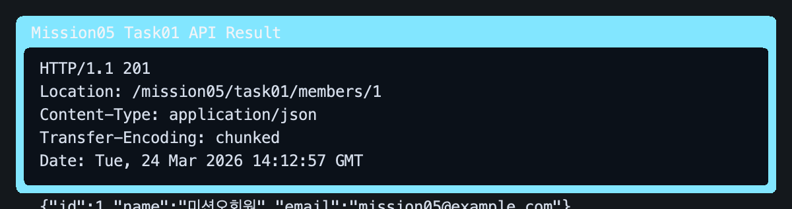
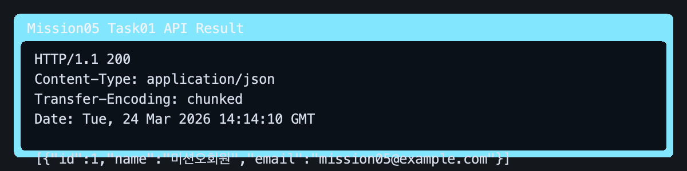
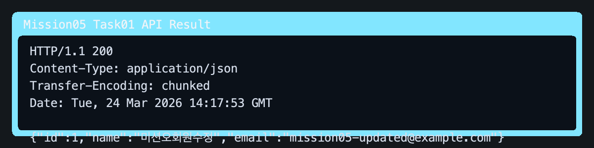
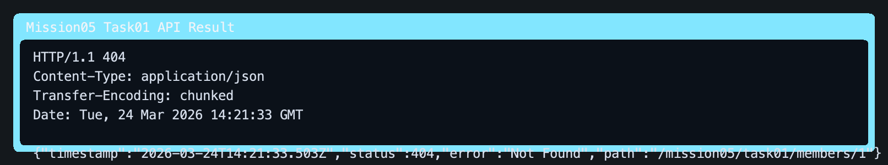

# Spring Boot에서 JPA 사용하여 데이터 CRUD 구현하기

이 문서는 `mission-05-spring-db`의 `task-01-jpa-crud` 구현 결과를 정리한 보고서입니다. Spring Boot 환경에서 JPA와 Spring Data JPA를 사용해 회원 엔터티를 데이터베이스에 매핑하고, 생성·조회·수정·삭제 흐름을 REST API로 구현했습니다.

## 1. 작업 개요

- 미션/태스크: `mission-05-spring-db` / `task-01-jpa-crud`
- 목표:
  - JPA 엔터티를 정의하고 H2 인메모리 데이터베이스 테이블과 매핑한다.
  - Spring Data JPA 리포지토리로 기본 CRUD를 구현한다.
  - 컨트롤러, 서비스, 리포지토리 계층으로 역할을 분리하고 실제 HTTP 요청으로 결과를 확인한다.
- 베이스 경로: `/mission05/task01/members`
- 사용 기술: `Spring Boot`, `Spring Data JPA`, `Hibernate`, `H2 Database`, `MockMvc`

## 2. 코드 파일 경로 인덱스

| 구분 | 파일 경로 | 역할 |
|---|---|---|
| Controller | `src/main/java/com/goorm/springmissionsplayground/mission05_spring_db/task01_jpa_crud/controller/JpaCrudMemberController.java` | 회원 CRUD API 엔드포인트를 제공하고 HTTP 응답 형식을 결정합니다. |
| Service | `src/main/java/com/goorm/springmissionsplayground/mission05_spring_db/task01_jpa_crud/service/JpaCrudMemberService.java` | 트랜잭션 경계를 관리하고 회원 생성·조회·수정·삭제 흐름을 조합합니다. |
| Repository | `src/main/java/com/goorm/springmissionsplayground/mission05_spring_db/task01_jpa_crud/repository/JpaCrudMemberRepository.java` | `JpaRepository`를 상속해 JPA CRUD 기능을 제공합니다. |
| Domain | `src/main/java/com/goorm/springmissionsplayground/mission05_spring_db/task01_jpa_crud/domain/JpaCrudMember.java` | 회원 엔터티와 테이블 매핑, 상태 변경 메서드를 정의합니다. |
| DTO | `src/main/java/com/goorm/springmissionsplayground/mission05_spring_db/task01_jpa_crud/dto/JpaCrudMemberRequest.java` | 생성/수정 요청 JSON을 바인딩하고 입력값을 검증합니다. |
| DTO | `src/main/java/com/goorm/springmissionsplayground/mission05_spring_db/task01_jpa_crud/dto/JpaCrudMemberResponse.java` | 엔터티를 API 응답 JSON 형태로 변환합니다. |
| Config | `src/main/resources/application.properties` | H2, Hibernate DDL 자동 생성, SQL 출력 등 실행 환경을 설정합니다. |
| Test | `src/test/java/com/goorm/springmissionsplayground/mission05_spring_db/task01_jpa_crud/JpaCrudMemberControllerTest.java` | 실제 스프링 컨텍스트에서 CRUD API 흐름 전체를 검증합니다. |

## 3. 구현 단계와 주요 코드 해설

1. `JpaCrudMember` 엔터티를 만들고 `@Entity`, `@Table(name = "mission05_task01_members")`로 별도 테이블에 매핑했습니다. 기존 미션의 JPA 예제와 엔티티 이름이 겹치지 않도록 클래스명도 분리했습니다.
2. `JpaCrudMemberRepository`는 `JpaRepository<JpaCrudMember, Long>`만 상속하도록 두어 `save`, `findById`, `findAll`, `delete` 같은 기본 CRUD를 바로 사용하게 했습니다.
3. `JpaCrudMemberService`는 클래스 레벨 `@Transactional`로 쓰기 작업의 기본 트랜잭션 경계를 두고, 조회 메서드는 `@Transactional(readOnly = true)`로 읽기 전용 의도를 명확히 했습니다.
4. 수정 API는 엔터티를 다시 저장하지 않고 `findById()`로 조회한 뒤 `updateProfile()`만 호출합니다. 트랜잭션이 끝날 때 JPA의 변경 감지(Dirty Checking)가 변경된 값을 UPDATE SQL로 반영합니다.
5. `JpaCrudMemberController`는 `/mission05/task01/members` 경로 아래에서 `POST`, `GET`, `PUT`, `DELETE`를 각각 매핑하고, 생성 시 `201 Created`와 `Location` 헤더를 함께 반환하도록 구성했습니다.
6. `JpaCrudMemberControllerTest`는 `MockMvc`로 생성 → 단건 조회 → 목록 조회 → 수정 → 삭제 → 삭제 후 404 확인 순서를 한 번에 검증해 CRUD 과정이 실제로 동작하는지 확인합니다.

## 4. 파일별 상세 설명 + 전체 코드

### 4.1 `JpaCrudMemberController.java`

- 파일 경로: `src/main/java/com/goorm/springmissionsplayground/mission05_spring_db/task01_jpa_crud/controller/JpaCrudMemberController.java`
- 역할: 회원 CRUD API 엔드포인트 제공
- 상세 설명:
- 기본 경로는 `/mission05/task01/members`입니다.
- `POST /mission05/task01/members`는 회원 생성 후 `201 Created`와 `Location` 헤더를 반환합니다.
- `GET`, `PUT`, `DELETE` 메서드는 서비스 계층에 작업을 위임하고, 응답은 `JpaCrudMemberResponse`로 통일합니다.

<details>
<summary><code>JpaCrudMemberController.java</code> 전체 코드</summary>

```java
package com.goorm.springmissionsplayground.mission05_spring_db.task01_jpa_crud.controller;

import com.goorm.springmissionsplayground.mission05_spring_db.task01_jpa_crud.domain.JpaCrudMember;
import com.goorm.springmissionsplayground.mission05_spring_db.task01_jpa_crud.dto.JpaCrudMemberRequest;
import com.goorm.springmissionsplayground.mission05_spring_db.task01_jpa_crud.dto.JpaCrudMemberResponse;
import com.goorm.springmissionsplayground.mission05_spring_db.task01_jpa_crud.service.JpaCrudMemberService;
import jakarta.validation.Valid;
import java.net.URI;
import java.util.List;
import org.springframework.http.HttpStatus;
import org.springframework.http.ResponseEntity;
import org.springframework.web.bind.annotation.DeleteMapping;
import org.springframework.web.bind.annotation.GetMapping;
import org.springframework.web.bind.annotation.PathVariable;
import org.springframework.web.bind.annotation.PostMapping;
import org.springframework.web.bind.annotation.PutMapping;
import org.springframework.web.bind.annotation.RequestBody;
import org.springframework.web.bind.annotation.RequestMapping;
import org.springframework.web.bind.annotation.ResponseStatus;
import org.springframework.web.bind.annotation.RestController;

@RestController
@RequestMapping("/mission05/task01/members")
public class JpaCrudMemberController {

    private final JpaCrudMemberService memberService;

    public JpaCrudMemberController(JpaCrudMemberService memberService) {
        this.memberService = memberService;
    }

    @PostMapping
    public ResponseEntity<JpaCrudMemberResponse> create(@RequestBody @Valid JpaCrudMemberRequest request) {
        JpaCrudMember created = memberService.create(request.getName(), request.getEmail());
        return ResponseEntity
                .created(URI.create("/mission05/task01/members/" + created.getId()))
                .body(JpaCrudMemberResponse.from(created));
    }

    @GetMapping
    public List<JpaCrudMemberResponse> list() {
        return memberService.findAll().stream()
                .map(JpaCrudMemberResponse::from)
                .toList();
    }

    @GetMapping("/{id}")
    public JpaCrudMemberResponse get(@PathVariable Long id) {
        return JpaCrudMemberResponse.from(memberService.findById(id));
    }

    @PutMapping("/{id}")
    public JpaCrudMemberResponse update(@PathVariable Long id, @RequestBody @Valid JpaCrudMemberRequest request) {
        JpaCrudMember updated = memberService.update(id, request.getName(), request.getEmail());
        return JpaCrudMemberResponse.from(updated);
    }

    @DeleteMapping("/{id}")
    @ResponseStatus(HttpStatus.NO_CONTENT)
    public void delete(@PathVariable Long id) {
        memberService.delete(id);
    }
}
```

</details>

### 4.2 `JpaCrudMemberService.java`

- 파일 경로: `src/main/java/com/goorm/springmissionsplayground/mission05_spring_db/task01_jpa_crud/service/JpaCrudMemberService.java`
- 역할: 트랜잭션과 비즈니스 흐름 관리
- 상세 설명:
- 핵심 공개 메서드는 `create`, `findAll`, `findById`, `update`, `delete`입니다.
- 조회 메서드는 `readOnly = true`로 열고, 생성/수정/삭제는 기본 트랜잭션 안에서 처리합니다.
- 없는 회원 ID가 들어오면 `ResponseStatusException(HttpStatus.NOT_FOUND, "회원을 찾을 수 없습니다.")`를 던져 404 응답으로 이어지게 했습니다.

<details>
<summary><code>JpaCrudMemberService.java</code> 전체 코드</summary>

```java
package com.goorm.springmissionsplayground.mission05_spring_db.task01_jpa_crud.service;

import com.goorm.springmissionsplayground.mission05_spring_db.task01_jpa_crud.domain.JpaCrudMember;
import com.goorm.springmissionsplayground.mission05_spring_db.task01_jpa_crud.repository.JpaCrudMemberRepository;
import java.util.List;
import org.springframework.data.domain.Sort;
import org.springframework.http.HttpStatus;
import org.springframework.stereotype.Service;
import org.springframework.transaction.annotation.Transactional;
import org.springframework.web.server.ResponseStatusException;

@Service
@Transactional
public class JpaCrudMemberService {

    private final JpaCrudMemberRepository memberRepository;

    public JpaCrudMemberService(JpaCrudMemberRepository memberRepository) {
        this.memberRepository = memberRepository;
    }

    public JpaCrudMember create(String name, String email) {
        JpaCrudMember member = new JpaCrudMember(name, email);
        return memberRepository.save(member);
    }

    @Transactional(readOnly = true)
    public List<JpaCrudMember> findAll() {
        return memberRepository.findAll(Sort.by(Sort.Direction.ASC, "id"));
    }

    @Transactional(readOnly = true)
    public JpaCrudMember findById(Long id) {
        return memberRepository.findById(id)
                .orElseThrow(() -> new ResponseStatusException(HttpStatus.NOT_FOUND, "회원을 찾을 수 없습니다."));
    }

    public JpaCrudMember update(Long id, String name, String email) {
        JpaCrudMember member = findById(id);
        member.updateProfile(name, email);
        return member;
    }

    public void delete(Long id) {
        JpaCrudMember member = findById(id);
        memberRepository.delete(member);
    }
}
```

</details>

### 4.3 `JpaCrudMemberRepository.java`

- 파일 경로: `src/main/java/com/goorm/springmissionsplayground/mission05_spring_db/task01_jpa_crud/repository/JpaCrudMemberRepository.java`
- 역할: JPA CRUD 데이터 접근
- 상세 설명:
- `JpaRepository<JpaCrudMember, Long>` 상속만으로 기본 CRUD 메서드를 바로 사용할 수 있습니다.
- 구현 클래스를 직접 만들지 않아도 스프링 데이터 JPA가 런타임에 프록시 구현체를 생성합니다.
- 서비스는 이 리포지토리를 통해 영속성 컨텍스트와 DB 작업을 연결합니다.

<details>
<summary><code>JpaCrudMemberRepository.java</code> 전체 코드</summary>

```java
package com.goorm.springmissionsplayground.mission05_spring_db.task01_jpa_crud.repository;

import com.goorm.springmissionsplayground.mission05_spring_db.task01_jpa_crud.domain.JpaCrudMember;
import org.springframework.data.jpa.repository.JpaRepository;
import org.springframework.stereotype.Repository;

@Repository
public interface JpaCrudMemberRepository extends JpaRepository<JpaCrudMember, Long> {
}
```

</details>

### 4.4 `JpaCrudMember.java`

- 파일 경로: `src/main/java/com/goorm/springmissionsplayground/mission05_spring_db/task01_jpa_crud/domain/JpaCrudMember.java`
- 역할: 회원 엔터티와 테이블 매핑
- 상세 설명:
- `@Entity`와 `@Table(name = "mission05_task01_members")`로 학습용 회원 테이블과 매핑했습니다.
- `@Id`, `@GeneratedValue(strategy = GenerationType.IDENTITY)`로 기본 키를 자동 생성합니다.
- `updateProfile()` 메서드가 엔터티 상태 변경 책임을 갖고, 수정 흐름에서 서비스가 이 메서드를 호출합니다.

<details>
<summary><code>JpaCrudMember.java</code> 전체 코드</summary>

```java
package com.goorm.springmissionsplayground.mission05_spring_db.task01_jpa_crud.domain;

import jakarta.persistence.Column;
import jakarta.persistence.Entity;
import jakarta.persistence.GeneratedValue;
import jakarta.persistence.GenerationType;
import jakarta.persistence.Id;
import jakarta.persistence.Table;

@Entity
@Table(name = "mission05_task01_members")
public class JpaCrudMember {

    @Id
    @GeneratedValue(strategy = GenerationType.IDENTITY)
    private Long id;

    @Column(nullable = false, length = 30)
    private String name;

    @Column(nullable = false, length = 100)
    private String email;

    protected JpaCrudMember() {
        // JPA 기본 생성자
    }

    public JpaCrudMember(String name, String email) {
        this.name = name;
        this.email = email;
    }

    public Long getId() {
        return id;
    }

    public String getName() {
        return name;
    }

    public String getEmail() {
        return email;
    }

    public void updateProfile(String name, String email) {
        this.name = name;
        this.email = email;
    }
}
```

</details>

### 4.5 `JpaCrudMemberRequest.java`

- 파일 경로: `src/main/java/com/goorm/springmissionsplayground/mission05_spring_db/task01_jpa_crud/dto/JpaCrudMemberRequest.java`
- 역할: 생성/수정 요청 바인딩 및 검증
- 상세 설명:
- 클라이언트가 보내는 JSON 본문을 `name`, `email` 필드로 받습니다.
- `@NotBlank`, `@Email`, `@Size`로 필수값과 이메일 형식을 검증합니다.
- 컨트롤러에서 `@Valid`와 함께 사용해 잘못된 요청을 초기에 막습니다.

<details>
<summary><code>JpaCrudMemberRequest.java</code> 전체 코드</summary>

```java
package com.goorm.springmissionsplayground.mission05_spring_db.task01_jpa_crud.dto;

import jakarta.validation.constraints.Email;
import jakarta.validation.constraints.NotBlank;
import jakarta.validation.constraints.Size;

public class JpaCrudMemberRequest {

    @NotBlank(message = "이름은 필수입니다.")
    @Size(max = 30, message = "이름은 30자 이하여야 합니다.")
    private String name;

    @NotBlank(message = "이메일은 필수입니다.")
    @Email(message = "올바른 이메일 형식이어야 합니다.")
    @Size(max = 100, message = "이메일은 100자 이하여야 합니다.")
    private String email;

    public String getName() {
        return name;
    }

    public void setName(String name) {
        this.name = name;
    }

    public String getEmail() {
        return email;
    }

    public void setEmail(String email) {
        this.email = email;
    }
}
```

</details>

### 4.6 `JpaCrudMemberResponse.java`

- 파일 경로: `src/main/java/com/goorm/springmissionsplayground/mission05_spring_db/task01_jpa_crud/dto/JpaCrudMemberResponse.java`
- 역할: 응답 JSON 포맷 정의
- 상세 설명:
- 엔터티 내부 구조를 그대로 노출하지 않고 API 응답 전용 객체로 변환합니다.
- `from(JpaCrudMember member)` 정적 메서드가 변환 책임을 모아 컨트롤러 코드를 단순하게 유지합니다.
- 응답 필드는 `id`, `name`, `email` 세 값만 포함합니다.

<details>
<summary><code>JpaCrudMemberResponse.java</code> 전체 코드</summary>

```java
package com.goorm.springmissionsplayground.mission05_spring_db.task01_jpa_crud.dto;

import com.goorm.springmissionsplayground.mission05_spring_db.task01_jpa_crud.domain.JpaCrudMember;

public class JpaCrudMemberResponse {

    private final Long id;
    private final String name;
    private final String email;

    public JpaCrudMemberResponse(Long id, String name, String email) {
        this.id = id;
        this.name = name;
        this.email = email;
    }

    public static JpaCrudMemberResponse from(JpaCrudMember member) {
        return new JpaCrudMemberResponse(member.getId(), member.getName(), member.getEmail());
    }

    public Long getId() {
        return id;
    }

    public String getName() {
        return name;
    }

    public String getEmail() {
        return email;
    }
}
```

</details>

### 4.7 `application.properties`

- 파일 경로: `src/main/resources/application.properties`
- 역할: H2, JPA, Hibernate 실행 환경 설정
- 상세 설명:
- `spring.datasource.url=jdbc:h2:mem:mission01`로 인메모리 DB를 사용해 실행할 때마다 깨끗한 상태에서 시작합니다.
- `spring.jpa.hibernate.ddl-auto=create-drop`이 엔터티 기준으로 테이블을 만들고 종료 시 정리합니다.
- `spring.jpa.show-sql=true`와 `hibernate.format_sql=true` 덕분에 콘솔에서 INSERT/SELECT/UPDATE/DELETE SQL을 확인할 수 있습니다.

<details>
<summary><code>application.properties</code> 전체 코드</summary>

```properties
spring.application.name=core

# Mission04 Task02: Thymeleaf View Resolver 설정
spring.thymeleaf.prefix=classpath:/templates/
spring.thymeleaf.suffix=.html
spring.thymeleaf.mode=HTML
spring.thymeleaf.encoding=UTF-8
spring.thymeleaf.cache=false

# H2 in-memory DB 설정 (테스트/학습용)
spring.datasource.url=jdbc:h2:mem:mission01;DB_CLOSE_DELAY=-1;DB_CLOSE_ON_EXIT=FALSE
spring.datasource.driverClassName=org.h2.Driver
spring.datasource.username=sa
spring.datasource.password=

# JPA 설정
spring.jpa.hibernate.ddl-auto=create-drop
spring.jpa.show-sql=true
spring.jpa.properties.hibernate.format_sql=true

# H2 콘솔 (개발 편의를 위해 활성화)
spring.h2.console.enabled=true
spring.h2.console.path=/h2-console
```

</details>

### 4.8 `JpaCrudMemberControllerTest.java`

- 파일 경로: `src/test/java/com/goorm/springmissionsplayground/mission05_spring_db/task01_jpa_crud/JpaCrudMemberControllerTest.java`
- 역할: CRUD 전체 흐름 통합 검증
- 상세 설명:
- 검증 시나리오는 회원 생성, 단건 조회, 목록 조회, 수정, 삭제, 삭제 후 404 확인 순서입니다.
- `WebApplicationContext`로 실제 스프링 컨텍스트를 띄운 뒤 `MockMvc`로 HTTP 요청을 보내기 때문에 컨트롤러와 서비스, 리포지토리 협력 흐름을 함께 검증합니다.
- 정상 흐름과 예외 흐름(삭제 후 조회 시 404)을 모두 확인합니다.

<details>
<summary><code>JpaCrudMemberControllerTest.java</code> 전체 코드</summary>

```java
package com.goorm.springmissionsplayground.mission05_spring_db.task01_jpa_crud;

import com.goorm.springmissionsplayground.mission05_spring_db.task01_jpa_crud.repository.JpaCrudMemberRepository;
import org.junit.jupiter.api.BeforeEach;
import org.junit.jupiter.api.DisplayName;
import org.junit.jupiter.api.Test;
import org.springframework.beans.factory.annotation.Autowired;
import org.springframework.boot.test.context.SpringBootTest;
import org.springframework.http.MediaType;
import org.springframework.test.web.servlet.MockMvc;
import org.springframework.test.web.servlet.MvcResult;
import org.springframework.test.web.servlet.setup.MockMvcBuilders;
import org.springframework.web.context.WebApplicationContext;

import static org.hamcrest.Matchers.hasSize;
import static org.springframework.test.web.servlet.request.MockMvcRequestBuilders.delete;
import static org.springframework.test.web.servlet.request.MockMvcRequestBuilders.get;
import static org.springframework.test.web.servlet.request.MockMvcRequestBuilders.post;
import static org.springframework.test.web.servlet.request.MockMvcRequestBuilders.put;
import static org.springframework.test.web.servlet.result.MockMvcResultMatchers.header;
import static org.springframework.test.web.servlet.result.MockMvcResultMatchers.jsonPath;
import static org.springframework.test.web.servlet.result.MockMvcResultMatchers.status;

@SpringBootTest
class JpaCrudMemberControllerTest {

    @Autowired
    private WebApplicationContext context;

    private MockMvc mockMvc;

    @Autowired
    private JpaCrudMemberRepository memberRepository;

    @BeforeEach
    void setUp() {
        memberRepository.deleteAll();
        mockMvc = MockMvcBuilders.webAppContextSetup(context).build();
    }

    @Test
    @DisplayName("회원 CRUD API를 순서대로 호출하면 생성, 조회, 수정, 삭제가 모두 동작한다")
    void memberCrudFlow() throws Exception {
        MvcResult createResult = mockMvc.perform(post("/mission05/task01/members")
                        .contentType(MediaType.APPLICATION_JSON)
                        .content("""
                                {
                                  "name": "김스프링",
                                  "email": "springkim@example.com"
                                }
                                """))
                .andExpect(status().isCreated())
                .andExpect(header().exists("Location"))
                .andExpect(jsonPath("$.id").isNumber())
                .andExpect(jsonPath("$.name").value("김스프링"))
                .andExpect(jsonPath("$.email").value("springkim@example.com"))
                .andReturn();

        String location = createResult.getResponse().getHeader("Location");
        Long memberId = Long.parseLong(location.substring(location.lastIndexOf('/') + 1));

        mockMvc.perform(get("/mission05/task01/members/{id}", memberId))
                .andExpect(status().isOk())
                .andExpect(jsonPath("$.id").value(memberId))
                .andExpect(jsonPath("$.name").value("김스프링"))
                .andExpect(jsonPath("$.email").value("springkim@example.com"));

        mockMvc.perform(get("/mission05/task01/members"))
                .andExpect(status().isOk())
                .andExpect(jsonPath("$", hasSize(1)))
                .andExpect(jsonPath("$[0].id").value(memberId))
                .andExpect(jsonPath("$[0].name").value("김스프링"));

        mockMvc.perform(put("/mission05/task01/members/{id}", memberId)
                        .contentType(MediaType.APPLICATION_JSON)
                        .content("""
                                {
                                  "name": "김스프링수정",
                                  "email": "updated.springkim@example.com"
                                }
                                """))
                .andExpect(status().isOk())
                .andExpect(jsonPath("$.id").value(memberId))
                .andExpect(jsonPath("$.name").value("김스프링수정"))
                .andExpect(jsonPath("$.email").value("updated.springkim@example.com"));

        mockMvc.perform(delete("/mission05/task01/members/{id}", memberId))
                .andExpect(status().isNoContent());

        mockMvc.perform(get("/mission05/task01/members/{id}", memberId))
                .andExpect(status().isNotFound());

        mockMvc.perform(get("/mission05/task01/members"))
                .andExpect(status().isOk())
                .andExpect(jsonPath("$", hasSize(0)));
    }
}
```

</details>

## 5. 새로 나온 개념 정리 + 참고 링크

### 5.1 JPA 엔터티와 기본 생성자

- 핵심:
- JPA 엔터티는 `@Entity`가 붙은 클래스이며, DB 테이블 한 행을 자바 객체로 다루기 위한 기준 단위입니다.
- JPA는 엔터티를 생성할 때 기본 생성자를 사용하므로 `public` 또는 `protected` 기본 생성자가 필요합니다.
- 왜 쓰는가:
- SQL 결과를 매번 수동으로 객체로 바꾸지 않아도 되고, 자바 객체 중심으로 데이터 상태를 다룰 수 있습니다.
- 엔터티 규칙을 지키면 JPA 구현체(Hibernate)가 조회 결과를 자동으로 객체에 채워줍니다.
- 참고 링크:
- Jakarta Persistence `@Entity` API: https://jakarta.ee/specifications/persistence/3.1/apidocs/jakarta.persistence/jakarta/persistence/entity
- Jakarta Persistence 3.2 Specification, 2.1 The Entity Class: https://jakarta.ee/specifications/persistence/3.2/jakarta-persistence-spec-3.2

### 5.2 `JpaRepository`와 기본 CRUD

- 핵심:
- `JpaRepository`는 `save`, `findById`, `findAll`, `delete` 같은 기본 CRUD 메서드를 제공하는 스프링 데이터 JPA 인터페이스입니다.
- 리포지토리 인터페이스만 선언하면 구현체는 런타임에 자동으로 생성됩니다.
- 왜 쓰는가:
- 반복적인 DAO 구현 코드를 직접 작성하지 않아도 되고, 도메인 중심으로 데이터 접근 계층을 빠르게 만들 수 있습니다.
- 작은 학습용 프로젝트에서도 구조를 깔끔하게 나누면서 생산성을 높일 수 있습니다.
- 참고 링크:
- Spring Data JPA Reference: https://docs.spring.io/spring-data/jpa/reference/jpa.html
- Spring Data JPA `JpaRepository` API: https://docs.spring.io/spring-data/jpa/reference/api/java/org/springframework/data/jpa/repository/JpaRepository.html

### 5.3 `@Transactional`과 변경 감지

- 핵심:
- `@Transactional`은 메서드 실행을 트랜잭션 안에서 처리하게 해 주는 스프링 선언형 트랜잭션 기능입니다.
- 트랜잭션 안에서 조회한 엔터티 값을 바꾸면 JPA가 변경 사항을 추적했다가 커밋 시점에 UPDATE SQL을 실행합니다.
- 왜 쓰는가:
- 생성, 수정, 삭제 작업이 중간에 끊기지 않게 묶어 주고, 데이터 정합성을 유지하기 쉽습니다.
- 수정 메서드에서 `save()`를 반복 호출하지 않아도 되는 이유를 이해하는 데 중요한 개념입니다.
- 참고 링크:
- Spring Framework Transaction Management: https://docs.spring.io/spring-framework/reference/data-access/transaction.html
- Spring Framework Declarative Transaction Management: https://docs.spring.io/spring-framework/reference/data-access/transaction/declarative.html

### 5.4 `@Valid`와 요청 데이터 검증

- 핵심:
- `@Valid`는 요청 본문 DTO에 선언한 Bean Validation 규칙을 검사하게 만듭니다.
- `@NotBlank`, `@Email`, `@Size` 같은 제약 조건이 컨트롤러 진입 시점에 적용됩니다.
- 왜 쓰는가:
- 잘못된 값이 서비스와 DB까지 내려가기 전에 막을 수 있어 API 안정성이 좋아집니다.
- 입력 규칙이 DTO에 모여 있어 어떤 값이 허용되는지 코드만 봐도 이해하기 쉽습니다.
- 참고 링크:
- Spring Framework Validation for Web MVC: https://docs.spring.io/spring-framework/reference/web/webmvc/mvc-controller/ann-validation.html
- Bean Validation Overview (Spring Framework Reference): https://docs.spring.io/spring-framework/reference/core/validation/beanvalidation.html

## 6. 실행·검증 방법

### 6.1 애플리케이션 실행

```bash
./gradlew bootRun
```

- 예상 결과:
- 콘솔에 `Tomcat started on port 8080`가 출력되고, Hibernate가 `mission05_task01_members` 테이블을 생성합니다.

### 6.2 API 호출로 CRUD 확인

회원 생성:

```bash
curl -i -X POST http://localhost:8080/mission05/task01/members \
  -H "Content-Type: application/json" \
  -d '{"name":"미션오회원","email":"mission05@example.com"}'
```

회원 목록 조회:

```bash
curl -i http://localhost:8080/mission05/task01/members
```

회원 수정:

```bash
curl -i -X PUT http://localhost:8080/mission05/task01/members/1 \
  -H "Content-Type: application/json" \
  -d '{"name":"미션오회원수정","email":"mission05-updated@example.com"}'
```

회원 삭제:

```bash
curl -i -X DELETE http://localhost:8080/mission05/task01/members/1
```

삭제 후 조회:

```bash
curl -i http://localhost:8080/mission05/task01/members/1
```

- 예상 결과:
- 생성 시 `201 Created`, 목록/단건/수정 시 `200 OK`, 삭제 시 `204 No Content`, 삭제 후 조회 시 `404 Not Found`가 반환됩니다.

### 6.3 테스트 실행

```bash
./gradlew test --tests com.goorm.springmissionsplayground.mission05_spring_db.task01_jpa_crud.JpaCrudMemberControllerTest
```

- 예상 결과:
- 테스트가 `BUILD SUCCESSFUL`로 끝나며 CRUD 전체 흐름이 통과합니다.

## 7. 결과 확인 방법(스크린샷 포함)

- 성공 기준:
- 생성 응답에 `201 Created`, `Location: /mission05/task01/members/1`, JSON 본문이 포함되면 저장이 성공한 것입니다.
- 목록 응답에 생성한 회원이 배열로 보이면 조회가 성공한 것입니다.
- 수정 응답에 변경된 이름과 이메일이 보이면 UPDATE가 성공한 것입니다.
- 삭제 응답이 `204`이고, 같은 ID를 다시 조회했을 때 `404`가 나오면 삭제와 예외 흐름이 모두 정상입니다.
- 스크린샷 파일명과 저장 위치:
- `docs/mission-05-spring-db/task-01-jpa-crud/screenshots/create-response.png`
- `docs/mission-05-spring-db/task-01-jpa-crud/screenshots/list-response.png`
- `docs/mission-05-spring-db/task-01-jpa-crud/screenshots/update-response.png`
- `docs/mission-05-spring-db/task-01-jpa-crud/screenshots/delete-response.png`
- `docs/mission-05-spring-db/task-01-jpa-crud/screenshots/not-found-response.png`
- 참고:
- 위 이미지는 2026-03-24에 실제 `curl` 응답을 저장한 뒤 PNG로 렌더링한 결과입니다.

### 7.1 회원 생성 응답



### 7.2 회원 목록 조회 응답



### 7.3 회원 수정 응답



### 7.4 회원 삭제 후 조회 응답



## 8. 학습 내용

- JPA를 쓰면 "테이블 한 줄"을 직접 SQL 결과로 다루기보다 "엔터티 객체 하나"로 다루게 됩니다. 그래서 서비스 코드는 데이터베이스보다 도메인 객체의 상태 변화에 더 집중할 수 있습니다.
- Spring Data JPA의 `JpaRepository`는 CRUD를 빠르게 시작하게 해 주지만, 서비스 계층이 사라지는 것은 아닙니다. 트랜잭션 경계, 예외 처리, 정렬 규칙, 응답 조합 같은 흐름은 서비스가 정리해 주는 편이 이해하기 쉽고 유지보수에도 유리합니다.
- 수정 로직에서 `member.updateProfile(...)`만 호출하고 별도 `save()`를 하지 않아도 동작하는 이유는 JPA가 트랜잭션 안에서 엔터티 변화를 추적하기 때문입니다. 이 흐름을 이해하면 JPA 코드가 왜 객체 지향적으로 보이는지 감이 잡힙니다.
- 요청 DTO에 검증 규칙을 두면 컨트롤러에 들어오는 데이터 품질을 초기에 통제할 수 있습니다. 잘못된 요청이 서비스와 DB까지 내려가지 않으므로 버그 원인을 좁히기 쉬워집니다.
