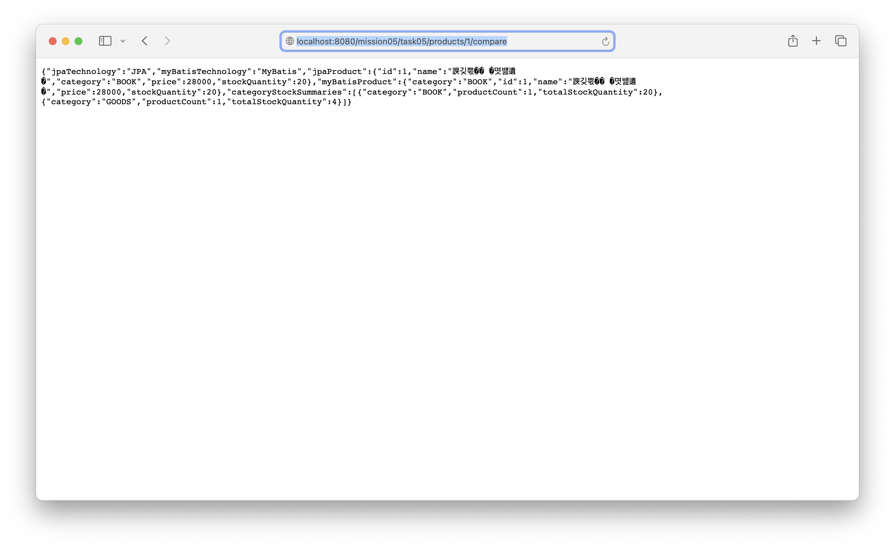
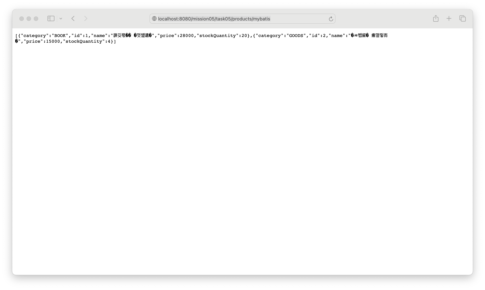
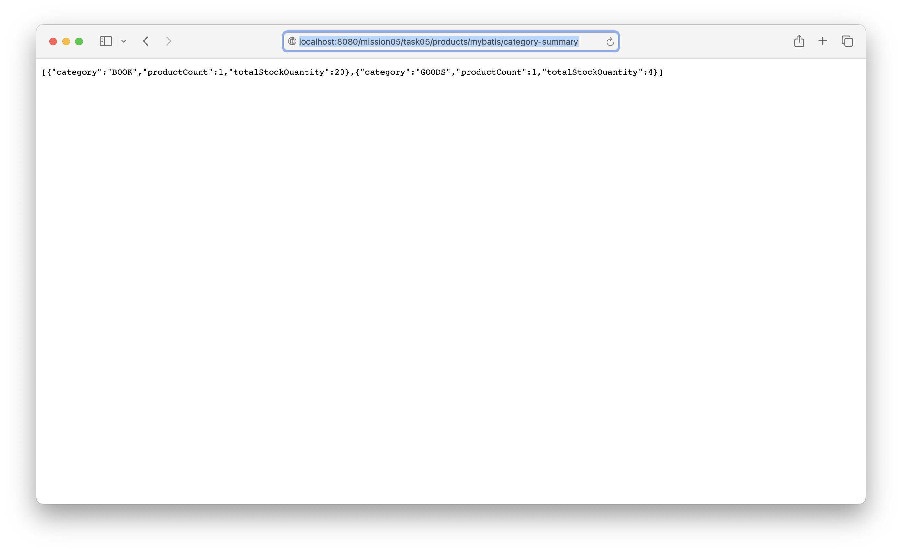

# Spring Boot에서 MyBatis와 JPA를 동시에 사용하기

이 문서는 `mission-05-spring-db`의 `task-05-mybatis-jpa-together` 구현 결과를 정리한 보고서입니다. Spring Boot 4 환경에서 JPA와 MyBatis를 함께 설정하고, JPA는 쓰기 작업에, MyBatis는 조회와 집계 작업에 사용해 같은 데이터베이스를 병행 처리하는 예제를 구현했습니다.

## 1. 작업 개요

- 미션/태스크: `mission-05-spring-db` / `task-05-mybatis-jpa-together`
- 목표:
  - Spring Boot 애플리케이션에 MyBatis와 JPA를 동시에 설정한다.
  - 같은 테이블에 대해 JPA는 저장/수정, MyBatis는 조회/집계 역할을 맡게 한다.
  - 두 기술을 한 서비스 흐름 안에서 함께 호출하고, 실제 API 응답과 스크린샷으로 결과를 확인한다.
- 베이스 경로: `/mission05/task05/products`
- 사용 기술: `Spring Boot`, `Spring Data JPA`, `MyBatis`, `Hibernate`, `H2 Database`, `MockMvc`

## 2. 코드 파일 경로 인덱스

| 구분 | 파일 경로                                                                                                                                              | 역할 |
|---|----------------------------------------------------------------------------------------------------------------------------------------------------|---|
| Config | `build.gradle`                                                                                                                                     | Spring Boot 4와 함께 사용할 MyBatis Spring Boot Starter 의존성을 추가합니다. |
| Config | `src/codemain/resources/application.properties`                                                                                                    | H2, Hibernate DDL 자동 생성, SQL 출력 등 공통 실행 환경을 설정합니다. |
| Controller | `src/main/java/com/goorm/springmissionsplayground/mission05_spring_db/task05_mybatis_jpa_together/controller/HybridPersistenceController.java`     | JPA 저장/수정과 MyBatis 조회 결과를 확인하는 API를 제공합니다. |
| Service | `src/main/java/com/goorm/springmissionsplayground/mission05_spring_db/task05_mybatis_jpa_together/service/HybridPersistenceService.java`           | JPA 쓰기와 MyBatis 읽기를 같은 서비스 흐름으로 묶습니다. |
| Repository | `src/main/java/com/goorm/springmissionsplayground/mission05_spring_db/task05_mybatis_jpa_together/repository/HybridStoreProductJpaRepository.java` | 상품 엔터티를 JPA 방식으로 저장·수정·조회합니다. |
| Mapper | `src/main/java/com/goorm/springmissionsplayground/mission05_spring_db/task05_mybatis_jpa_together/mapper/HybridStoreProductMapper.java`            | 같은 상품 테이블을 MyBatis 방식으로 조회하고 카테고리별 재고를 집계합니다. |
| Domain | `src/main/java/com/goorm/springmissionsplayground/mission05_spring_db/task05_mybatis_jpa_together/domain/HybridStoreProduct.java`                  | JPA 엔터티와 테이블 매핑, 재고 변경 메서드를 정의합니다. |
| DTO | `src/main/java/com/goorm/springmissionsplayground/mission05_spring_db/task05_mybatis_jpa_together/dto/HybridStoreProductCreateRequest.java`        | 상품 생성 요청 JSON을 바인딩하고 입력값을 검증합니다. |
| DTO | `src/main/java/com/goorm/springmissionsplayground/mission05_spring_db/task05_mybatis_jpa_together/dto/HybridStoreStockUpdateRequest.java`          | 재고 수정 요청 JSON을 바인딩합니다. |
| DTO | `src/main/java/com/goorm/springmissionsplayground/mission05_spring_db/task05_mybatis_jpa_together/dto/HybridStoreProductResponse.java`             | JPA 엔터티를 응답 JSON으로 변환합니다. |
| DTO | `src/main/java/com/goorm/springmissionsplayground/mission05_spring_db/task05_mybatis_jpa_together/dto/HybridStoreProductView.java`                 | MyBatis 조회 결과를 담는 읽기 전용 모델입니다. |
| DTO | `src/main/java/com/goorm/springmissionsplayground/mission05_spring_db/task05_mybatis_jpa_together/dto/CategoryStockSummary.java`                   | MyBatis 카테고리별 집계 결과를 담습니다. |
| DTO | `src/main/java/com/goorm/springmissionsplayground/mission05_spring_db/task05_mybatis_jpa_together/dto/HybridPersistenceSnapshotResponse.java`      | JPA 쓰기 결과와 MyBatis 읽기 결과를 한 번에 반환합니다. |
| Test | `src/test/java/com/goorm/springmissionsplayground/mission05_spring_db/task05_mybatis_jpa_together/HybridPersistenceControllerTest.java`            | JPA 저장/수정과 MyBatis 조회/집계가 함께 동작하는지를 통합 테스트로 검증합니다. |
| Artifact | `docs/mission-05-spring-db/task-05-mybatis-jpa-together/task05-gradle-test-output.txt`                                                             | `task05` 테스트 실행 결과를 저장한 콘솔 출력 파일입니다. |
| Artifact | `docs/mission-05-spring-db/task-05-mybatis-jpa-together/screenshots/create-snapshot.txt`                                                           | JPA 저장 후 MyBatis 재조회 응답 원본 텍스트입니다. |
| Artifact | `docs/mission-05-spring-db/task-05-mybatis-jpa-together/screenshots/update-snapshot.txt`                                                           | JPA 재고 수정 후 MyBatis 집계 응답 원본 텍스트입니다. |
| Artifact | `docs/mission-05-spring-db/task-05-mybatis-jpa-together/screenshots/mybatis-list.txt`                                                              | MyBatis 전용 목록 조회 응답 원본 텍스트입니다. |
| Artifact | `docs/mission-05-spring-db/task-05-mybatis-jpa-together/screenshots/mybatis-category-summary.txt`                                                  | MyBatis 전용 카테고리 집계 응답 원본 텍스트입니다. |
| Artifact | `docs/mission-05-spring-db/task-05-mybatis-jpa-together/screenshots/create-snapshot.png`                                                           | JPA 저장 + MyBatis 조회 스냅샷 스크린샷입니다. |
| Artifact | `docs/mission-05-spring-db/task-05-mybatis-jpa-together/screenshots/update-snapshot.png`                                                           | JPA 수정 + MyBatis 재조회 스크린샷입니다. |
| Artifact | `docs/mission-05-spring-db/task-05-mybatis-jpa-together/screenshots/mybatis-list.png`                                                              | MyBatis 전용 목록 조회 스크린샷입니다. |
| Artifact | `docs/mission-05-spring-db/task-05-mybatis-jpa-together/screenshots/mybatis-category-summary.png`                                                  | MyBatis 전용 카테고리 집계 스크린샷입니다. |

## 3. 구현 단계와 주요 코드 해설

1. `build.gradle`에 `org.mybatis.spring.boot:mybatis-spring-boot-starter:4.0.1`을 추가해 Spring Boot 4 환경에서 MyBatis를 함께 사용할 수 있도록 구성했습니다. 공식 문서 기준으로 MyBatis Spring Boot Starter 4.x 라인이 Spring Boot 4.0+를 지원합니다.
2. `HybridStoreProduct` 엔터티와 `HybridStoreProductJpaRepository`는 상품 저장과 수정 역할을 맡습니다. JPA는 객체 중심으로 엔터티 상태를 관리하고 `flush()` 시점에 실제 SQL 반영을 보장합니다.
3. `HybridStoreProductMapper`는 같은 `mission05_task05_products` 테이블을 대상으로 MyBatis 조회를 담당합니다. 단건 조회, 전체 목록 조회, 카테고리별 재고 집계를 `@Select` 기반 SQL로 직접 표현했습니다.
4. `HybridPersistenceService`는 JPA로 상품을 저장하거나 재고를 수정한 뒤 `productJpaRepository.flush()`를 호출하고, 바로 MyBatis 매퍼로 같은 데이터를 다시 읽습니다. 이 흐름 덕분에 "JPA로 write, MyBatis로 read"를 같은 서비스 단위 안에서 확인할 수 있습니다.
5. `HybridPersistenceController`는 생성, 재고 수정, MyBatis 전용 목록 조회, MyBatis 전용 집계 조회 API를 제공합니다. 생성/수정 응답에는 `writeTechnology=JPA`, `readTechnology=MyBatis` 필드를 넣어 어떤 기술이 어느 역할을 수행했는지 JSON만 봐도 드러나게 했습니다.
6. `HybridPersistenceControllerTest`는 JPA 저장 후 MyBatis 재조회, JPA 수정 후 MyBatis 집계 반영, MyBatis 전용 목록/집계 조회를 각각 검증합니다. 테스트와 실제 `curl` 응답을 기반으로 스크린샷도 함께 만들었습니다.

## 4. 파일별 상세 설명 + 전체 코드

### 4.1 `build.gradle`

- 파일 경로: `build.gradle`
- 역할: MyBatis와 JPA를 함께 사용하는 의존성 설정
- 상세 설명:
- `spring-boot-starter-data-jpa`와 `mybatis-spring-boot-starter`를 함께 선언해 동일한 Spring Boot 애플리케이션 안에서 두 접근 기술을 같이 사용합니다.
- MyBatis 스타터 버전은 `4.0.1`로 설정했고, 이는 Spring Boot 4.x 라인과 호환되는 공식 스타터 버전입니다.
- H2는 실행 시점에 같은 메모리 DB를 JPA와 MyBatis가 함께 바라보게 합니다.

<details>
<summary><code>build.gradle</code> 전체 코드</summary>

```groovy
plugins {
	id 'java'
	id 'org.springframework.boot' version '4.0.2'
	id 'io.spring.dependency-management' version '1.1.7'
}

group = 'com.goorm'
version = '0.0.1-SNAPSHOT'
description = 'Demo project for Spring Boot'

java {
	toolchain {
		languageVersion = JavaLanguageVersion.of(25)
	}
}

repositories {
	mavenCentral()
}

dependencies {
	implementation 'org.springframework.boot:spring-boot-starter-web'
	implementation 'org.springframework.boot:spring-boot-starter-thymeleaf'
	implementation 'org.springframework.boot:spring-boot-starter-validation'
	implementation 'org.springframework.boot:spring-boot-starter'
	implementation 'org.springframework.boot:spring-boot-starter-aspectj'
	implementation 'org.springframework.boot:spring-boot-starter-data-jpa'
	implementation 'org.mybatis.spring.boot:mybatis-spring-boot-starter:4.0.1'
	implementation 'jakarta.inject:jakarta.inject-api:2.0.1'
	runtimeOnly 'com.h2database:h2'
	testImplementation 'org.springframework.boot:spring-boot-starter-test'
	testRuntimeOnly 'org.junit.platform:junit-platform-launcher'
}

tasks.named('test') {
	useJUnitPlatform()
}
```

</details>

### 4.2 `HybridPersistenceController.java`

- 파일 경로: `src/main/java/com/goorm/springmissionsplayground/mission05_spring_db/task05_mybatis_jpa_together/controller/HybridPersistenceController.java`
- 역할: JPA/MyBatis 병행 사용 API 제공
- 상세 설명:
- 기본 경로는 `/mission05/task05/products`입니다.
- `POST /mission05/task05/products`는 JPA로 저장한 뒤 MyBatis로 다시 읽은 결과를 함께 반환합니다.
- `PATCH /mission05/task05/products/{id}/stock`, `GET /mission05/task05/products/mybatis`, `GET /mission05/task05/products/mybatis/category-summary`로 수정 후 조회와 MyBatis 전용 읽기 결과를 확인할 수 있습니다.

<details>
<summary><code>HybridPersistenceController.java</code> 전체 코드</summary>

```java
package com.goorm.springmissionsplayground.mission05_spring_db.task05_mybatis_jpa_together.controller;

import com.goorm.springmissionsplayground.mission05_spring_db.task05_mybatis_jpa_together.dto.CategoryStockSummary;
import com.goorm.springmissionsplayground.mission05_spring_db.task05_mybatis_jpa_together.dto.HybridPersistenceSnapshotResponse;
import com.goorm.springmissionsplayground.mission05_spring_db.task05_mybatis_jpa_together.dto.HybridStoreProductCreateRequest;
import com.goorm.springmissionsplayground.mission05_spring_db.task05_mybatis_jpa_together.dto.HybridStoreProductView;
import com.goorm.springmissionsplayground.mission05_spring_db.task05_mybatis_jpa_together.dto.HybridStoreStockUpdateRequest;
import com.goorm.springmissionsplayground.mission05_spring_db.task05_mybatis_jpa_together.service.HybridPersistenceService;
import jakarta.validation.Valid;
import java.net.URI;
import java.util.List;
import org.springframework.http.ResponseEntity;
import org.springframework.web.bind.annotation.GetMapping;
import org.springframework.web.bind.annotation.PatchMapping;
import org.springframework.web.bind.annotation.PathVariable;
import org.springframework.web.bind.annotation.PostMapping;
import org.springframework.web.bind.annotation.RequestBody;
import org.springframework.web.bind.annotation.RequestMapping;
import org.springframework.web.bind.annotation.RestController;

@RestController
@RequestMapping("/mission05/task05/products")
public class HybridPersistenceController {

    private final HybridPersistenceService hybridPersistenceService;

    public HybridPersistenceController(HybridPersistenceService hybridPersistenceService) {
        this.hybridPersistenceService = hybridPersistenceService;
    }

    @PostMapping
    public ResponseEntity<HybridPersistenceSnapshotResponse> create(
            @RequestBody @Valid HybridStoreProductCreateRequest request
    ) {
        HybridPersistenceSnapshotResponse response = hybridPersistenceService.createWithJpaAndReadWithMyBatis(
                request.getName(),
                request.getCategory(),
                request.getPrice(),
                request.getStockQuantity()
        );
        return ResponseEntity
                .created(URI.create("/mission05/task05/products/" + response.getSavedByJpa().getId()))
                .body(response);
    }

    @PatchMapping("/{id}/stock")
    public HybridPersistenceSnapshotResponse updateStock(
            @PathVariable Long id,
            @RequestBody @Valid HybridStoreStockUpdateRequest request
    ) {
        return hybridPersistenceService.updateStockWithJpaAndReadWithMyBatis(id, request.getStockQuantity());
    }

    @GetMapping("/mybatis")
    public List<HybridStoreProductView> listByMyBatis() {
        return hybridPersistenceService.readAllProductsWithMyBatis();
    }

    @GetMapping("/mybatis/category-summary")
    public List<CategoryStockSummary> categorySummaryByMyBatis() {
        return hybridPersistenceService.readCategoryStockSummariesWithMyBatis();
    }
}
```

</details>

### 4.3 `HybridPersistenceService.java`

- 파일 경로: `src/main/java/com/goorm/springmissionsplayground/mission05_spring_db/task05_mybatis_jpa_together/service/HybridPersistenceService.java`
- 역할: JPA 쓰기와 MyBatis 읽기 조합
- 상세 설명:
- 핵심 공개 메서드는 `createWithJpaAndReadWithMyBatis`, `updateStockWithJpaAndReadWithMyBatis`, `readAllProductsWithMyBatis`, `readCategoryStockSummariesWithMyBatis`입니다.
- 생성/수정 메서드는 JPA 저장 후 `flush()`를 호출해 DB 반영 시점을 명확히 한 다음 MyBatis로 같은 데이터를 즉시 다시 읽습니다.
- 없는 상품 ID는 `404 Not Found`로 처리하고, 읽기 전용 조회 메서드는 `@Transactional(readOnly = true)`를 사용합니다.

<details>
<summary><code>HybridPersistenceService.java</code> 전체 코드</summary>

```java
package com.goorm.springmissionsplayground.mission05_spring_db.task05_mybatis_jpa_together.service;

import com.goorm.springmissionsplayground.mission05_spring_db.task05_mybatis_jpa_together.domain.HybridStoreProduct;
import com.goorm.springmissionsplayground.mission05_spring_db.task05_mybatis_jpa_together.dto.CategoryStockSummary;
import com.goorm.springmissionsplayground.mission05_spring_db.task05_mybatis_jpa_together.dto.HybridPersistenceSnapshotResponse;
import com.goorm.springmissionsplayground.mission05_spring_db.task05_mybatis_jpa_together.dto.HybridStoreProductResponse;
import com.goorm.springmissionsplayground.mission05_spring_db.task05_mybatis_jpa_together.dto.HybridStoreProductView;
import com.goorm.springmissionsplayground.mission05_spring_db.task05_mybatis_jpa_together.mapper.HybridStoreProductMapper;
import com.goorm.springmissionsplayground.mission05_spring_db.task05_mybatis_jpa_together.repository.HybridStoreProductJpaRepository;
import java.util.List;
import org.springframework.http.HttpStatus;
import org.springframework.stereotype.Service;
import org.springframework.transaction.annotation.Transactional;
import org.springframework.web.server.ResponseStatusException;

@Service
public class HybridPersistenceService {

    private final HybridStoreProductJpaRepository productJpaRepository;
    private final HybridStoreProductMapper productMapper;

    public HybridPersistenceService(
            HybridStoreProductJpaRepository productJpaRepository,
            HybridStoreProductMapper productMapper
    ) {
        this.productJpaRepository = productJpaRepository;
        this.productMapper = productMapper;
    }

    @Transactional
    public HybridPersistenceSnapshotResponse createWithJpaAndReadWithMyBatis(
            String name,
            String category,
            int price,
            int stockQuantity
    ) {
        HybridStoreProduct savedProduct = productJpaRepository.save(
                new HybridStoreProduct(name, category, price, stockQuantity)
        );
        productJpaRepository.flush();
        return buildSnapshot(savedProduct);
    }

    @Transactional
    public HybridPersistenceSnapshotResponse updateStockWithJpaAndReadWithMyBatis(Long id, int stockQuantity) {
        HybridStoreProduct product = productJpaRepository.findById(id)
                .orElseThrow(() -> new ResponseStatusException(HttpStatus.NOT_FOUND, "상품을 찾을 수 없습니다."));
        product.changeStockQuantity(stockQuantity);
        productJpaRepository.flush();
        return buildSnapshot(product);
    }

    @Transactional(readOnly = true)
    public List<HybridStoreProductView> readAllProductsWithMyBatis() {
        return productMapper.findAll();
    }

    @Transactional(readOnly = true)
    public List<CategoryStockSummary> readCategoryStockSummariesWithMyBatis() {
        return productMapper.findCategoryStockSummaries();
    }

    private HybridPersistenceSnapshotResponse buildSnapshot(HybridStoreProduct savedProduct) {
        HybridStoreProductView myBatisView = productMapper.findById(savedProduct.getId());
        return new HybridPersistenceSnapshotResponse(
                "JPA",
                "MyBatis",
                HybridStoreProductResponse.from(savedProduct),
                myBatisView,
                productMapper.findCategoryStockSummaries()
        );
    }
}
```

</details>

### 4.4 `HybridStoreProductJpaRepository.java`

- 파일 경로: `src/main/java/com/goorm/springmissionsplayground/mission05_spring_db/task05_mybatis_jpa_together/repository/HybridStoreProductJpaRepository.java`
- 역할: JPA 기반 상품 저장소
- 상세 설명:
- `JpaRepository<HybridStoreProduct, Long>`를 상속해 저장, 조회, flush 기능을 사용합니다.
- 이번 태스크에서는 주로 `save`, `findById`, `flush`를 사용해 쓰기 역할을 담당합니다.
- 서비스 계층은 이 리포지토리를 통해 JPA 엔터티 생명주기와 변경 감지를 활용합니다.

<details>
<summary><code>HybridStoreProductJpaRepository.java</code> 전체 코드</summary>

```java
package com.goorm.springmissionsplayground.mission05_spring_db.task05_mybatis_jpa_together.repository;

import com.goorm.springmissionsplayground.mission05_spring_db.task05_mybatis_jpa_together.domain.HybridStoreProduct;
import org.springframework.data.jpa.repository.JpaRepository;
import org.springframework.stereotype.Repository;

@Repository
public interface HybridStoreProductJpaRepository extends JpaRepository<HybridStoreProduct, Long> {
}
```

</details>

### 4.5 `HybridStoreProductMapper.java`

- 파일 경로: `src/main/java/com/goorm/springmissionsplayground/mission05_spring_db/task05_mybatis_jpa_together/mapper/HybridStoreProductMapper.java`
- 역할: MyBatis 기반 상품 조회와 집계
- 상세 설명:
- `@Mapper` 인터페이스이며 `@Select` SQL로 단건 조회, 전체 목록 조회, 카테고리별 재고 집계를 수행합니다.
- `stock_quantity AS stockQuantity`처럼 alias를 명시해 DTO 필드와 컬럼 이름을 연결했습니다.
- 읽기 중심 작업을 MyBatis에 맡겨 SQL이 어떻게 실행되는지 더 직접적으로 보여 줍니다.

<details>
<summary><code>HybridStoreProductMapper.java</code> 전체 코드</summary>

```java
package com.goorm.springmissionsplayground.mission05_spring_db.task05_mybatis_jpa_together.mapper;

import com.goorm.springmissionsplayground.mission05_spring_db.task05_mybatis_jpa_together.dto.CategoryStockSummary;
import com.goorm.springmissionsplayground.mission05_spring_db.task05_mybatis_jpa_together.dto.HybridStoreProductView;
import java.util.List;
import org.apache.ibatis.annotations.Mapper;
import org.apache.ibatis.annotations.Param;
import org.apache.ibatis.annotations.Select;

@Mapper
public interface HybridStoreProductMapper {

    @Select("""
            SELECT id,
                   name,
                   category,
                   price,
                   stock_quantity AS stockQuantity
            FROM mission05_task05_products
            WHERE id = #{id}
            """)
    HybridStoreProductView findById(@Param("id") Long id);

    @Select("""
            SELECT id,
                   name,
                   category,
                   price,
                   stock_quantity AS stockQuantity
            FROM mission05_task05_products
            ORDER BY id ASC
            """)
    List<HybridStoreProductView> findAll();

    @Select("""
            SELECT category,
                   COUNT(*) AS productCount,
                   COALESCE(SUM(stock_quantity), 0) AS totalStockQuantity
            FROM mission05_task05_products
            GROUP BY category
            ORDER BY category ASC
            """)
    List<CategoryStockSummary> findCategoryStockSummaries();
}
```

</details>

### 4.6 `HybridStoreProduct.java`

- 파일 경로: `src/main/java/com/goorm/springmissionsplayground/mission05_spring_db/task05_mybatis_jpa_together/domain/HybridStoreProduct.java`
- 역할: 상품 엔터티와 테이블 매핑
- 상세 설명:
- `@Entity`, `@Table(name = "mission05_task05_products")`로 JPA 엔터티를 정의했습니다.
- 가격과 재고는 숫자 필드로, 이름과 카테고리는 문자열 필드로 관리합니다.
- 재고 수정 흐름에서는 `changeStockQuantity()`만 호출하고, 실제 UPDATE SQL은 JPA 변경 감지와 flush가 처리합니다.

<details>
<summary><code>HybridStoreProduct.java</code> 전체 코드</summary>

```java
package com.goorm.springmissionsplayground.mission05_spring_db.task05_mybatis_jpa_together.domain;

import jakarta.persistence.Column;
import jakarta.persistence.Entity;
import jakarta.persistence.GeneratedValue;
import jakarta.persistence.GenerationType;
import jakarta.persistence.Id;
import jakarta.persistence.Table;

@Entity
@Table(name = "mission05_task05_products")
public class HybridStoreProduct {

    @Id
    @GeneratedValue(strategy = GenerationType.IDENTITY)
    private Long id;

    @Column(nullable = false, length = 40)
    private String name;

    @Column(nullable = false, length = 30)
    private String category;

    @Column(nullable = false)
    private int price;

    @Column(nullable = false)
    private int stockQuantity;

    protected HybridStoreProduct() {
        // JPA 기본 생성자
    }

    public HybridStoreProduct(String name, String category, int price, int stockQuantity) {
        this.name = name;
        this.category = category;
        this.price = price;
        this.stockQuantity = stockQuantity;
    }

    public Long getId() {
        return id;
    }

    public String getName() {
        return name;
    }

    public String getCategory() {
        return category;
    }

    public int getPrice() {
        return price;
    }

    public int getStockQuantity() {
        return stockQuantity;
    }

    public void changeStockQuantity(int stockQuantity) {
        this.stockQuantity = stockQuantity;
    }
}
```

</details>

### 4.7 `HybridStoreProductCreateRequest.java`

- 파일 경로: `src/main/java/com/goorm/springmissionsplayground/mission05_spring_db/task05_mybatis_jpa_together/dto/HybridStoreProductCreateRequest.java`
- 역할: 상품 생성 요청 DTO
- 상세 설명:
- 상품명, 카테고리, 가격, 재고 수량을 JSON 요청 본문에서 바인딩합니다.
- `@NotBlank`, `@Size`, `@Min` 검증으로 기본 입력 오류를 미리 차단합니다.
- `POST /mission05/task05/products` 요청에서 사용합니다.

<details>
<summary><code>HybridStoreProductCreateRequest.java</code> 전체 코드</summary>

```java
package com.goorm.springmissionsplayground.mission05_spring_db.task05_mybatis_jpa_together.dto;

import jakarta.validation.constraints.Min;
import jakarta.validation.constraints.NotBlank;
import jakarta.validation.constraints.Size;

public class HybridStoreProductCreateRequest {

    @NotBlank(message = "상품명은 필수입니다.")
    @Size(max = 40, message = "상품명은 40자 이하여야 합니다.")
    private String name;

    @NotBlank(message = "카테고리는 필수입니다.")
    @Size(max = 30, message = "카테고리는 30자 이하여야 합니다.")
    private String category;

    @Min(value = 0, message = "가격은 0 이상이어야 합니다.")
    private int price;

    @Min(value = 0, message = "재고 수량은 0 이상이어야 합니다.")
    private int stockQuantity;

    public String getName() {
        return name;
    }

    public void setName(String name) {
        this.name = name;
    }

    public String getCategory() {
        return category;
    }

    public void setCategory(String category) {
        this.category = category;
    }

    public int getPrice() {
        return price;
    }

    public void setPrice(int price) {
        this.price = price;
    }

    public int getStockQuantity() {
        return stockQuantity;
    }

    public void setStockQuantity(int stockQuantity) {
        this.stockQuantity = stockQuantity;
    }
}
```

</details>

### 4.8 `HybridStoreStockUpdateRequest.java`

- 파일 경로: `src/main/java/com/goorm/springmissionsplayground/mission05_spring_db/task05_mybatis_jpa_together/dto/HybridStoreStockUpdateRequest.java`
- 역할: 재고 수정 요청 DTO
- 상세 설명:
- 재고 수량 하나만 입력받는 단순한 수정 요청 객체입니다.
- `PATCH /mission05/task05/products/{id}/stock`에서 사용합니다.
- 재고 수량은 음수가 될 수 없도록 `@Min(0)` 검증을 붙였습니다.

<details>
<summary><code>HybridStoreStockUpdateRequest.java</code> 전체 코드</summary>

```java
package com.goorm.springmissionsplayground.mission05_spring_db.task05_mybatis_jpa_together.dto;

import jakarta.validation.constraints.Min;

public class HybridStoreStockUpdateRequest {

    @Min(value = 0, message = "재고 수량은 0 이상이어야 합니다.")
    private int stockQuantity;

    public int getStockQuantity() {
        return stockQuantity;
    }

    public void setStockQuantity(int stockQuantity) {
        this.stockQuantity = stockQuantity;
    }
}
```

</details>

### 4.9 `HybridStoreProductResponse.java`

- 파일 경로: `src/main/java/com/goorm/springmissionsplayground/mission05_spring_db/task05_mybatis_jpa_together/dto/HybridStoreProductResponse.java`
- 역할: JPA 상품 응답 DTO
- 상세 설명:
- JPA 엔터티를 그대로 외부에 노출하지 않고 필요한 값만 응답합니다.
- `savedByJpa` 필드에 담겨 "JPA가 저장/수정한 결과"를 표현합니다.
- 생성/수정 응답에서 기술별 역할을 분리해 보여 주는 데 사용합니다.

<details>
<summary><code>HybridStoreProductResponse.java</code> 전체 코드</summary>

```java
package com.goorm.springmissionsplayground.mission05_spring_db.task05_mybatis_jpa_together.dto;

import com.goorm.springmissionsplayground.mission05_spring_db.task05_mybatis_jpa_together.domain.HybridStoreProduct;

public class HybridStoreProductResponse {

    private final Long id;
    private final String name;
    private final String category;
    private final int price;
    private final int stockQuantity;

    public HybridStoreProductResponse(Long id, String name, String category, int price, int stockQuantity) {
        this.id = id;
        this.name = name;
        this.category = category;
        this.price = price;
        this.stockQuantity = stockQuantity;
    }

    public static HybridStoreProductResponse from(HybridStoreProduct product) {
        return new HybridStoreProductResponse(
                product.getId(),
                product.getName(),
                product.getCategory(),
                product.getPrice(),
                product.getStockQuantity()
        );
    }

    public Long getId() {
        return id;
    }

    public String getName() {
        return name;
    }

    public String getCategory() {
        return category;
    }

    public int getPrice() {
        return price;
    }

    public int getStockQuantity() {
        return stockQuantity;
    }
}
```

</details>

### 4.10 `HybridStoreProductView.java`

- 파일 경로: `src/main/java/com/goorm/springmissionsplayground/mission05_spring_db/task05_mybatis_jpa_together/dto/HybridStoreProductView.java`
- 역할: MyBatis 조회 전용 모델
- 상세 설명:
- MyBatis가 SQL 결과를 매핑하는 용도의 DTO입니다.
- `readByMyBatis` 필드와 `/mybatis` 목록 조회 응답에서 사용됩니다.
- JPA 엔터티와 분리해 두어 읽기 모델과 쓰기 모델의 역할 차이를 보여 줍니다.

<details>
<summary><code>HybridStoreProductView.java</code> 전체 코드</summary>

```java
package com.goorm.springmissionsplayground.mission05_spring_db.task05_mybatis_jpa_together.dto;

public class HybridStoreProductView {

    private Long id;
    private String name;
    private String category;
    private int price;
    private int stockQuantity;

    public Long getId() {
        return id;
    }

    public void setId(Long id) {
        this.id = id;
    }

    public String getName() {
        return name;
    }

    public void setName(String name) {
        this.name = name;
    }

    public String getCategory() {
        return category;
    }

    public void setCategory(String category) {
        this.category = category;
    }

    public int getPrice() {
        return price;
    }

    public void setPrice(int price) {
        this.price = price;
    }

    public int getStockQuantity() {
        return stockQuantity;
    }

    public void setStockQuantity(int stockQuantity) {
        this.stockQuantity = stockQuantity;
    }
}
```

</details>

### 4.11 `CategoryStockSummary.java`

- 파일 경로: `src/main/java/com/goorm/springmissionsplayground/mission05_spring_db/task05_mybatis_jpa_together/dto/CategoryStockSummary.java`
- 역할: 카테고리별 집계 DTO
- 상세 설명:
- MyBatis 집계 SQL 결과를 `category`, `productCount`, `totalStockQuantity`로 받습니다.
- `/mybatis/category-summary` 응답과 생성/수정 스냅샷 응답에서 함께 사용됩니다.
- JPA가 저장한 데이터를 MyBatis 집계가 어떻게 읽는지 결과 차원에서 보여 줍니다.

<details>
<summary><code>CategoryStockSummary.java</code> 전체 코드</summary>

```java
package com.goorm.springmissionsplayground.mission05_spring_db.task05_mybatis_jpa_together.dto;

public class CategoryStockSummary {

    private String category;
    private long productCount;
    private long totalStockQuantity;

    public String getCategory() {
        return category;
    }

    public void setCategory(String category) {
        this.category = category;
    }

    public long getProductCount() {
        return productCount;
    }

    public void setProductCount(long productCount) {
        this.productCount = productCount;
    }

    public long getTotalStockQuantity() {
        return totalStockQuantity;
    }

    public void setTotalStockQuantity(long totalStockQuantity) {
        this.totalStockQuantity = totalStockQuantity;
    }
}
```

</details>

### 4.12 `HybridPersistenceSnapshotResponse.java`

- 파일 경로: `src/main/java/com/goorm/springmissionsplayground/mission05_spring_db/task05_mybatis_jpa_together/dto/HybridPersistenceSnapshotResponse.java`
- 역할: JPA 쓰기 + MyBatis 읽기 결과를 한 번에 담는 응답 DTO
- 상세 설명:
- `writeTechnology`, `readTechnology`로 각 기술의 역할을 문자열로 명시했습니다.
- `savedByJpa`, `readByMyBatis`, `categoryStockSummaries`를 묶어 이번 태스크의 핵심 흐름을 응답 하나로 보여 줍니다.
- 문서 스크린샷에 가장 직접적으로 드러나는 DTO입니다.

<details>
<summary><code>HybridPersistenceSnapshotResponse.java</code> 전체 코드</summary>

```java
package com.goorm.springmissionsplayground.mission05_spring_db.task05_mybatis_jpa_together.dto;

import java.util.List;

public class HybridPersistenceSnapshotResponse {

    private final String writeTechnology;
    private final String readTechnology;
    private final HybridStoreProductResponse savedByJpa;
    private final HybridStoreProductView readByMyBatis;
    private final List<CategoryStockSummary> categoryStockSummaries;

    public HybridPersistenceSnapshotResponse(
            String writeTechnology,
            String readTechnology,
            HybridStoreProductResponse savedByJpa,
            HybridStoreProductView readByMyBatis,
            List<CategoryStockSummary> categoryStockSummaries
    ) {
        this.writeTechnology = writeTechnology;
        this.readTechnology = readTechnology;
        this.savedByJpa = savedByJpa;
        this.readByMyBatis = readByMyBatis;
        this.categoryStockSummaries = categoryStockSummaries;
    }

    public String getWriteTechnology() {
        return writeTechnology;
    }

    public String getReadTechnology() {
        return readTechnology;
    }

    public HybridStoreProductResponse getSavedByJpa() {
        return savedByJpa;
    }

    public HybridStoreProductView getReadByMyBatis() {
        return readByMyBatis;
    }

    public List<CategoryStockSummary> getCategoryStockSummaries() {
        return categoryStockSummaries;
    }
}
```

</details>

### 4.13 `application.properties`

- 파일 경로: `src/main/resources/application.properties`
- 역할: 공통 H2/JPA 실행 설정
- 상세 설명:
- H2 인메모리 DB를 하나 두고 JPA와 MyBatis가 같은 데이터소스를 공유하게 합니다.
- `ddl-auto=create-drop`으로 `mission05_task05_products` 테이블을 자동 생성합니다.
- SQL 출력 설정이 켜져 있어 JPA/Hibernate 동작도 콘솔에서 추적할 수 있습니다.

<details>
<summary><code>application.properties</code> 전체 코드</summary>

```properties
spring.application.name=core

# Mission04 Task02: Thymeleaf View Resolver 설정
spring.thymeleaf.prefix=classpath:/templates/
spring.thymeleaf.suffix=.html
spring.thymeleaf.mode=HTML
spring.thymeleaf.encoding=UTF-8
spring.thymeleaf.cache=false

# H2 in-memory DB 설정 (테스트/학습용)
spring.datasource.url=jdbc:h2:mem:mission01;DB_CLOSE_DELAY=-1;DB_CLOSE_ON_EXIT=FALSE
spring.datasource.driverClassName=org.h2.Driver
spring.datasource.username=sa
spring.datasource.password=

# JPA 설정
spring.jpa.hibernate.ddl-auto=create-drop
spring.jpa.show-sql=true
spring.jpa.properties.hibernate.format_sql=true

# H2 콘솔 (개발 편의를 위해 활성화)
spring.h2.console.enabled=true
spring.h2.console.path=/h2-console
```

</details>

### 4.14 `HybridPersistenceControllerTest.java`

- 파일 경로: `src/test/java/com/goorm/springmissionsplayground/mission05_spring_db/task05_mybatis_jpa_together/HybridPersistenceControllerTest.java`
- 역할: JPA와 MyBatis 병행 사용 통합 검증
- 상세 설명:
- 검증 시나리오는 JPA 저장 후 MyBatis 재조회, JPA 수정 후 MyBatis 집계 반영, MyBatis 전용 목록/집계 조회입니다.
- `MockMvc` 기반으로 실제 스프링 컨텍스트를 띄워 컨트롤러, 서비스, JPA, MyBatis가 함께 연결되는지를 확인합니다.
- 정상 흐름 중심 태스크라 예외보다 기술 간 역할 분담과 결과 일치 여부를 보장합니다.

<details>
<summary><code>HybridPersistenceControllerTest.java</code> 전체 코드</summary>

```java
package com.goorm.springmissionsplayground.mission05_spring_db.task05_mybatis_jpa_together;

import com.goorm.springmissionsplayground.mission05_spring_db.task05_mybatis_jpa_together.repository.HybridStoreProductJpaRepository;
import org.junit.jupiter.api.BeforeEach;
import org.junit.jupiter.api.DisplayName;
import org.junit.jupiter.api.Test;
import org.springframework.beans.factory.annotation.Autowired;
import org.springframework.boot.test.context.SpringBootTest;
import org.springframework.http.MediaType;
import org.springframework.test.web.servlet.MockMvc;
import org.springframework.test.web.servlet.MvcResult;
import org.springframework.test.web.servlet.setup.MockMvcBuilders;
import org.springframework.web.context.WebApplicationContext;

import static org.hamcrest.Matchers.hasSize;
import static org.springframework.test.web.servlet.request.MockMvcRequestBuilders.get;
import static org.springframework.test.web.servlet.request.MockMvcRequestBuilders.patch;
import static org.springframework.test.web.servlet.request.MockMvcRequestBuilders.post;
import static org.springframework.test.web.servlet.result.MockMvcResultMatchers.header;
import static org.springframework.test.web.servlet.result.MockMvcResultMatchers.jsonPath;
import static org.springframework.test.web.servlet.result.MockMvcResultMatchers.status;

@SpringBootTest
class HybridPersistenceControllerTest {

    @Autowired
    private WebApplicationContext context;

    @Autowired
    private HybridStoreProductJpaRepository productJpaRepository;

    private MockMvc mockMvc;

    @BeforeEach
    void setUp() {
        productJpaRepository.deleteAll();
        mockMvc = MockMvcBuilders.webAppContextSetup(context).build();
    }

    @Test
    @DisplayName("JPA로 저장한 상품을 같은 요청 안에서 MyBatis로 다시 조회할 수 있다")
    void createWithJpaAndReadWithMyBatis() throws Exception {
        mockMvc.perform(post("/mission05/task05/products")
                        .contentType(MediaType.APPLICATION_JSON)
                        .content("""
                                {
                                  "name": "백엔드 핸드북",
                                  "category": "BOOK",
                                  "price": 28000,
                                  "stockQuantity": 12
                                }
                                """))
                .andExpect(status().isCreated())
                .andExpect(header().exists("Location"))
                .andExpect(jsonPath("$.writeTechnology").value("JPA"))
                .andExpect(jsonPath("$.readTechnology").value("MyBatis"))
                .andExpect(jsonPath("$.savedByJpa.name").value("백엔드 핸드북"))
                .andExpect(jsonPath("$.readByMyBatis.name").value("백엔드 핸드북"))
                .andExpect(jsonPath("$.categoryStockSummaries[0].category").value("BOOK"))
                .andExpect(jsonPath("$.categoryStockSummaries[0].totalStockQuantity").value(12));
    }

    @Test
    @DisplayName("JPA로 재고를 수정한 뒤 MyBatis 집계 결과에서 변경된 수량을 확인할 수 있다")
    void updateWithJpaAndReadSummaryWithMyBatis() throws Exception {
        MvcResult createResult = mockMvc.perform(post("/mission05/task05/products")
                        .contentType(MediaType.APPLICATION_JSON)
                        .content("""
                                {
                                  "name": "스프링 머그컵",
                                  "category": "GOODS",
                                  "price": 15000,
                                  "stockQuantity": 4
                                }
                                """))
                .andExpect(status().isCreated())
                .andReturn();

        String location = createResult.getResponse().getHeader("Location");
        Long productId = Long.parseLong(location.substring(location.lastIndexOf('/') + 1));

        mockMvc.perform(patch("/mission05/task05/products/{id}/stock", productId)
                        .contentType(MediaType.APPLICATION_JSON)
                        .content("""
                                {
                                  "stockQuantity": 9
                                }
                                """))
                .andExpect(status().isOk())
                .andExpect(jsonPath("$.savedByJpa.stockQuantity").value(9))
                .andExpect(jsonPath("$.readByMyBatis.stockQuantity").value(9))
                .andExpect(jsonPath("$.categoryStockSummaries[0].category").value("GOODS"))
                .andExpect(jsonPath("$.categoryStockSummaries[0].totalStockQuantity").value(9));
    }

    @Test
    @DisplayName("MyBatis 전용 조회 엔드포인트에서 전체 목록과 카테고리 집계를 확인할 수 있다")
    void listAndSummaryByMyBatis() throws Exception {
        mockMvc.perform(post("/mission05/task05/products")
                        .contentType(MediaType.APPLICATION_JSON)
                        .content("""
                                {
                                  "name": "스프링 입문서",
                                  "category": "BOOK",
                                  "price": 22000,
                                  "stockQuantity": 5
                                }
                                """))
                .andExpect(status().isCreated());

        mockMvc.perform(post("/mission05/task05/products")
                        .contentType(MediaType.APPLICATION_JSON)
                        .content("""
                                {
                                  "name": "아키텍처 노트",
                                  "category": "BOOK",
                                  "price": 32000,
                                  "stockQuantity": 3
                                }
                                """))
                .andExpect(status().isCreated());

        mockMvc.perform(get("/mission05/task05/products/mybatis"))
                .andExpect(status().isOk())
                .andExpect(jsonPath("$", hasSize(2)))
                .andExpect(jsonPath("$[0].name").value("스프링 입문서"))
                .andExpect(jsonPath("$[1].name").value("아키텍처 노트"));

        mockMvc.perform(get("/mission05/task05/products/mybatis/category-summary"))
                .andExpect(status().isOk())
                .andExpect(jsonPath("$", hasSize(1)))
                .andExpect(jsonPath("$[0].category").value("BOOK"))
                .andExpect(jsonPath("$[0].productCount").value(2))
                .andExpect(jsonPath("$[0].totalStockQuantity").value(8));
    }
}
```

</details>

### 4.15 `task05-gradle-test-output.txt`

- 파일 경로: `docs/mission-05-spring-db/task-05-mybatis-jpa-together/task05-gradle-test-output.txt`
- 역할: `task05` 테스트 실행 결과 보관
- 상세 설명:
- `HybridPersistenceControllerTest` 실행 결과를 저장한 콘솔 출력 파일입니다.
- `BUILD SUCCESSFUL`로 테스트 통과를 빠르게 재확인할 수 있습니다.
- 문서 제출 시 코드 검증이 실제로 수행되었음을 보여 주는 보조 자료입니다.

<details>
<summary><code>task05-gradle-test-output.txt</code> 내용</summary>

```text
Starting a Gradle Daemon, 1 busy Daemon could not be reused, use --status for details
> Task :compileJava UP-TO-DATE
> Task :processResources UP-TO-DATE
> Task :classes UP-TO-DATE
> Task :compileTestJava UP-TO-DATE
> Task :processTestResources NO-SOURCE
> Task :testClasses UP-TO-DATE
> Task :test UP-TO-DATE

BUILD SUCCESSFUL in 2s
4 actionable tasks: 4 up-to-date
Consider enabling configuration cache to speed up this build: https://docs.gradle.org/9.3.0/userguide/configuration_cache_enabling.html
```

</details>

## 5. 새로 나온 개념 정리 + 참고 링크

### 5.1 Spring Boot 4에서 MyBatis와 JPA를 함께 구성하기

- 핵심:
- 하나의 Spring Boot 애플리케이션 안에서 JPA와 MyBatis를 동시에 사용할 수 있습니다.
- JPA는 엔터티 중심의 쓰기/상태 관리에, MyBatis는 SQL 중심의 조회/집계에 각각 강점이 있습니다.
- 왜 쓰는가:
- 저장과 수정은 JPA의 변경 감지와 엔터티 모델을 활용하고, 복잡한 조회와 통계는 MyBatis SQL로 더 직접적으로 표현할 수 있습니다.
- 한 기술로 모든 요구사항을 해결하기보다, 각 기술의 장점을 역할에 맞게 분리할 수 있습니다.
- 참고 링크:
- MyBatis Spring Boot Starter Introduction: <https://mybatis.org/spring-boot-starter/mybatis-spring-boot-autoconfigure/>
- MyBatis Spring Boot Starter Releases: <https://github.com/mybatis/spring-boot-starter/releases>

### 5.2 JPA `flush()` 후 MyBatis로 같은 데이터 읽기

- 핵심:
- JPA는 엔터티 변경을 영속성 컨텍스트에 먼저 반영하고, 실제 SQL은 flush/commit 시점에 DB로 보냅니다.
- 같은 서비스 흐름 안에서 MyBatis가 최신 값을 읽게 하려면 JPA 쪽 변경을 먼저 `flush()`로 DB에 반영하는 것이 안전합니다.
- 왜 쓰는가:
- JPA와 MyBatis를 같이 쓸 때 읽기 시점이 꼬이면 "JPA 쪽에서는 저장됐는데 MyBatis 조회에는 안 보이는" 상황이 생길 수 있습니다.
- 이번 예제는 `save -> flush -> MyBatis select` 순서를 고정해 두 기술이 같은 DB 상태를 보게 만들었습니다.
- 참고 링크:
- Spring Data JPA Reference - Transactionality: <https://docs.spring.io/spring-data/jpa/reference/jpa/transactions.html>
- Spring Framework Reference - Using `@Transactional`: <https://docs.spring.io/spring-framework/reference/data-access/transaction/declarative/annotations.html>

### 5.3 MyBatis의 SQL 직접 제어

- 핵심:
- MyBatis는 `@Select`나 XML Mapper로 SQL을 직접 작성해 조회 결과를 원하는 DTO에 매핑할 수 있습니다.
- 이번 태스크에서는 목록 조회와 카테고리별 재고 집계를 MyBatis로 구현했습니다.
- 왜 쓰는가:
- 집계나 보고서성 조회는 엔터티보다 읽기 전용 DTO가 더 적합한 경우가 많습니다.
- SQL을 명시적으로 표현하면 어떤 컬럼을 어떤 형태로 가져오는지 더 분명하게 드러납니다.
- 참고 링크:
- MyBatis Spring Boot Starter About: <https://mybatis.org/spring-boot-starter/>

## 6. 실행·검증 방법

### 6.1 애플리케이션 실행

```bash
./gradlew bootRun
```

- 예상 결과:
- 애플리케이션이 `8080` 포트에서 실행됩니다.
- Hibernate가 `mission05_task05_products` 테이블을 생성하고, MyBatis 매퍼도 같은 데이터소스에 연결됩니다.

### 6.2 API 호출 또는 화면 접근 방법

```bash
curl -i -X POST http://localhost:8080/mission05/task05/products \
  -H "Content-Type: application/json" \
  -d '{"name":"백엔드 핸드북","category":"BOOK","price":28000,"stockQuantity":12}'
```

```bash
curl -i -X PATCH http://localhost:8080/mission05/task05/products/1/stock \
  -H "Content-Type: application/json" \
  -d '{"stockQuantity":20}'
```

```bash
curl -i http://localhost:8080/mission05/task05/products/mybatis
```

```bash
curl -i http://localhost:8080/mission05/task05/products/mybatis/category-summary
```

- 예상 결과:
- 생성 응답에는 `savedByJpa`와 `readByMyBatis`가 함께 포함됩니다.
- 재고 수정 응답에서는 JPA 수정 결과와 MyBatis 집계 결과의 수량이 동일하게 반영됩니다.
- MyBatis 목록/집계 응답은 읽기 전용 조회 결과를 별도 엔드포인트로 제공합니다.

### 6.3 테스트 실행

```bash
./gradlew test --tests com.goorm.springmissionsplayground.mission05_spring_db.task05_mybatis_jpa_together.HybridPersistenceControllerTest
```

- 예상 결과:
- 3개의 테스트가 모두 통과합니다.
- 콘솔 마지막에 `BUILD SUCCESSFUL`이 출력됩니다.
- HTML 테스트 리포트는 `build/reports/tests/test/index.html`에서 확인할 수 있습니다.

## 7. 결과 확인 방법(스크린샷 포함)

- 성공 기준:
- 생성 응답에서 `writeTechnology`가 `JPA`, `readTechnology`가 `MyBatis`로 표시되고 두 결과의 상품 정보가 일치하면 성공입니다.
- 재고 수정 응답에서 `savedByJpa.stockQuantity`와 `readByMyBatis.stockQuantity`가 같은 값으로 바뀌면 성공입니다.
- MyBatis 목록/카테고리 집계 응답에서 저장된 상품 목록과 재고 합계가 정확히 보이면 성공입니다.
- 결과 확인 파일:
- 테스트 결과: `./task05-gradle-test-output.txt`
- 생성 응답 원본: `./screenshots/create-snapshot.txt`
- 수정 응답 원본: `./screenshots/update-snapshot.txt`
- MyBatis 목록 원본: `./screenshots/mybatis-list.txt`
- MyBatis 집계 원본: `./screenshots/mybatis-category-summary.txt`
- 스크린샷 파일명과 저장 위치:
- `./screenshots/create-snapshot.png`
- `./screenshots/update-snapshot.png`
- `./screenshots/mybatis-list.png`
- `./screenshots/mybatis-category-summary.png`

### 7.1 JPA 저장 후 MyBatis 재조회 스크린샷



### 7.2 JPA 재고 수정 후 MyBatis 재조회 스크린샷


### 7.3 MyBatis 전용 목록 조회 스크린샷



### 7.4 MyBatis 카테고리 집계 스크린샷



## 8. 학습 내용

이번 태스크에서 가장 중요한 점은 "JPA와 MyBatis는 경쟁 관계가 아니라 역할 분담 대상"이라는 점이었습니다. 엔터티를 저장하고 수정하는 작업은 JPA가 훨씬 자연스러웠고, 목록과 카테고리별 재고 집계처럼 SQL 의도를 바로 드러내고 싶은 조회는 MyBatis가 더 직관적이었습니다. 한 프로젝트 안에서 두 기술을 동시에 쓰는 이유가 바로 이런 차이에 있다는 점을 코드로 확인할 수 있었습니다.

또 하나 확인한 점은 두 기술을 함께 쓸 때는 "언제 DB에 반영되는가"를 더 신경 써야 한다는 것입니다. JPA는 영속성 컨텍스트 안에서 작업하다가 flush/commit 시점에 SQL이 실행되기 때문에, 같은 흐름에서 MyBatis가 그 값을 읽으려면 JPA 쪽 변경을 먼저 확정해 줘야 합니다. 이번 예제에서 `flush()`를 명시한 이유도 그 때문이었고, 이 과정을 이해하니 두 기술을 병행할 때 생길 수 있는 조회 시점 문제를 더 명확하게 볼 수 있었습니다.
