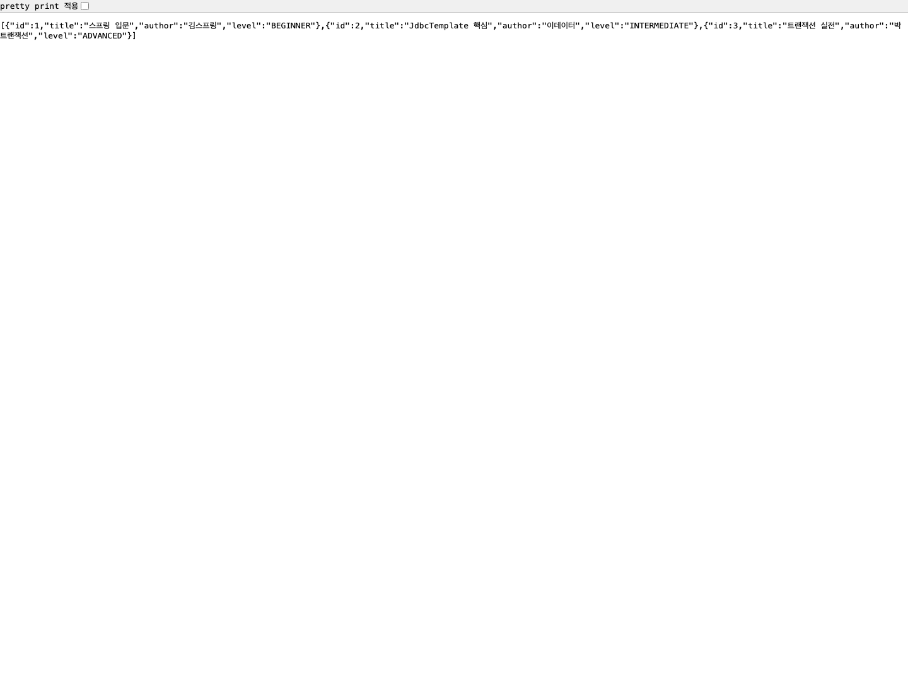

# 스프링 JdbcTemplate을 사용한 데이터베이스 조회

이 문서는 `mission-05-spring-db`의 `task-08-jdbctemplate-query` 구현 결과를 정리한 보고서입니다. `JdbcTemplate`로 H2 메모리 데이터베이스의 샘플 도서 데이터를 조회하고, 조회 결과를 HTTP 응답으로 반환하면서 동시에 콘솔에 출력하는 예제를 구현했습니다.

## 1. 작업 개요

- 미션/태스크: `mission-05-spring-db` / `task-08-jdbctemplate-query`
- 목표:
  - `JdbcTemplate`을 사용해 특정 테이블의 데이터를 조회한다.
  - 간단한 SQL 쿼리 결과를 콘솔에 출력한다.
  - 조회 코드, 콘솔 출력 결과, 크롬 기반 스크린샷을 제출 가능한 형태로 정리한다.
- 조회 대상:
  - 테이블명: `mission05_task08_books`
  - 조회 SQL: `select id, title, author, level from mission05_task08_books order by id asc`
- 실행 엔드포인트:
  - 기본 경로: `/mission05/task08/books`
  - 조회 경로: `GET /mission05/task08/books/console-query`
- 사용 기술: `Spring Boot`, `Spring JDBC`, `JdbcTemplate`, `H2 Database`, `MockMvc`, `OutputCaptureExtension`

## 2. 코드 파일 경로 인덱스

| 구분 | 파일 경로 | 역할 |
|---|---|---|
| Config | `build.gradle` | `spring-boot-starter-jdbc`와 H2 의존성으로 `JdbcTemplate` 실습 환경을 제공합니다. |
| Config | `src/main/resources/application.properties` | H2 메모리 DB, JPA 공통 설정, H2 콘솔 경로를 정의합니다. |
| Controller | `src/main/java/com/goorm/springmissionsplayground/mission05_spring_db/task08_jdbctemplate_query/controller/JdbcTemplateBookQueryController.java` | `JdbcTemplate` 조회를 호출하는 `GET /mission05/task08/books/console-query` 엔드포인트를 제공합니다. |
| Service | `src/main/java/com/goorm/springmissionsplayground/mission05_spring_db/task08_jdbctemplate_query/service/JdbcTemplateBookQueryService.java` | 저장소 조회 결과를 DTO로 바꾸고 콘솔에 보기 좋은 형식으로 출력합니다. |
| Repository | `src/main/java/com/goorm/springmissionsplayground/mission05_spring_db/task08_jdbctemplate_query/repository/JdbcTemplateBookRepository.java` | `JdbcTemplate`로 테이블 생성, 샘플 데이터 적재, 전체 조회를 처리합니다. |
| Domain | `src/main/java/com/goorm/springmissionsplayground/mission05_spring_db/task08_jdbctemplate_query/domain/JdbcTemplateBook.java` | 조회 결과 한 행을 표현하는 도메인 레코드입니다. |
| DTO | `src/main/java/com/goorm/springmissionsplayground/mission05_spring_db/task08_jdbctemplate_query/dto/JdbcTemplateBookResponse.java` | 응답 JSON으로 내려줄 도서 정보를 표현합니다. |
| Test | `src/test/java/com/goorm/springmissionsplayground/mission05_spring_db/task08_jdbctemplate_query/JdbcTemplateBookQueryControllerTest.java` | 응답 데이터와 콘솔 출력 문자열을 함께 검증합니다. |
| Artifact | `docs/mission-05-spring-db/task-08-jdbctemplate-query/task08-gradle-test-output.txt` | `task08` 테스트 실행 로그를 저장한 파일입니다. |
| Artifact | `docs/mission-05-spring-db/task-08-jdbctemplate-query/screenshots/console-query-response.txt` | 실제 엔드포인트 호출 응답 원문입니다. |
| Artifact | `docs/mission-05-spring-db/task-08-jdbctemplate-query/screenshots/console-output.txt` | 실제 콘솔 출력 내용을 정리한 텍스트 파일입니다. |
| Artifact | `docs/mission-05-spring-db/task-08-jdbctemplate-query/screenshots/console-query-response-chrome.png` | 실제 `task08` URL을 Google Chrome으로 직접 열어 캡처한 응답 스크린샷입니다. |

## 3. 구현 단계와 주요 코드 해설

1. `JdbcTemplateBookRepository`에서 `mission05_task08_books` 테이블을 생성하고, `@PostConstruct` 시점에 세 권의 샘플 도서를 미리 넣도록 구성했습니다. 덕분에 앱 실행 직후 바로 조회를 실습할 수 있습니다.
2. 조회 SQL은 `select id, title, author, level from mission05_task08_books order by id asc` 한 줄입니다. `JdbcTemplate.query(...)`에 `RowMapper` 람다를 넘겨 각 행을 `JdbcTemplateBook`으로 변환합니다.
3. `JdbcTemplateBookQueryService`는 저장소에서 받은 결과를 `JdbcTemplateBookResponse`로 변환한 뒤, 콘솔에 시작/종료 배너와 각 행 데이터를 순서대로 출력합니다.
4. `JdbcTemplateBookQueryController`는 `GET /mission05/task08/books/console-query` 요청을 받으면 서비스 메서드를 호출합니다. 응답은 JSON 목록이고, 같은 시점에 서버 콘솔에는 같은 데이터가 문자열로 남습니다.
5. 테스트는 `MockMvc`로 API 응답을 검증하고, `OutputCaptureExtension`으로 콘솔 출력을 함께 잡아서 `"id=1, title=..."` 같은 실제 로그 문자열이 나왔는지도 확인합니다.

### 조회 흐름 요약

1. 브라우저 또는 `curl`이 `GET /mission05/task08/books/console-query`를 호출합니다.
2. 컨트롤러가 서비스의 `queryBooksAndPrintToConsole()`를 호출합니다.
3. 서비스가 저장소의 `findAll()`을 호출합니다.
4. 저장소가 `JdbcTemplate.query()`로 `mission05_task08_books`를 조회하고 각 행을 `JdbcTemplateBook`으로 매핑합니다.
5. 서비스가 결과를 DTO로 바꾼 뒤 콘솔에 출력하고, 컨트롤러는 이를 JSON 응답으로 반환합니다.

## 4. 파일별 상세 설명 + 전체 코드

### 4.1 `build.gradle`

- 파일 경로: `build.gradle`
- 역할: `JdbcTemplate` 실습 의존성 제공
- 상세 설명:
- `spring-boot-starter-jdbc`가 포함되어 있어 `JdbcTemplate`, `DataSource`를 바로 사용할 수 있습니다.
- `runtimeOnly 'com.h2database:h2'` 설정으로 별도 외부 DB 없이 인메모리 H2에서 예제를 재현할 수 있습니다.
- 이번 태스크는 기존 의존성을 그대로 활용해 새 코드를 추가하는 방식으로 구성했습니다.

<details>
<summary><code>build.gradle</code> 전체 코드</summary>

```groovy
plugins {
	id 'java'
	id 'org.springframework.boot' version '4.0.2'
	id 'io.spring.dependency-management' version '1.1.7'
}

group = 'com.goorm'
version = '0.0.1-SNAPSHOT'
description = 'Demo project for Spring Boot'

java {
	toolchain {
		languageVersion = JavaLanguageVersion.of(25)
	}
}

repositories {
	mavenCentral()
}

dependencies {
	implementation 'org.springframework.boot:spring-boot-starter-web'
	implementation 'org.springframework.boot:spring-boot-starter-thymeleaf'
	implementation 'org.springframework.boot:spring-boot-starter-validation'
	implementation 'org.springframework.boot:spring-boot-starter'
	implementation 'org.springframework.boot:spring-boot-starter-aspectj'
	implementation 'org.springframework.boot:spring-boot-starter-jdbc'
	implementation 'org.springframework.boot:spring-boot-starter-data-jpa'
	implementation 'org.mybatis.spring.boot:mybatis-spring-boot-starter:4.0.1'
	implementation 'jakarta.inject:jakarta.inject-api:2.0.1'
	runtimeOnly 'com.h2database:h2'
	testImplementation 'org.springframework.boot:spring-boot-starter-test'
	testRuntimeOnly 'org.junit.platform:junit-platform-launcher'
}

tasks.named('test') {
	useJUnitPlatform()
}
```

</details>

### 4.2 `application.properties`

- 파일 경로: `src/main/resources/application.properties`
- 역할: H2 메모리 DB 실행 환경 제공
- 상세 설명:
- `jdbc:h2:mem:mission01` 설정으로 애플리케이션 실행 중 메모리 DB를 유지합니다.
- `task08`의 `JdbcTemplate` 저장소도 같은 `DataSource`를 사용해 별도 설정 없이 동작합니다.
- `/h2-console` 경로가 열려 있어 테이블 상태를 수동 확인할 수도 있습니다.

<details>
<summary><code>application.properties</code> 전체 코드</summary>

```properties
spring.application.name=core

# Mission04 Task02: Thymeleaf View Resolver 설정
spring.thymeleaf.prefix=classpath:/templates/
spring.thymeleaf.suffix=.html
spring.thymeleaf.mode=HTML
spring.thymeleaf.encoding=UTF-8
spring.thymeleaf.cache=false

# H2 in-memory DB 설정 (테스트/학습용)
spring.datasource.url=jdbc:h2:mem:mission01;DB_CLOSE_DELAY=-1;DB_CLOSE_ON_EXIT=FALSE
spring.datasource.driverClassName=org.h2.Driver
spring.datasource.username=sa
spring.datasource.password=

# JPA 설정
spring.jpa.hibernate.ddl-auto=create-drop
spring.jpa.show-sql=true
spring.jpa.properties.hibernate.format_sql=true

# H2 콘솔 (개발 편의를 위해 활성화)
spring.h2.console.enabled=true
spring.h2.console.path=/h2-console
```

</details>

### 4.3 `JdbcTemplateBookQueryController.java`

- 파일 경로: `src/main/java/com/goorm/springmissionsplayground/mission05_spring_db/task08_jdbctemplate_query/controller/JdbcTemplateBookQueryController.java`
- 역할: `JdbcTemplate` 조회 API 진입점
- 상세 설명:
- 기본 경로는 `/mission05/task08/books`입니다.
- `GET /console-query`는 서비스의 조회 메서드를 호출하고 JSON 배열을 반환합니다.
- 별도 요청 파라미터 없이 항상 샘플 테이블 전체를 조회하는 가장 단순한 예제로 구성했습니다.

<details>
<summary><code>JdbcTemplateBookQueryController.java</code> 전체 코드</summary>

```java
package com.goorm.springmissionsplayground.mission05_spring_db.task08_jdbctemplate_query.controller;

import com.goorm.springmissionsplayground.mission05_spring_db.task08_jdbctemplate_query.dto.JdbcTemplateBookResponse;
import com.goorm.springmissionsplayground.mission05_spring_db.task08_jdbctemplate_query.service.JdbcTemplateBookQueryService;
import java.util.List;
import org.springframework.web.bind.annotation.GetMapping;
import org.springframework.web.bind.annotation.RequestMapping;
import org.springframework.web.bind.annotation.RestController;

@RestController
@RequestMapping("/mission05/task08/books")
public class JdbcTemplateBookQueryController {

    private final JdbcTemplateBookQueryService jdbcTemplateBookQueryService;

    public JdbcTemplateBookQueryController(JdbcTemplateBookQueryService jdbcTemplateBookQueryService) {
        this.jdbcTemplateBookQueryService = jdbcTemplateBookQueryService;
    }

    @GetMapping("/console-query")
    public List<JdbcTemplateBookResponse> queryAndPrintToConsole() {
        return jdbcTemplateBookQueryService.queryBooksAndPrintToConsole();
    }
}
```

</details>

### 4.4 `JdbcTemplateBookQueryService.java`

- 파일 경로: `src/main/java/com/goorm/springmissionsplayground/mission05_spring_db/task08_jdbctemplate_query/service/JdbcTemplateBookQueryService.java`
- 역할: 조회 결과 DTO 변환과 콘솔 출력
- 상세 설명:
- 핵심 공개 메서드는 `queryBooksAndPrintToConsole()`입니다.
- 저장소 조회 결과를 `JdbcTemplateBookResponse`로 변환한 뒤, 배너와 각 행 데이터를 `System.out.println`으로 출력합니다.
- 테스트용 `resetSampleData()`도 제공해 매번 같은 예제 데이터를 보장합니다.

<details>
<summary><code>JdbcTemplateBookQueryService.java</code> 전체 코드</summary>

```java
package com.goorm.springmissionsplayground.mission05_spring_db.task08_jdbctemplate_query.service;

import com.goorm.springmissionsplayground.mission05_spring_db.task08_jdbctemplate_query.dto.JdbcTemplateBookResponse;
import com.goorm.springmissionsplayground.mission05_spring_db.task08_jdbctemplate_query.repository.JdbcTemplateBookRepository;
import java.util.List;
import org.springframework.stereotype.Service;

@Service
public class JdbcTemplateBookQueryService {

    private final JdbcTemplateBookRepository jdbcTemplateBookRepository;

    public JdbcTemplateBookQueryService(JdbcTemplateBookRepository jdbcTemplateBookRepository) {
        this.jdbcTemplateBookRepository = jdbcTemplateBookRepository;
    }

    public List<JdbcTemplateBookResponse> queryBooksAndPrintToConsole() {
        List<JdbcTemplateBookResponse> responses = jdbcTemplateBookRepository.findAll()
                .stream()
                .map(JdbcTemplateBookResponse::from)
                .toList();

        System.out.println("=== mission05 task08 JdbcTemplate 조회 결과 시작 ===");
        for (JdbcTemplateBookResponse response : responses) {
            System.out.println("id=%d, title=%s, author=%s, level=%s".formatted(
                    response.id(),
                    response.title(),
                    response.author(),
                    response.level()
            ));
        }
        System.out.println("=== mission05 task08 JdbcTemplate 조회 결과 끝 ===");

        return responses;
    }

    public void resetSampleData() {
        jdbcTemplateBookRepository.resetSampleData();
    }
}
```

</details>

### 4.5 `JdbcTemplateBookRepository.java`

- 파일 경로: `src/main/java/com/goorm/springmissionsplayground/mission05_spring_db/task08_jdbctemplate_query/repository/JdbcTemplateBookRepository.java`
- 역할: `JdbcTemplate` 기반 테이블 관리와 조회
- 상세 설명:
- `@PostConstruct`에서 `mission05_task08_books` 테이블을 만들고 샘플 데이터를 초기화합니다.
- `findAll()`은 `JdbcTemplate.query()`와 `RowMapper` 람다를 사용해 전체 도서 목록을 ID 순으로 조회합니다.
- `resetSampleData()`는 `truncate table ... restart identity`로 항상 같은 예제 결과를 유지합니다.

<details>
<summary><code>JdbcTemplateBookRepository.java</code> 전체 코드</summary>

```java
package com.goorm.springmissionsplayground.mission05_spring_db.task08_jdbctemplate_query.repository;

import com.goorm.springmissionsplayground.mission05_spring_db.task08_jdbctemplate_query.domain.JdbcTemplateBook;
import jakarta.annotation.PostConstruct;
import java.util.List;
import org.springframework.jdbc.core.JdbcTemplate;
import org.springframework.jdbc.core.RowMapper;
import org.springframework.stereotype.Repository;

@Repository
public class JdbcTemplateBookRepository {

    private static final String TABLE_NAME = "mission05_task08_books";
    private static final RowMapper<JdbcTemplateBook> BOOK_ROW_MAPPER = (resultSet, rowNum) -> new JdbcTemplateBook(
            resultSet.getLong("id"),
            resultSet.getString("title"),
            resultSet.getString("author"),
            resultSet.getString("level")
    );

    private final JdbcTemplate jdbcTemplate;

    public JdbcTemplateBookRepository(JdbcTemplate jdbcTemplate) {
        this.jdbcTemplate = jdbcTemplate;
    }

    @PostConstruct
    void initializeTableAndSampleData() {
        jdbcTemplate.execute("""
                create table if not exists mission05_task08_books (
                    id bigint generated by default as identity primary key,
                    title varchar(100) not null,
                    author varchar(50) not null,
                    level varchar(30) not null
                )
                """);
        resetSampleData();
    }

    public List<JdbcTemplateBook> findAll() {
        return jdbcTemplate.query(
                """
                select id, title, author, level
                from mission05_task08_books
                order by id asc
                """,
                BOOK_ROW_MAPPER
        );
    }

    public void resetSampleData() {
        jdbcTemplate.execute("truncate table " + TABLE_NAME + " restart identity");
        jdbcTemplate.batchUpdate(
                "insert into " + TABLE_NAME + " (title, author, level) values (?, ?, ?)",
                List.of(
                        new Object[]{"스프링 입문", "김스프링", "BEGINNER"},
                        new Object[]{"JdbcTemplate 핵심", "이데이터", "INTERMEDIATE"},
                        new Object[]{"트랜잭션 실전", "박트랜잭션", "ADVANCED"}
                )
        );
    }
}
```

</details>

### 4.6 `JdbcTemplateBook.java`

- 파일 경로: `src/main/java/com/goorm/springmissionsplayground/mission05_spring_db/task08_jdbctemplate_query/domain/JdbcTemplateBook.java`
- 역할: 조회 결과 한 행 표현
- 상세 설명:
- `id`, `title`, `author`, `level` 네 값을 가지는 간단한 레코드입니다.
- 저장소의 `RowMapper`가 `ResultSet`의 각 행을 이 객체로 변환합니다.
- 데이터베이스 구조를 서비스와 컨트롤러 쪽으로 자연스럽게 전달하는 중간 표현 역할입니다.

<details>
<summary><code>JdbcTemplateBook.java</code> 전체 코드</summary>

```java
package com.goorm.springmissionsplayground.mission05_spring_db.task08_jdbctemplate_query.domain;

public record JdbcTemplateBook(Long id, String title, String author, String level) {
}
```

</details>

### 4.7 `JdbcTemplateBookResponse.java`

- 파일 경로: `src/main/java/com/goorm/springmissionsplayground/mission05_spring_db/task08_jdbctemplate_query/dto/JdbcTemplateBookResponse.java`
- 역할: 응답 JSON 표현
- 상세 설명:
- 도메인 객체를 API 응답용 데이터 구조로 분리했습니다.
- `from()` 정적 팩토리 메서드로 `JdbcTemplateBook`을 `JdbcTemplateBookResponse`로 변환합니다.
- 이번 예제에서는 도메인과 필드가 같지만, 계층 역할을 분리해 이후 확장에 대비했습니다.

<details>
<summary><code>JdbcTemplateBookResponse.java</code> 전체 코드</summary>

```java
package com.goorm.springmissionsplayground.mission05_spring_db.task08_jdbctemplate_query.dto;

import com.goorm.springmissionsplayground.mission05_spring_db.task08_jdbctemplate_query.domain.JdbcTemplateBook;

public record JdbcTemplateBookResponse(Long id, String title, String author, String level) {

    public static JdbcTemplateBookResponse from(JdbcTemplateBook book) {
        return new JdbcTemplateBookResponse(
                book.id(),
                book.title(),
                book.author(),
                book.level()
        );
    }
}
```

</details>

### 4.8 `JdbcTemplateBookQueryControllerTest.java`

- 파일 경로: `src/test/java/com/goorm/springmissionsplayground/mission05_spring_db/task08_jdbctemplate_query/JdbcTemplateBookQueryControllerTest.java`
- 역할: 응답 데이터와 콘솔 출력 동시 검증
- 상세 설명:
- `queryBooksAndPrintToConsole()` 테스트가 `GET /mission05/task08/books/console-query`의 정상 흐름을 검증합니다.
- 응답 JSON 개수와 필드값뿐 아니라, `CapturedOutput`으로 실제 콘솔 배너와 출력 행 문자열까지 확인합니다.
- `@BeforeEach`에서 샘플 데이터를 다시 초기화해 매번 같은 결과가 나오도록 고정했습니다.

<details>
<summary><code>JdbcTemplateBookQueryControllerTest.java</code> 전체 코드</summary>

```java
package com.goorm.springmissionsplayground.mission05_spring_db.task08_jdbctemplate_query;

import com.goorm.springmissionsplayground.mission05_spring_db.task08_jdbctemplate_query.service.JdbcTemplateBookQueryService;
import org.junit.jupiter.api.BeforeEach;
import org.junit.jupiter.api.DisplayName;
import org.junit.jupiter.api.Test;
import org.junit.jupiter.api.extension.ExtendWith;
import org.springframework.beans.factory.annotation.Autowired;
import org.springframework.boot.test.context.SpringBootTest;
import org.springframework.boot.test.system.CapturedOutput;
import org.springframework.boot.test.system.OutputCaptureExtension;
import org.springframework.test.web.servlet.MockMvc;
import org.springframework.test.web.servlet.setup.MockMvcBuilders;
import org.springframework.web.context.WebApplicationContext;

import static org.hamcrest.Matchers.hasSize;
import static org.hamcrest.Matchers.startsWith;
import static org.assertj.core.api.Assertions.assertThat;
import static org.springframework.test.web.servlet.request.MockMvcRequestBuilders.get;
import static org.springframework.test.web.servlet.result.MockMvcResultMatchers.jsonPath;
import static org.springframework.test.web.servlet.result.MockMvcResultMatchers.status;

@ExtendWith(OutputCaptureExtension.class)
@SpringBootTest
class JdbcTemplateBookQueryControllerTest {

    @Autowired
    private WebApplicationContext context;

    @Autowired
    private JdbcTemplateBookQueryService jdbcTemplateBookQueryService;

    private MockMvc mockMvc;

    @BeforeEach
    void setUp() {
        jdbcTemplateBookQueryService.resetSampleData();
        mockMvc = MockMvcBuilders.webAppContextSetup(context).build();
    }

    @Test
    @DisplayName("JdbcTemplate으로 조회한 데이터를 응답으로 반환하고 콘솔에도 출력한다")
    void queryBooksAndPrintToConsole(CapturedOutput output) throws Exception {
        mockMvc.perform(get("/mission05/task08/books/console-query"))
                .andExpect(status().isOk())
                .andExpect(jsonPath("$", hasSize(3)))
                .andExpect(jsonPath("$[0].title").value("스프링 입문"))
                .andExpect(jsonPath("$[1].author").value("이데이터"))
                .andExpect(jsonPath("$[2].level").value("ADVANCED"))
                .andExpect(jsonPath("$[0].level", startsWith("BEGIN")));

        assertThat(output).contains("=== mission05 task08 JdbcTemplate 조회 결과 시작 ===");
        assertThat(output).contains("id=1, title=스프링 입문, author=김스프링, level=BEGINNER");
        assertThat(output).contains("id=3, title=트랜잭션 실전, author=박트랜잭션, level=ADVANCED");
        assertThat(output).contains("=== mission05 task08 JdbcTemplate 조회 결과 끝 ===");
    }
}
```

</details>

## 5. 새로 나온 개념 정리 + 참고 링크

### 5.1 `JdbcTemplate`

- 핵심:
  - `JdbcTemplate`은 JDBC 연결 획득, `Statement` 실행, 예외 변환 같은 반복 작업을 줄여 주는 스프링의 핵심 JDBC 도우미입니다.
  - SQL은 직접 작성하되, 연결 관리와 예외 처리 보일러플레이트를 많이 덜 수 있습니다.
- 왜 쓰는가:
  - 순수 JDBC보다 코드가 짧고 읽기 쉬우며, 트랜잭션 환경에도 자연스럽게 참여합니다.
  - 이번 태스크처럼 “간단한 SQL 조회 결과를 바로 확인하는 예제”에 특히 잘 맞습니다.
- 참고 링크:
  - Spring `JdbcTemplate` javadoc: https://docs.spring.io/spring-framework/docs/current/javadoc-api/org/springframework/jdbc/core/JdbcTemplate.html

### 5.2 `RowMapper`

- 핵심:
  - `RowMapper`는 `ResultSet`의 한 행을 원하는 객체로 바꾸는 함수형 인터페이스입니다.
  - `JdbcTemplate.query()`와 함께 쓰면 각 행을 리스트 형태의 도메인 객체로 쉽게 변환할 수 있습니다.
- 왜 쓰는가:
  - SQL 결과를 `Map`으로 다루는 것보다 타입이 분명하고, 서비스/컨트롤러 코드가 더 읽기 쉬워집니다.
  - 이번 태스크에서는 `JdbcTemplateBook` 레코드로 변환해 응답과 콘솔 출력에 재사용했습니다.
- 참고 링크:
  - Spring `RowMapper` javadoc: https://docs.spring.io/spring-framework/docs/current/javadoc-api/org/springframework/jdbc/core/RowMapper.html

### 5.3 `OutputCaptureExtension`

- 핵심:
  - `OutputCaptureExtension`은 테스트 중 발생한 `System.out`, `System.err`, 로그 출력을 캡처해 검증할 수 있게 해 줍니다.
  - API 응답만이 아니라 콘솔 출력까지 테스트 대상으로 삼을 수 있습니다.
- 왜 쓰는가:
  - 이번 태스크의 결과물에는 콘솔 출력이 핵심이므로, “정말 콘솔에 원하는 형식이 찍혔는지”를 자동으로 확인하는 것이 중요했습니다.
  - 수동 확인만 하면 놓치기 쉬운 출력 형식 회귀를 테스트로 막을 수 있습니다.
- 참고 링크:
  - Spring Boot Testing reference: https://docs.spring.io/spring-boot/reference/testing/index.html

## 6. 실행·검증 방법

```bash
./gradlew bootRun
```

- 애플리케이션 실행 후 브라우저 또는 `curl`로 다음 경로를 호출합니다.

```bash
curl -s -i http://localhost:8080/mission05/task08/books/console-query
```

- 기대 결과:
  - HTTP 응답은 도서 3건의 JSON 배열입니다.
  - 서버 콘솔에는 각 도서 정보가 줄 단위로 출력됩니다.

```bash
./gradlew test --tests com.goorm.springmissionsplayground.mission05_spring_db.task08_jdbctemplate_query.JdbcTemplateBookQueryControllerTest
```

- 테스트 검증 포인트:
  - 응답 배열 크기가 3인지
  - 첫 번째 책 제목과 마지막 책 난이도가 예상값인지
  - 콘솔에 시작/종료 배너와 실제 행 문자열이 출력됐는지

## 7. 결과 확인 방법(스크린샷 포함)

- 성공 기준:
  - `GET /mission05/task08/books/console-query` 호출 시 `200 OK`와 도서 목록 JSON이 반환되어야 합니다.
  - 서버 콘솔에는 아래와 같은 형식의 출력이 남아야 합니다.

```text
=== mission05 task08 JdbcTemplate 조회 결과 시작 ===
id=1, title=스프링 입문, author=김스프링, level=BEGINNER
id=2, title=JdbcTemplate 핵심, author=이데이터, level=INTERMEDIATE
id=3, title=트랜잭션 실전, author=박트랜잭션, level=ADVANCED
=== mission05 task08 JdbcTemplate 조회 결과 끝 ===
```

- 아티팩트 파일:
  - 테스트 로그: `docs/mission-05-spring-db/task-08-jdbctemplate-query/task08-gradle-test-output.txt`
  - 응답 원문: `docs/mission-05-spring-db/task-08-jdbctemplate-query/screenshots/console-query-response.txt`
  - 콘솔 출력 텍스트: `docs/mission-05-spring-db/task-08-jdbctemplate-query/screenshots/console-output.txt`
  - 크롬 스크린샷 PNG: `docs/mission-05-spring-db/task-08-jdbctemplate-query/screenshots/console-query-response-chrome.png`
- 스크린샷 확인:
  - 아래 이미지는 `Google Chrome`으로 실제 URL `http://localhost:8080/mission05/task08/books/console-query`를 직접 열고 캡처한 결과입니다.



## 8. 학습 내용

- `JdbcTemplate`은 SQL을 직접 다루면서도 순수 JDBC의 반복 코드를 크게 줄여 줍니다. 조회 쿼리를 그대로 눈에 보이게 유지할 수 있어 학습용 예제나 단순 조회 기능에서 특히 이해가 쉽습니다.
- `RowMapper`를 함께 사용하면 DB 행을 곧바로 도메인 객체로 바꿀 수 있어서, 서비스 계층은 “조회 결과를 어떻게 쓸지”에만 집중할 수 있습니다.
- 이번 태스크에서는 “HTTP 응답”과 “콘솔 출력”을 동시에 남겼습니다. 같은 데이터를 두 경로로 확인하면, 조회 자체가 성공했는지와 콘솔 포맷이 올바른지를 분리해서 검증할 수 있습니다.
- 콘솔 출력도 테스트 대상으로 삼을 수 있다는 점이 중요했습니다. 기능이 단순해 보여도 출력 형식이 결과물 요구사항에 포함되면, 그 형식 자체를 테스트로 고정하는 편이 안전합니다.
