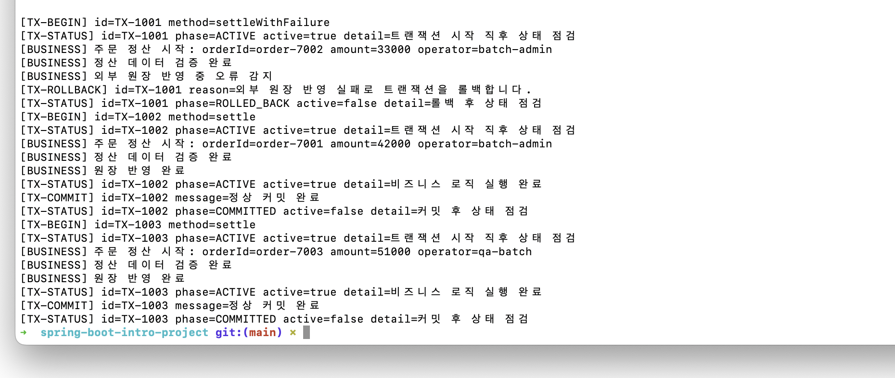

# 스프링 핵심 원리 - 고급: 동적 프록시를 이용한 트랜잭션 관리 시스템 구현

이 문서는 `mission-06-spring-core-advanced`의 `task-02-dynamic-transaction`을 기준으로 정리한 보고서입니다.
JDK 동적 프록시를 사용해 서비스 메서드 호출 전후에 트랜잭션 시작, 상태 점검, 커밋, 롤백을 처리하고, 그 결과를 API 응답과 콘솔 로그로 함께 확인할 수 있게 구현했습니다.

## 1. 작업 개요

- 미션/태스크: `mission-06-spring-core-advanced` / `task-02-dynamic-transaction`
- 목표:
  - `java.lang.reflect.Proxy` 기반 JDK 동적 프록시로 트랜잭션 관리 로직을 구현한다.
  - 메서드 실행 전후에 트랜잭션 시작, 상태 점검, 커밋/롤백 로그를 출력한다.
  - 마지막 트랜잭션 상태를 별도 조회할 수 있게 만들어 상태 검사 기능도 함께 제공한다.
- 엔드포인트:
  - `POST /mission06/task02/dynamic-transaction/settlements/{orderId}`
  - `POST /mission06/task02/dynamic-transaction/settlements/{orderId}/fail`
  - `GET /mission06/task02/dynamic-transaction/transactions/last-status`

설계한 시스템 정의:

- 서비스 인터페이스: `OrderSettlementService`
- 실제 서비스(Target): `OrderSettlementServiceImpl`
- 동적 프록시 생성 지점: `Task02DynamicTransactionConfig`
- 호출 가로채기(InvocationHandler): `TransactionInvocationHandler`
- 트랜잭션 관리자: `ConsoleTransactionManager`
- 마지막 상태 저장소: `TransactionAuditStore`
- 상태 모델:
  - `ACTIVE`
  - `COMMITTED`
  - `ROLLED_BACK`

핵심 동작 규칙:

1. 프록시가 메서드 호출을 가로챕니다.
2. `ConsoleTransactionManager.begin()`으로 트랜잭션을 시작합니다.
3. 대상 서비스 실행 전후에 상태를 점검합니다.
4. 정상 종료면 `commit()`, 예외 발생이면 `rollback()`을 수행합니다.
5. 마지막 실행 상태는 `TransactionAuditStore`에 저장해 API에서 다시 조회할 수 있게 합니다.

## 2. 코드 파일 경로 인덱스

| 구분 | 파일 경로 | 역할 |
|---|---|---|
| Config | `src/main/java/com/goorm/springmissionsplayground/mission06_spring_core_advanced/task02_dynamic_transaction/config/Task02DynamicTransactionConfig.java` | 실제 서비스와 동적 프록시 빈을 생성 |
| Controller | `src/main/java/com/goorm/springmissionsplayground/mission06_spring_core_advanced/task02_dynamic_transaction/controller/DynamicTransactionController.java` | 정산 API와 마지막 트랜잭션 상태 조회 API 제공 |
| Controller | `src/main/java/com/goorm/springmissionsplayground/mission06_spring_core_advanced/task02_dynamic_transaction/controller/DynamicTransactionExceptionHandler.java` | 롤백 예외를 JSON 응답으로 변환 |
| DTO | `src/main/java/com/goorm/springmissionsplayground/mission06_spring_core_advanced/task02_dynamic_transaction/dto/SettlementResponse.java` | 정상 정산 응답과 트랜잭션 상태를 함께 반환 |
| DTO | `src/main/java/com/goorm/springmissionsplayground/mission06_spring_core_advanced/task02_dynamic_transaction/dto/TransactionErrorResponse.java` | 실패 응답과 롤백 상태를 함께 반환 |
| DTO | `src/main/java/com/goorm/springmissionsplayground/mission06_spring_core_advanced/task02_dynamic_transaction/dto/TransactionSnapshotResponse.java` | 마지막 트랜잭션 상태를 API 응답 형태로 변환 |
| Exception | `src/main/java/com/goorm/springmissionsplayground/mission06_spring_core_advanced/task02_dynamic_transaction/exception/SettlementFailureException.java` | 정산 실패를 표현하는 런타임 예외 |
| Service | `src/main/java/com/goorm/springmissionsplayground/mission06_spring_core_advanced/task02_dynamic_transaction/service/OrderSettlementService.java` | 프록시와 대상 서비스가 공유하는 인터페이스 |
| Service | `src/main/java/com/goorm/springmissionsplayground/mission06_spring_core_advanced/task02_dynamic_transaction/service/OrderSettlementServiceImpl.java` | 실제 정산 비즈니스 로직 수행 |
| Service | `src/main/java/com/goorm/springmissionsplayground/mission06_spring_core_advanced/task02_dynamic_transaction/service/SettlementResult.java` | 대상 서비스의 비즈니스 처리 결과 |
| Transaction | `src/main/java/com/goorm/springmissionsplayground/mission06_spring_core_advanced/task02_dynamic_transaction/transaction/TransactionInvocationHandler.java` | 동적 프록시에서 트랜잭션 흐름을 제어 |
| Transaction | `src/main/java/com/goorm/springmissionsplayground/mission06_spring_core_advanced/task02_dynamic_transaction/transaction/ConsoleTransactionManager.java` | begin/inspect/commit/rollback 로그와 상태 저장 담당 |
| Transaction | `src/main/java/com/goorm/springmissionsplayground/mission06_spring_core_advanced/task02_dynamic_transaction/transaction/TransactionAuditStore.java` | 마지막 트랜잭션 스냅샷 저장 |
| Transaction | `src/main/java/com/goorm/springmissionsplayground/mission06_spring_core_advanced/task02_dynamic_transaction/transaction/TransactionExecutionTrace.java` | 트랜잭션 상태, 상세 메시지, 이벤트 목록을 담는 모델 |
| Transaction | `src/main/java/com/goorm/springmissionsplayground/mission06_spring_core_advanced/task02_dynamic_transaction/transaction/TransactionPhase.java` | 트랜잭션 단계 enum |
| Test | `src/test/java/com/goorm/springmissionsplayground/mission06_spring_core_advanced/task02_dynamic_transaction/DynamicTransactionControllerTest.java` | 프록시 생성 여부, 커밋/롤백, 콘솔 로그를 검증 |

## 3. 구현 단계와 주요 코드 해설

1. `OrderSettlementService` 인터페이스를 기준으로 정산 메서드 두 개를 정의했습니다.
   - `settle()`은 정상 커밋 경로입니다.
   - `settleWithFailure()`는 강제로 예외를 발생시켜 롤백 경로를 보여줍니다.

2. `Task02DynamicTransactionConfig`에서 실제 서비스와 프록시를 직접 빈으로 생성했습니다.
   - `orderSettlementTarget()`은 실제 구현체를 반환합니다.
   - `orderSettlementService()`는 `Proxy.newProxyInstance()`로 JDK 동적 프록시를 생성합니다.
   - 컨트롤러의 생성자 파라미터 이름이 `orderSettlementService`라 프록시 빈이 주입됩니다.

3. `TransactionInvocationHandler`가 모든 인터페이스 메서드 호출을 가로챕니다.
   - `Object` 기본 메서드는 그대로 대상 객체에 위임합니다.
   - 비즈니스 메서드는 `begin -> invoke -> inspect -> commit` 순서로 처리합니다.
   - `InvocationTargetException`이 발생하면 실제 원인 예외를 꺼내 `rollback()` 후 다시 던집니다.

4. `ConsoleTransactionManager`는 콘솔 로그와 마지막 상태 저장을 담당합니다.
   - `begin()`에서 고유한 `TX-1001` 같은 ID를 생성합니다.
   - `inspect()`는 현재 단계와 활성 상태를 점검하고 `TransactionAuditStore`에 저장합니다.
   - `commit()`과 `rollback()`은 각각 최종 상태를 `COMMITTED`, `ROLLED_BACK`으로 기록합니다.

5. `DynamicTransactionController`는 비즈니스 결과와 트랜잭션 상태를 묶어 응답합니다.
   - 정상 응답은 `SettlementResponse`
   - 예외 응답은 `DynamicTransactionExceptionHandler`를 통해 `TransactionErrorResponse`
   - `GET /transactions/last-status`는 가장 최근 트랜잭션 스냅샷을 다시 확인하는 용도입니다.

요청 흐름 요약:

1. 컨트롤러가 `OrderSettlementService` 인터페이스를 호출합니다.
2. 실제 주입된 객체는 JDK 동적 프록시입니다.
3. `TransactionInvocationHandler`가 호출을 가로채 `ConsoleTransactionManager.begin()`을 실행합니다.
4. 대상 서비스 `OrderSettlementServiceImpl`가 정산 비즈니스 로직을 수행합니다.
5. 성공이면 커밋, 실패면 롤백을 기록합니다.
6. 최종 상태는 `TransactionAuditStore`에 저장되고, 컨트롤러 응답과 상태 조회 API에서 재사용됩니다.

## 4. 파일별 상세 설명 + 전체 코드

### 4.1 `Task02DynamicTransactionConfig.java`

- 파일 경로: `src/main/java/com/goorm/springmissionsplayground/mission06_spring_core_advanced/task02_dynamic_transaction/config/Task02DynamicTransactionConfig.java`
- 역할: 실제 서비스와 동적 프록시 빈을 생성
- 상세 설명:
- `Proxy.newProxyInstance()`로 `OrderSettlementService` 인터페이스용 JDK 프록시를 생성합니다.
- 실제 구현체와 `ConsoleTransactionManager`를 `TransactionInvocationHandler`에 연결합니다.
- 스프링 AOP 없이도 프록시 객체를 빈으로 등록해 컨트롤러가 그대로 사용할 수 있게 했습니다.

<details>
<summary><code>Task02DynamicTransactionConfig.java</code> 전체 코드</summary>

```java
package com.goorm.springmissionsplayground.mission06_spring_core_advanced.task02_dynamic_transaction.config;

import com.goorm.springmissionsplayground.mission06_spring_core_advanced.task02_dynamic_transaction.service.OrderSettlementService;
import com.goorm.springmissionsplayground.mission06_spring_core_advanced.task02_dynamic_transaction.service.OrderSettlementServiceImpl;
import com.goorm.springmissionsplayground.mission06_spring_core_advanced.task02_dynamic_transaction.transaction.ConsoleTransactionManager;
import com.goorm.springmissionsplayground.mission06_spring_core_advanced.task02_dynamic_transaction.transaction.TransactionInvocationHandler;
import java.lang.reflect.Proxy;
import org.springframework.context.annotation.Bean;
import org.springframework.context.annotation.Configuration;

@Configuration
public class Task02DynamicTransactionConfig {

    @Bean
    public OrderSettlementService orderSettlementTarget() {
        return new OrderSettlementServiceImpl();
    }

    @Bean
    public OrderSettlementService orderSettlementService(
            OrderSettlementService orderSettlementTarget,
            ConsoleTransactionManager consoleTransactionManager
    ) {
        return (OrderSettlementService) Proxy.newProxyInstance(
                OrderSettlementService.class.getClassLoader(),
                new Class<?>[]{OrderSettlementService.class},
                new TransactionInvocationHandler(orderSettlementTarget, consoleTransactionManager)
        );
    }
}
```

</details>

### 4.2 `DynamicTransactionController.java`

- 파일 경로: `src/main/java/com/goorm/springmissionsplayground/mission06_spring_core_advanced/task02_dynamic_transaction/controller/DynamicTransactionController.java`
- 역할: 정산 API와 마지막 트랜잭션 상태 조회 API 제공
- 상세 설명:
- 기본 경로: `/mission06/task02/dynamic-transaction`
- 매핑 메서드:
  - `POST /settlements/{orderId}` -> 정상 정산
  - `POST /settlements/{orderId}/fail` -> 롤백 데모
  - `GET /transactions/last-status` -> 마지막 상태 조회
- 정상 흐름에서는 비즈니스 결과와 `ConsoleTransactionManager`의 마지막 상태를 함께 묶어 반환합니다.

<details>
<summary><code>DynamicTransactionController.java</code> 전체 코드</summary>

```java
package com.goorm.springmissionsplayground.mission06_spring_core_advanced.task02_dynamic_transaction.controller;

import com.goorm.springmissionsplayground.mission06_spring_core_advanced.task02_dynamic_transaction.dto.SettlementResponse;
import com.goorm.springmissionsplayground.mission06_spring_core_advanced.task02_dynamic_transaction.dto.TransactionSnapshotResponse;
import com.goorm.springmissionsplayground.mission06_spring_core_advanced.task02_dynamic_transaction.service.OrderSettlementService;
import com.goorm.springmissionsplayground.mission06_spring_core_advanced.task02_dynamic_transaction.service.SettlementResult;
import com.goorm.springmissionsplayground.mission06_spring_core_advanced.task02_dynamic_transaction.transaction.ConsoleTransactionManager;
import org.springframework.web.bind.annotation.GetMapping;
import org.springframework.web.bind.annotation.PathVariable;
import org.springframework.web.bind.annotation.PostMapping;
import org.springframework.web.bind.annotation.RequestMapping;
import org.springframework.web.bind.annotation.RequestParam;
import org.springframework.web.bind.annotation.RestController;

@RestController
@RequestMapping("/mission06/task02/dynamic-transaction")
public class DynamicTransactionController {

    private final OrderSettlementService orderSettlementService;
    private final ConsoleTransactionManager consoleTransactionManager;

    public DynamicTransactionController(
            OrderSettlementService orderSettlementService,
            ConsoleTransactionManager consoleTransactionManager
    ) {
        this.orderSettlementService = orderSettlementService;
        this.consoleTransactionManager = consoleTransactionManager;
    }

    @PostMapping("/settlements/{orderId}")
    public SettlementResponse settle(
            @PathVariable String orderId,
            @RequestParam(defaultValue = "15000") int amount,
            @RequestParam(defaultValue = "ops-team") String operator
    ) {
        SettlementResult result = orderSettlementService.settle(orderId, amount, operator);
        return toResponse(result);
    }

    @PostMapping("/settlements/{orderId}/fail")
    public SettlementResponse settleWithFailure(
            @PathVariable String orderId,
            @RequestParam(defaultValue = "15000") int amount,
            @RequestParam(defaultValue = "ops-team") String operator
    ) {
        SettlementResult result = orderSettlementService.settleWithFailure(orderId, amount, operator);
        return toResponse(result);
    }

    @GetMapping("/transactions/last-status")
    public TransactionSnapshotResponse lastStatus() {
        return TransactionSnapshotResponse.from(consoleTransactionManager.getLastTrace());
    }

    private SettlementResponse toResponse(SettlementResult result) {
        return new SettlementResponse(
                result.getOrderId(),
                result.getAmount(),
                result.getOperator(),
                result.getBusinessStatus(),
                result.getMessage(),
                TransactionSnapshotResponse.from(consoleTransactionManager.getLastTrace())
        );
    }
}
```

</details>

### 4.3 `DynamicTransactionExceptionHandler.java`

- 파일 경로: `src/main/java/com/goorm/springmissionsplayground/mission06_spring_core_advanced/task02_dynamic_transaction/controller/DynamicTransactionExceptionHandler.java`
- 역할: 롤백 예외를 JSON 응답으로 변환
- 상세 설명:
- `SettlementFailureException`이 발생하면 HTTP 500으로 응답합니다.
- 예외 메시지와 함께 마지막 트랜잭션 상태를 `TransactionSnapshotResponse`로 같이 내려줍니다.
- 롤백이 실제로 기록됐는지 응답 본문만 보고도 확인할 수 있게 했습니다.

<details>
<summary><code>DynamicTransactionExceptionHandler.java</code> 전체 코드</summary>

```java
package com.goorm.springmissionsplayground.mission06_spring_core_advanced.task02_dynamic_transaction.controller;

import com.goorm.springmissionsplayground.mission06_spring_core_advanced.task02_dynamic_transaction.dto.TransactionErrorResponse;
import com.goorm.springmissionsplayground.mission06_spring_core_advanced.task02_dynamic_transaction.dto.TransactionSnapshotResponse;
import com.goorm.springmissionsplayground.mission06_spring_core_advanced.task02_dynamic_transaction.exception.SettlementFailureException;
import com.goorm.springmissionsplayground.mission06_spring_core_advanced.task02_dynamic_transaction.transaction.ConsoleTransactionManager;
import jakarta.servlet.http.HttpServletRequest;
import org.springframework.http.HttpStatus;
import org.springframework.web.bind.annotation.ExceptionHandler;
import org.springframework.web.bind.annotation.ResponseStatus;
import org.springframework.web.bind.annotation.RestControllerAdvice;

@RestControllerAdvice(assignableTypes = DynamicTransactionController.class)
public class DynamicTransactionExceptionHandler {

    private final ConsoleTransactionManager consoleTransactionManager;

    public DynamicTransactionExceptionHandler(ConsoleTransactionManager consoleTransactionManager) {
        this.consoleTransactionManager = consoleTransactionManager;
    }

    @ResponseStatus(HttpStatus.INTERNAL_SERVER_ERROR)
    @ExceptionHandler(SettlementFailureException.class)
    public TransactionErrorResponse handleSettlementFailure(
            SettlementFailureException exception,
            HttpServletRequest request
    ) {
        return new TransactionErrorResponse(
                HttpStatus.INTERNAL_SERVER_ERROR.value(),
                "TX_ROLLBACK",
                exception.getMessage(),
                request.getRequestURI(),
                TransactionSnapshotResponse.from(consoleTransactionManager.getLastTrace())
        );
    }
}
```

</details>

### 4.4 `SettlementResponse.java`

- 파일 경로: `src/main/java/com/goorm/springmissionsplayground/mission06_spring_core_advanced/task02_dynamic_transaction/dto/SettlementResponse.java`
- 역할: 정상 정산 응답과 트랜잭션 상태를 함께 반환
- 상세 설명:
- 정산 대상 주문, 금액, 작업자, 비즈니스 상태, 메시지와 트랜잭션 스냅샷을 함께 담습니다.
- 성공 API 호출 결과에서 커밋 상태를 응답 본문으로 확인할 수 있게 도와줍니다.

<details>
<summary><code>SettlementResponse.java</code> 전체 코드</summary>

```java
package com.goorm.springmissionsplayground.mission06_spring_core_advanced.task02_dynamic_transaction.dto;

public class SettlementResponse {

    private final String orderId;
    private final int amount;
    private final String operator;
    private final String businessStatus;
    private final String message;
    private final TransactionSnapshotResponse transaction;

    public SettlementResponse(
            String orderId,
            int amount,
            String operator,
            String businessStatus,
            String message,
            TransactionSnapshotResponse transaction
    ) {
        this.orderId = orderId;
        this.amount = amount;
        this.operator = operator;
        this.businessStatus = businessStatus;
        this.message = message;
        this.transaction = transaction;
    }

    public String getOrderId() {
        return orderId;
    }

    public int getAmount() {
        return amount;
    }

    public String getOperator() {
        return operator;
    }

    public String getBusinessStatus() {
        return businessStatus;
    }

    public String getMessage() {
        return message;
    }

    public TransactionSnapshotResponse getTransaction() {
        return transaction;
    }
}
```

</details>

### 4.5 `TransactionErrorResponse.java`

- 파일 경로: `src/main/java/com/goorm/springmissionsplayground/mission06_spring_core_advanced/task02_dynamic_transaction/dto/TransactionErrorResponse.java`
- 역할: 실패 응답과 롤백 상태를 함께 반환
- 상세 설명:
- 상태 코드, 오류 이름, 메시지, 경로, 트랜잭션 스냅샷을 한 번에 담습니다.
- 실패 API 호출에서도 롤백 상태와 실패 원인을 그대로 재확인할 수 있습니다.

<details>
<summary><code>TransactionErrorResponse.java</code> 전체 코드</summary>

```java
package com.goorm.springmissionsplayground.mission06_spring_core_advanced.task02_dynamic_transaction.dto;

public class TransactionErrorResponse {

    private final int status;
    private final String error;
    private final String message;
    private final String path;
    private final TransactionSnapshotResponse transaction;

    public TransactionErrorResponse(
            int status,
            String error,
            String message,
            String path,
            TransactionSnapshotResponse transaction
    ) {
        this.status = status;
        this.error = error;
        this.message = message;
        this.path = path;
        this.transaction = transaction;
    }

    public int getStatus() {
        return status;
    }

    public String getError() {
        return error;
    }

    public String getMessage() {
        return message;
    }

    public String getPath() {
        return path;
    }

    public TransactionSnapshotResponse getTransaction() {
        return transaction;
    }
}
```

</details>

### 4.6 `TransactionSnapshotResponse.java`

- 파일 경로: `src/main/java/com/goorm/springmissionsplayground/mission06_spring_core_advanced/task02_dynamic_transaction/dto/TransactionSnapshotResponse.java`
- 역할: 마지막 트랜잭션 상태를 API 응답 형태로 변환
- 상세 설명:
- `TransactionExecutionTrace`를 외부 응답용 형태로 옮기는 DTO입니다.
- `phase`, `active`, `failureReason`, `events`를 포함해 상태 점검 결과를 그대로 보여줍니다.
- `from()` 팩토리 메서드로 컨트롤러와 예외 처리기에서 동일하게 재사용합니다.

<details>
<summary><code>TransactionSnapshotResponse.java</code> 전체 코드</summary>

```java
package com.goorm.springmissionsplayground.mission06_spring_core_advanced.task02_dynamic_transaction.dto;

import com.goorm.springmissionsplayground.mission06_spring_core_advanced.task02_dynamic_transaction.transaction.TransactionExecutionTrace;
import java.util.List;

public class TransactionSnapshotResponse {

    private final String transactionId;
    private final String methodName;
    private final String phase;
    private final boolean active;
    private final String detail;
    private final String failureReason;
    private final List<String> events;

    public TransactionSnapshotResponse(
            String transactionId,
            String methodName,
            String phase,
            boolean active,
            String detail,
            String failureReason,
            List<String> events
    ) {
        this.transactionId = transactionId;
        this.methodName = methodName;
        this.phase = phase;
        this.active = active;
        this.detail = detail;
        this.failureReason = failureReason;
        this.events = List.copyOf(events);
    }

    public static TransactionSnapshotResponse from(TransactionExecutionTrace trace) {
        return new TransactionSnapshotResponse(
                trace.getTransactionId(),
                trace.getMethodName(),
                trace.getPhase().name(),
                trace.isActive(),
                trace.getDetail(),
                trace.getFailureReason(),
                trace.getEvents()
        );
    }

    public String getTransactionId() {
        return transactionId;
    }

    public String getMethodName() {
        return methodName;
    }

    public String getPhase() {
        return phase;
    }

    public boolean isActive() {
        return active;
    }

    public String getDetail() {
        return detail;
    }

    public String getFailureReason() {
        return failureReason;
    }

    public List<String> getEvents() {
        return events;
    }
}
```

</details>

### 4.7 `SettlementFailureException.java`

- 파일 경로: `src/main/java/com/goorm/springmissionsplayground/mission06_spring_core_advanced/task02_dynamic_transaction/exception/SettlementFailureException.java`
- 역할: 정산 실패를 표현하는 런타임 예외
- 상세 설명:
- 대상 서비스가 의도적으로 실패 경로를 보여줄 때 사용하는 예외입니다.
- 동적 프록시가 이 예외를 감지하면 롤백을 수행하고 예외를 다시 던집니다.

<details>
<summary><code>SettlementFailureException.java</code> 전체 코드</summary>

```java
package com.goorm.springmissionsplayground.mission06_spring_core_advanced.task02_dynamic_transaction.exception;

public class SettlementFailureException extends RuntimeException {

    public SettlementFailureException(String message) {
        super(message);
    }
}
```

</details>

### 4.8 `OrderSettlementService.java`

- 파일 경로: `src/main/java/com/goorm/springmissionsplayground/mission06_spring_core_advanced/task02_dynamic_transaction/service/OrderSettlementService.java`
- 역할: 프록시와 대상 서비스가 공유하는 인터페이스
- 상세 설명:
- JDK 동적 프록시는 인터페이스 기반으로 프록시 객체를 생성하므로 이 인터페이스가 기준점이 됩니다.
- 정상 커밋 메서드와 강제 롤백 메서드를 모두 여기에 선언했습니다.

<details>
<summary><code>OrderSettlementService.java</code> 전체 코드</summary>

```java
package com.goorm.springmissionsplayground.mission06_spring_core_advanced.task02_dynamic_transaction.service;

public interface OrderSettlementService {

    SettlementResult settle(String orderId, int amount, String operator);

    SettlementResult settleWithFailure(String orderId, int amount, String operator);
}
```

</details>

### 4.9 `OrderSettlementServiceImpl.java`

- 파일 경로: `src/main/java/com/goorm/springmissionsplayground/mission06_spring_core_advanced/task02_dynamic_transaction/service/OrderSettlementServiceImpl.java`
- 역할: 실제 정산 비즈니스 로직 수행
- 상세 설명:
- 핵심 공개 메서드: `settle()`, `settleWithFailure()`
- 트랜잭션 시작/커밋/롤백은 직접 처리하지 않고, 비즈니스 로그와 결과 생성만 담당합니다.
- 실패 메서드는 외부 원장 반영 실패를 가정해 `SettlementFailureException`을 던집니다.

<details>
<summary><code>OrderSettlementServiceImpl.java</code> 전체 코드</summary>

```java
package com.goorm.springmissionsplayground.mission06_spring_core_advanced.task02_dynamic_transaction.service;

import com.goorm.springmissionsplayground.mission06_spring_core_advanced.task02_dynamic_transaction.exception.SettlementFailureException;

public class OrderSettlementServiceImpl implements OrderSettlementService {

    @Override
    public SettlementResult settle(String orderId, int amount, String operator) {
        System.out.println("[BUSINESS] 주문 정산 시작: orderId=%s amount=%d operator=%s"
                .formatted(orderId, amount, operator));
        System.out.println("[BUSINESS] 정산 데이터 검증 완료");
        System.out.println("[BUSINESS] 원장 반영 완료");

        return new SettlementResult(
                orderId,
                amount,
                operator,
                "SETTLEMENT_COMPLETED",
                "주문 정산이 정상적으로 커밋되었습니다."
        );
    }

    @Override
    public SettlementResult settleWithFailure(String orderId, int amount, String operator) {
        System.out.println("[BUSINESS] 주문 정산 시작: orderId=%s amount=%d operator=%s"
                .formatted(orderId, amount, operator));
        System.out.println("[BUSINESS] 정산 데이터 검증 완료");
        System.out.println("[BUSINESS] 외부 원장 반영 중 오류 감지");

        throw new SettlementFailureException("외부 원장 반영 실패로 트랜잭션을 롤백합니다.");
    }
}
```

</details>

### 4.10 `SettlementResult.java`

- 파일 경로: `src/main/java/com/goorm/springmissionsplayground/mission06_spring_core_advanced/task02_dynamic_transaction/service/SettlementResult.java`
- 역할: 대상 서비스의 비즈니스 처리 결과
- 상세 설명:
- 대상 서비스가 비즈니스 처리 결과만 반환하도록 분리한 값 객체입니다.
- 트랜잭션 상태는 포함하지 않고, 컨트롤러가 마지막 트랜잭션 스냅샷을 별도로 붙입니다.

<details>
<summary><code>SettlementResult.java</code> 전체 코드</summary>

```java
package com.goorm.springmissionsplayground.mission06_spring_core_advanced.task02_dynamic_transaction.service;

public class SettlementResult {

    private final String orderId;
    private final int amount;
    private final String operator;
    private final String businessStatus;
    private final String message;

    public SettlementResult(String orderId, int amount, String operator, String businessStatus, String message) {
        this.orderId = orderId;
        this.amount = amount;
        this.operator = operator;
        this.businessStatus = businessStatus;
        this.message = message;
    }

    public String getOrderId() {
        return orderId;
    }

    public int getAmount() {
        return amount;
    }

    public String getOperator() {
        return operator;
    }

    public String getBusinessStatus() {
        return businessStatus;
    }

    public String getMessage() {
        return message;
    }
}
```

</details>

### 4.11 `TransactionInvocationHandler.java`

- 파일 경로: `src/main/java/com/goorm/springmissionsplayground/mission06_spring_core_advanced/task02_dynamic_transaction/transaction/TransactionInvocationHandler.java`
- 역할: 동적 프록시에서 트랜잭션 흐름을 제어
- 상세 설명:
- `invoke()`가 모든 인터페이스 메서드 호출을 감시합니다.
- 일반 비즈니스 메서드는 `begin -> invoke -> inspect -> commit` 순서로 실행합니다.
- 예외가 생기면 `InvocationTargetException`에서 실제 원인을 꺼내 롤백 후 그대로 다시 전달합니다.

<details>
<summary><code>TransactionInvocationHandler.java</code> 전체 코드</summary>

```java
package com.goorm.springmissionsplayground.mission06_spring_core_advanced.task02_dynamic_transaction.transaction;

import java.lang.reflect.InvocationHandler;
import java.lang.reflect.InvocationTargetException;
import java.lang.reflect.Method;

public class TransactionInvocationHandler implements InvocationHandler {

    private final Object target;
    private final ConsoleTransactionManager transactionManager;

    public TransactionInvocationHandler(Object target, ConsoleTransactionManager transactionManager) {
        this.target = target;
        this.transactionManager = transactionManager;
    }

    @Override
    public Object invoke(Object proxy, Method method, Object[] args) throws Throwable {
        if (method.getDeclaringClass() == Object.class) {
            return method.invoke(target, args);
        }

        ConsoleTransactionManager.TransactionContext context = transactionManager.begin(method.getName());

        try {
            Object result = method.invoke(target, args);
            transactionManager.inspect(context, TransactionPhase.ACTIVE, true, "비즈니스 로직 실행 완료", null);
            transactionManager.commit(context);
            return result;
        } catch (InvocationTargetException exception) {
            Throwable targetException = exception.getTargetException();
            transactionManager.rollback(context, targetException);
            throw targetException;
        } catch (Throwable throwable) {
            transactionManager.rollback(context, throwable);
            throw throwable;
        }
    }
}
```

</details>

### 4.12 `ConsoleTransactionManager.java`

- 파일 경로: `src/main/java/com/goorm/springmissionsplayground/mission06_spring_core_advanced/task02_dynamic_transaction/transaction/ConsoleTransactionManager.java`
- 역할: begin/inspect/commit/rollback 로그와 상태 저장 담당
- 상세 설명:
- 핵심 공개 메서드: `begin()`, `inspect()`, `commit()`, `rollback()`
- `AtomicLong`으로 순차적인 트랜잭션 ID를 생성하고, 각 이벤트를 콘솔에 출력합니다.
- 상태가 바뀔 때마다 `TransactionAuditStore`에 최신 스냅샷을 저장해 컨트롤러와 예외 처리기에서 다시 읽을 수 있게 했습니다.

<details>
<summary><code>ConsoleTransactionManager.java</code> 전체 코드</summary>

```java
package com.goorm.springmissionsplayground.mission06_spring_core_advanced.task02_dynamic_transaction.transaction;

import java.util.ArrayList;
import java.util.List;
import java.util.concurrent.atomic.AtomicLong;
import org.springframework.stereotype.Component;

@Component
public class ConsoleTransactionManager {

    private static final AtomicLong SEQUENCE = new AtomicLong(1000);

    private final TransactionAuditStore transactionAuditStore;

    public ConsoleTransactionManager(TransactionAuditStore transactionAuditStore) {
        this.transactionAuditStore = transactionAuditStore;
    }

    public TransactionContext begin(String methodName) {
        String transactionId = "TX-" + SEQUENCE.incrementAndGet();
        TransactionContext context = new TransactionContext(transactionId, methodName);

        appendEvent(context, "[TX-BEGIN] id=%s method=%s".formatted(transactionId, methodName));
        inspect(context, TransactionPhase.ACTIVE, true, "트랜잭션 시작 직후 상태 점검", null);
        return context;
    }

    public void inspect(
            TransactionContext context,
            TransactionPhase phase,
            boolean active,
            String detail,
            String failureReason
    ) {
        appendEvent(
                context,
                "[TX-STATUS] id=%s phase=%s active=%s detail=%s".formatted(
                        context.getTransactionId(),
                        phase.name(),
                        active,
                        detail
                )
        );

        transactionAuditStore.save(new TransactionExecutionTrace(
                context.getTransactionId(),
                context.getMethodName(),
                phase,
                active,
                detail,
                failureReason,
                context.getEvents()
        ));
    }

    public void commit(TransactionContext context) {
        appendEvent(context, "[TX-COMMIT] id=%s message=정상 커밋 완료".formatted(context.getTransactionId()));
        inspect(context, TransactionPhase.COMMITTED, false, "커밋 후 상태 점검", null);
    }

    public void rollback(TransactionContext context, Throwable throwable) {
        String failureReason = throwable.getMessage() == null ? throwable.getClass().getSimpleName() : throwable.getMessage();
        appendEvent(
                context,
                "[TX-ROLLBACK] id=%s reason=%s".formatted(context.getTransactionId(), failureReason)
        );
        inspect(context, TransactionPhase.ROLLED_BACK, false, "롤백 후 상태 점검", failureReason);
    }

    public TransactionExecutionTrace getLastTrace() {
        return transactionAuditStore.getLastTrace();
    }

    private void appendEvent(TransactionContext context, String event) {
        context.getMutableEvents().add(event);
        System.out.println(event);
    }

    public static class TransactionContext {

        private final String transactionId;
        private final String methodName;
        private final List<String> events = new ArrayList<>();

        public TransactionContext(String transactionId, String methodName) {
            this.transactionId = transactionId;
            this.methodName = methodName;
        }

        public String getTransactionId() {
            return transactionId;
        }

        public String getMethodName() {
            return methodName;
        }

        public List<String> getEvents() {
            return List.copyOf(events);
        }

        public List<String> getMutableEvents() {
            return events;
        }
    }
}
```

</details>

### 4.13 `TransactionAuditStore.java`

- 파일 경로: `src/main/java/com/goorm/springmissionsplayground/mission06_spring_core_advanced/task02_dynamic_transaction/transaction/TransactionAuditStore.java`
- 역할: 마지막 트랜잭션 스냅샷 저장
- 상세 설명:
- 마지막 트랜잭션 실행 결과를 하나만 보관하는 단순 저장소입니다.
- 애플리케이션 시작 직후에는 `NONE` 상태 기본값을 가지고 있고, 실행 후에는 가장 최근 상태로 교체됩니다.

<details>
<summary><code>TransactionAuditStore.java</code> 전체 코드</summary>

```java
package com.goorm.springmissionsplayground.mission06_spring_core_advanced.task02_dynamic_transaction.transaction;

import org.springframework.stereotype.Component;

@Component
public class TransactionAuditStore {

    private volatile TransactionExecutionTrace lastTrace = new TransactionExecutionTrace(
            "N/A",
            "N/A",
            TransactionPhase.NONE,
            false,
            "아직 실행된 트랜잭션이 없습니다.",
            null,
            java.util.List.of()
    );

    public TransactionExecutionTrace getLastTrace() {
        return lastTrace;
    }

    public void save(TransactionExecutionTrace trace) {
        this.lastTrace = trace;
    }
}
```

</details>

### 4.14 `TransactionExecutionTrace.java`

- 파일 경로: `src/main/java/com/goorm/springmissionsplayground/mission06_spring_core_advanced/task02_dynamic_transaction/transaction/TransactionExecutionTrace.java`
- 역할: 트랜잭션 상태, 상세 메시지, 이벤트 목록을 담는 모델
- 상세 설명:
- 트랜잭션 ID, 메서드 이름, 단계, 활성 여부, 상세 설명, 실패 사유, 이벤트 목록을 한 번에 보관합니다.
- 응답 DTO와 저장소가 모두 이 모델을 기준으로 데이터를 주고받습니다.

<details>
<summary><code>TransactionExecutionTrace.java</code> 전체 코드</summary>

```java
package com.goorm.springmissionsplayground.mission06_spring_core_advanced.task02_dynamic_transaction.transaction;

import java.util.List;

public class TransactionExecutionTrace {

    private final String transactionId;
    private final String methodName;
    private final TransactionPhase phase;
    private final boolean active;
    private final String detail;
    private final String failureReason;
    private final List<String> events;

    public TransactionExecutionTrace(
            String transactionId,
            String methodName,
            TransactionPhase phase,
            boolean active,
            String detail,
            String failureReason,
            List<String> events
    ) {
        this.transactionId = transactionId;
        this.methodName = methodName;
        this.phase = phase;
        this.active = active;
        this.detail = detail;
        this.failureReason = failureReason;
        this.events = List.copyOf(events);
    }

    public String getTransactionId() {
        return transactionId;
    }

    public String getMethodName() {
        return methodName;
    }

    public TransactionPhase getPhase() {
        return phase;
    }

    public boolean isActive() {
        return active;
    }

    public String getDetail() {
        return detail;
    }

    public String getFailureReason() {
        return failureReason;
    }

    public List<String> getEvents() {
        return events;
    }
}
```

</details>

### 4.15 `TransactionPhase.java`

- 파일 경로: `src/main/java/com/goorm/springmissionsplayground/mission06_spring_core_advanced/task02_dynamic_transaction/transaction/TransactionPhase.java`
- 역할: 트랜잭션 단계 enum
- 상세 설명:
- 현재 트랜잭션이 `NONE`, `ACTIVE`, `COMMITTED`, `ROLLED_BACK` 중 어디에 있는지 표현합니다.
- 상태 조회 API와 테스트에서 최종 단계를 명확하게 비교하는 기준으로 사용합니다.

<details>
<summary><code>TransactionPhase.java</code> 전체 코드</summary>

```java
package com.goorm.springmissionsplayground.mission06_spring_core_advanced.task02_dynamic_transaction.transaction;

public enum TransactionPhase {
    NONE,
    ACTIVE,
    COMMITTED,
    ROLLED_BACK
}
```

</details>

### 4.16 `DynamicTransactionControllerTest.java`

- 파일 경로: `src/test/java/com/goorm/springmissionsplayground/mission06_spring_core_advanced/task02_dynamic_transaction/DynamicTransactionControllerTest.java`
- 역할: 프록시 생성 여부, 커밋/롤백, 콘솔 로그를 검증
- 상세 설명:
- 검증 시나리오:
  - `orderSettlementService_isJdkDynamicProxy`
  - `settle_whenSuccess_thenCommitAndExposeLastTransaction`
  - `settle_whenFailure_thenRollback`
- `OutputCaptureExtension`으로 콘솔 출력까지 잡아 begin/status/commit/rollback 로그가 실제로 출력되는지 확인합니다.

<details>
<summary><code>DynamicTransactionControllerTest.java</code> 전체 코드</summary>

```java
package com.goorm.springmissionsplayground.mission06_spring_core_advanced.task02_dynamic_transaction;

import static org.assertj.core.api.Assertions.assertThat;
import static org.springframework.test.web.servlet.request.MockMvcRequestBuilders.get;
import static org.springframework.test.web.servlet.request.MockMvcRequestBuilders.post;
import static org.springframework.test.web.servlet.result.MockMvcResultMatchers.jsonPath;
import static org.springframework.test.web.servlet.result.MockMvcResultMatchers.status;

import com.goorm.springmissionsplayground.mission06_spring_core_advanced.task02_dynamic_transaction.service.OrderSettlementService;
import java.lang.reflect.Proxy;
import org.junit.jupiter.api.BeforeEach;
import org.junit.jupiter.api.Test;
import org.junit.jupiter.api.extension.ExtendWith;
import org.springframework.beans.factory.annotation.Autowired;
import org.springframework.boot.test.context.SpringBootTest;
import org.springframework.boot.test.system.CapturedOutput;
import org.springframework.boot.test.system.OutputCaptureExtension;
import org.springframework.test.web.servlet.MockMvc;
import org.springframework.test.web.servlet.setup.MockMvcBuilders;
import org.springframework.web.context.WebApplicationContext;

@ExtendWith(OutputCaptureExtension.class)
@SpringBootTest
class DynamicTransactionControllerTest {

    @Autowired
    private WebApplicationContext context;

    @Autowired
    private OrderSettlementService orderSettlementService;

    private MockMvc mockMvc;

    @BeforeEach
    void setUp() {
        mockMvc = MockMvcBuilders.webAppContextSetup(context).build();
    }

    @Test
    void orderSettlementService_isJdkDynamicProxy() {
        assertThat(Proxy.isProxyClass(orderSettlementService.getClass())).isTrue();
    }

    @Test
    void settle_whenSuccess_thenCommitAndExposeLastTransaction(CapturedOutput output) throws Exception {
        mockMvc.perform(post("/mission06/task02/dynamic-transaction/settlements/order-7001")
                        .param("amount", "42000")
                        .param("operator", "batch-admin"))
                .andExpect(status().isOk())
                .andExpect(jsonPath("$.orderId").value("order-7001"))
                .andExpect(jsonPath("$.businessStatus").value("SETTLEMENT_COMPLETED"))
                .andExpect(jsonPath("$.transaction.phase").value("COMMITTED"))
                .andExpect(jsonPath("$.transaction.active").value(false))
                .andExpect(jsonPath("$.transaction.methodName").value("settle"))
                .andExpect(jsonPath("$.transaction.events[0]").value(org.hamcrest.Matchers.startsWith("[TX-BEGIN]")));

        mockMvc.perform(get("/mission06/task02/dynamic-transaction/transactions/last-status"))
                .andExpect(status().isOk())
                .andExpect(jsonPath("$.phase").value("COMMITTED"));

        assertThat(output).contains("[TX-BEGIN]");
        assertThat(output).contains("[TX-STATUS]");
        assertThat(output).contains("[TX-COMMIT]");
        assertThat(output).contains("[BUSINESS] 원장 반영 완료");
    }

    @Test
    void settle_whenFailure_thenRollback(CapturedOutput output) throws Exception {
        mockMvc.perform(post("/mission06/task02/dynamic-transaction/settlements/order-7002/fail")
                        .param("amount", "33000")
                        .param("operator", "batch-admin"))
                .andExpect(status().isInternalServerError())
                .andExpect(jsonPath("$.error").value("TX_ROLLBACK"))
                .andExpect(jsonPath("$.transaction.phase").value("ROLLED_BACK"))
                .andExpect(jsonPath("$.transaction.active").value(false))
                .andExpect(jsonPath("$.transaction.methodName").value("settleWithFailure"))
                .andExpect(jsonPath("$.transaction.failureReason").value("외부 원장 반영 실패로 트랜잭션을 롤백합니다."));

        assertThat(output).contains("[TX-ROLLBACK]");
        assertThat(output).contains("외부 원장 반영 실패로 트랜잭션을 롤백합니다.");
    }
}
```

</details>

## 5. 새로 나온 개념 정리 + 참고 링크

- **JDK 동적 프록시(`Proxy`)**
  - 핵심: 인터페이스를 기준으로 런타임에 프록시 객체를 생성하고, 실제 메서드 호출을 가로챌 수 있습니다.
  - 왜 쓰는가: 정산 로직 자체를 수정하지 않고도 트랜잭션 시작/종료 같은 공통 기능을 메서드 앞뒤에 끼워 넣을 수 있기 때문입니다.
  - 참고 링크:
    - Java SE `Proxy`: https://docs.oracle.com/en/java/javase/25/docs/api/java.base/java/lang/reflect/Proxy.html

- **`InvocationHandler`**
  - 핵심: 프록시가 어떤 메서드를 호출받았을 때 실제로 어떤 코드를 실행할지 정의하는 인터페이스입니다.
  - 왜 쓰는가: `begin`, `commit`, `rollback` 같은 트랜잭션 경계를 하나의 `invoke()` 메서드에서 공통 처리할 수 있습니다.
  - 참고 링크:
    - Java SE `InvocationHandler`: https://docs.oracle.com/en/java/javase/25/docs/api/java.base/java/lang/reflect/InvocationHandler.html

- **트랜잭션 경계(Transaction Boundary)**
  - 핵심: 비즈니스 로직 실행 전후의 시작, 상태 점검, 커밋, 롤백 시점을 명확하게 구분하는 개념입니다.
  - 왜 쓰는가: 어느 시점에서 데이터 반영을 확정하고, 어느 시점에서 되돌릴지를 분명히 해야 일관성을 유지할 수 있습니다.
  - 참고 링크:
    - Spring Framework Transaction Management: https://docs.spring.io/spring-framework/reference/data-access/transaction.html

- **출력 캡처 테스트(`OutputCaptureExtension`)**
  - 핵심: 테스트 실행 중 출력된 콘솔 메시지를 문자열처럼 검증할 수 있게 도와주는 확장 기능입니다.
  - 왜 쓰는가: 동적 프록시 태스크는 "로그를 실제로 출력하는가"도 요구사항이기 때문에 콘솔 메시지까지 테스트로 고정할 수 있습니다.
  - 참고 링크:
    - Spring Boot OutputCaptureExtension API: https://docs.spring.io/spring-boot/api/java/org/springframework/boot/test/system/OutputCaptureExtension.html

## 6. 실행·검증 방법

### 6.1 애플리케이션 실행

```bash
./gradlew bootRun
```

### 6.2 정상 정산 호출

```bash
curl -X POST "http://localhost:8080/mission06/task02/dynamic-transaction/settlements/order-7001?amount=42000&operator=batch-admin"
```

예상 결과:

- HTTP 200
- `businessStatus=SETTLEMENT_COMPLETED`
- `transaction.phase=COMMITTED`
- `transaction.active=false`

### 6.3 롤백 정산 호출

```bash
curl -X POST "http://localhost:8080/mission06/task02/dynamic-transaction/settlements/order-7002/fail?amount=33000&operator=batch-admin"
```

예상 결과:

- HTTP 500
- `error=TX_ROLLBACK`
- `transaction.phase=ROLLED_BACK`
- `transaction.failureReason=외부 원장 반영 실패로 트랜잭션을 롤백합니다.`

### 6.4 마지막 트랜잭션 상태 조회

```bash
curl "http://localhost:8080/mission06/task02/dynamic-transaction/transactions/last-status"
```

예상 결과:

- 가장 최근 트랜잭션의 `transactionId`, `phase`, `active`, `events`가 반환됩니다.
- 문서용 마지막 확인 기준으로는 `TX-1003`, `COMMITTED`, `active=false`가 저장되어 있습니다.

### 6.5 테스트 실행

```bash
./gradlew test --tests com.goorm.springmissionsplayground.mission06_spring_core_advanced.task02_dynamic_transaction.DynamicTransactionControllerTest
```

예상 결과:

- `BUILD SUCCESSFUL`
- 프록시 생성 여부, 커밋 경로, 롤백 경로, 콘솔 로그 검증이 모두 통과합니다.

## 7. 결과 확인 방법(스크린샷 포함)

- 성공 기준:
  - 정상 API 호출 시 응답 본문에 `COMMITTED` 상태가 포함되어야 합니다.
  - 실패 API 호출 시 응답 본문에 `ROLLED_BACK` 상태와 실패 사유가 포함되어야 합니다.
  - 콘솔에는 `TX-BEGIN`, `TX-STATUS`, `TX-COMMIT`, `TX-ROLLBACK`, `BUSINESS` 로그가 순서대로 찍혀야 합니다.

- 응답 스냅샷 파일:
  - `docs/mission-06-spring-core-advanced/task-02-dynamic-transaction/responses/settlement-success.txt`
  - `docs/mission-06-spring-core-advanced/task-02-dynamic-transaction/responses/settlement-failure.txt`
  - `docs/mission-06-spring-core-advanced/task-02-dynamic-transaction/responses/last-transaction-status.txt`
  - `docs/mission-06-spring-core-advanced/task-02-dynamic-transaction/responses/settlement-success-2.txt`

- 테스트 로그 파일:
  - `docs/mission-06-spring-core-advanced/task-02-dynamic-transaction/task02-gradle-test-output.txt`

- 콘솔 로그 원본 파일:
  - `docs/mission-06-spring-core-advanced/task-02-dynamic-transaction/screenshots/bootrun-console-full.log`
  - `docs/mission-06-spring-core-advanced/task-02-dynamic-transaction/screenshots/console-transaction-snippet.txt`

- 제출용 크롭 콘솔 스크린샷:
  - `docs/mission-06-spring-core-advanced/task-02-dynamic-transaction/screenshots/console-transaction-cropped.png`



## 8. 학습 내용

- 동적 프록시는 정적 프록시보다 클래스 수를 줄이면서도 공통 로직을 메서드 호출 앞뒤에 삽입할 수 있다는 장점이 있습니다. 인터페이스만 있으면 프록시 클래스를 런타임에 만들 수 있기 때문에, 여러 서비스에 같은 패턴을 적용하기 쉬워집니다.
- 트랜잭션 관리는 실제 비즈니스 로직과 분리될 때 구조가 더 명확해집니다. 정산 서비스는 정산 자체만 담당하고, 트랜잭션 시작/종료는 `InvocationHandler`와 `ConsoleTransactionManager`가 맡으니 책임이 분리됩니다.
- 상태 저장소를 따로 두면 단순히 "로그를 찍는다"에서 끝나지 않고, 마지막 트랜잭션이 어떤 단계에서 끝났는지를 API로 다시 확인할 수 있습니다. 이런 구조는 나중에 모니터링이나 감사 로그 확장으로 이어지기 좋습니다.
- 이번 예제는 스프링 AOP 이전 단계 학습으로도 의미가 있습니다. 스프링 AOP가 내부적으로 프록시를 사용한다는 사실을 직접 구현해 보면, 선언형 트랜잭션이 왜 프록시 기반으로 동작하는지 더 쉽게 이해할 수 있습니다.
