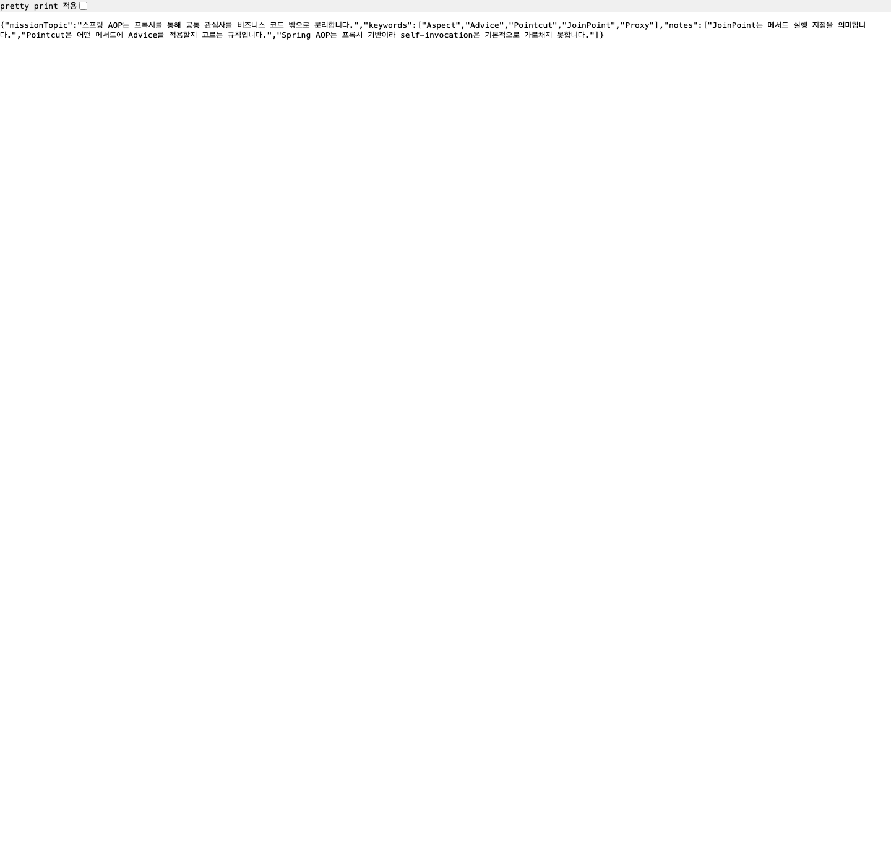
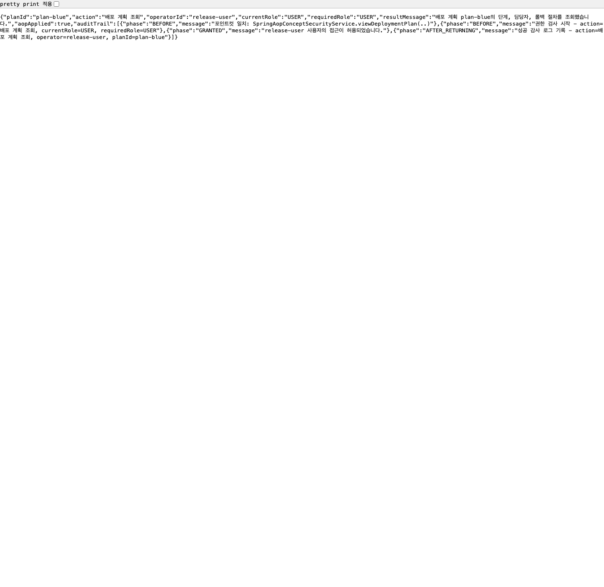
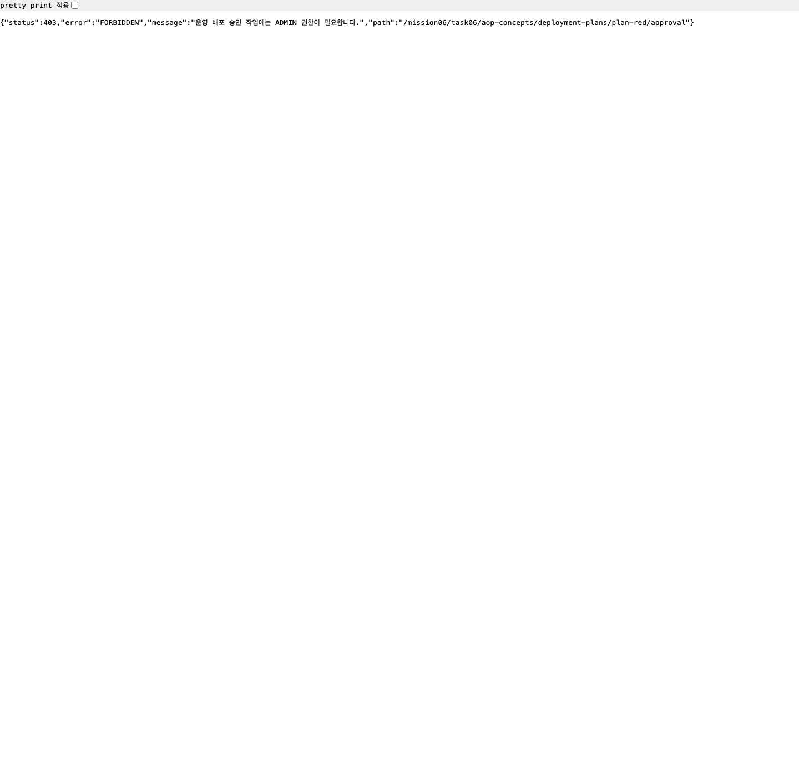

# 스프링 핵심 원리 - 고급: 스프링 AOP 개념 정리와 보안 체크 예제 구현

이 문서는 `mission-06-spring-core-advanced`의 `task-06-spring-aop-concepts` 결과를 정리한 보고서입니다.
스프링 AOP의 핵심 개념을 정리하고, 커스텀 애너테이션과 애스펙트를 이용해 메서드 호출 전 권한을 검사하고 호출 후 감사 로그를 남기는 간단한 보안 체크 예제를 구현했습니다.

## 1. 작업 개요

- 미션/태스크: `mission-06-spring-core-advanced` / `task-06-spring-aop-concepts`
- 목표:
  - 스프링 AOP의 핵심 개념(Aspect, Advice, Pointcut, JoinPoint, Proxy)을 코드와 함께 이해합니다.
  - `@RequireRole` 애너테이션과 `@Aspect`를 사용해 메서드 실행 전 권한 검사, 실행 후 감사 로그 기록을 구현합니다.
  - 권한 허용/거부 시나리오를 테스트하고, 실제 브라우저 결과를 Chrome으로 캡처합니다.
- 엔드포인트:
  - `GET /mission06/task06/aop-concepts/summary`
  - `GET /mission06/task06/aop-concepts/deployment-plans/{planId}`
  - `GET /mission06/task06/aop-concepts/deployment-plans/{planId}/approval`

설계한 시스템 정의:

- 커스텀 애너테이션: `@RequireRole`
- 애스펙트: `RoleCheckAspect`
- 대상 서비스: `SpringAopConceptSecurityService`
- 요청 컨텍스트: `AopSecurityRequest`
- 권한 enum: `AopUserRole`
- 감사 로그 저장소: `AopAccessAuditStore`

핵심 동작 규칙:

1. `@RequireRole`이 붙은 메서드만 포인트컷에 매칭됩니다.
2. `@Before` 어드바이스가 메서드 실행 전에 현재 역할과 요구 역할을 비교합니다.
3. 권한이 부족하면 예외를 던져 실제 비즈니스 메서드 실행을 막습니다.
4. 정상 실행이 끝나면 `@AfterReturning` 어드바이스가 성공 감사 로그를 남깁니다.

## 2. 코드 파일 경로 인덱스

| 구분 | 파일 경로 | 역할 |
|---|---|---|
| Annotation | `src/main/java/com/goorm/springmissionsplayground/mission06_spring_core_advanced/task06_spring_aop_concepts/annotation/RequireRole.java` | 권한 검사 대상 메서드와 요구 역할을 선언하는 커스텀 애너테이션 |
| Aspect | `src/main/java/com/goorm/springmissionsplayground/mission06_spring_core_advanced/task06_spring_aop_concepts/aspect/RoleCheckAspect.java` | 메서드 실행 전 권한 검사와 실행 후 감사 로그 기록을 담당 |
| Controller | `src/main/java/com/goorm/springmissionsplayground/mission06_spring_core_advanced/task06_spring_aop_concepts/controller/SpringAopConceptController.java` | 개념 요약 API와 보안 체크 예제 API를 제공 |
| Controller | `src/main/java/com/goorm/springmissionsplayground/mission06_spring_core_advanced/task06_spring_aop_concepts/controller/SpringAopConceptExceptionHandler.java` | 권한 부족/잘못된 입력을 JSON 에러 응답으로 변환 |
| Domain | `src/main/java/com/goorm/springmissionsplayground/mission06_spring_core_advanced/task06_spring_aop_concepts/domain/AopUserRole.java` | 역할 계층 비교와 문자열 파싱 규칙 정의 |
| Domain | `src/main/java/com/goorm/springmissionsplayground/mission06_spring_core_advanced/task06_spring_aop_concepts/domain/AopSecurityRequest.java` | 요청 사용자 ID와 역할을 묶는 컨텍스트 모델 |
| DTO | `src/main/java/com/goorm/springmissionsplayground/mission06_spring_core_advanced/task06_spring_aop_concepts/dto/AopConceptSummaryResponse.java` | 스프링 AOP 개념 요약 응답 |
| DTO | `src/main/java/com/goorm/springmissionsplayground/mission06_spring_core_advanced/task06_spring_aop_concepts/dto/AopSecurityOperationResponse.java` | 보안 체크 결과와 감사 로그를 함께 반환 |
| DTO | `src/main/java/com/goorm/springmissionsplayground/mission06_spring_core_advanced/task06_spring_aop_concepts/dto/AopConceptErrorResponse.java` | 권한 실패/입력 오류 응답 DTO |
| Exception | `src/main/java/com/goorm/springmissionsplayground/mission06_spring_core_advanced/task06_spring_aop_concepts/exception/AopAccessDeniedException.java` | 권한 부족 시 403으로 연결되는 예외 |
| Service | `src/main/java/com/goorm/springmissionsplayground/mission06_spring_core_advanced/task06_spring_aop_concepts/service/SpringAopConceptSecurityService.java` | 권한이 필요한 메서드와 비대상 메서드를 제공하는 예제 서비스 |
| Service | `src/main/java/com/goorm/springmissionsplayground/mission06_spring_core_advanced/task06_spring_aop_concepts/service/AopSecuredOperationResult.java` | 서비스 내부 실행 결과 모델 |
| Support | `src/main/java/com/goorm/springmissionsplayground/mission06_spring_core_advanced/task06_spring_aop_concepts/support/AopAccessAuditStore.java` | 최근 AOP 감사 로그를 저장 |
| Support | `src/main/java/com/goorm/springmissionsplayground/mission06_spring_core_advanced/task06_spring_aop_concepts/support/AopAccessAuditEntry.java` | 감사 로그 한 건의 phase와 메시지를 표현 |
| Test | `src/test/java/com/goorm/springmissionsplayground/mission06_spring_core_advanced/task06_spring_aop_concepts/SpringAopConceptControllerTest.java` | 프록시 생성, 허용/거부 시나리오, 비대상 메서드 제외를 통합 검증 |
| Artifact | `docs/mission-06-spring-core-advanced/task-06-spring-aop-concepts/responses/summary-response.txt` | 개념 요약 API 실제 응답 저장 |
| Artifact | `docs/mission-06-spring-core-advanced/task-06-spring-aop-concepts/responses/view-plan-success.txt` | 권한 허용 응답 저장 |
| Artifact | `docs/mission-06-spring-core-advanced/task-06-spring-aop-concepts/responses/approval-forbidden.txt` | 권한 거부 응답 저장 |
| Artifact | `docs/mission-06-spring-core-advanced/task-06-spring-aop-concepts/task06-gradle-test-output.txt` | `task06` 테스트 실행 결과 요약 |

## 3. 구현 단계와 주요 코드 해설

1. `@RequireRole` 애너테이션으로 포인트컷 기준을 만들었습니다.
   - 필요한 역할(`value`)과 작업 이름(`action`)을 메서드 선언부에 바로 적을 수 있게 했습니다.
   - 패키지 전체를 묶는 방식보다 의도가 명확하고, “어떤 메서드가 AOP 적용 대상인지” 코드만 봐도 바로 드러납니다.

2. `RoleCheckAspect`에서 두 종류의 어드바이스를 사용했습니다.
   - `@Before`는 비즈니스 메서드 실행 전에 동작합니다.
   - `@AfterReturning`은 메서드가 정상 반환됐을 때만 동작합니다.
   - 이 구성으로 “실행 전 권한 검사”와 “실행 후 성공 감사 로그”를 분리해 AOP 개념을 더 선명하게 보여줍니다.

3. 권한 검사는 메서드 인자에서 `AopSecurityRequest`를 찾아 수행합니다.
   - 현재 역할이 요구 역할 이상이면 `GRANTED` 로그를 남기고 통과시킵니다.
   - 부족하면 `AopAccessDeniedException`을 던져 실제 대상 메서드가 아예 실행되지 않게 막습니다.
   - 이 흐름이 바로 “공통 관심사(보안 검사)를 핵심 로직 바깥에서 가로챈다”는 AOP의 대표적인 예입니다.

4. 서비스는 AOP 대상 메서드와 비대상 메서드를 함께 둬서 차이를 비교할 수 있게 했습니다.
   - `viewDeploymentPlan()`은 `USER` 이상이면 접근할 수 있습니다.
   - `approveProductionDeployment()`는 `ADMIN`만 접근할 수 있습니다.
   - `conceptKeywords()`는 애너테이션이 없어 AOP가 적용되지 않으므로 테스트에서 로그가 생기지 않는 것을 확인할 수 있습니다.

5. 스프링 AOP가 프록시 기반이라는 점도 테스트로 확인했습니다.
   - 서비스 빈이 실제 프록시인지 `AopUtils.isAopProxy()`로 검증합니다.
   - 이 태스크에서는 서비스가 인터페이스를 구현하지 않으므로 클래스 기반 프록시(CGLIB)가 만들어집니다.
   - 문서에는 self-invocation이 기본적으로 가로채지지 않는 이유도 함께 정리했습니다.

요청 흐름 요약:

1. `SpringAopConceptController`가 요청 파라미터를 `AopSecurityRequest`로 묶습니다.
2. 컨트롤러는 `SpringAopConceptSecurityService`의 보안 대상 메서드를 호출합니다.
3. 실제 주입된 객체는 스프링 AOP 프록시입니다.
4. 프록시가 `RoleCheckAspect.@Before`를 먼저 실행해 권한을 검사합니다.
5. 검사 통과 시 실제 서비스 메서드가 실행됩니다.
6. 반환 후 `RoleCheckAspect.@AfterReturning`이 감사 로그를 저장합니다.
7. 컨트롤러는 서비스 결과와 `AopAccessAuditStore`의 로그를 함께 응답으로 반환합니다.

## 4. 파일별 상세 설명 + 전체 코드

### 4.1 `RequireRole.java`

- 파일 경로: `src/main/java/com/goorm/springmissionsplayground/mission06_spring_core_advanced/task06_spring_aop_concepts/annotation/RequireRole.java`
- 역할: 권한 검사 대상 메서드와 요구 역할을 선언하는 커스텀 애너테이션
- 상세 설명:
- 메서드 레벨에 붙여 AOP 포인트컷이 어떤 메서드를 잡아야 하는지 표시합니다.
- `value()`는 필요한 최소 역할, `action()`은 로그와 에러 메시지에 쓸 작업 이름입니다.
- 런타임 리플렉션으로 읽어야 하므로 `RetentionPolicy.RUNTIME`을 사용합니다.

<details>
<summary><code>RequireRole.java</code> 전체 코드</summary>

```java
package com.goorm.springmissionsplayground.mission06_spring_core_advanced.task06_spring_aop_concepts.annotation;

import com.goorm.springmissionsplayground.mission06_spring_core_advanced.task06_spring_aop_concepts.domain.AopUserRole;
import java.lang.annotation.ElementType;
import java.lang.annotation.Retention;
import java.lang.annotation.RetentionPolicy;
import java.lang.annotation.Target;

@Target(ElementType.METHOD)
@Retention(RetentionPolicy.RUNTIME)
public @interface RequireRole {

    AopUserRole value();

    String action();
}
```

</details>

### 4.2 `RoleCheckAspect.java`

- 파일 경로: `src/main/java/com/goorm/springmissionsplayground/mission06_spring_core_advanced/task06_spring_aop_concepts/aspect/RoleCheckAspect.java`
- 역할: 메서드 실행 전 권한 검사와 실행 후 감사 로그 기록을 담당
- 상세 설명:
- `@Before("@annotation(requireRole)")`로 `@RequireRole`이 붙은 메서드 실행 전에 검사 로직을 넣습니다.
- `@AfterReturning`은 정상 반환된 경우에만 성공 감사 로그를 남겨, “실행 성공 후 부가 작업” 예제를 보여줍니다.
- 인자에서 `AopSecurityRequest`를 찾아 현재 사용자 역할을 읽고, 부족하면 예외를 던져 핵심 메서드 실행을 막습니다.

<details>
<summary><code>RoleCheckAspect.java</code> 전체 코드</summary>

```java
package com.goorm.springmissionsplayground.mission06_spring_core_advanced.task06_spring_aop_concepts.aspect;

import com.goorm.springmissionsplayground.mission06_spring_core_advanced.task06_spring_aop_concepts.annotation.RequireRole;
import com.goorm.springmissionsplayground.mission06_spring_core_advanced.task06_spring_aop_concepts.domain.AopSecurityRequest;
import com.goorm.springmissionsplayground.mission06_spring_core_advanced.task06_spring_aop_concepts.exception.AopAccessDeniedException;
import com.goorm.springmissionsplayground.mission06_spring_core_advanced.task06_spring_aop_concepts.service.AopSecuredOperationResult;
import com.goorm.springmissionsplayground.mission06_spring_core_advanced.task06_spring_aop_concepts.support.AopAccessAuditStore;
import org.aspectj.lang.JoinPoint;
import org.aspectj.lang.annotation.AfterReturning;
import org.aspectj.lang.annotation.Aspect;
import org.aspectj.lang.annotation.Before;
import org.slf4j.Logger;
import org.slf4j.LoggerFactory;
import org.springframework.stereotype.Component;

@Aspect
@Component
public class RoleCheckAspect {

    private static final Logger log = LoggerFactory.getLogger(RoleCheckAspect.class);

    private final AopAccessAuditStore aopAccessAuditStore;

    public RoleCheckAspect(AopAccessAuditStore aopAccessAuditStore) {
        this.aopAccessAuditStore = aopAccessAuditStore;
    }

    @Before("@annotation(requireRole)")
    public void verifyRole(JoinPoint joinPoint, RequireRole requireRole) {
        AopSecurityRequest request = extractRequest(joinPoint);
        String methodLabel = joinPoint.getSignature().toShortString();

        aopAccessAuditStore.add("BEFORE", "포인트컷 일치: " + methodLabel);
        aopAccessAuditStore.add(
                "BEFORE",
                "권한 검사 시작 - action=" + requireRole.action()
                        + ", currentRole=" + request.getRole()
                        + ", requiredRole=" + requireRole.value()
        );

        if (!request.getRole().hasAtLeast(requireRole.value())) {
            String message = requireRole.action() + " 작업에는 " + requireRole.value() + " 권한이 필요합니다.";
            aopAccessAuditStore.add("DENIED", message);
            log.info("[TASK06-AOP][DENIED] {} operator={} role={}", requireRole.action(), request.getOperatorId(), request.getRole());
            throw new AopAccessDeniedException(message);
        }

        aopAccessAuditStore.add("GRANTED", request.getOperatorId() + " 사용자의 접근이 허용되었습니다.");
        log.info("[TASK06-AOP][GRANTED] {} operator={} role={}", requireRole.action(), request.getOperatorId(), request.getRole());
    }

    @AfterReturning(
            value = "@annotation(requireRole)",
            returning = "result"
    )
    public void writeAuditTrail(RequireRole requireRole, AopSecuredOperationResult result) {
        String auditMessage = "성공 감사 로그 기록 - action=" + requireRole.action()
                + ", operator=" + result.getOperatorId()
                + ", planId=" + result.getPlanId();
        aopAccessAuditStore.add("AFTER_RETURNING", auditMessage);
        log.info("[TASK06-AOP][AFTER_RETURNING] {}", auditMessage);
    }

    private AopSecurityRequest extractRequest(JoinPoint joinPoint) {
        for (Object argument : joinPoint.getArgs()) {
            if (argument instanceof AopSecurityRequest request) {
                return request;
            }
        }
        throw new IllegalArgumentException("AOP 보안 검사에는 AopSecurityRequest 인자가 필요합니다.");
    }
}
```

</details>

### 4.3 `SpringAopConceptController.java`

- 파일 경로: `src/main/java/com/goorm/springmissionsplayground/mission06_spring_core_advanced/task06_spring_aop_concepts/controller/SpringAopConceptController.java`
- 역할: 개념 요약 API와 보안 체크 예제 API를 제공
- 상세 설명:
- 기본 경로: `/mission06/task06/aop-concepts`
- 매핑 메서드:
  - `GET /summary` -> 스프링 AOP 개념 요약 JSON 반환
  - `GET /deployment-plans/{planId}` -> `USER` 이상 권한으로 배포 계획 조회
  - `GET /deployment-plans/{planId}/approval` -> `ADMIN` 권한으로 운영 배포 승인 점검
- 권한 체크 요청 전에 `AopAccessAuditStore.reset()`을 호출해 최근 실행 로그만 응답에 담기도록 맞췄습니다.

<details>
<summary><code>SpringAopConceptController.java</code> 전체 코드</summary>

```java
package com.goorm.springmissionsplayground.mission06_spring_core_advanced.task06_spring_aop_concepts.controller;

import com.goorm.springmissionsplayground.mission06_spring_core_advanced.task06_spring_aop_concepts.domain.AopSecurityRequest;
import com.goorm.springmissionsplayground.mission06_spring_core_advanced.task06_spring_aop_concepts.domain.AopUserRole;
import com.goorm.springmissionsplayground.mission06_spring_core_advanced.task06_spring_aop_concepts.dto.AopConceptSummaryResponse;
import com.goorm.springmissionsplayground.mission06_spring_core_advanced.task06_spring_aop_concepts.dto.AopSecurityOperationResponse;
import com.goorm.springmissionsplayground.mission06_spring_core_advanced.task06_spring_aop_concepts.service.SpringAopConceptSecurityService;
import com.goorm.springmissionsplayground.mission06_spring_core_advanced.task06_spring_aop_concepts.support.AopAccessAuditStore;
import java.util.List;
import org.springframework.web.bind.annotation.GetMapping;
import org.springframework.web.bind.annotation.PathVariable;
import org.springframework.web.bind.annotation.RequestMapping;
import org.springframework.web.bind.annotation.RequestParam;
import org.springframework.web.bind.annotation.RestController;

@RestController
@RequestMapping("/mission06/task06/aop-concepts")
public class SpringAopConceptController {

    private final SpringAopConceptSecurityService springAopConceptSecurityService;
    private final AopAccessAuditStore aopAccessAuditStore;

    public SpringAopConceptController(
            SpringAopConceptSecurityService springAopConceptSecurityService,
            AopAccessAuditStore aopAccessAuditStore
    ) {
        this.springAopConceptSecurityService = springAopConceptSecurityService;
        this.aopAccessAuditStore = aopAccessAuditStore;
    }

    @GetMapping("/summary")
    public AopConceptSummaryResponse summary() {
        return new AopConceptSummaryResponse(
                "스프링 AOP는 프록시를 통해 공통 관심사를 비즈니스 코드 밖으로 분리합니다.",
                springAopConceptSecurityService.conceptKeywords(),
                List.of(
                        "JoinPoint는 메서드 실행 지점을 의미합니다.",
                        "Pointcut은 어떤 메서드에 Advice를 적용할지 고르는 규칙입니다.",
                        "Spring AOP는 프록시 기반이라 self-invocation은 기본적으로 가로채지 못합니다."
                )
        );
    }

    @GetMapping("/deployment-plans/{planId}")
    public AopSecurityOperationResponse viewDeploymentPlan(
            @PathVariable String planId,
            @RequestParam(defaultValue = "release-user") String operatorId,
            @RequestParam(defaultValue = "USER") String role
    ) {
        aopAccessAuditStore.reset();
        return AopSecurityOperationResponse.from(
                springAopConceptSecurityService.viewDeploymentPlan(planId, createRequest(operatorId, role)),
                aopAccessAuditStore.getEntries()
        );
    }

    @GetMapping("/deployment-plans/{planId}/approval")
    public AopSecurityOperationResponse approveProductionDeployment(
            @PathVariable String planId,
            @RequestParam(defaultValue = "release-admin") String operatorId,
            @RequestParam(defaultValue = "ADMIN") String role
    ) {
        aopAccessAuditStore.reset();
        return AopSecurityOperationResponse.from(
                springAopConceptSecurityService.approveProductionDeployment(planId, createRequest(operatorId, role)),
                aopAccessAuditStore.getEntries()
        );
    }

    private AopSecurityRequest createRequest(String operatorId, String role) {
        return new AopSecurityRequest(operatorId, AopUserRole.from(role));
    }
}
```

</details>

### 4.4 `SpringAopConceptExceptionHandler.java`

- 파일 경로: `src/main/java/com/goorm/springmissionsplayground/mission06_spring_core_advanced/task06_spring_aop_concepts/controller/SpringAopConceptExceptionHandler.java`
- 역할: 권한 부족/잘못된 입력을 JSON 에러 응답으로 변환
- 상세 설명:
- `AopAccessDeniedException`은 403 `FORBIDDEN` 응답으로 변환합니다.
- 잘못된 role 입력이나 누락된 값은 `IllegalArgumentException`으로 받아 400 `BAD_REQUEST`로 반환합니다.
- 요청 URI까지 응답에 실어 어떤 API에서 실패했는지 바로 확인할 수 있습니다.

<details>
<summary><code>SpringAopConceptExceptionHandler.java</code> 전체 코드</summary>

```java
package com.goorm.springmissionsplayground.mission06_spring_core_advanced.task06_spring_aop_concepts.controller;

import com.goorm.springmissionsplayground.mission06_spring_core_advanced.task06_spring_aop_concepts.dto.AopConceptErrorResponse;
import com.goorm.springmissionsplayground.mission06_spring_core_advanced.task06_spring_aop_concepts.exception.AopAccessDeniedException;
import jakarta.servlet.http.HttpServletRequest;
import org.springframework.http.HttpStatus;
import org.springframework.web.bind.annotation.ExceptionHandler;
import org.springframework.web.bind.annotation.ResponseStatus;
import org.springframework.web.bind.annotation.RestControllerAdvice;

@RestControllerAdvice(assignableTypes = SpringAopConceptController.class)
public class SpringAopConceptExceptionHandler {

    @ResponseStatus(HttpStatus.FORBIDDEN)
    @ExceptionHandler(AopAccessDeniedException.class)
    public AopConceptErrorResponse handleAccessDenied(
            AopAccessDeniedException exception,
            HttpServletRequest request
    ) {
        return new AopConceptErrorResponse(
                HttpStatus.FORBIDDEN.value(),
                "FORBIDDEN",
                exception.getMessage(),
                request.getRequestURI()
        );
    }

    @ResponseStatus(HttpStatus.BAD_REQUEST)
    @ExceptionHandler(IllegalArgumentException.class)
    public AopConceptErrorResponse handleBadRequest(
            IllegalArgumentException exception,
            HttpServletRequest request
    ) {
        return new AopConceptErrorResponse(
                HttpStatus.BAD_REQUEST.value(),
                "BAD_REQUEST",
                exception.getMessage(),
                request.getRequestURI()
        );
    }
}
```

</details>

### 4.5 `AopUserRole.java`

- 파일 경로: `src/main/java/com/goorm/springmissionsplayground/mission06_spring_core_advanced/task06_spring_aop_concepts/domain/AopUserRole.java`
- 역할: 역할 계층 비교와 문자열 파싱 규칙 정의
- 상세 설명:
- `GUEST < USER < MANAGER < ADMIN` 순서로 권한 레벨을 비교합니다.
- `hasAtLeast()`는 현재 역할이 요구 역할 이상인지 검사하는 핵심 메서드입니다.
- `from()`은 컨트롤러의 문자열 파라미터를 enum으로 바꾸며, 잘못된 값이면 400으로 이어집니다.

<details>
<summary><code>AopUserRole.java</code> 전체 코드</summary>

```java
package com.goorm.springmissionsplayground.mission06_spring_core_advanced.task06_spring_aop_concepts.domain;

import java.util.Locale;

public enum AopUserRole {

    GUEST(0),
    USER(1),
    MANAGER(2),
    ADMIN(3);

    private final int level;

    AopUserRole(int level) {
        this.level = level;
    }

    public boolean hasAtLeast(AopUserRole requiredRole) {
        return this.level >= requiredRole.level;
    }

    public static AopUserRole from(String rawRole) {
        if (rawRole == null || rawRole.isBlank()) {
            throw new IllegalArgumentException("role 파라미터는 비어 있을 수 없습니다.");
        }

        try {
            return AopUserRole.valueOf(rawRole.trim().toUpperCase(Locale.ROOT));
        } catch (IllegalArgumentException exception) {
            throw new IllegalArgumentException("지원하지 않는 role 입니다. 사용 가능 값: GUEST, USER, MANAGER, ADMIN");
        }
    }
}
```

</details>

### 4.6 `AopSecurityRequest.java`

- 파일 경로: `src/main/java/com/goorm/springmissionsplayground/mission06_spring_core_advanced/task06_spring_aop_concepts/domain/AopSecurityRequest.java`
- 역할: 요청 사용자 ID와 역할을 묶는 컨텍스트 모델
- 상세 설명:
- 컨트롤러가 받은 `operatorId`, `role` 값을 한 객체로 묶어 서비스에 전달합니다.
- 애스펙트는 이 객체를 메서드 인자에서 찾아 권한 검사를 수행합니다.
- 예제 규모에서는 단순 DTO처럼 보이지만, “애스펙트가 읽는 실행 컨텍스트” 역할이 핵심입니다.

<details>
<summary><code>AopSecurityRequest.java</code> 전체 코드</summary>

```java
package com.goorm.springmissionsplayground.mission06_spring_core_advanced.task06_spring_aop_concepts.domain;

public class AopSecurityRequest {

    private final String operatorId;
    private final AopUserRole role;

    public AopSecurityRequest(String operatorId, AopUserRole role) {
        this.operatorId = operatorId;
        this.role = role;
    }

    public String getOperatorId() {
        return operatorId;
    }

    public AopUserRole getRole() {
        return role;
    }
}
```

</details>

### 4.7 `AopConceptSummaryResponse.java`

- 파일 경로: `src/main/java/com/goorm/springmissionsplayground/mission06_spring_core_advanced/task06_spring_aop_concepts/dto/AopConceptSummaryResponse.java`
- 역할: 스프링 AOP 개념 요약 응답
- 상세 설명:
- 개념 정리 내용을 API로 바로 확인할 수 있게 만든 DTO입니다.
- `keywords`에는 핵심 용어, `notes`에는 자주 놓치는 포인트를 담았습니다.
- self-invocation 주의 사항도 함께 내려줘 문서와 API가 같은 학습 내용을 공유하도록 맞췄습니다.

<details>
<summary><code>AopConceptSummaryResponse.java</code> 전체 코드</summary>

```java
package com.goorm.springmissionsplayground.mission06_spring_core_advanced.task06_spring_aop_concepts.dto;

import java.util.List;

public class AopConceptSummaryResponse {

    private final String missionTopic;
    private final List<String> keywords;
    private final List<String> notes;

    public AopConceptSummaryResponse(String missionTopic, List<String> keywords, List<String> notes) {
        this.missionTopic = missionTopic;
        this.keywords = List.copyOf(keywords);
        this.notes = List.copyOf(notes);
    }

    public String getMissionTopic() {
        return missionTopic;
    }

    public List<String> getKeywords() {
        return keywords;
    }

    public List<String> getNotes() {
        return notes;
    }
}
```

</details>

### 4.8 `AopSecurityOperationResponse.java`

- 파일 경로: `src/main/java/com/goorm/springmissionsplayground/mission06_spring_core_advanced/task06_spring_aop_concepts/dto/AopSecurityOperationResponse.java`
- 역할: 보안 체크 결과와 감사 로그를 함께 반환
- 상세 설명:
- 서비스의 비즈니스 결과와 AOP 감사 로그를 하나의 응답으로 묶습니다.
- `aopApplied`를 명시해 이 응답이 AOP 보안 체크를 거친 결과라는 점을 바로 확인할 수 있습니다.
- `auditTrail`은 `BEFORE`, `GRANTED`, `AFTER_RETURNING` 흐름을 그대로 보여 줍니다.

<details>
<summary><code>AopSecurityOperationResponse.java</code> 전체 코드</summary>

```java
package com.goorm.springmissionsplayground.mission06_spring_core_advanced.task06_spring_aop_concepts.dto;

import com.goorm.springmissionsplayground.mission06_spring_core_advanced.task06_spring_aop_concepts.service.AopSecuredOperationResult;
import com.goorm.springmissionsplayground.mission06_spring_core_advanced.task06_spring_aop_concepts.support.AopAccessAuditEntry;
import java.util.List;

public class AopSecurityOperationResponse {

    private final String planId;
    private final String action;
    private final String operatorId;
    private final String currentRole;
    private final String requiredRole;
    private final String resultMessage;
    private final boolean aopApplied;
    private final List<AopAccessAuditEntry> auditTrail;

    public AopSecurityOperationResponse(
            String planId,
            String action,
            String operatorId,
            String currentRole,
            String requiredRole,
            String resultMessage,
            boolean aopApplied,
            List<AopAccessAuditEntry> auditTrail
    ) {
        this.planId = planId;
        this.action = action;
        this.operatorId = operatorId;
        this.currentRole = currentRole;
        this.requiredRole = requiredRole;
        this.resultMessage = resultMessage;
        this.aopApplied = aopApplied;
        this.auditTrail = List.copyOf(auditTrail);
    }

    public static AopSecurityOperationResponse from(
            AopSecuredOperationResult result,
            List<AopAccessAuditEntry> auditTrail
    ) {
        return new AopSecurityOperationResponse(
                result.getPlanId(),
                result.getAction(),
                result.getOperatorId(),
                result.getCurrentRole().name(),
                result.getRequiredRole().name(),
                result.getResultMessage(),
                true,
                auditTrail
        );
    }

    public String getPlanId() {
        return planId;
    }

    public String getAction() {
        return action;
    }

    public String getOperatorId() {
        return operatorId;
    }

    public String getCurrentRole() {
        return currentRole;
    }

    public String getRequiredRole() {
        return requiredRole;
    }

    public String getResultMessage() {
        return resultMessage;
    }

    public boolean isAopApplied() {
        return aopApplied;
    }

    public List<AopAccessAuditEntry> getAuditTrail() {
        return auditTrail;
    }
}
```

</details>

### 4.9 `AopConceptErrorResponse.java`

- 파일 경로: `src/main/java/com/goorm/springmissionsplayground/mission06_spring_core_advanced/task06_spring_aop_concepts/dto/AopConceptErrorResponse.java`
- 역할: 권한 실패/입력 오류 응답 DTO
- 상세 설명:
- 권한 실패와 잘못된 입력을 일관된 JSON 형태로 전달합니다.
- 상태 코드, 에러명, 메시지, 요청 경로를 묶어 브라우저에서도 바로 읽기 쉽게 구성했습니다.
- 단순하지만 예외 처리 흐름이 AOP 예제와 섞이지 않도록 경계를 분리하는 역할이 있습니다.

<details>
<summary><code>AopConceptErrorResponse.java</code> 전체 코드</summary>

```java
package com.goorm.springmissionsplayground.mission06_spring_core_advanced.task06_spring_aop_concepts.dto;

public class AopConceptErrorResponse {

    private final int status;
    private final String error;
    private final String message;
    private final String path;

    public AopConceptErrorResponse(int status, String error, String message, String path) {
        this.status = status;
        this.error = error;
        this.message = message;
        this.path = path;
    }

    public int getStatus() {
        return status;
    }

    public String getError() {
        return error;
    }

    public String getMessage() {
        return message;
    }

    public String getPath() {
        return path;
    }
}
```

</details>

### 4.10 `AopAccessDeniedException.java`

- 파일 경로: `src/main/java/com/goorm/springmissionsplayground/mission06_spring_core_advanced/task06_spring_aop_concepts/exception/AopAccessDeniedException.java`
- 역할: 권한 부족 시 403으로 연결되는 예외
- 상세 설명:
- 애스펙트가 권한 부족을 감지했을 때 던지는 전용 예외입니다.
- 이 예외 덕분에 비즈니스 메서드는 “권한 검사를 어떻게 실패 응답으로 바꿀지”를 몰라도 됩니다.
- 보안 검사 실패를 핵심 로직 바깥에서 끝내는 구조가 AOP 의도와 잘 맞습니다.

<details>
<summary><code>AopAccessDeniedException.java</code> 전체 코드</summary>

```java
package com.goorm.springmissionsplayground.mission06_spring_core_advanced.task06_spring_aop_concepts.exception;

public class AopAccessDeniedException extends RuntimeException {

    public AopAccessDeniedException(String message) {
        super(message);
    }
}
```

</details>

### 4.11 `SpringAopConceptSecurityService.java`

- 파일 경로: `src/main/java/com/goorm/springmissionsplayground/mission06_spring_core_advanced/task06_spring_aop_concepts/service/SpringAopConceptSecurityService.java`
- 역할: 권한이 필요한 메서드와 비대상 메서드를 제공하는 예제 서비스
- 상세 설명:
- 핵심 공개 메서드:
  - `viewDeploymentPlan()` -> `USER` 이상 허용
  - `approveProductionDeployment()` -> `ADMIN`만 허용
  - `conceptKeywords()` -> AOP 비대상 메서드
- 비즈니스 메서드 안에는 권한 비교 코드가 없고, 오직 결과 생성만 담당합니다. 권한 검사는 전부 애스펙트가 맡습니다.

<details>
<summary><code>SpringAopConceptSecurityService.java</code> 전체 코드</summary>

```java
package com.goorm.springmissionsplayground.mission06_spring_core_advanced.task06_spring_aop_concepts.service;

import com.goorm.springmissionsplayground.mission06_spring_core_advanced.task06_spring_aop_concepts.annotation.RequireRole;
import com.goorm.springmissionsplayground.mission06_spring_core_advanced.task06_spring_aop_concepts.domain.AopSecurityRequest;
import com.goorm.springmissionsplayground.mission06_spring_core_advanced.task06_spring_aop_concepts.domain.AopUserRole;
import java.util.List;
import org.springframework.stereotype.Service;

@Service
public class SpringAopConceptSecurityService {

    @RequireRole(value = AopUserRole.USER, action = "배포 계획 조회")
    public AopSecuredOperationResult viewDeploymentPlan(String planId, AopSecurityRequest request) {
        return new AopSecuredOperationResult(
                planId,
                "배포 계획 조회",
                request.getOperatorId(),
                request.getRole(),
                AopUserRole.USER,
                "배포 계획 " + planId + "의 단계, 담당자, 롤백 절차를 조회했습니다."
        );
    }

    @RequireRole(value = AopUserRole.ADMIN, action = "운영 배포 승인")
    public AopSecuredOperationResult approveProductionDeployment(String planId, AopSecurityRequest request) {
        return new AopSecuredOperationResult(
                planId,
                "운영 배포 승인",
                request.getOperatorId(),
                request.getRole(),
                AopUserRole.ADMIN,
                "운영 배포 계획 " + planId + "의 최종 승인 검토를 완료했습니다."
        );
    }

    public List<String> conceptKeywords() {
        return List.of("Aspect", "Advice", "Pointcut", "JoinPoint", "Proxy");
    }
}
```

</details>

### 4.12 `AopSecuredOperationResult.java`

- 파일 경로: `src/main/java/com/goorm/springmissionsplayground/mission06_spring_core_advanced/task06_spring_aop_concepts/service/AopSecuredOperationResult.java`
- 역할: 서비스 내부 실행 결과 모델
- 상세 설명:
- 서비스 메서드가 만든 비즈니스 결과를 한 객체로 묶습니다.
- 현재 역할과 요구 역할을 같이 들고 있어 컨트롤러 응답에서도 그대로 재사용할 수 있습니다.
- AOP와 무관한 순수 결과 모델이라, 핵심 로직과 부가 기능의 경계가 잘 드러납니다.

<details>
<summary><code>AopSecuredOperationResult.java</code> 전체 코드</summary>

```java
package com.goorm.springmissionsplayground.mission06_spring_core_advanced.task06_spring_aop_concepts.service;

import com.goorm.springmissionsplayground.mission06_spring_core_advanced.task06_spring_aop_concepts.domain.AopUserRole;

public class AopSecuredOperationResult {

    private final String planId;
    private final String action;
    private final String operatorId;
    private final AopUserRole currentRole;
    private final AopUserRole requiredRole;
    private final String resultMessage;

    public AopSecuredOperationResult(
            String planId,
            String action,
            String operatorId,
            AopUserRole currentRole,
            AopUserRole requiredRole,
            String resultMessage
    ) {
        this.planId = planId;
        this.action = action;
        this.operatorId = operatorId;
        this.currentRole = currentRole;
        this.requiredRole = requiredRole;
        this.resultMessage = resultMessage;
    }

    public String getPlanId() {
        return planId;
    }

    public String getAction() {
        return action;
    }

    public String getOperatorId() {
        return operatorId;
    }

    public AopUserRole getCurrentRole() {
        return currentRole;
    }

    public AopUserRole getRequiredRole() {
        return requiredRole;
    }

    public String getResultMessage() {
        return resultMessage;
    }
}
```

</details>

### 4.13 `AopAccessAuditStore.java`

- 파일 경로: `src/main/java/com/goorm/springmissionsplayground/mission06_spring_core_advanced/task06_spring_aop_concepts/support/AopAccessAuditStore.java`
- 역할: 최근 AOP 감사 로그를 저장
- 상세 설명:
- 최근 요청의 감사 로그를 메모리에 저장하고, 컨트롤러 응답에 바로 재사용합니다.
- `reset()`으로 요청 시작 전에 이전 로그를 비우고, `add()`로 각 어드바이스 단계 기록을 남깁니다.
- 멀티 스레드 안전성은 `synchronized`로 단순하게 보강했습니다.

<details>
<summary><code>AopAccessAuditStore.java</code> 전체 코드</summary>

```java
package com.goorm.springmissionsplayground.mission06_spring_core_advanced.task06_spring_aop_concepts.support;

import java.util.ArrayList;
import java.util.List;
import org.springframework.stereotype.Component;

@Component
public class AopAccessAuditStore {

    private final List<AopAccessAuditEntry> entries = new ArrayList<>();

    public synchronized void reset() {
        entries.clear();
    }

    public synchronized void add(String phase, String message) {
        entries.add(new AopAccessAuditEntry(phase, message));
    }

    public synchronized List<AopAccessAuditEntry> getEntries() {
        return List.copyOf(entries);
    }
}
```

</details>

### 4.14 `AopAccessAuditEntry.java`

- 파일 경로: `src/main/java/com/goorm/springmissionsplayground/mission06_spring_core_advanced/task06_spring_aop_concepts/support/AopAccessAuditEntry.java`
- 역할: 감사 로그 한 건의 phase와 메시지를 표현
- 상세 설명:
- `BEFORE`, `GRANTED`, `DENIED`, `AFTER_RETURNING` 같은 단계를 문자열로 구분합니다.
- 응답 JSON에서 사용자가 바로 읽을 수 있도록 구조를 단순하게 유지했습니다.
- 이 모델 덕분에 스크린샷에서도 AOP 적용 순서를 그대로 확인할 수 있습니다.

<details>
<summary><code>AopAccessAuditEntry.java</code> 전체 코드</summary>

```java
package com.goorm.springmissionsplayground.mission06_spring_core_advanced.task06_spring_aop_concepts.support;

public class AopAccessAuditEntry {

    private final String phase;
    private final String message;

    public AopAccessAuditEntry(String phase, String message) {
        this.phase = phase;
        this.message = message;
    }

    public String getPhase() {
        return phase;
    }

    public String getMessage() {
        return message;
    }
}
```

</details>

### 4.15 `SpringAopConceptControllerTest.java`

- 파일 경로: `src/test/java/com/goorm/springmissionsplayground/mission06_spring_core_advanced/task06_spring_aop_concepts/SpringAopConceptControllerTest.java`
- 역할: 프록시 생성, 허용/거부 시나리오, 비대상 메서드 제외를 통합 검증
- 상세 설명:
- 검증 시나리오:
  - `securedService_isProxiedBySpringAop()` -> 서비스 빈이 실제 AOP 프록시인지 보장
  - `summary_returnsAopConceptKeywords()` -> 개념 요약 API 응답 보장
  - `viewDeploymentPlan_whenUserRole_thenReturnsAuditTrail()` -> 허용 흐름과 감사 로그 보장
  - `approveProductionDeployment_whenUserRole_thenReturns403()` -> 권한 부족 시 차단 보장
  - `nonAnnotatedMethod_doesNotCreateAuditTrail()` -> 비대상 메서드에는 AOP 미적용 보장
- 정상과 예외 흐름을 모두 고정해 포인트컷 범위나 권한 검사 규칙이 흐트러지는 회귀를 막습니다.

<details>
<summary><code>SpringAopConceptControllerTest.java</code> 전체 코드</summary>

```java
package com.goorm.springmissionsplayground.mission06_spring_core_advanced.task06_spring_aop_concepts;

import static org.assertj.core.api.Assertions.assertThat;
import static org.hamcrest.Matchers.hasSize;
import static org.springframework.test.web.servlet.request.MockMvcRequestBuilders.get;
import static org.springframework.test.web.servlet.result.MockMvcResultMatchers.jsonPath;
import static org.springframework.test.web.servlet.result.MockMvcResultMatchers.status;

import com.goorm.springmissionsplayground.mission06_spring_core_advanced.task06_spring_aop_concepts.service.SpringAopConceptSecurityService;
import com.goorm.springmissionsplayground.mission06_spring_core_advanced.task06_spring_aop_concepts.support.AopAccessAuditStore;
import org.junit.jupiter.api.BeforeEach;
import org.junit.jupiter.api.Test;
import org.springframework.aop.support.AopUtils;
import org.springframework.beans.factory.annotation.Autowired;
import org.springframework.boot.test.context.SpringBootTest;
import org.springframework.test.web.servlet.MockMvc;
import org.springframework.test.web.servlet.setup.MockMvcBuilders;
import org.springframework.web.context.WebApplicationContext;

@SpringBootTest
class SpringAopConceptControllerTest {

    @Autowired
    private WebApplicationContext context;

    @Autowired
    private SpringAopConceptSecurityService springAopConceptSecurityService;

    @Autowired
    private AopAccessAuditStore aopAccessAuditStore;

    private MockMvc mockMvc;

    @BeforeEach
    void setUp() {
        mockMvc = MockMvcBuilders.webAppContextSetup(context).build();
        aopAccessAuditStore.reset();
    }

    @Test
    void securedService_isProxiedBySpringAop() {
        assertThat(AopUtils.isAopProxy(springAopConceptSecurityService)).isTrue();
    }

    @Test
    void summary_returnsAopConceptKeywords() throws Exception {
        mockMvc.perform(get("/mission06/task06/aop-concepts/summary"))
                .andExpect(status().isOk())
                .andExpect(jsonPath("$.keywords", hasSize(5)))
                .andExpect(jsonPath("$.keywords[0]").value("Aspect"))
                .andExpect(jsonPath("$.notes[2]").value("Spring AOP는 프록시 기반이라 self-invocation은 기본적으로 가로채지 못합니다."));
    }

    @Test
    void viewDeploymentPlan_whenUserRole_thenReturnsAuditTrail() throws Exception {
        mockMvc.perform(get("/mission06/task06/aop-concepts/deployment-plans/plan-blue")
                        .param("operatorId", "release-user")
                        .param("role", "USER"))
                .andExpect(status().isOk())
                .andExpect(jsonPath("$.planId").value("plan-blue"))
                .andExpect(jsonPath("$.action").value("배포 계획 조회"))
                .andExpect(jsonPath("$.currentRole").value("USER"))
                .andExpect(jsonPath("$.requiredRole").value("USER"))
                .andExpect(jsonPath("$.aopApplied").value(true))
                .andExpect(jsonPath("$.auditTrail", hasSize(4)))
                .andExpect(jsonPath("$.auditTrail[0].phase").value("BEFORE"))
                .andExpect(jsonPath("$.auditTrail[2].phase").value("GRANTED"))
                .andExpect(jsonPath("$.auditTrail[3].phase").value("AFTER_RETURNING"));
    }

    @Test
    void approveProductionDeployment_whenUserRole_thenReturns403() throws Exception {
        mockMvc.perform(get("/mission06/task06/aop-concepts/deployment-plans/plan-red/approval")
                        .param("operatorId", "release-user")
                        .param("role", "USER"))
                .andExpect(status().isForbidden())
                .andExpect(jsonPath("$.error").value("FORBIDDEN"))
                .andExpect(jsonPath("$.message").value("운영 배포 승인 작업에는 ADMIN 권한이 필요합니다."));
    }

    @Test
    void nonAnnotatedMethod_doesNotCreateAuditTrail() {
        springAopConceptSecurityService.conceptKeywords();

        assertThat(aopAccessAuditStore.getEntries()).isEmpty();
    }
}
```

</details>

## 5. 새로 나온 개념 정리 + 참고 링크

- Aspect
  - 핵심: 여러 클래스에 흩어지는 공통 관심사를 한 클래스로 모듈화한 단위입니다.
  - 왜 쓰는가: 로깅, 보안, 트랜잭션처럼 반복되는 부가 기능을 비즈니스 코드에서 분리할 수 있기 때문입니다.
  - 참고 링크:
    - https://docs.spring.io/spring-framework/reference/core/aop/introduction-defn.html
    - https://docs.spring.io/spring-framework/reference/core/aop.html

- Advice
  - 핵심: 특정 JoinPoint에서 실제로 실행되는 부가 동작입니다. `@Before`, `@AfterReturning`, `@Around` 등이 여기에 해당합니다.
  - 왜 쓰는가: 메서드 실행 전후 어느 시점에 어떤 공통 기능을 넣을지 세밀하게 나눌 수 있기 때문입니다.
  - 참고 링크:
    - https://docs.spring.io/spring-framework/reference/core/aop/ataspectj/advice.html

- Pointcut
  - 핵심: 어떤 메서드 실행에 Advice를 적용할지 선택하는 규칙입니다.
  - 왜 쓰는가: 전체 애플리케이션이 아니라 정말 필요한 메서드만 AOP 대상으로 좁힐 수 있기 때문입니다.
  - 참고 링크:
    - https://docs.spring.io/spring-framework/reference/core/aop/introduction-defn.html

- JoinPoint
  - 핵심: 프로그램 실행 중 Advice가 걸릴 수 있는 지점입니다. Spring AOP에서는 기본적으로 메서드 실행 지점을 뜻합니다.
  - 왜 쓰는가: 어떤 메서드가 호출됐는지, 어떤 인자가 들어왔는지 읽어 권한 검사나 로그 기록에 활용할 수 있기 때문입니다.
  - 참고 링크:
    - https://docs.spring.io/spring-framework/reference/core/aop/introduction-defn.html
    - https://www.eclipse.org/aspectj/doc/released/runtime-api/org/aspectj/lang/ProceedingJoinPoint.html

- Proxy 기반 동작과 self-invocation
  - 핵심: Spring AOP는 대상 객체 자체를 바꾸는 것이 아니라 프록시 객체를 앞단에 두는 방식으로 동작합니다.
  - 왜 쓰는가: 기존 코드를 크게 바꾸지 않고도 공통 관심사를 주입할 수 있지만, 같은 객체 내부에서 `this`로 다른 메서드를 부르는 self-invocation은 기본적으로 가로채지 못한다는 제약을 이해해야 하기 때문입니다.
  - 참고 링크:
    - https://docs.spring.io/spring-framework/reference/core/aop/proxying.html
    - https://docs.spring.io/spring-framework/reference/core/aop/introduction-proxies.html

## 6. 실행·검증 방법

애플리케이션 실행:

```bash
./gradlew bootRun
```

개념 요약 API 호출:

```bash
curl -s "http://localhost:8080/mission06/task06/aop-concepts/summary"
```

권한 허용 시나리오 호출:

```bash
curl -s "http://localhost:8080/mission06/task06/aop-concepts/deployment-plans/plan-blue?operatorId=release-user&role=USER"
```

권한 거부 시나리오 호출:

```bash
curl -s "http://localhost:8080/mission06/task06/aop-concepts/deployment-plans/plan-red/approval?operatorId=release-user&role=USER"
```

task06 테스트 실행:

```bash
./gradlew test --tests com.goorm.springmissionsplayground.mission06_spring_core_advanced.task06_spring_aop_concepts.SpringAopConceptControllerTest
```

예상 결과:

- `/summary`는 AOP 핵심 용어와 프록시 기반 주의 사항을 반환합니다.
- `/deployment-plans/{planId}`는 `USER` 역할이면 정상 응답과 `BEFORE -> GRANTED -> AFTER_RETURNING` 감사 로그를 반환합니다.
- `/deployment-plans/{planId}/approval`는 `USER` 역할이면 403과 권한 부족 메시지를 반환합니다.
- 테스트는 AOP 프록시 적용 여부, 허용/거부 응답, 비대상 메서드 미적용 여부를 모두 통과해야 합니다.

## 7. 결과 확인 방법(스크린샷 포함)

- 성공 기준:
  - `summary` 응답에 `Aspect`, `Advice`, `Pointcut`, `JoinPoint`, `Proxy` 키워드가 포함되어야 합니다.
  - 허용 시나리오 응답에 `aopApplied=true`와 감사 로그 4건이 포함되어야 합니다.
  - 거부 시나리오 응답은 403 `FORBIDDEN`과 `운영 배포 승인 작업에는 ADMIN 권한이 필요합니다.` 메시지를 반환해야 합니다.

- 응답 스냅샷 파일:
  - `docs/mission-06-spring-core-advanced/task-06-spring-aop-concepts/responses/summary-response.txt`
  - `docs/mission-06-spring-core-advanced/task-06-spring-aop-concepts/responses/view-plan-success.txt`
  - `docs/mission-06-spring-core-advanced/task-06-spring-aop-concepts/responses/approval-forbidden.txt`

- 테스트 로그 파일:
  - `docs/mission-06-spring-core-advanced/task-06-spring-aop-concepts/task06-gradle-test-output.txt`

- Chrome 캡처 파일:
  - `docs/mission-06-spring-core-advanced/task-06-spring-aop-concepts/screenshots/summary-response.png`
  - `docs/mission-06-spring-core-advanced/task-06-spring-aop-concepts/screenshots/view-plan-success.png`
  - `docs/mission-06-spring-core-advanced/task-06-spring-aop-concepts/screenshots/approval-forbidden.png`

스크린샷 미리보기:





이번 태스크에서는 Google Chrome headless를 사용해 실제 브라우저 렌더링 결과를 PNG로 저장했습니다. JSON 응답이 브라우저에서 어떻게 보이는지 그대로 확인할 수 있습니다.

## 8. 학습 내용

- 스프링 AOP는 비즈니스 로직을 직접 수정하지 않고 프록시를 통해 공통 관심사를 끼워 넣는 방식입니다. 그래서 서비스 메서드는 본래 책임만 유지하고, 보안 검사 같은 횡단 관심사는 애스펙트 한 곳에서 일괄 처리할 수 있습니다.
- `@Before`와 `@AfterReturning`을 분리해서 써 보면 “실행 전 검사”와 “실행 성공 후 기록”이 서로 다른 시점이라는 점이 명확해집니다. 무조건 `@Around`만 쓰기보다, 필요한 시점에 맞는 어드바이스를 고르는 감각이 중요합니다.
- 프록시 기반 구조는 편리하지만 제약도 있습니다. 대표적으로 같은 객체 내부에서 `this`로 다른 메서드를 호출하면 프록시를 거치지 않아서 AOP가 적용되지 않습니다. 이 self-invocation 문제는 스프링 AOP를 사용할 때 반드시 알고 있어야 할 핵심 특징입니다.
- 이 태스크의 보안 체크 예제는 실제 서비스 코드에 `if (role ...)` 검사를 반복해서 넣지 않고도 권한 정책을 적용할 수 있다는 점을 보여줍니다. 이런 구조가 누적될수록 AOP의 유지보수 이점이 더 커집니다.
